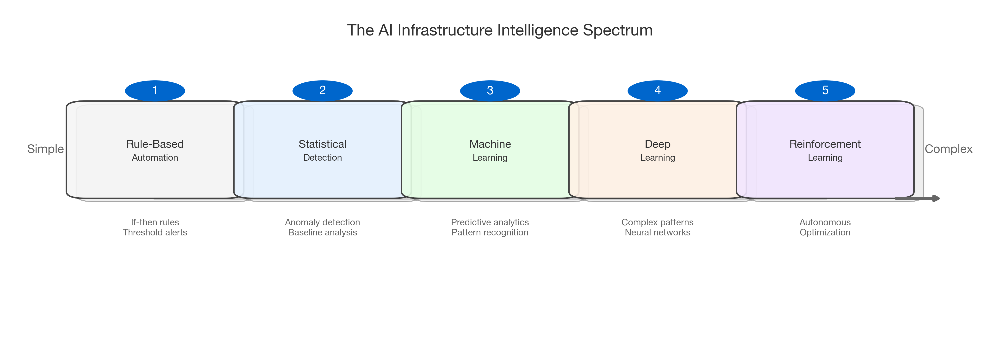
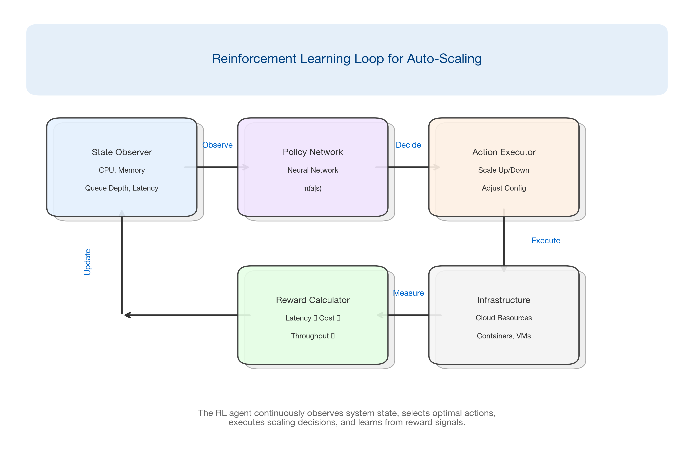
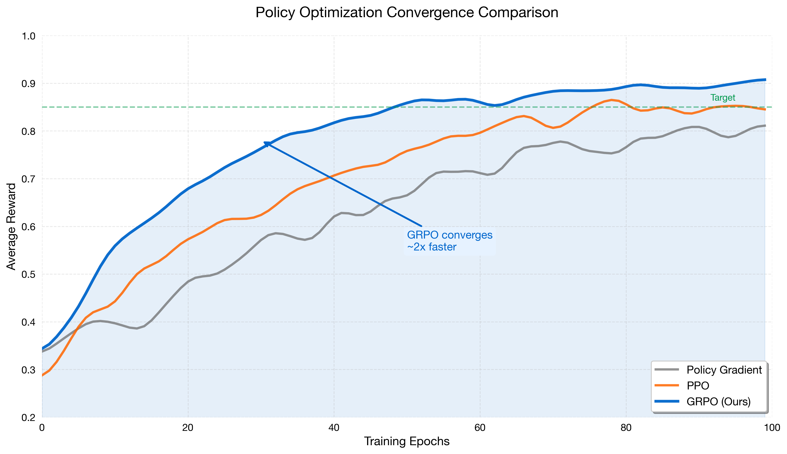
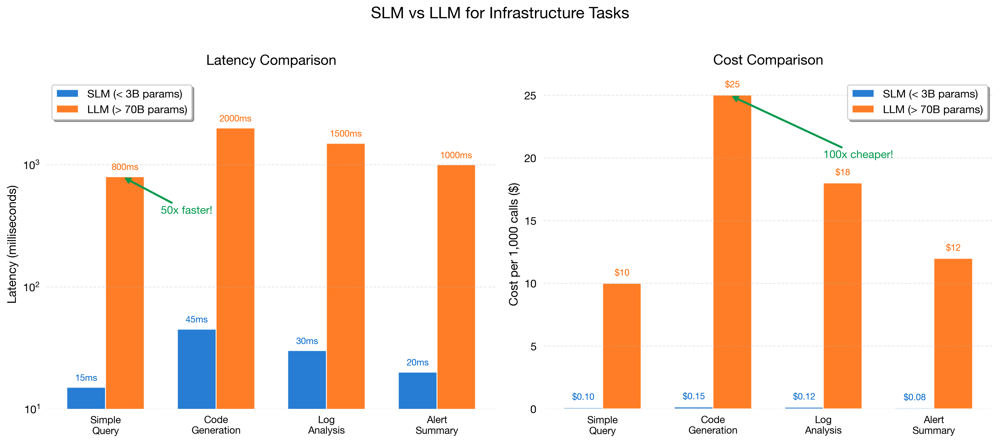
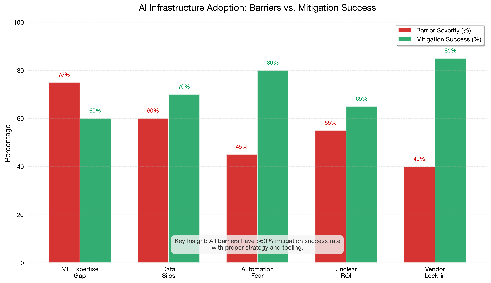

# Chapter 2: Foundations of AI-Driven Optimization

## Introduction

The shift from reactive to proactive infrastructure management represents one of the most significant transformations in enterprise computing. While Chapter 1 outlined why traditional systems fail, this chapter establishes the foundational concepts that enable AI-driven optimization. We'll explore the core technologies, distinguish between different approaches, and set the stage for the practical implementations that follow.

## 2.1 What "AI-Driven Infrastructure" Really Means

The term "AI-driven infrastructure" has become ubiquitous in vendor marketing, often obscuring its true meaning. At its core, AI-driven infrastructure refers to systems that:

1. **Observe** - Continuously collect metrics, logs, and traces from infrastructure components
2. **Learn** - Build models of normal behavior and performance patterns
3. **Predict** - Anticipate future states, failures, and resource requirements
4. **Act** - Automatically adjust configurations, scale resources, or trigger alerts

This represents a fundamental shift from rule-based automation to adaptive, learning systems.

### The Spectrum of Intelligence

Not all AI-driven systems are created equal. They exist on a spectrum from simple rule-based automation to fully autonomous optimization systems.



**Figure 2.1: The AI Infrastructure Intelligence Spectrum**

Most enterprises today operate somewhere between statistical anomaly detection and basic machine learning. The frontier—where true autonomous optimization occurs—remains largely unexplored in production environments.

## 2.2 Core Technologies Explained

### 2.2.1 Machine Learning for Infrastructure

Machine learning in infrastructure contexts differs significantly from traditional ML applications like image classification or NLP. Infrastructure ML must handle:

- **High-dimensional time series data** - Thousands of metrics updating every second
- **Non-stationary distributions** - Traffic patterns change with seasons, promotions, world events
- **Strict latency requirements** - Predictions must arrive before they become stale
- **Adversarial conditions** - Systems may behave unexpectedly during the exact moments prediction matters most

Common ML applications in infrastructure include:

| Application | Technique | Example |
|-------------|-----------|---------|
| Capacity prediction | Time series forecasting (ARIMA, Prophet, LSTM) | Predicting next-hour CPU utilization |
| Anomaly detection | Isolation forests, autoencoders | Detecting unusual latency patterns |
| Root cause analysis | Causal inference, graph neural networks | Tracing failures through microservices |
| Resource allocation | Regression, optimization | Right-sizing container resources |

### 2.2.2 Reinforcement Learning for Dynamic Systems

Reinforcement learning (RL) offers something traditional ML cannot: the ability to learn optimal policies through interaction with the environment. For infrastructure, this means systems that improve their decision-making over time.

**Key RL concepts for infrastructure:**

- **State**: Current system metrics (CPU, memory, queue depth, latency)
- **Action**: Configuration changes (scaling, routing, caching policies)
- **Reward**: Performance improvement (reduced latency, cost savings, higher throughput)
- **Policy**: The learned strategy mapping states to actions



**Figure 2.2: Reinforcement Learning Loop for Auto-Scaling**

### 2.2.3 Group Relative Policy Optimization (GRPO)

GRPO represents a significant advancement in RL for systems optimization. Unlike traditional policy gradient methods, GRPO:

1. **Samples multiple actions** per state
2. **Compares relative performance** rather than absolute rewards
3. **Reduces variance** in gradient estimates
4. **Converges faster** with fewer environment interactions

This is particularly valuable for infrastructure optimization where:
- Each "experiment" has real costs
- Sample efficiency matters
- The action space is large (many configuration knobs)

**Algorithm 2.1: GRPO for Infrastructure Optimization**

```python
def grpo_update(policy, states, num_samples=8):
    """
    Group Relative Policy Optimization update step.

    Args:
        policy: Neural network policy
        states: Batch of current infrastructure states
        num_samples: Number of action samples per state
    """
    for state in states:
        # Sample multiple actions from current policy
        actions = [policy.sample(state) for _ in range(num_samples)]

        # Execute actions and collect rewards
        rewards = [execute_and_measure(action) for action in actions]

        # Compute relative advantages (key GRPO insight)
        mean_reward = sum(rewards) / len(rewards)
        advantages = [r - mean_reward for r in rewards]

        # Update policy to increase probability of better actions
        policy.update(state, actions, advantages)
```



**Figure 2.4: GRPO Convergence vs Traditional Policy Gradient Methods**

### 2.2.4 Predictive Analytics

Predictive analytics bridges the gap between historical analysis and autonomous action. Key applications include:

**Capacity Planning**
- Forecasting resource needs 24-72 hours ahead
- Seasonal decomposition for long-term planning
- Event-driven predictions (product launches, marketing campaigns)

**Failure Prediction**
- Disk failure prediction using SMART metrics
- Network equipment degradation patterns
- Application performance degradation indicators

**Cost Optimization**
- Spot instance interruption prediction
- Reserved capacity utilization forecasting
- Multi-cloud cost trajectory analysis

## 2.3 Small Language Models vs. Large Language Models for Infrastructure

The emergence of Large Language Models (LLMs) like GPT-4 has generated significant interest in their application to infrastructure automation. However, the optimal choice often isn't the largest model available.

### 2.3.1 The Case for Small Language Models (SLMs)

Small Language Models (typically under 3B parameters) offer compelling advantages for infrastructure automation:

| Factor | SLMs (< 3B params) | LLMs (> 70B params) |
|--------|-------------------|---------------------|
| **Latency** | 10-50ms | 500-2000ms |
| **Cost per call** | $0.0001 | $0.01-0.10 |
| **Privacy** | On-premise deployment | Often cloud-required |
| **Customization** | Fine-tunable on domain data | Prompt engineering only |
| **Consistency** | Deterministic with low temp | Variable outputs |



**Figure 2.3: SLM vs LLM Decision Framework**

### 2.3.2 SLM Applications in Infrastructure

**Code Generation for IaC**
Small models fine-tuned on Terraform, Kubernetes YAML, and Ansible playbooks can generate infrastructure code with high accuracy while maintaining sub-second response times.

**Log Analysis**
SLMs trained on operational logs can classify issues, extract key entities, and suggest remediation steps without sending sensitive data to external APIs.

**Alert Summarization**
Converting verbose monitoring alerts into actionable summaries for on-call engineers.

**Runbook Execution**
Translating natural language incident descriptions into executable remediation steps.

## 2.4 Industry Misconceptions and Adoption Barriers

### Misconception 1: "AI will replace ops teams"

**Reality**: AI augments human operators, handling routine decisions while escalating complex situations. The most effective implementations create a collaborative loop:

```
AI handles: 80% of routine scaling decisions
Humans handle: Complex incidents, architectural decisions, policy setting
Together: Continuous improvement through feedback
```

### Misconception 2: "We need perfect data first"

**Reality**: ML systems can start providing value with imperfect data. The key is to:
- Begin with narrow, well-defined use cases
- Implement feedback loops for continuous improvement
- Accept that some predictions will be wrong

### Misconception 3: "It's too expensive to implement"

**Reality**: Modern cloud providers offer managed ML services. Open-source tools like:
- **Prometheus + Thanos** for metrics
- **OpenTelemetry** for observability
- **Ray** for distributed ML
- **MLflow** for experiment tracking

...enable sophisticated AI infrastructure at reasonable cost.

### Common Adoption Barriers

| Barrier | Mitigation Strategy |
|---------|---------------------|
| Lack of ML expertise | Start with AutoML tools; hire/train gradually |
| Data silos | Implement unified observability platform first |
| Fear of automation | Begin with "recommend" mode before "auto-act" |
| Unclear ROI | Define metrics before implementation; run controlled experiments |
| Vendor lock-in concerns | Prioritize open standards (OpenTelemetry, Prometheus) |



**Figure 2.5: Common Adoption Barriers and Mitigation Strategies**

## 2.5 Connecting to Real-World Optimization

The concepts introduced in this chapter form the foundation for everything that follows. In subsequent chapters, we'll see how:

- **Chapter 3**: These techniques are evaluated and benchmarked systematically
- **Chapters 4-6**: Industry-specific applications of ML and RL
- **Chapter 9**: Deep dive into GRPO implementation
- **Chapter 10**: Building production SLM platforms

## Key Takeaways

1. **AI-driven infrastructure** operates on a spectrum from simple automation to autonomous optimization
2. **Reinforcement learning** enables systems that improve through experience, not just historical patterns
3. **GRPO** offers sample-efficient policy learning for infrastructure optimization
4. **Small Language Models** often outperform LLMs for infrastructure tasks due to latency, cost, and customization advantages
5. **Adoption barriers** are real but surmountable with the right strategy

## References

1. Schulman, J., et al. "Proximal Policy Optimization Algorithms." arXiv:1707.06347 (2017)
2. Shao, Z., et al. "DeepSeekMath: Pushing the Limits of Mathematical Reasoning." arXiv:2402.03300 (2024)
3. DAPO: Direct Advantage Policy Optimization. NeurIPS 2025
4. Huyen, C. "Designing Machine Learning Systems." O'Reilly Media (2022)
5. Google SRE Book. "Site Reliability Engineering." O'Reilly Media (2016)

---

*Next Chapter: Comparative Framework for Evaluating Infrastructure Optimization*
