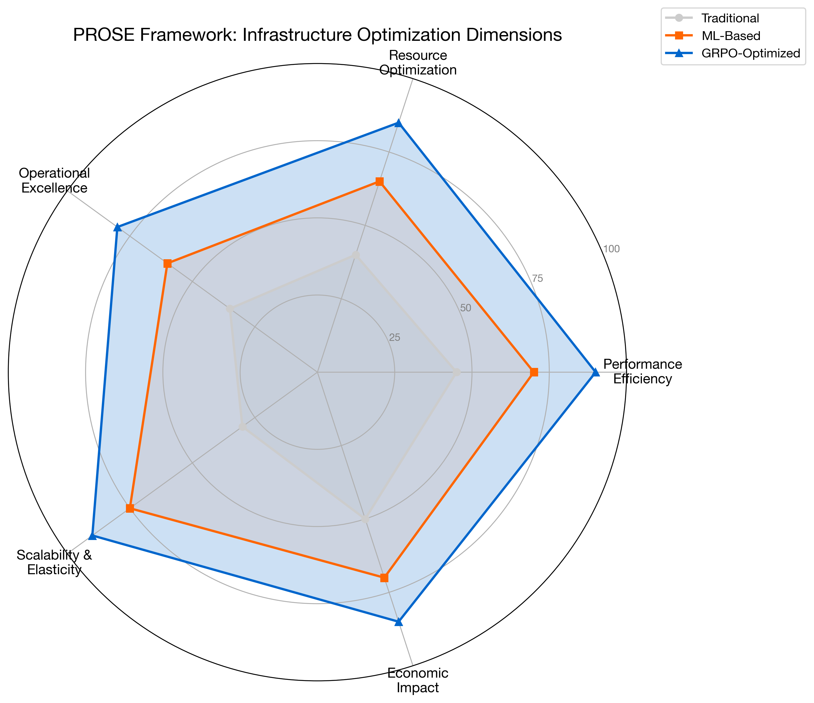
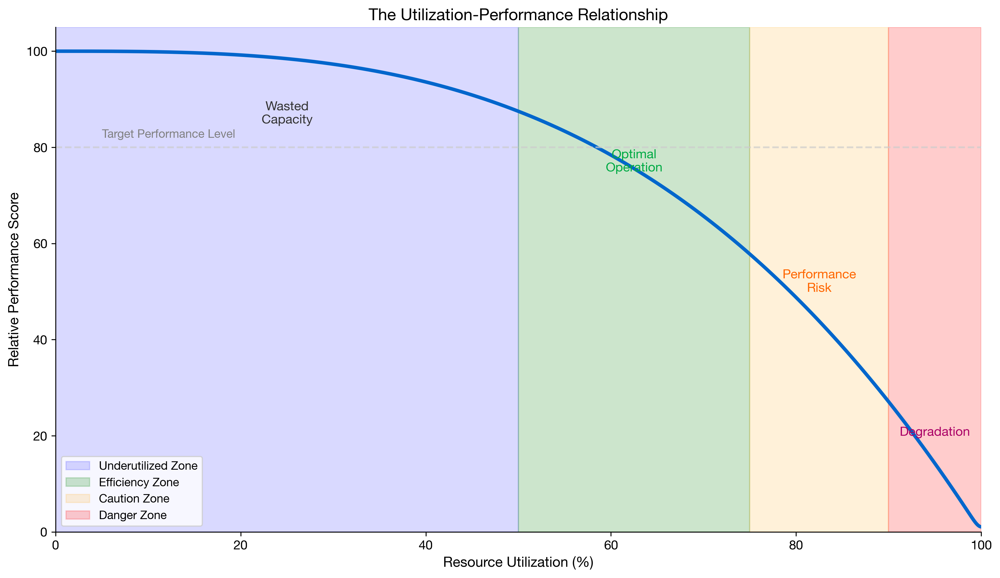
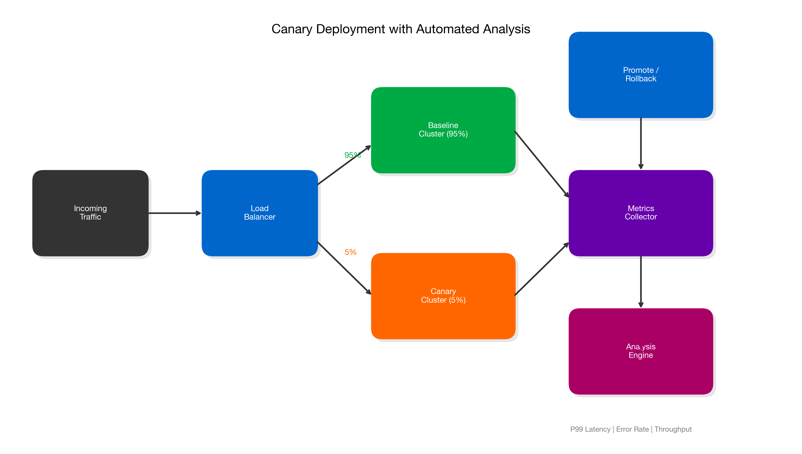
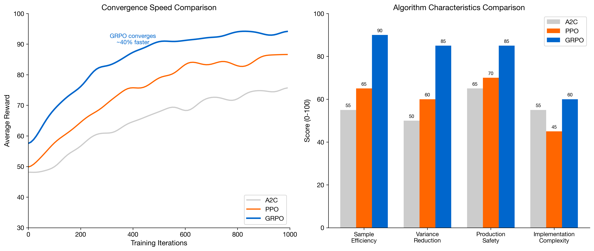
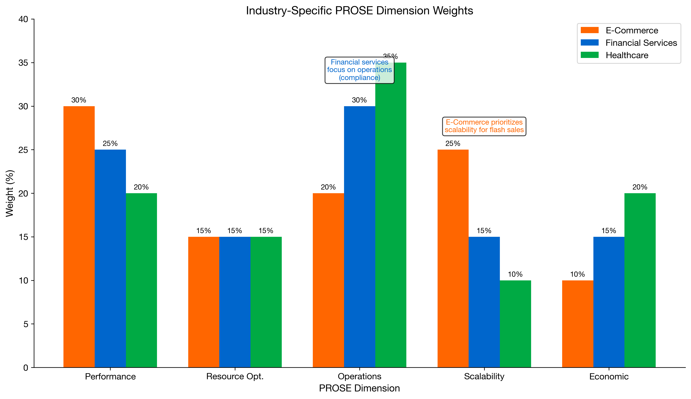

# Chapter 3: Comparative Framework for Evaluating Infrastructure Optimization

## Introduction

With the foundations of AI-driven infrastructure established in Chapter 2, organizations face a critical question: how do we evaluate and compare different optimization approaches? This chapter introduces a systematic framework for assessing infrastructure optimization strategies, enabling data-driven decisions about which techniques to adopt.

The framework presented here will be applied throughout the industry-specific chapters that follow, providing a consistent lens for evaluation across e-commerce, financial services, and healthcare domains.

## 3.1 The Evaluation Challenge

### 3.1.1 Why Traditional Metrics Fall Short

Most organizations evaluate infrastructure performance using metrics that were designed for static, predictable workloads:

| Traditional Metric | Limitation |
|-------------------|------------|
| Average CPU utilization | Masks burst patterns and tail behavior |
| Uptime percentage | Doesn't capture degraded performance states |
| Mean response time | Hides P99 latency that affects user experience |
| Cost per server | Ignores efficiency and actual utilization |

These metrics create blind spots. A system can report 99.9% uptime while delivering unacceptable performance during critical business periods.

### 3.1.2 The Multi-Dimensional Nature of Modern Infrastructure

Modern infrastructure optimization must balance competing objectives:

- **Performance**: Response time, throughput, consistency
- **Cost**: Infrastructure spend, operational overhead, opportunity cost
- **Reliability**: Availability, fault tolerance, recovery time
- **Scalability**: Elasticity, resource efficiency, growth capacity
- **Operability**: Complexity, observability, maintenance burden

No single metric captures this complexity. Effective evaluation requires a framework that addresses all dimensions while acknowledging trade-offs.



**Figure 3.1: The Five Dimensions of Infrastructure Optimization**

## 3.2 The PROSE Framework

We propose the **PROSE Framework** for comprehensive infrastructure evaluation:

- **P**erformance Efficiency
- **R**esource Optimization
- **O**perational Excellence
- **S**calability & Elasticity
- **E**conomic Impact

### 3.2.1 Performance Efficiency

Performance efficiency measures how well the system delivers value to end users.

**Key Metrics:**

| Metric | Definition | Target Range |
|--------|------------|--------------|
| P50 Latency | Median response time | < 100ms for interactive |
| P99 Latency | 99th percentile response time | < 500ms for interactive |
| Throughput | Requests processed per second | Workload-dependent |
| Error Rate | Failed requests / total requests | < 0.1% |
| Latency Consistency | Std dev of response times | Low variance preferred |

**Measurement Approach:**

```python
def calculate_performance_score(metrics):
    """
    Calculate composite performance efficiency score.

    Args:
        metrics: Dict containing latency, throughput, error_rate

    Returns:
        Score between 0-100
    """
    latency_score = max(0, 100 - (metrics['p99_latency_ms'] / 10))
    throughput_score = min(100, (metrics['throughput'] / metrics['target_throughput']) * 100)
    error_score = max(0, 100 - (metrics['error_rate'] * 1000))

    # Weighted composite
    return (latency_score * 0.4 + throughput_score * 0.35 + error_score * 0.25)
```

### 3.2.2 Resource Optimization

Resource optimization assesses how efficiently infrastructure resources are utilized.

**Key Metrics:**

| Metric | Definition | Optimal Range |
|--------|------------|---------------|
| CPU Utilization Efficiency | Useful work / total CPU time | 60-80% |
| Memory Utilization | Active memory / allocated memory | 70-85% |
| Network Efficiency | Payload bytes / total bytes | > 90% |
| Storage IOPS Efficiency | Useful IOPS / provisioned IOPS | > 70% |
| Container Density | Workloads per node | Maximize within limits |

**The Utilization-Performance Curve:**

Resources exhibit non-linear behavior as utilization increases. The relationship between utilization and performance follows a characteristic curve:



**Figure 3.2: The Utilization-Performance Relationship**

Optimal operation occurs in the "efficiency zone" where utilization is high enough to avoid waste but low enough to maintain performance headroom.

### 3.2.3 Operational Excellence

Operational excellence evaluates the human and process factors in infrastructure management.

**Key Metrics:**

| Metric | Definition | Target |
|--------|------------|--------|
| Mean Time to Detect (MTTD) | Time from incident start to detection | < 5 minutes |
| Mean Time to Resolve (MTTR) | Time from detection to resolution | < 30 minutes |
| Change Failure Rate | Failed changes / total changes | < 5% |
| Deployment Frequency | Successful deployments per week | High (continuous) |
| Automation Coverage | Automated tasks / total tasks | > 80% |

**Operational Maturity Model:**

| Level | Characteristics | Automation | Response |
|-------|----------------|------------|----------|
| 1 - Reactive | Manual monitoring, ticket-driven | < 20% | Hours |
| 2 - Proactive | Threshold alerts, runbooks | 40-60% | Minutes |
| 3 - Predictive | ML-based alerting, auto-remediation | 60-80% | Seconds |
| 4 - Autonomous | Self-healing, continuous optimization | > 90% | Preemptive |

### 3.2.4 Scalability & Elasticity

Scalability measures the system's ability to handle growth; elasticity measures its ability to adapt to demand changes.

**Key Metrics:**

| Metric | Definition | Target |
|--------|------------|--------|
| Scale-up Time | Time to provision additional capacity | < 2 minutes |
| Scale-down Time | Time to release unused capacity | < 5 minutes |
| Scaling Accuracy | Actual demand met / predicted demand | > 95% |
| Burst Handling | Performance during 10x traffic spike | < 20% degradation |
| Cost Elasticity | Cost change / demand change ratio | Near 1.0 |

**Elasticity Scoring:**

```python
def calculate_elasticity_score(scaling_events):
    """
    Calculate elasticity score based on scaling behavior.

    Args:
        scaling_events: List of (demand_change, capacity_change, time_lag) tuples

    Returns:
        Elasticity score between 0-100
    """
    scores = []
    for demand_delta, capacity_delta, lag_seconds in scaling_events:
        # Ideal: capacity matches demand with zero lag
        accuracy = min(capacity_delta / demand_delta, 1.0) if demand_delta > 0 else 1.0
        speed = max(0, 1 - (lag_seconds / 300))  # 5-minute baseline
        scores.append(accuracy * 0.6 + speed * 0.4)

    return sum(scores) / len(scores) * 100
```

### 3.2.5 Economic Impact

Economic impact quantifies the financial implications of infrastructure decisions.

**Key Metrics:**

| Metric | Definition | Calculation |
|--------|------------|-------------|
| Cost per Transaction | Infrastructure cost / transactions | Direct division |
| Revenue per Infrastructure Dollar | Revenue / infrastructure cost | Higher is better |
| Waste Ratio | Idle resources / total resources | Lower is better |
| Optimization ROI | (Savings - Implementation Cost) / Implementation Cost | > 200% target |
| Total Cost of Ownership | Direct + indirect + opportunity costs | Comprehensive view |

**TCO Calculation Model:**

```
TCO = Direct Costs + Operational Costs + Opportunity Costs

Where:
  Direct Costs = Compute + Storage + Network + Licensing
  Operational Costs = Personnel + Tools + Training + Incidents
  Opportunity Costs = Downtime Revenue Loss + Performance Impact + Technical Debt
```

## 3.3 Benchmarking Methodologies

### 3.3.1 Controlled Benchmarks

Controlled benchmarks provide repeatable measurements under standardized conditions.

**Standard Infrastructure Benchmarks:**

| Benchmark | Focus Area | Key Output |
|-----------|------------|------------|
| SPEC CPU | Compute performance | SPECrate, SPECspeed |
| TPC-C/TPC-E | Database transactions | Transactions per minute |
| YCSB | NoSQL databases | Operations per second |
| Fio | Storage I/O | IOPS, bandwidth, latency |
| wrk/hey | HTTP performance | Requests per second |

**Benchmark Design Principles:**

1. **Reproducibility**: Same inputs produce same outputs
2. **Isolation**: Minimize external interference
3. **Representativeness**: Workload reflects real usage
4. **Scalability**: Can measure across different scales

### 3.3.2 Production Benchmarks

Production benchmarks measure real-world performance under actual conditions.

**Approaches:**

| Method | Description | Trade-offs |
|--------|-------------|------------|
| Canary Analysis | Compare new vs. baseline in production | Real data, limited scope |
| Shadow Traffic | Replay production traffic to test systems | No user impact, resource cost |
| A/B Testing | Split traffic between configurations | Statistical rigor, complexity |
| Chaos Engineering | Inject failures to test resilience | Risk requires careful design |

**Canary Analysis Framework:**



**Figure 3.3: Canary Deployment with Automated Analysis**

### 3.3.3 Comparative Analysis

When comparing optimization approaches, structure the analysis systematically:

**Comparison Matrix Template:**

| Dimension | Approach A | Approach B | Approach C | Weight |
|-----------|------------|------------|------------|--------|
| Performance | Score 0-100 | Score 0-100 | Score 0-100 | 25% |
| Resource Efficiency | Score 0-100 | Score 0-100 | Score 0-100 | 20% |
| Operational Complexity | Score 0-100 | Score 0-100 | Score 0-100 | 20% |
| Scalability | Score 0-100 | Score 0-100 | Score 0-100 | 15% |
| Cost Impact | Score 0-100 | Score 0-100 | Score 0-100 | 20% |
| **Weighted Total** | | | | 100% |

## 3.4 Optimization Approach Comparison

### 3.4.1 Rule-Based vs. ML-Based Optimization

| Criterion | Rule-Based | ML-Based |
|-----------|------------|----------|
| **Setup Complexity** | Low - define thresholds | High - requires training data |
| **Adaptability** | Static - manual updates | Dynamic - learns from data |
| **Explainability** | High - clear rules | Variable - depends on model |
| **Edge Cases** | Poor - only handles known scenarios | Better - generalizes patterns |
| **Maintenance** | High - rules proliferate | Medium - model retraining |
| **Best For** | Stable, predictable workloads | Dynamic, evolving workloads |

### 3.4.2 Reactive vs. Predictive Scaling

| Criterion | Reactive Scaling | Predictive Scaling |
|-----------|-----------------|-------------------|
| **Response Time** | Minutes (after threshold breach) | Preemptive (before demand) |
| **Accuracy** | High for steady state | Requires pattern learning |
| **Over-provisioning** | Common during uncertainty | Optimized based on forecasts |
| **Cold Start Handling** | Poor - always behind | Good - anticipates demand |
| **Implementation** | Simple threshold rules | ML models + forecasting |
| **Best For** | Unpredictable spikes | Patterns with seasonality |

### 3.4.3 Traditional RL vs. GRPO for Infrastructure

| Criterion | Traditional RL (PPO/A2C) | GRPO |
|-----------|-------------------------|------|
| **Sample Efficiency** | Lower - needs many episodes | Higher - relative comparisons |
| **Variance** | Higher gradient variance | Lower through group normalization |
| **Convergence Speed** | Slower | Faster |
| **Exploration** | Requires explicit strategy | Built into group sampling |
| **Infrastructure Suitability** | Challenging - costly exploration | Better - efficient learning |
| **Best For** | Simulated environments | Production optimization |



**Figure 3.4: Reinforcement Learning Approaches for Infrastructure**

## 3.5 Industry-Specific Evaluation Criteria

Different industries weight the PROSE dimensions differently based on their unique requirements:

### 3.5.1 E-Commerce Weighting

| Dimension | Weight | Rationale |
|-----------|--------|-----------|
| Performance | 30% | User experience directly impacts conversion |
| Resource Optimization | 15% | Important but secondary to availability |
| Operational Excellence | 20% | Fast recovery during peak seasons |
| Scalability | 25% | Must handle flash sales, viral events |
| Economic Impact | 10% | Revenue growth often trumps cost optimization |

### 3.5.2 Financial Services Weighting

| Dimension | Weight | Rationale |
|-----------|--------|-----------|
| Performance | 25% | Low latency for trading, transactions |
| Resource Optimization | 15% | Compliance may require over-provisioning |
| Operational Excellence | 30% | Regulatory requirements, audit trails |
| Scalability | 15% | More predictable than e-commerce |
| Economic Impact | 15% | Cost matters but reliability is paramount |

### 3.5.3 Healthcare Weighting

| Dimension | Weight | Rationale |
|-----------|--------|-----------|
| Performance | 20% | Important but not ultra-low latency |
| Resource Optimization | 15% | Budget constraints in healthcare |
| Operational Excellence | 35% | Patient safety, data integrity |
| Scalability | 10% | Generally more predictable demand |
| Economic Impact | 20% | Cost containment is major industry focus |



**Figure 3.5: PROSE Dimension Weights by Industry**

## 3.6 Building Your Evaluation Practice

### 3.6.1 Establishing Baselines

Before evaluating optimization approaches, establish clear baselines:

1. **Current State Assessment**
   - Document existing metrics across all PROSE dimensions
   - Identify measurement gaps and instrumentation needs
   - Establish data collection pipelines

2. **Baseline Period Selection**
   - Choose representative time periods
   - Include both typical and peak periods
   - Account for seasonality and trends

3. **Baseline Documentation**
   - Record infrastructure configurations
   - Document workload characteristics
   - Capture cost structures

### 3.6.2 Running Evaluations

**Evaluation Checklist:**

- [ ] Define success criteria before testing
- [ ] Ensure statistically significant sample sizes
- [ ] Control for external variables
- [ ] Document all configuration changes
- [ ] Monitor for unintended side effects
- [ ] Capture both quantitative and qualitative data
- [ ] Include rollback procedures

### 3.6.3 Interpreting Results

When analyzing evaluation results:

1. **Statistical Significance**: Ensure differences aren't due to random variation
2. **Practical Significance**: A 5% improvement may not justify implementation complexity
3. **Trade-off Analysis**: Improvements in one dimension may come at cost to others
4. **Long-term Sustainability**: Short-term gains may not persist
5. **Operational Impact**: Consider the burden on teams

## 3.7 Case Study: Applying the Framework

Consider a hypothetical evaluation of three auto-scaling approaches:

**Scenario**: E-commerce platform evaluating scaling strategies

| Approach | Description |
|----------|-------------|
| A: Threshold-based | Scale when CPU > 70% |
| B: Predictive (Prophet) | Forecast-based pre-scaling |
| C: RL-based (GRPO) | Learned optimal policy |

**Evaluation Results:**

| Metric | Approach A | Approach B | Approach C |
|--------|------------|------------|------------|
| P99 Latency (ms) | 450 | 280 | 195 |
| Scale-up Time (s) | 180 | 45 | 30 |
| Over-provisioning % | 35% | 18% | 12% |
| Monthly Cost | $48,000 | $42,000 | $38,500 |
| Implementation Effort | Low | Medium | High |
| PROSE Score | 62 | 78 | 89 |

**Recommendation**: Approach C (GRPO) delivers the best overall performance but requires significant implementation investment. Approach B offers a strong middle ground for organizations not ready for full RL adoption.

## Key Takeaways

1. **Multi-dimensional evaluation** is essential - no single metric captures infrastructure optimization effectiveness

2. **The PROSE Framework** provides comprehensive coverage: Performance, Resource optimization, Operational excellence, Scalability, Economic impact

3. **Benchmarking requires rigor** - controlled benchmarks for comparison, production benchmarks for validation

4. **Industry context matters** - weight dimensions according to your specific business requirements

5. **Baselines are foundational** - you cannot measure improvement without a clear starting point

6. **Trade-offs are inevitable** - the goal is informed decision-making, not perfection in every dimension

## References

1. Ousterhout, J. "Always Measure One Level Deeper." Communications of the ACM (2018)
2. Google Cloud. "The Four Golden Signals." Site Reliability Engineering (2016)
3. Sedgewick, R., Wayne, K. "Algorithms." Princeton University (2011)
4. Dean, J., Barroso, L. "The Tail at Scale." Communications of the ACM (2013)
5. Kim, G., et al. "The DevOps Handbook." IT Revolution Press (2016)

---

*Next Chapter: E-Commerce Infrastructure Optimization - Applying the Framework*
