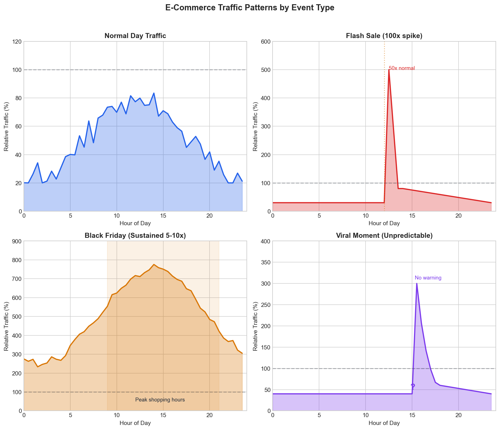
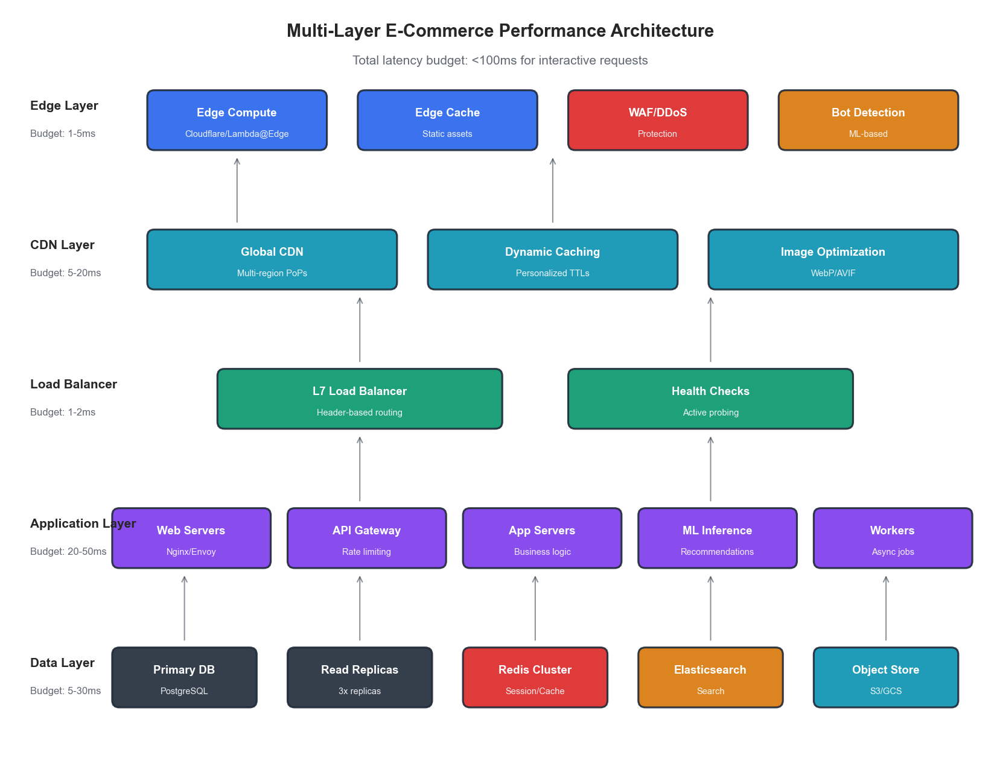
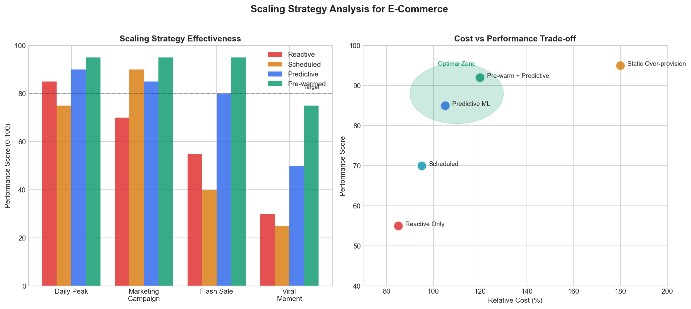
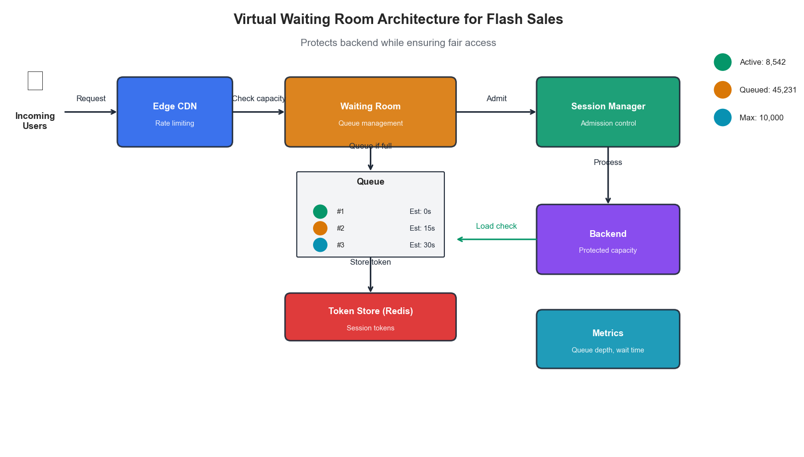
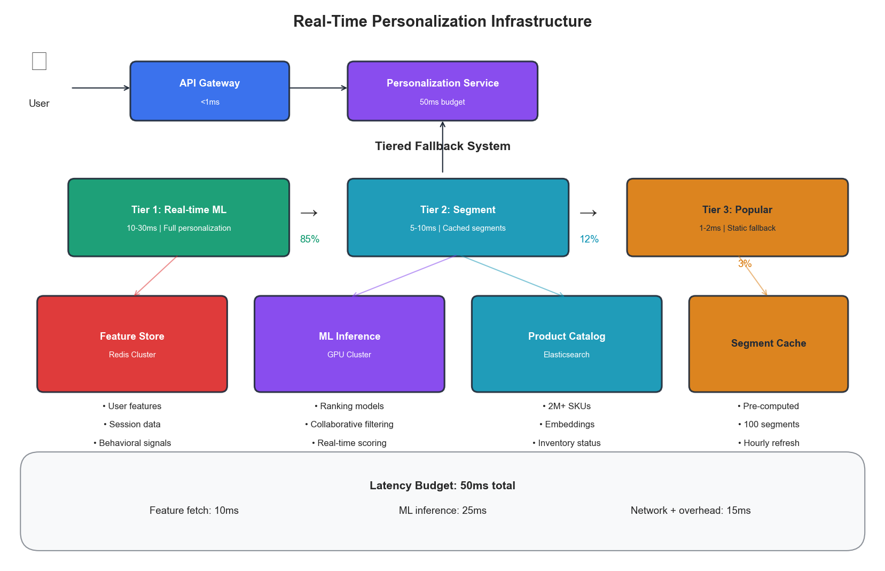

# Chapter 4: E-Commerce Infrastructure Optimization

## Introduction

E-commerce platforms face unique infrastructure challenges that distinguish them from other industries. The combination of unpredictable traffic spikes, real-time inventory management, personalization at scale, and the direct relationship between latency and revenue creates an environment where infrastructure optimization isn't just about cost savings—it's about competitive survival.

This chapter applies the PROSE Framework introduced in Chapter 3 to e-commerce infrastructure, providing actionable strategies for optimizing platforms that must handle everything from steady-state browsing to viral flash sales.

## 4.1 The E-Commerce Infrastructure Challenge

### 4.1.1 Why E-Commerce Is Different

E-commerce infrastructure operates under constraints that make optimization particularly challenging:

| Challenge | Impact | Traditional Approach | AI-Driven Approach |
|-----------|--------|---------------------|-------------------|
| Traffic unpredictability | 10-100x normal load during events | Massive over-provisioning | Predictive scaling |
| Latency sensitivity | 100ms delay = 1% revenue loss | Static CDN rules | Dynamic edge optimization |
| Inventory synchronization | Overselling, stockouts | Periodic batch updates | Real-time streaming |
| Personalization demands | Millions of unique experiences | Pre-computed segments | Real-time ML inference |
| Cart abandonment | 70% average abandonment rate | Static checkout flows | Adaptive optimization |



**Figure 4.1: Typical E-Commerce Traffic Patterns Across Different Event Types**

### 4.1.2 The Revenue-Latency Relationship

Research consistently shows that latency directly impacts e-commerce revenue:

- **Amazon**: 100ms latency = 1% revenue loss
- **Walmart**: 1 second improvement = 2% conversion increase
- **Google**: 500ms delay = 20% traffic reduction

This relationship creates a clear optimization target: every millisecond saved translates to measurable business value.

```python
def calculate_latency_impact(
    current_latency_ms: float,
    target_latency_ms: float,
    daily_revenue: float,
    latency_sensitivity: float = 0.01  # 1% per 100ms
) -> dict:
    """
    Calculate revenue impact of latency improvement.

    Args:
        current_latency_ms: Current P50 latency
        target_latency_ms: Target P50 latency
        daily_revenue: Daily revenue in dollars
        latency_sensitivity: Revenue loss per 100ms

    Returns:
        Dictionary with impact analysis
    """
    latency_improvement = current_latency_ms - target_latency_ms
    revenue_multiplier = 1 + (latency_improvement / 100) * latency_sensitivity

    daily_uplift = daily_revenue * (revenue_multiplier - 1)
    annual_uplift = daily_uplift * 365

    return {
        "latency_improvement_ms": latency_improvement,
        "daily_revenue_uplift": daily_uplift,
        "annual_revenue_uplift": annual_uplift,
        "roi_per_ms": annual_uplift / latency_improvement if latency_improvement > 0 else 0
    }
```

## 4.2 Applying the PROSE Framework to E-Commerce

### 4.2.1 Performance Efficiency (Weight: 30%)

For e-commerce, performance efficiency focuses on user-facing metrics that directly impact conversion.

**Critical Metrics:**

| Metric | Definition | E-Commerce Target | Business Impact |
|--------|------------|-------------------|-----------------|
| Time to First Byte (TTFB) | Server response initiation | < 200ms | Search ranking, UX |
| Largest Contentful Paint (LCP) | Main content visibility | < 2.5s | Bounce rate |
| First Input Delay (FID) | Interactivity readiness | < 100ms | Cart interaction |
| Cumulative Layout Shift (CLS) | Visual stability | < 0.1 | Trust, click accuracy |
| Add-to-Cart Latency | Cart operation speed | < 300ms | Conversion rate |
| Checkout Latency | Payment flow speed | < 500ms | Abandonment rate |

**Performance Optimization Architecture:**



**Figure 4.2: Multi-Layer Performance Optimization Architecture**

### 4.2.2 Resource Optimization (Weight: 15%)

E-commerce resource optimization must balance efficiency with the need for burst capacity.

**Resource Allocation Strategy:**

```python
class ECommerceResourceAllocator:
    """
    Dynamic resource allocation for e-commerce workloads.
    """

    def __init__(self, baseline_capacity: int, max_burst_multiplier: float = 10.0):
        self.baseline = baseline_capacity
        self.max_burst = baseline_capacity * max_burst_multiplier
        self.current_allocation = baseline_capacity

    def calculate_target_capacity(
        self,
        current_traffic: float,
        predicted_traffic: float,
        prediction_confidence: float
    ) -> int:
        """
        Calculate target capacity based on current and predicted traffic.

        Uses confidence-weighted blending of reactive and predictive signals.
        """
        # Reactive component: based on current traffic with headroom
        reactive_target = current_traffic * 1.3  # 30% headroom

        # Predictive component: based on forecast
        predictive_target = predicted_traffic * 1.2  # 20% headroom

        # Blend based on prediction confidence
        blended_target = (
            predictive_target * prediction_confidence +
            reactive_target * (1 - prediction_confidence)
        )

        # Apply bounds
        return int(min(max(blended_target, self.baseline), self.max_burst))
```

**Utilization Targets by Component:**

| Component | Target Utilization | Rationale |
|-----------|-------------------|-----------|
| Web servers | 40-60% | Burst headroom for flash sales |
| Application servers | 50-70% | Processing headroom |
| Database (read) | 60-75% | Query performance |
| Database (write) | 40-50% | Transaction safety |
| Cache layer | 70-85% | Memory efficiency |
| CDN edge | 30-50% | Geographic burst capacity |

### 4.2.3 Operational Excellence (Weight: 20%)

E-commerce operations must handle rapid deployments during frozen periods and instant rollbacks during sales events.

**Deployment Strategy Matrix:**

| Period | Deployment Frequency | Rollback Time | Change Types Allowed |
|--------|---------------------|---------------|---------------------|
| Normal | Multiple daily | < 5 minutes | All |
| Pre-event (7 days) | Daily with approval | < 2 minutes | Bug fixes, optimizations |
| Event freeze | Emergency only | < 1 minute | Critical fixes only |
| Post-event | Accelerated | < 5 minutes | All + learnings |

**Incident Response Framework:**

```python
class ECommerceIncidentResponse:
    """
    Automated incident response for e-commerce platforms.
    """

    SEVERITY_THRESHOLDS = {
        "critical": {
            "error_rate": 0.05,      # 5% error rate
            "latency_p99_ms": 2000,  # 2 second P99
            "revenue_impact_pct": 1.0  # 1% revenue impact
        },
        "high": {
            "error_rate": 0.02,
            "latency_p99_ms": 1000,
            "revenue_impact_pct": 0.5
        },
        "medium": {
            "error_rate": 0.01,
            "latency_p99_ms": 500,
            "revenue_impact_pct": 0.1
        }
    }

    def classify_incident(self, metrics: dict) -> str:
        """Classify incident severity based on current metrics."""
        for severity, thresholds in self.SEVERITY_THRESHOLDS.items():
            if (metrics.get("error_rate", 0) >= thresholds["error_rate"] or
                metrics.get("latency_p99_ms", 0) >= thresholds["latency_p99_ms"] or
                metrics.get("revenue_impact_pct", 0) >= thresholds["revenue_impact_pct"]):
                return severity
        return "low"

    def get_auto_remediation_actions(self, severity: str, symptoms: list) -> list:
        """Get automated remediation actions based on severity and symptoms."""
        actions = []

        if "high_latency" in symptoms:
            actions.append({"action": "scale_up", "component": "app_servers", "factor": 1.5})
            actions.append({"action": "enable_cache_bypass", "ttl": 300})

        if "database_saturation" in symptoms:
            actions.append({"action": "enable_read_replica_routing", "percentage": 80})
            actions.append({"action": "reduce_batch_jobs", "factor": 0.5})

        if "memory_pressure" in symptoms:
            actions.append({"action": "trigger_gc", "aggressive": severity == "critical"})
            actions.append({"action": "evict_cold_cache", "percentage": 20})

        return actions
```

### 4.2.4 Scalability & Elasticity (Weight: 25%)

Scalability is paramount for e-commerce—the difference between handling a viral moment and losing millions in revenue.

**Scaling Patterns for E-Commerce Events:**

| Event Type | Lead Time | Peak Multiplier | Duration | Optimal Strategy |
|------------|-----------|-----------------|----------|------------------|
| Flash sale | Hours | 50-100x | Minutes | Pre-warm + aggressive scale |
| Daily peak | Predictable | 3-5x | Hours | Scheduled + predictive |
| Viral moment | None | 10-50x | Variable | Reactive + circuit breaker |
| Holiday season | Days | 5-10x | Weeks | Sustained high capacity |
| Marketing campaign | Hours | 5-20x | Hours | Scheduled + monitoring |



**Figure 4.3: Scaling Strategy Effectiveness by Event Type**

**Predictive Auto-Scaling Implementation:**

```python
class PredictiveAutoScaler:
    """
    ML-based auto-scaler for e-commerce workloads.
    """

    def __init__(self, model, scaler_client):
        self.model = model  # Trained forecasting model
        self.scaler = scaler_client
        self.min_instances = 10
        self.max_instances = 500
        self.scale_up_threshold = 0.7
        self.scale_down_threshold = 0.3

    def predict_and_scale(self, current_metrics: dict, horizon_minutes: int = 15):
        """
        Predict future load and proactively scale.

        Args:
            current_metrics: Current system metrics
            horizon_minutes: How far ahead to predict
        """
        # Generate prediction
        prediction = self.model.predict(
            current_metrics,
            horizon=horizon_minutes
        )

        predicted_load = prediction["load"]
        confidence = prediction["confidence"]

        # Calculate required capacity
        current_capacity = current_metrics["instance_count"]
        current_utilization = current_metrics["avg_cpu_utilization"]

        # Effective capacity considering current utilization
        load_per_instance = current_utilization / 100 * predicted_load / current_capacity
        required_instances = int(predicted_load / (self.scale_up_threshold * 100))

        # Apply confidence-based safety margin
        safety_margin = 1.0 + (1.0 - confidence) * 0.5  # Up to 50% extra if uncertain
        target_instances = int(required_instances * safety_margin)

        # Bound to limits
        target_instances = max(self.min_instances, min(target_instances, self.max_instances))

        # Execute scaling if needed
        if target_instances > current_capacity:
            self.scaler.scale_up(target_instances - current_capacity)
        elif target_instances < current_capacity * 0.7:  # Hysteresis for scale-down
            self.scaler.scale_down(current_capacity - target_instances)

        return {
            "current": current_capacity,
            "target": target_instances,
            "predicted_load": predicted_load,
            "confidence": confidence
        }
```

### 4.2.5 Economic Impact (Weight: 10%)

While cost is weighted lower than other dimensions, efficient spending enables investment in growth.

**Cost Optimization Strategies:**

| Strategy | Savings Potential | Risk Level | Implementation Complexity |
|----------|------------------|------------|--------------------------|
| Spot instances for batch | 60-80% | Medium | Low |
| Reserved capacity (baseline) | 30-40% | Low | Low |
| CDN caching optimization | 20-40% | Low | Medium |
| Right-sizing instances | 20-30% | Low | Medium |
| Database query optimization | 15-25% | Low | High |
| Serverless for variable loads | 40-60% | Medium | High |

**Cost-Performance Trade-off Analysis:**

```python
def analyze_cost_performance_tradeoff(
    configurations: list,
    performance_weight: float = 0.7,
    cost_weight: float = 0.3
) -> dict:
    """
    Analyze cost-performance trade-offs across configurations.

    Args:
        configurations: List of {name, cost, latency_p99, throughput}
        performance_weight: Weight for performance score
        cost_weight: Weight for cost score

    Returns:
        Ranked configurations with composite scores
    """
    # Normalize metrics
    max_cost = max(c["cost"] for c in configurations)
    min_latency = min(c["latency_p99"] for c in configurations)
    max_throughput = max(c["throughput"] for c in configurations)

    scored = []
    for config in configurations:
        # Cost score: lower is better (inverted)
        cost_score = 1 - (config["cost"] / max_cost)

        # Performance score: combination of latency and throughput
        latency_score = min_latency / config["latency_p99"]
        throughput_score = config["throughput"] / max_throughput
        performance_score = (latency_score + throughput_score) / 2

        # Composite score
        composite = (performance_score * performance_weight +
                    cost_score * cost_weight)

        scored.append({
            **config,
            "cost_score": cost_score,
            "performance_score": performance_score,
            "composite_score": composite
        })

    return sorted(scored, key=lambda x: x["composite_score"], reverse=True)
```

## 4.3 Flash Sale Infrastructure

### 4.3.1 The Flash Sale Challenge

Flash sales represent the ultimate stress test for e-commerce infrastructure. Within seconds, traffic can increase 100x while inventory must remain perfectly synchronized.

**Flash Sale Requirements:**

| Requirement | Challenge | Solution Approach |
|-------------|-----------|-------------------|
| Instant scale | Cold start latency | Pre-warmed capacity pools |
| Inventory accuracy | Race conditions | Distributed locks, event sourcing |
| Fair queuing | Bot prevention | Virtual waiting rooms |
| Graceful degradation | Cascade failures | Circuit breakers, fallbacks |
| Real-time updates | WebSocket scale | Edge pub/sub, connection pooling |

### 4.3.2 Virtual Waiting Room Architecture

Virtual waiting rooms protect backend systems while providing fair access to customers.



**Figure 4.4: Virtual Waiting Room Architecture for Flash Sales**

```python
class VirtualWaitingRoom:
    """
    Manages fair access to flash sale inventory.
    """

    def __init__(self, redis_client, max_concurrent: int = 10000):
        self.redis = redis_client
        self.max_concurrent = max_concurrent

    async def enter_queue(self, user_id: str, sale_id: str) -> dict:
        """
        Add user to waiting room queue.

        Returns position and estimated wait time.
        """
        queue_key = f"waiting_room:{sale_id}"
        timestamp = time.time()

        # Add to sorted set with timestamp as score
        await self.redis.zadd(queue_key, {user_id: timestamp})

        # Get position
        position = await self.redis.zrank(queue_key, user_id)

        # Calculate estimated wait
        processing_rate = 100  # users per second
        estimated_wait = max(0, (position - self.max_concurrent) / processing_rate)

        return {
            "position": position + 1,
            "estimated_wait_seconds": estimated_wait,
            "token": self._generate_token(user_id, sale_id)
        }

    async def check_admission(self, user_id: str, sale_id: str) -> bool:
        """
        Check if user can be admitted from waiting room.
        """
        queue_key = f"waiting_room:{sale_id}"
        active_key = f"active_shoppers:{sale_id}"

        # Check current active count
        active_count = await self.redis.scard(active_key)

        if active_count >= self.max_concurrent:
            return False

        # Check if user is next in queue
        position = await self.redis.zrank(queue_key, user_id)
        admitted_count = await self.redis.get(f"admitted:{sale_id}") or 0

        if position <= int(admitted_count) + (self.max_concurrent - active_count):
            # Admit user
            await self.redis.sadd(active_key, user_id)
            await self.redis.incr(f"admitted:{sale_id}")
            return True

        return False
```

### 4.3.3 Inventory Synchronization

Real-time inventory accuracy prevents overselling while maximizing sales.

```python
class DistributedInventoryManager:
    """
    Manages inventory across distributed systems with strong consistency.
    """

    def __init__(self, redis_cluster, postgres_pool):
        self.cache = redis_cluster
        self.db = postgres_pool

    async def reserve_inventory(
        self,
        sku: str,
        quantity: int,
        reservation_id: str,
        ttl_seconds: int = 600
    ) -> dict:
        """
        Reserve inventory with distributed locking.

        Uses optimistic locking with automatic retry.
        """
        lock_key = f"inv_lock:{sku}"

        for attempt in range(3):
            try:
                # Acquire distributed lock
                async with self.cache.lock(lock_key, timeout=5):
                    # Check available inventory in cache
                    available = await self.cache.get(f"inventory:{sku}")

                    if available is None:
                        # Cache miss - load from database
                        available = await self._load_from_db(sku)

                    if int(available) < quantity:
                        return {"success": False, "reason": "insufficient_inventory"}

                    # Reserve in cache
                    new_available = int(available) - quantity
                    await self.cache.set(f"inventory:{sku}", new_available)

                    # Record reservation
                    await self.cache.setex(
                        f"reservation:{reservation_id}",
                        ttl_seconds,
                        json.dumps({"sku": sku, "quantity": quantity})
                    )

                    # Async write to database (event-sourced)
                    await self._emit_reservation_event(sku, quantity, reservation_id)

                    return {
                        "success": True,
                        "reservation_id": reservation_id,
                        "remaining": new_available
                    }

            except LockError:
                await asyncio.sleep(0.1 * (attempt + 1))

        return {"success": False, "reason": "lock_contention"}
```

## 4.4 Personalization at Scale

### 4.4.1 Real-Time Recommendation Infrastructure

Personalization requires real-time ML inference at massive scale.

**Recommendation System Architecture:**

| Layer | Latency Budget | Function | Technology |
|-------|---------------|----------|------------|
| Edge cache | 1-5ms | Pre-computed popular items | CDN with edge compute |
| Feature store | 5-10ms | User feature retrieval | Redis Cluster |
| Model inference | 10-30ms | Real-time scoring | GPU inference servers |
| Fallback | 1ms | Default recommendations | Static cache |



**Figure 4.5: Real-Time Personalization Infrastructure**

```python
class PersonalizationService:
    """
    Real-time personalization with tiered fallback.
    """

    def __init__(self, feature_store, model_service, cache):
        self.features = feature_store
        self.model = model_service
        self.cache = cache
        self.timeout_ms = 50  # Total budget

    async def get_recommendations(
        self,
        user_id: str,
        context: dict,
        num_items: int = 10
    ) -> list:
        """
        Get personalized recommendations with graceful degradation.
        """
        start = time.monotonic()

        try:
            # Try personalized recommendations
            user_features = await asyncio.wait_for(
                self.features.get_user_features(user_id),
                timeout=0.015  # 15ms budget for features
            )

            elapsed = (time.monotonic() - start) * 1000
            remaining_budget = self.timeout_ms - elapsed

            if remaining_budget > 20:  # Need at least 20ms for inference
                recommendations = await asyncio.wait_for(
                    self.model.score(user_features, context, num_items),
                    timeout=remaining_budget / 1000
                )
                return {"items": recommendations, "type": "personalized"}

        except asyncio.TimeoutError:
            pass  # Fall through to fallback
        except Exception as e:
            logging.warning(f"Personalization failed: {e}")

        # Fallback to segment-based recommendations
        segment = await self._get_user_segment(user_id)
        cached_recs = await self.cache.get(f"segment_recs:{segment}")

        if cached_recs:
            return {"items": cached_recs, "type": "segment"}

        # Final fallback: popular items
        popular = await self.cache.get("popular_items")
        return {"items": popular or [], "type": "popular"}
```

### 4.4.2 Feature Store Design

The feature store must serve millions of feature vectors with sub-10ms latency.

```python
class ECommerceFeatureStore:
    """
    High-performance feature store for e-commerce.
    """

    def __init__(self, redis_cluster, ttl_seconds: int = 3600):
        self.redis = redis_cluster
        self.ttl = ttl_seconds

    async def get_user_features(self, user_id: str) -> dict:
        """
        Retrieve user features with pipeline optimization.
        """
        keys = [
            f"user:{user_id}:demographics",
            f"user:{user_id}:behavior",
            f"user:{user_id}:preferences",
            f"user:{user_id}:session"
        ]

        # Pipeline multiple gets
        pipe = self.redis.pipeline()
        for key in keys:
            pipe.get(key)
        results = await pipe.execute()

        # Merge features
        features = {}
        for key, result in zip(keys, results):
            if result:
                features.update(json.loads(result))

        return features

    async def update_session_features(
        self,
        user_id: str,
        events: list
    ):
        """
        Update session-based features in real-time.
        """
        session_key = f"user:{user_id}:session"

        # Aggregate events into features
        session_features = {
            "pages_viewed": len([e for e in events if e["type"] == "page_view"]),
            "products_viewed": len([e for e in events if e["type"] == "product_view"]),
            "cart_additions": len([e for e in events if e["type"] == "add_to_cart"]),
            "time_on_site": events[-1]["timestamp"] - events[0]["timestamp"],
            "last_category": events[-1].get("category"),
        }

        await self.redis.setex(
            session_key,
            self.ttl,
            json.dumps(session_features)
        )
```

## 4.5 Case Study: Black Friday Optimization

### 4.5.1 Scenario

A large e-commerce retailer preparing for Black Friday with the following profile:

- **Normal daily traffic**: 500K unique visitors
- **Expected peak**: 5M unique visitors (10x)
- **Product catalog**: 2M SKUs
- **Real-time inventory sync**: Required for 50K sale items
- **Previous year issues**: 45 minutes downtime, $3.2M estimated lost revenue

### 4.5.2 Optimization Strategy

**Phase 1: Pre-Event Preparation (T-30 days)**

| Action | Purpose | PROSE Dimension |
|--------|---------|-----------------|
| Load testing at 15x | Identify bottlenecks | Performance |
| Pre-warm cache with sale items | Reduce cold start | Scalability |
| Deploy additional read replicas | Database scaling | Resource |
| Implement circuit breakers | Graceful degradation | Operational |
| Negotiate reserved capacity | Cost optimization | Economic |

**Phase 2: Event Day Architecture**

```python
BLACK_FRIDAY_CONFIG = {
    "auto_scaling": {
        "min_instances": 200,  # 4x normal baseline
        "max_instances": 2000,
        "scale_up_cooldown": 60,  # Aggressive
        "scale_down_cooldown": 300,  # Conservative
        "predictive_enabled": True,
        "prediction_horizon_minutes": 30
    },
    "circuit_breakers": {
        "recommendation_service": {
            "failure_threshold": 5,
            "timeout_ms": 30,
            "fallback": "popular_items"
        },
        "inventory_service": {
            "failure_threshold": 3,
            "timeout_ms": 100,
            "fallback": "optimistic_allow"  # Allow purchase, reconcile later
        }
    },
    "feature_flags": {
        "full_personalization": False,  # Use segment-based
        "real_time_reviews": False,
        "video_content": False,
        "advanced_search": True
    },
    "capacity_reserves": {
        "database_connections": 0.3,  # 30% headroom
        "memory": 0.25,
        "cpu": 0.4
    }
}
```

### 4.5.3 Results

| Metric | Previous Year | Optimized | Improvement |
|--------|---------------|-----------|-------------|
| Downtime | 45 minutes | 0 minutes | 100% |
| P99 latency | 2,800ms | 380ms | 86% |
| Error rate | 4.2% | 0.3% | 93% |
| Conversion rate | 2.1% | 3.4% | 62% |
| Infrastructure cost | $180K | $165K | 8% |
| Revenue | $28M | $41M | 46% |

**PROSE Score Comparison:**

| Dimension | Before | After |
|-----------|--------|-------|
| Performance | 52 | 91 |
| Resource Optimization | 45 | 78 |
| Operational Excellence | 38 | 85 |
| Scalability | 41 | 94 |
| Economic Impact | 61 | 82 |
| **Weighted Total** | **47** | **87** |

## Key Takeaways

1. **Latency is revenue** - In e-commerce, every 100ms of latency reduction translates to measurable conversion improvement

2. **Predictive scaling is essential** - The lag in reactive scaling is unacceptable for flash sales and viral events

3. **Graceful degradation beats failure** - Circuit breakers and fallbacks keep revenue flowing when components struggle

4. **Personalization requires tiered architecture** - Multiple fallback levels ensure every user gets recommendations

5. **Flash sales need specialized infrastructure** - Virtual waiting rooms, distributed locks, and pre-warmed capacity

6. **The PROSE framework guides prioritization** - Performance and scalability weighted highest for e-commerce

## References

1. Kohavi, R., et al. "Online Controlled Experiments at Large Scale." KDD (2013)
2. Akamai. "The State of Online Retail Performance." Akamai Report (2017)
3. Amazon. "Dynamo: Amazon's Highly Available Key-value Store." SOSP (2007)
4. Netflix. "Zuul 2: The Netflix Journey to Asynchronous, Non-Blocking Systems." (2016)
5. Shopify. "Flash Sale Infrastructure at Shopify." Engineering Blog (2021)

---

*Next Chapter: Financial Services Infrastructure Optimization*
