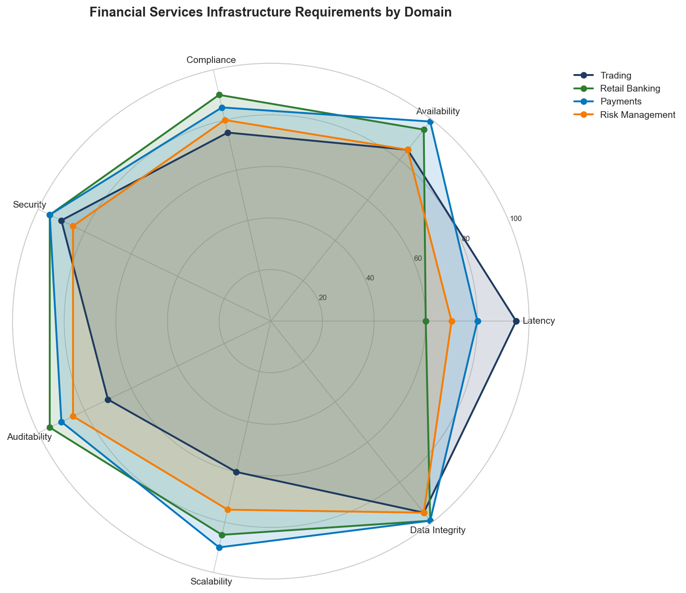
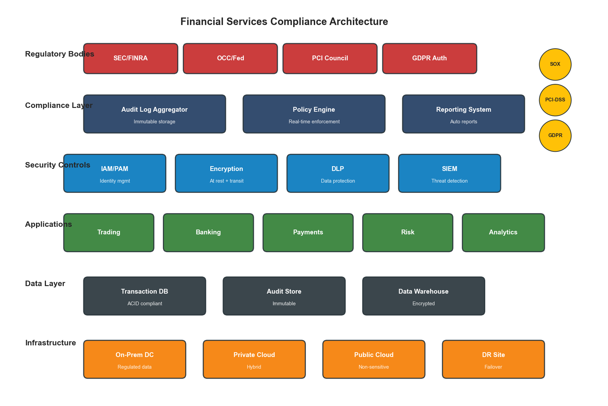
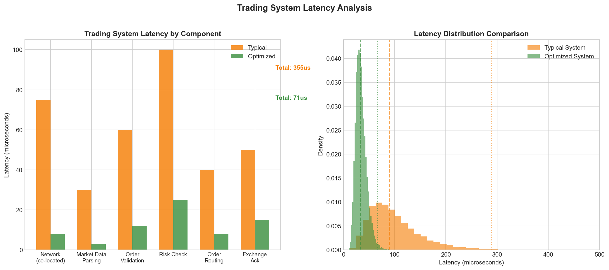
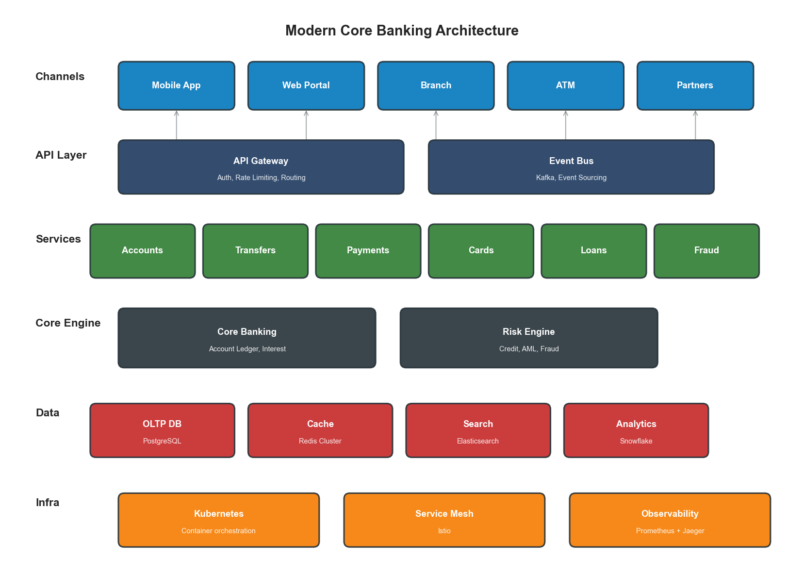
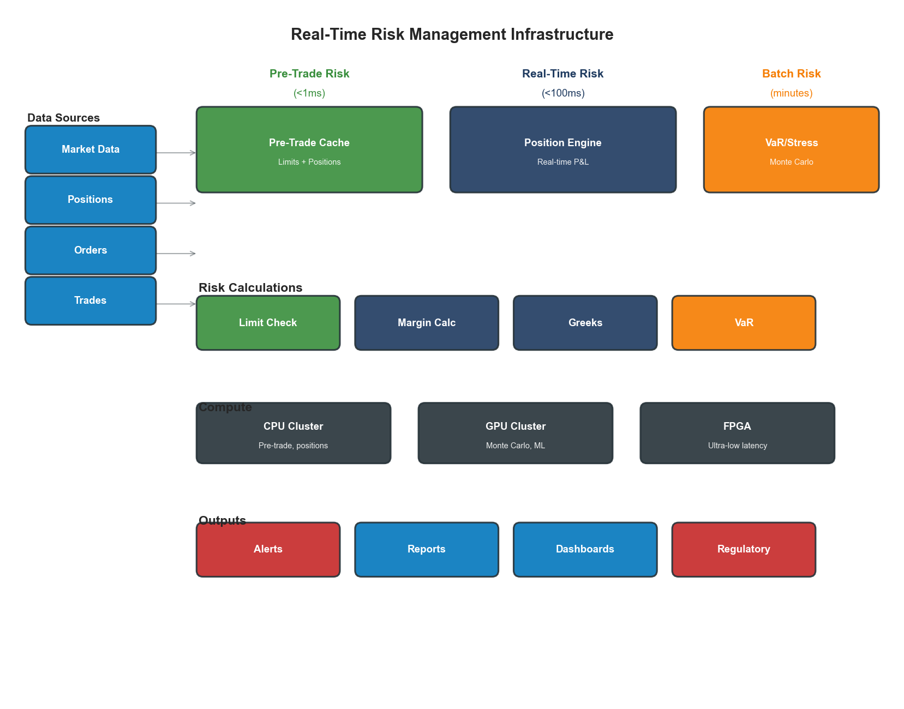

# Chapter 5: Financial Services Infrastructure Optimization

## Introduction

Financial services infrastructure operates under constraints that make it fundamentally different from other industries. Where e-commerce optimizes for conversion rates and user experience, financial services must optimize for regulatory compliance, ultra-low latency, absolute reliability, and complete auditability—often simultaneously. A single millisecond of latency in trading systems can cost millions; a single compliance violation can result in billions in fines.

This chapter applies the PROSE Framework to financial services, demonstrating how AI-driven optimization can address the unique challenges of banking, trading, and insurance infrastructure while maintaining the rigorous standards required by regulators.

## 5.1 The Financial Services Infrastructure Landscape

### 5.1.1 Unique Constraints

Financial services infrastructure operates under constraints that distinguish it from all other industries:

| Constraint | Requirement | Impact |
|------------|-------------|--------|
| Regulatory compliance | SOX, PCI-DSS, GDPR, MiFID II | Every change requires audit trail |
| Ultra-low latency | Microsecond-level for trading | Specialized hardware, co-location |
| Zero data loss | RPO = 0 for transactions | Synchronous replication |
| High availability | 99.999% uptime (5.26 min/year) | Active-active architectures |
| Complete auditability | 7+ year retention | Immutable logging |
| Security | Defense in depth | Multiple security layers |



**Figure 5.1: Financial Services Infrastructure Requirements by Domain**

### 5.1.2 The Cost of Failure

Infrastructure failures in financial services have consequences beyond lost revenue:

| Failure Type | Direct Cost | Indirect Cost |
|--------------|-------------|---------------|
| Trading system outage | $5-10M per hour | Market confidence, regulatory scrutiny |
| Data breach | $150-400 per record | Brand damage, customer churn |
| Compliance violation | $10M-$1B in fines | License risk, executive liability |
| Settlement failure | Transaction value + penalties | Counterparty relationships |
| Audit finding | Remediation costs | Increased oversight |

### 5.1.3 Infrastructure Domains

Financial services infrastructure spans multiple specialized domains:

| Domain | Latency Requirement | Availability | Key Challenge |
|--------|--------------------|--------------| --------------|
| High-Frequency Trading | < 10 microseconds | 99.99% | Latency consistency |
| Retail Banking | < 500ms | 99.999% | Scale + compliance |
| Payment Processing | < 100ms | 99.9999% | Fraud detection speed |
| Risk Management | < 5 seconds | 99.99% | Computational intensity |
| Regulatory Reporting | Batch (hours) | 99.9% | Data completeness |

## 5.2 Applying the PROSE Framework to Financial Services

### 5.2.1 Financial Services PROSE Weighting

As introduced in Chapter 3, financial services weights the PROSE dimensions differently than other industries:

| Dimension | Weight | Rationale |
|-----------|--------|-----------|
| Performance | 25% | Critical for trading, important for banking |
| Resource Optimization | 15% | Compliance may require over-provisioning |
| Operational Excellence | 30% | Regulatory requirements, audit trails |
| Scalability | 15% | More predictable than e-commerce |
| Economic Impact | 15% | Cost matters but reliability is paramount |

### 5.2.2 Performance Efficiency in Financial Services

Performance in financial services means different things across domains:

**Trading Systems Performance:**

| Metric | Target | Measurement Method |
|--------|--------|-------------------|
| Order-to-execution | < 50 microseconds | Hardware timestamping |
| Market data processing | < 5 microseconds | FPGA-based measurement |
| Risk calculation | < 1 millisecond | End-to-end tracing |
| Tick-to-trade | < 100 microseconds | Co-located measurement |

**Banking Systems Performance:**

| Metric | Target | Business Impact |
|--------|--------|-----------------|
| Login latency | < 2 seconds | Customer satisfaction |
| Balance inquiry | < 500ms | Core banking responsiveness |
| Transfer initiation | < 1 second | Transaction completion |
| Statement generation | < 5 seconds | Self-service adoption |

```python
class FinancialPerformanceMonitor:
    """
    Performance monitoring for financial systems with regulatory awareness.
    """

    def __init__(self, metrics_client, audit_logger):
        self.metrics = metrics_client
        self.audit = audit_logger
        self.sla_thresholds = {
            "trading": {"p99_latency_us": 100, "availability": 0.9999},
            "banking": {"p99_latency_ms": 500, "availability": 0.99999},
            "payments": {"p99_latency_ms": 100, "availability": 0.999999}
        }

    def measure_transaction(
        self,
        transaction_type: str,
        domain: str,
        start_time_ns: int
    ) -> dict:
        """
        Measure transaction performance with audit trail.
        """
        end_time_ns = time.time_ns()
        latency_us = (end_time_ns - start_time_ns) / 1000

        # Record metric
        self.metrics.histogram(
            f"{domain}.transaction.latency",
            latency_us,
            tags={"type": transaction_type}
        )

        # Check SLA
        threshold = self.sla_thresholds.get(domain, {})
        sla_breach = False

        if domain == "trading":
            sla_breach = latency_us > threshold.get("p99_latency_us", float("inf"))
        else:
            sla_breach = latency_us / 1000 > threshold.get("p99_latency_ms", float("inf"))

        # Audit log for compliance
        self.audit.log({
            "event": "transaction_measured",
            "transaction_type": transaction_type,
            "domain": domain,
            "latency_us": latency_us,
            "sla_breach": sla_breach,
            "timestamp": datetime.utcnow().isoformat()
        })

        return {
            "latency_us": latency_us,
            "sla_breach": sla_breach,
            "threshold": threshold
        }
```

### 5.2.3 Operational Excellence for Compliance

Operational excellence in financial services centers on compliance and auditability:

**Change Management Framework:**

| Change Type | Approval Required | Testing Required | Rollback Plan |
|-------------|-------------------|------------------|---------------|
| Emergency fix | 1 approver + post-review | Smoke tests | Automated |
| Standard change | 2 approvers | Full regression | Documented |
| Major change | CAB + compliance | Full + penetration | Rehearsed |
| Infrastructure | CAB + security + compliance | Full + DR test | Blue-green |

**Audit Trail Requirements:**

```python
class ComplianceAuditLogger:
    """
    Immutable audit logging for financial compliance.
    """

    def __init__(self, storage_backend, encryption_key):
        self.storage = storage_backend
        self.encryption = encryption_key
        self.hash_chain = None

    def log(self, event: dict) -> str:
        """
        Log event with cryptographic integrity.

        Returns audit ID for reference.
        """
        # Add metadata
        event["_audit_id"] = str(uuid.uuid4())
        event["_timestamp"] = datetime.utcnow().isoformat()
        event["_source_ip"] = self._get_source_ip()
        event["_user_id"] = self._get_current_user()

        # Create hash chain for tamper detection
        event_json = json.dumps(event, sort_keys=True)
        event_hash = hashlib.sha256(event_json.encode()).hexdigest()

        if self.hash_chain:
            event["_previous_hash"] = self.hash_chain
        event["_event_hash"] = event_hash
        self.hash_chain = event_hash

        # Encrypt sensitive fields
        encrypted_event = self._encrypt_sensitive_fields(event)

        # Write to immutable storage
        self.storage.append(encrypted_event)

        return event["_audit_id"]

    def verify_integrity(self, start_audit_id: str, end_audit_id: str) -> bool:
        """
        Verify hash chain integrity for audit period.
        """
        events = self.storage.range(start_audit_id, end_audit_id)
        previous_hash = None

        for event in events:
            if previous_hash and event.get("_previous_hash") != previous_hash:
                return False

            # Verify event hash
            event_copy = {k: v for k, v in event.items() if not k.startswith("_")}
            computed_hash = hashlib.sha256(
                json.dumps(event_copy, sort_keys=True).encode()
            ).hexdigest()

            if computed_hash != event["_event_hash"]:
                return False

            previous_hash = event["_event_hash"]

        return True
```



**Figure 5.2: Financial Services Compliance Architecture**

### 5.2.4 Scalability with Compliance

Scaling financial systems requires maintaining compliance at every scale:

**Scaling Constraints:**

| Constraint | Impact on Scaling | Mitigation |
|------------|-------------------|------------|
| Data sovereignty | Cannot replicate across borders | Regional deployments |
| Audit requirements | Every instance must log | Centralized audit aggregation |
| Encryption in transit | Performance overhead | Hardware acceleration |
| Key management | Keys cannot be shared | Per-region key hierarchies |
| Change control | Cannot auto-scale freely | Pre-approved capacity pools |

```python
class CompliantAutoScaler:
    """
    Auto-scaling with compliance guardrails.
    """

    def __init__(self, orchestrator, compliance_checker, audit_logger):
        self.orchestrator = orchestrator
        self.compliance = compliance_checker
        self.audit = audit_logger
        self.approved_capacity_pool = {}

    async def scale(
        self,
        service: str,
        target_instances: int,
        reason: str
    ) -> dict:
        """
        Scale with compliance verification.
        """
        current = await self.orchestrator.get_instance_count(service)

        # Pre-flight compliance check
        compliance_result = await self.compliance.check_scaling(
            service=service,
            current=current,
            target=target_instances
        )

        if not compliance_result["approved"]:
            self.audit.log({
                "event": "scaling_blocked",
                "service": service,
                "reason": compliance_result["reason"],
                "current": current,
                "requested": target_instances
            })
            return {"success": False, "reason": compliance_result["reason"]}

        # Check pre-approved capacity
        available_capacity = self.approved_capacity_pool.get(service, 0)
        if target_instances > current + available_capacity:
            # Request emergency capacity approval
            approval = await self._request_emergency_approval(
                service, target_instances - current - available_capacity
            )
            if not approval["granted"]:
                return {"success": False, "reason": "capacity_not_approved"}

        # Execute scaling
        result = await self.orchestrator.scale(service, target_instances)

        # Audit the scaling action
        self.audit.log({
            "event": "scaling_executed",
            "service": service,
            "previous": current,
            "target": target_instances,
            "reason": reason,
            "compliance_check_id": compliance_result["check_id"]
        })

        return {"success": True, "new_count": target_instances}
```

### 5.2.5 Economic Impact in Regulated Environments

Cost optimization in financial services must account for compliance overhead:

**Total Cost Model:**

```
Financial TCO = Infrastructure + Compliance + Risk

Where:
  Infrastructure = Compute + Storage + Network + Licensing
  Compliance = Audit systems + Security tools + Compliance staff + Certification
  Risk = (Probability of breach × Cost) + (Probability of outage × Cost)
```

| Cost Component | Typical % of IT Budget | Optimization Potential |
|---------------|----------------------|----------------------|
| Infrastructure | 40-50% | 20-30% through optimization |
| Compliance tooling | 15-20% | 10-15% through automation |
| Security | 10-15% | Limited (cannot reduce) |
| Staff (compliance) | 15-20% | 30-40% through automation |
| Audit/certification | 5-10% | 20-30% through continuous compliance |

## 5.3 Low-Latency Trading Infrastructure

### 5.3.1 The Latency Arms Race

Modern trading systems measure latency in microseconds and nanoseconds:

| Component | Typical Latency | Optimized Latency |
|-----------|----------------|-------------------|
| Network (co-located) | 50-100 microseconds | 5-10 microseconds |
| Application logic | 100-500 microseconds | 10-50 microseconds |
| Market data parsing | 10-50 microseconds | 1-5 microseconds |
| Order validation | 20-100 microseconds | 5-20 microseconds |
| Risk check | 50-200 microseconds | 10-50 microseconds |



**Figure 5.3: Trading System Latency Components**

### 5.3.2 Hardware-Software Co-Design

Ultra-low latency requires thinking about hardware and software together:

**Hardware Optimizations:**

| Technique | Latency Reduction | Implementation |
|-----------|------------------|----------------|
| FPGA-based processing | 10-100x | Market data, order routing |
| Kernel bypass (DPDK) | 5-10x | Network stack |
| CPU pinning | 2-5x | Eliminate context switches |
| NUMA awareness | 2-3x | Memory locality |
| SR-IOV | 3-5x | Direct NIC access |

**Software Architecture for Low Latency:**

```python
class LowLatencyOrderRouter:
    """
    Order routing optimized for microsecond latency.

    Design principles:
    - Lock-free data structures
    - Pre-allocated memory pools
    - Zero-copy message passing
    - Busy-polling (no blocking)
    """

    def __init__(self, config):
        # Pre-allocate order pool to avoid allocation latency
        self.order_pool = self._preallocate_orders(config.pool_size)
        self.order_pool_index = 0

        # Lock-free queue for incoming orders
        self.incoming_queue = SPSCQueue(config.queue_size)

        # Pre-computed routing tables
        self.routing_table = self._build_routing_table(config.venues)

        # Pin to specific CPU core
        self._pin_to_core(config.cpu_core)

    def route_order(self, order_data: bytes) -> int:
        """
        Route order with minimal latency.

        Returns order ID.
        """
        # Get pre-allocated order (no malloc)
        order = self.order_pool[self.order_pool_index]
        self.order_pool_index = (self.order_pool_index + 1) % len(self.order_pool)

        # Parse directly into pre-allocated structure (zero-copy)
        order.parse_from_bytes(order_data)

        # Lookup routing (pre-computed, O(1))
        venue = self.routing_table[order.symbol_id]

        # Send via kernel bypass
        venue.send_order_dpdk(order)

        return order.order_id

    def _pin_to_core(self, core_id: int):
        """Pin this thread to a specific CPU core."""
        os.sched_setaffinity(0, {core_id})

        # Set real-time scheduling priority
        param = os.sched_param(os.sched_get_priority_max(os.SCHED_FIFO))
        os.sched_setscheduler(0, os.SCHED_FIFO, param)
```

### 5.3.3 Market Data Infrastructure

Processing market data at scale requires specialized infrastructure:

| Data Type | Volume | Processing Requirement |
|-----------|--------|----------------------|
| Level 1 quotes | 1-5M messages/sec | Real-time display |
| Level 2 depth | 10-50M messages/sec | Order book reconstruction |
| Trade prints | 500K-2M messages/sec | Trade analytics |
| Options chains | 100M+ symbols | Greeks calculation |

```python
class MarketDataProcessor:
    """
    High-performance market data processing.
    """

    def __init__(self, config):
        self.parser = FPGAMarketDataParser(config.fpga_device)
        self.book_builder = LockFreeOrderBook()
        self.subscribers = SubscriberRegistry()

    def process_feed(self, raw_data: memoryview):
        """
        Process market data with FPGA acceleration.

        Uses memory-mapped I/O for zero-copy processing.
        """
        # FPGA parses and normalizes in hardware
        parsed_messages = self.parser.parse_batch(raw_data)

        for msg in parsed_messages:
            if msg.type == MessageType.QUOTE:
                self._handle_quote(msg)
            elif msg.type == MessageType.TRADE:
                self._handle_trade(msg)
            elif msg.type == MessageType.DEPTH:
                self._handle_depth_update(msg)

    def _handle_depth_update(self, msg):
        """Update order book and notify subscribers."""
        # Lock-free update
        self.book_builder.apply_update(
            msg.symbol,
            msg.side,
            msg.price,
            msg.quantity
        )

        # Fan-out to subscribers (also lock-free)
        self.subscribers.notify(msg.symbol, self.book_builder.get_book(msg.symbol))
```

## 5.4 Banking Infrastructure Optimization

### 5.4.1 Core Banking Architecture

Modern core banking systems must balance legacy integration with modern performance:



**Figure 5.4: Modern Core Banking Architecture Layers**

**Architecture Layers:**

| Layer | Function | Technology Options |
|-------|----------|-------------------|
| Channel | Customer touchpoints | Mobile, web, branch, ATM |
| API Gateway | Security, routing | Kong, Apigee, custom |
| Microservices | Business logic | Java, Go, .NET |
| Core Banking | Account management | Temenos, Finacle, custom |
| Data Layer | Persistence | Oracle, PostgreSQL, distributed |

### 5.4.2 Transaction Processing

Financial transaction processing requires ACID guarantees with high throughput:

```python
class TransactionProcessor:
    """
    ACID-compliant transaction processing.
    """

    def __init__(self, db_pool, audit_logger, fraud_detector):
        self.db = db_pool
        self.audit = audit_logger
        self.fraud = fraud_detector

    async def process_transfer(
        self,
        from_account: str,
        to_account: str,
        amount: Decimal,
        currency: str,
        idempotency_key: str
    ) -> dict:
        """
        Process fund transfer with full compliance.
        """
        # Check idempotency (prevent duplicate processing)
        existing = await self._check_idempotency(idempotency_key)
        if existing:
            return existing

        # Pre-transaction fraud check
        fraud_result = await self.fraud.check_transaction({
            "from": from_account,
            "to": to_account,
            "amount": float(amount),
            "currency": currency
        })

        if fraud_result["blocked"]:
            self.audit.log({
                "event": "transaction_blocked",
                "reason": "fraud_detection",
                "details": fraud_result
            })
            return {"success": False, "reason": "transaction_blocked"}

        # Execute with distributed transaction
        async with self.db.transaction() as txn:
            try:
                # Debit source account
                debit_result = await txn.execute("""
                    UPDATE accounts
                    SET balance = balance - $1,
                        last_transaction = NOW()
                    WHERE account_id = $2
                    AND balance >= $1
                    AND status = 'active'
                    RETURNING balance
                """, amount, from_account)

                if not debit_result:
                    raise InsufficientFundsError()

                # Credit destination account
                await txn.execute("""
                    UPDATE accounts
                    SET balance = balance + $1,
                        last_transaction = NOW()
                    WHERE account_id = $2
                    AND status = 'active'
                """, amount, to_account)

                # Record transaction
                txn_id = await txn.execute("""
                    INSERT INTO transactions
                    (from_account, to_account, amount, currency, status, idempotency_key)
                    VALUES ($1, $2, $3, $4, 'completed', $5)
                    RETURNING transaction_id
                """, from_account, to_account, amount, currency, idempotency_key)

                # Commit
                await txn.commit()

                # Audit log (after commit for consistency)
                self.audit.log({
                    "event": "transfer_completed",
                    "transaction_id": txn_id,
                    "from": from_account,
                    "to": to_account,
                    "amount": str(amount),
                    "currency": currency
                })

                return {"success": True, "transaction_id": txn_id}

            except Exception as e:
                await txn.rollback()
                self.audit.log({
                    "event": "transfer_failed",
                    "error": str(e),
                    "from": from_account,
                    "to": to_account
                })
                raise
```

### 5.4.3 High Availability Patterns

Banking systems require extreme availability:

| Pattern | RTO | RPO | Use Case |
|---------|-----|-----|----------|
| Active-Active | 0 | 0 | Payment processing |
| Active-Passive (sync) | < 1 min | 0 | Core banking |
| Active-Passive (async) | < 5 min | < 1 min | Batch systems |
| Multi-region active | 0 | < 1 sec | Global banking |

**Active-Active Implementation:**

```python
class ActiveActiveRouter:
    """
    Route requests across active-active data centers.
    """

    def __init__(self, dc_configs: list):
        self.datacenters = [DataCenter(cfg) for cfg in dc_configs]
        self.consistency_checker = ConsistencyChecker()

    async def route_request(self, request: Request) -> Response:
        """
        Route with conflict detection and resolution.
        """
        # Determine primary DC based on account affinity
        primary_dc = self._get_affinity_dc(request.account_id)
        secondary_dc = self._get_secondary_dc(primary_dc)

        try:
            # Execute on primary
            response = await primary_dc.execute(request)

            # Async replicate to secondary
            asyncio.create_task(
                self._replicate_to_secondary(secondary_dc, request, response)
            )

            return response

        except DataCenterUnavailable:
            # Failover to secondary
            self.audit.log({
                "event": "dc_failover",
                "primary": primary_dc.name,
                "secondary": secondary_dc.name
            })

            response = await secondary_dc.execute(request)

            # Mark for reconciliation when primary recovers
            await self._mark_for_reconciliation(primary_dc, request)

            return response
```

## 5.5 Real-Time Risk Management

### 5.5.1 Risk Calculation Infrastructure

Real-time risk management requires massive computational power:

| Risk Type | Calculation Complexity | Latency Requirement |
|-----------|----------------------|---------------------|
| Pre-trade risk | O(1) lookups | < 1 millisecond |
| Position risk | O(n) portfolio | < 100 milliseconds |
| VaR (Value at Risk) | O(n*m) simulations | < 5 seconds |
| Stress testing | O(n*m*s) scenarios | Minutes to hours |



**Figure 5.5: Real-Time Risk Management Infrastructure**

```python
class RealTimeRiskEngine:
    """
    Real-time risk calculation with tiered architecture.
    """

    def __init__(self, config):
        self.pre_trade_cache = PreTradeRiskCache()
        self.position_service = PositionService()
        self.var_calculator = VaRCalculator(config.gpu_cluster)

    async def check_pre_trade_risk(
        self,
        order: Order
    ) -> RiskCheckResult:
        """
        Pre-trade risk check in < 1ms.

        Uses pre-computed limits and cached positions.
        """
        # Get cached limits (O(1) lookup)
        limits = self.pre_trade_cache.get_limits(order.trader_id, order.symbol)

        # Get current position (O(1) lookup)
        position = self.pre_trade_cache.get_position(order.trader_id, order.symbol)

        # Calculate exposure
        new_exposure = position.quantity + order.quantity
        new_notional = new_exposure * order.price

        # Check limits
        checks = [
            ("position_limit", abs(new_exposure) <= limits.max_position),
            ("notional_limit", abs(new_notional) <= limits.max_notional),
            ("order_size", order.quantity <= limits.max_order_size),
            ("loss_limit", position.unrealized_pnl > limits.max_loss)
        ]

        failed_checks = [name for name, passed in checks if not passed]

        return RiskCheckResult(
            approved=len(failed_checks) == 0,
            failed_checks=failed_checks,
            latency_us=self._get_elapsed_us()
        )

    async def calculate_portfolio_var(
        self,
        portfolio_id: str,
        confidence: float = 0.99,
        horizon_days: int = 1
    ) -> VaRResult:
        """
        Calculate VaR using GPU-accelerated Monte Carlo.
        """
        # Get portfolio positions
        positions = await self.position_service.get_portfolio(portfolio_id)

        # Get market data and correlations
        market_data = await self._get_market_data(positions)
        correlation_matrix = await self._get_correlations(positions)

        # GPU-accelerated Monte Carlo simulation
        simulations = await self.var_calculator.run_monte_carlo(
            positions=positions,
            market_data=market_data,
            correlations=correlation_matrix,
            num_simulations=100000,
            horizon_days=horizon_days
        )

        # Calculate VaR from simulation results
        var = np.percentile(simulations, (1 - confidence) * 100)

        return VaRResult(
            var=var,
            confidence=confidence,
            horizon_days=horizon_days,
            num_simulations=100000
        )
```

## 5.6 Case Study: Digital Bank Infrastructure Modernization

### 5.6.1 Scenario

A traditional bank launching a digital-first subsidiary with requirements:

- **Target scale**: 5M customers in 3 years
- **Transaction volume**: 100M transactions/month
- **Availability**: 99.99% for customer-facing systems
- **Compliance**: Full regulatory compliance from day one
- **Cost**: 50% lower cost-to-serve than parent bank

### 5.6.2 Architecture Decisions

| Component | Decision | Rationale |
|-----------|----------|-----------|
| Cloud strategy | Hybrid (regulated workloads on-prem) | Compliance + flexibility |
| Core banking | Cloud-native (Thought Machine) | API-first, scalable |
| Data platform | Snowflake + Kafka | Real-time + analytics |
| Security | Zero-trust architecture | Modern threat landscape |
| Observability | OpenTelemetry + Datadog | Full-stack visibility |

### 5.6.3 Results

| Metric | Traditional Bank | Digital Bank | Improvement |
|--------|-----------------|--------------|-------------|
| Account opening time | 5-7 days | 5 minutes | 99.9% |
| Transaction latency (P99) | 3 seconds | 200ms | 93% |
| Cost per transaction | $0.50 | $0.08 | 84% |
| Deployment frequency | Monthly | Daily | 30x |
| Availability | 99.9% | 99.99% | 10x fewer outages |
| Compliance findings | 15/year | 2/year | 87% |

**PROSE Score Comparison:**

| Dimension | Traditional | Digital | Weighted Impact |
|-----------|-------------|---------|-----------------|
| Performance | 55 | 88 | +8.25 |
| Resource Optimization | 40 | 82 | +6.30 |
| Operational Excellence | 50 | 90 | +12.00 |
| Scalability | 45 | 85 | +6.00 |
| Economic Impact | 35 | 88 | +7.95 |
| **Weighted Total** | **46** | **87** | **+40.5** |

## Key Takeaways

1. **Compliance is non-negotiable** - Every optimization must maintain full regulatory compliance with complete audit trails

2. **Latency requirements vary by domain** - Trading needs microseconds; banking needs sub-second; batch can tolerate minutes

3. **Zero data loss is achievable** - Synchronous replication and proper transaction design enable RPO=0

4. **Automation enables compliance** - Continuous compliance checking reduces audit findings and manual overhead

5. **Hardware-software co-design** - Ultra-low latency requires thinking about FPGA, kernel bypass, and CPU affinity

6. **Active-active is complex but necessary** - Multi-region active deployments require careful conflict resolution

## References

1. Harris, L. "Trading and Exchanges: Market Microstructure for Practitioners." Oxford University Press (2002)
2. Basel Committee. "Principles for Effective Risk Data Aggregation." BIS (2013)
3. PCI Security Standards Council. "PCI DSS Requirements and Security Assessment Procedures." (2022)
4. AWS. "Financial Services Industry Lens - AWS Well-Architected Framework." (2023)
5. Aldridge, I. "High-Frequency Trading: A Practical Guide." Wiley (2013)

---

*Next Chapter: Healthcare Infrastructure Optimization*
