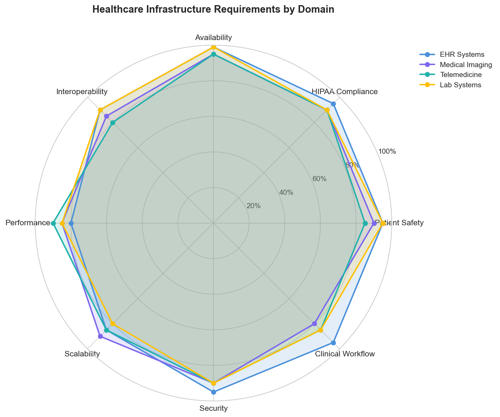
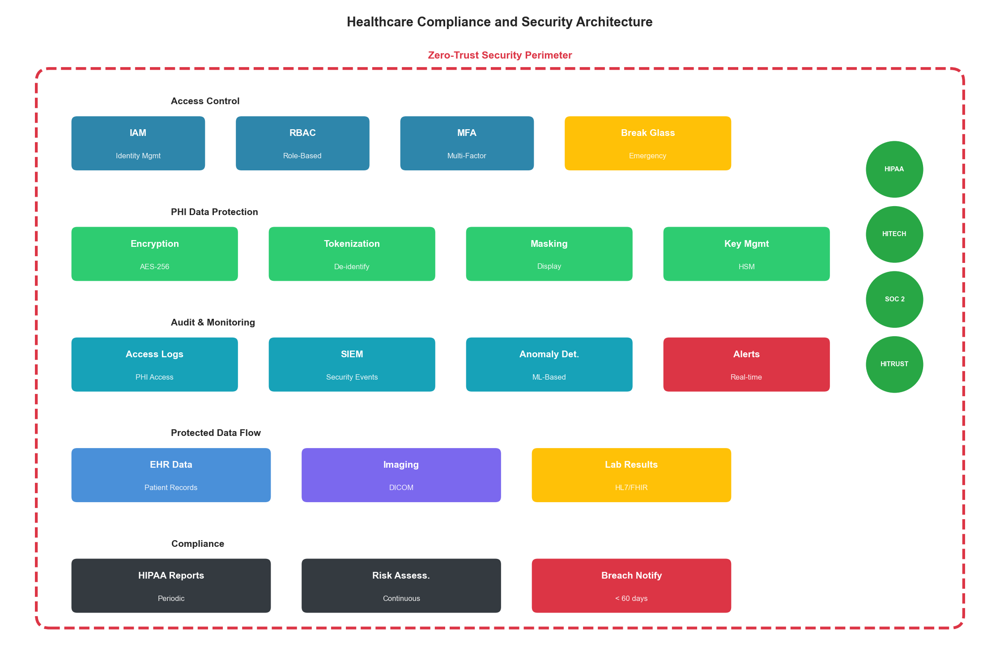
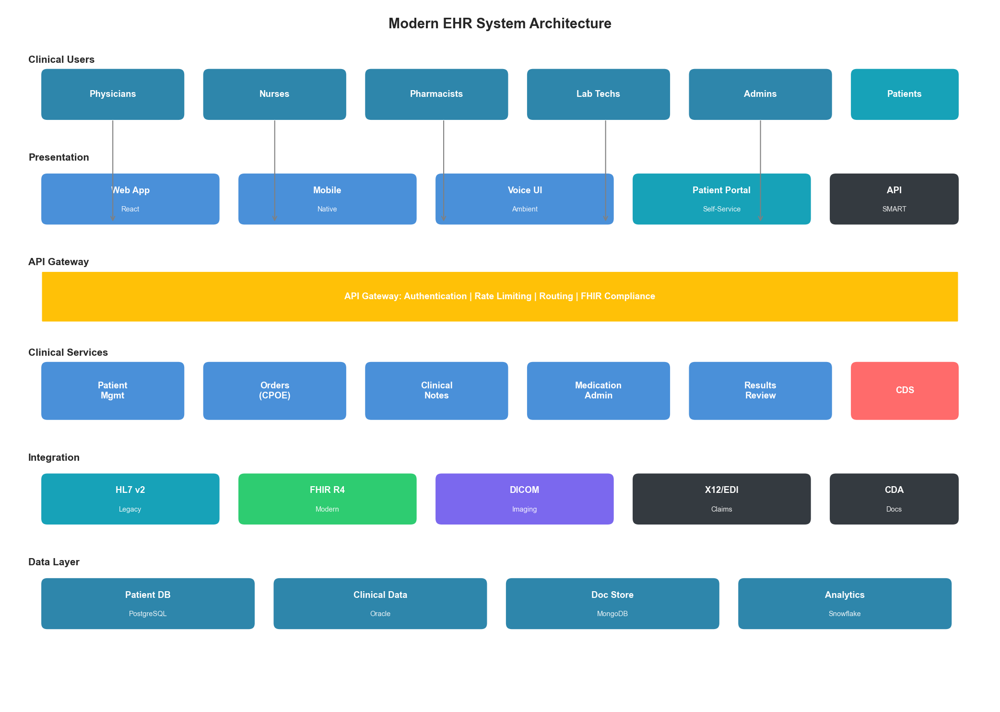
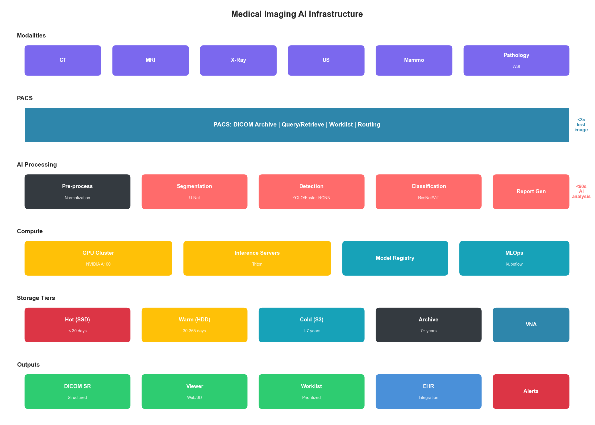
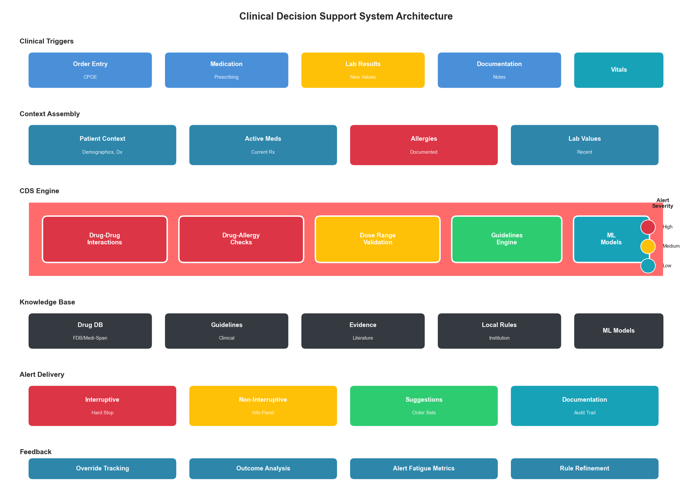

# Chapter 6: Healthcare Infrastructure Optimization

## Introduction

Healthcare infrastructure stands at a unique intersection of technology, regulation, and human life. Unlike e-commerce systems where failures result in lost revenue, or financial systems where failures result in monetary losses, healthcare infrastructure failures can directly impact patient outcomes. This creates an optimization landscape where reliability and data integrity must never be compromised for performance gains.

This chapter applies the PROSE Framework to healthcare systems, demonstrating how AI-driven optimization can improve patient care delivery while maintaining the strict compliance requirements of HIPAA, HITECH, and international equivalents. We'll explore the specialized demands of electronic health records (EHR), medical imaging, telemedicine, and clinical decision support systems.

## 6.1 The Healthcare Infrastructure Landscape

### 6.1.1 Unique Constraints

Healthcare infrastructure operates under constraints that distinguish it from other industries:

| Constraint | Requirement | Impact |
|------------|-------------|--------|
| Patient safety | Zero tolerance for data errors | Extensive validation, redundancy |
| HIPAA compliance | PHI protection | Encryption, access controls, audit trails |
| Interoperability | HL7 FHIR, DICOM standards | Complex integration requirements |
| 24/7 availability | Healthcare never stops | No maintenance windows |
| Legacy integration | 20-30 year system lifecycles | Bridging old and new technologies |
| Clinical workflow | Must fit provider workflow | User experience critical for adoption |



**Figure 6.1: Healthcare Infrastructure Requirements by Domain**

### 6.1.2 The Cost of Failure

Infrastructure failures in healthcare have consequences that extend far beyond financial impact:

| Failure Type | Direct Cost | Patient Impact |
|--------------|-------------|----------------|
| EHR outage | $1-5M per hour | Delayed care, medication errors |
| PHI breach | $150-400 per record + fines | Privacy violation, identity theft |
| Imaging system failure | $50K-200K per hour | Diagnostic delays |
| Lab system outage | $100K per hour | Delayed diagnoses |
| Telemedicine failure | Lost visits + rescheduling | Access to care barriers |

### 6.1.3 Infrastructure Domains

Healthcare infrastructure spans multiple specialized domains with distinct requirements:

| Domain | Availability | Latency Requirement | Key Challenge |
|--------|--------------|---------------------|---------------|
| EHR/EMR | 99.99% | < 2 seconds | Complex workflows, integration |
| Medical Imaging (PACS) | 99.95% | < 5 seconds for display | Massive data volumes |
| Laboratory Information | 99.99% | < 1 second | Real-time results |
| Pharmacy Systems | 99.999% | < 500ms | Drug interaction checks |
| Telemedicine | 99.9% | < 150ms latency | Video quality, reliability |
| Clinical Decision Support | 99.9% | < 3 seconds | ML model serving |

## 6.2 Applying the PROSE Framework to Healthcare

### 6.2.1 Healthcare PROSE Weighting

As introduced in Chapter 3, healthcare weights the PROSE dimensions with emphasis on operational excellence and reliability:

| Dimension | Weight | Rationale |
|-----------|--------|-----------|
| Performance | 20% | Important but not ultra-low latency |
| Resource Optimization | 15% | Clinical needs trump cost |
| Operational Excellence | 35% | Patient safety, compliance |
| Scalability | 15% | More predictable than retail |
| Economic Impact | 15% | Value-based care focus |

### 6.2.2 Performance Efficiency in Healthcare

Performance in healthcare focuses on clinical workflow efficiency rather than raw speed:

**EHR System Performance:**

| Metric | Target | Clinical Impact |
|--------|--------|-----------------|
| Patient chart load | < 2 seconds | Provider efficiency |
| Medication order entry | < 3 seconds | Workflow interruption |
| Lab result display | < 1 second | Time-critical decisions |
| Search/query response | < 2 seconds | Information retrieval |
| Report generation | < 10 seconds | Documentation time |

**Medical Imaging Performance:**

| Metric | Target | Clinical Impact |
|--------|--------|-----------------|
| Image load (first) | < 3 seconds | Radiologist workflow |
| Image navigation | < 500ms | Reading efficiency |
| 3D reconstruction | < 30 seconds | Advanced visualization |
| AI analysis | < 60 seconds | Diagnostic assistance |

```python
class HealthcarePerformanceMonitor:
    """
    Performance monitoring for healthcare systems with clinical context.
    """

    def __init__(self, metrics_client, audit_logger):
        self.metrics = metrics_client
        self.audit = audit_logger
        self.clinical_slas = {
            "ehr": {
                "chart_load_ms": 2000,
                "order_entry_ms": 3000,
                "lab_display_ms": 1000
            },
            "imaging": {
                "first_image_ms": 3000,
                "navigation_ms": 500,
                "ai_analysis_ms": 60000
            },
            "pharmacy": {
                "drug_check_ms": 500,
                "order_validation_ms": 1000
            }
        }

    def measure_clinical_operation(
        self,
        operation: str,
        domain: str,
        start_time_ms: float,
        patient_context: dict = None
    ) -> dict:
        """
        Measure operation performance with clinical awareness.
        """
        end_time_ms = time.time() * 1000
        latency_ms = end_time_ms - start_time_ms

        # Get SLA threshold
        sla_key = f"{operation}_ms"
        threshold = self.clinical_slas.get(domain, {}).get(sla_key, float("inf"))
        sla_breach = latency_ms > threshold

        # Record metric
        self.metrics.histogram(
            f"healthcare.{domain}.{operation}.latency",
            latency_ms,
            tags={"sla_breach": str(sla_breach)}
        )

        # Clinical context aware alerting
        if sla_breach and patient_context:
            self._evaluate_clinical_impact(
                operation, domain, latency_ms, patient_context
            )

        # HIPAA-compliant audit (no PHI in logs)
        self.audit.log({
            "event": "operation_measured",
            "operation": operation,
            "domain": domain,
            "latency_ms": latency_ms,
            "sla_breach": sla_breach,
            "timestamp": datetime.utcnow().isoformat()
            # Note: patient_context NOT logged
        })

        return {
            "latency_ms": latency_ms,
            "sla_breach": sla_breach,
            "threshold_ms": threshold
        }

    def _evaluate_clinical_impact(
        self,
        operation: str,
        domain: str,
        latency_ms: float,
        patient_context: dict
    ):
        """Evaluate if delay has clinical significance."""
        # Emergency department context - higher urgency
        if patient_context.get("location") == "ED":
            if latency_ms > self.clinical_slas[domain].get(f"{operation}_ms", 0) * 2:
                self._trigger_clinical_alert(operation, "ED_DELAY_CRITICAL")

        # ICU context
        if patient_context.get("location") == "ICU":
            self._trigger_clinical_alert(operation, "ICU_DELAY")
```

### 6.2.3 Operational Excellence for Patient Safety

Operational excellence in healthcare centers on patient safety and regulatory compliance:

**Change Management Framework:**

| Change Type | Approval Required | Testing Required | Rollback Plan |
|-------------|-------------------|------------------|---------------|
| Emergency hotfix | Clinical informatics + on-call | Smoke tests | Automated |
| Standard change | Clinical + IT review | Full regression + UAT | Documented |
| Major upgrade | Clinical committee + security | Full + clinical validation | Blue-green |
| Infrastructure | CAB + security + compliance | DR test + failover | Rehearsed |

**HIPAA Audit Requirements:**

```python
class HIPAAAuditLogger:
    """
    HIPAA-compliant audit logging for PHI access.

    Implements the HIPAA Security Rule requirements for:
    - Access logs (§164.312(b))
    - Audit controls (§164.312(b))
    - Integrity controls (§164.312(c)(1))
    """

    def __init__(self, storage_backend, encryption_service):
        self.storage = storage_backend
        self.encryption = encryption_service
        self.retention_years = 6  # HIPAA minimum

    def log_phi_access(
        self,
        user_id: str,
        patient_id: str,
        access_type: str,
        resource_type: str,
        clinical_justification: str = None
    ) -> str:
        """
        Log PHI access event.

        Required fields per HIPAA:
        - Who accessed
        - What was accessed
        - When
        - From where
        - Why (break-the-glass scenarios)
        """
        event = {
            "audit_id": str(uuid.uuid4()),
            "timestamp": datetime.utcnow().isoformat(),
            "user_id": user_id,
            "patient_id_hash": self._hash_patient_id(patient_id),
            "access_type": access_type,  # read, write, delete
            "resource_type": resource_type,  # chart, lab, medication
            "source_ip": self._get_source_ip(),
            "source_device": self._get_device_info(),
            "clinical_justification": clinical_justification,
            "treatment_relationship": self._verify_treatment_relationship(
                user_id, patient_id
            )
        }

        # Encrypt sensitive fields
        encrypted_event = self.encryption.encrypt_audit_record(event)

        # Write to immutable storage
        self.storage.append(encrypted_event)

        # Check for suspicious access patterns
        self._check_access_anomalies(event)

        return event["audit_id"]

    def log_break_the_glass(
        self,
        user_id: str,
        patient_id: str,
        emergency_reason: str
    ) -> str:
        """
        Log emergency access override.

        Break-the-glass access bypasses normal authorization
        but requires documented justification and generates
        additional audit alerts.
        """
        audit_id = self.log_phi_access(
            user_id=user_id,
            patient_id=patient_id,
            access_type="break_the_glass",
            resource_type="full_chart",
            clinical_justification=emergency_reason
        )

        # Alert privacy officer
        self._alert_privacy_officer({
            "audit_id": audit_id,
            "user_id": user_id,
            "patient_id_hash": self._hash_patient_id(patient_id),
            "reason": emergency_reason,
            "timestamp": datetime.utcnow().isoformat()
        })

        return audit_id
```



**Figure 6.2: Healthcare Compliance and Security Architecture**

### 6.2.4 Scalability with Clinical Safety

Scaling healthcare systems requires maintaining safety guarantees at every scale:

**Scaling Constraints:**

| Constraint | Impact on Scaling | Mitigation |
|------------|-------------------|------------|
| Data locality | PHI cannot cross certain boundaries | Regional deployments |
| Audit requirements | Every instance must log | Centralized SIEM |
| Encryption | Performance overhead | Hardware acceleration |
| Testing requirements | Clinical validation needed | Staged rollouts |
| Integration | HL7/FHIR compatibility | Interface engines |

```python
class ClinicalSafeScaler:
    """
    Auto-scaling with clinical safety guardrails.
    """

    def __init__(self, orchestrator, safety_checker, audit_logger):
        self.orchestrator = orchestrator
        self.safety = safety_checker
        self.audit = audit_logger

    async def scale_service(
        self,
        service: str,
        target_instances: int,
        reason: str
    ) -> dict:
        """
        Scale with clinical safety verification.
        """
        current = await self.orchestrator.get_instance_count(service)

        # Pre-flight safety check
        safety_result = await self.safety.check_scaling(
            service=service,
            current=current,
            target=target_instances
        )

        if not safety_result["safe"]:
            self.audit.log({
                "event": "scaling_blocked",
                "service": service,
                "reason": safety_result["reason"],
                "clinical_impact": safety_result.get("clinical_impact")
            })
            return {"success": False, "reason": safety_result["reason"]}

        # Check clinical hours constraints
        if self._is_peak_clinical_hours() and target_instances < current:
            return {
                "success": False,
                "reason": "scale_down_blocked_during_clinical_hours"
            }

        # Execute scaling
        result = await self.orchestrator.scale(service, target_instances)

        # Verify health post-scaling
        health = await self._verify_service_health(service)
        if not health["healthy"]:
            # Automatic rollback
            await self.orchestrator.scale(service, current)
            return {"success": False, "reason": "health_check_failed"}

        self.audit.log({
            "event": "scaling_completed",
            "service": service,
            "previous": current,
            "new": target_instances,
            "reason": reason
        })

        return {"success": True, "new_count": target_instances}
```

### 6.2.5 Economic Impact in Value-Based Care

Cost optimization in healthcare must align with value-based care models:

**Total Cost Model:**

```
Healthcare TCO = Infrastructure + Compliance + Clinical Outcomes

Where:
  Infrastructure = Compute + Storage + Network + Integration
  Compliance = HIPAA tools + Security + Audit + Training
  Clinical Outcomes = (Quality metrics × Reimbursement) - (Adverse events × Cost)
```

| Cost Component | Typical % of IT Budget | Optimization Potential |
|---------------|----------------------|----------------------|
| EHR/EMR systems | 30-40% | 15-20% through optimization |
| Infrastructure | 25-30% | 20-30% through cloud |
| Integration/interfaces | 15-20% | 30-40% through FHIR |
| Security/compliance | 10-15% | Limited (cannot reduce) |
| Support/maintenance | 10-15% | 20-30% through automation |

## 6.3 Electronic Health Record Infrastructure

### 6.3.1 EHR Architecture Patterns

Modern EHR systems require sophisticated architectures to handle complex clinical workflows:



**Figure 6.3: Modern EHR System Architecture**

**Architecture Layers:**

| Layer | Function | Technology Options |
|-------|----------|-------------------|
| Presentation | Clinical UI | Web, mobile, voice |
| API Gateway | Security, routing | Kong, AWS API Gateway |
| Clinical Services | Business logic | Java, .NET, microservices |
| Integration | Interoperability | Mirth Connect, Rhapsody |
| Data Layer | Patient records | Oracle, PostgreSQL, MongoDB |
| Analytics | Population health | Snowflake, Databricks |

### 6.3.2 Clinical Workflow Optimization

```python
class ClinicalWorkflowOptimizer:
    """
    Optimize EHR workflows for clinical efficiency.
    """

    def __init__(self, ehr_client, ml_predictor, cache):
        self.ehr = ehr_client
        self.predictor = ml_predictor
        self.cache = cache

    async def optimize_chart_load(
        self,
        patient_id: str,
        provider_id: str,
        encounter_type: str
    ) -> dict:
        """
        Predictive chart loading based on clinical context.

        Pre-fetches likely needed data based on:
        - Encounter type
        - Patient history
        - Provider preferences
        """
        # Predict needed data sections
        predicted_sections = await self.predictor.predict_chart_sections(
            encounter_type=encounter_type,
            patient_conditions=await self._get_conditions(patient_id),
            provider_specialty=await self._get_specialty(provider_id)
        )

        # Parallel pre-fetch
        fetch_tasks = []
        for section in predicted_sections:
            if section["probability"] > 0.7:
                fetch_tasks.append(
                    self._prefetch_section(patient_id, section["name"])
                )

        await asyncio.gather(*fetch_tasks)

        return {
            "prefetched_sections": [s["name"] for s in predicted_sections
                                     if s["probability"] > 0.7],
            "patient_id": patient_id
        }

    async def optimize_order_entry(
        self,
        patient_id: str,
        provider_id: str,
        order_type: str
    ) -> dict:
        """
        Optimize order entry with clinical decision support.
        """
        # Get patient context
        allergies = await self.ehr.get_allergies(patient_id)
        medications = await self.ehr.get_active_medications(patient_id)
        conditions = await self.ehr.get_active_conditions(patient_id)

        # Pre-compute interaction checks
        if order_type == "medication":
            interaction_cache_key = f"interactions:{patient_id}"
            await self.cache.set(
                interaction_cache_key,
                await self._compute_interactions(medications, allergies),
                ttl=300  # 5 minute cache
            )

        # Pre-load order templates
        templates = await self.predictor.predict_order_templates(
            provider_id=provider_id,
            conditions=conditions,
            order_type=order_type
        )

        return {
            "suggested_templates": templates[:5],
            "precomputed_checks": True
        }
```

### 6.3.3 FHIR-Based Interoperability

```python
class FHIRInteroperabilityLayer:
    """
    FHIR R4 compliant interoperability layer.
    """

    def __init__(self, fhir_server, transform_engine, audit_logger):
        self.fhir = fhir_server
        self.transformer = transform_engine
        self.audit = audit_logger

    async def get_patient_summary(
        self,
        patient_id: str,
        requesting_system: str
    ) -> dict:
        """
        Return FHIR-compliant patient summary.

        Implements US Core Patient profile.
        """
        # Audit the external access
        self.audit.log_phi_access(
            user_id=f"system:{requesting_system}",
            patient_id=patient_id,
            access_type="read",
            resource_type="patient_summary"
        )

        # Fetch from FHIR server
        patient = await self.fhir.read("Patient", patient_id)
        conditions = await self.fhir.search("Condition", {
            "patient": patient_id,
            "clinical-status": "active"
        })
        medications = await self.fhir.search("MedicationRequest", {
            "patient": patient_id,
            "status": "active"
        })
        allergies = await self.fhir.search("AllergyIntolerance", {
            "patient": patient_id,
            "clinical-status": "active"
        })

        # Build summary bundle
        summary = {
            "resourceType": "Bundle",
            "type": "document",
            "entry": [
                {"resource": patient},
                *[{"resource": c} for c in conditions["entry"]],
                *[{"resource": m} for m in medications["entry"]],
                *[{"resource": a} for a in allergies["entry"]]
            ]
        }

        return summary

    async def transform_hl7v2_to_fhir(
        self,
        hl7_message: str,
        message_type: str
    ) -> dict:
        """
        Transform legacy HL7v2 messages to FHIR resources.
        """
        # Parse HL7v2
        parsed = self.transformer.parse_hl7v2(hl7_message)

        # Map to FHIR based on message type
        if message_type == "ADT^A01":  # Admission
            return await self._transform_admission(parsed)
        elif message_type == "ORM^O01":  # Order
            return await self._transform_order(parsed)
        elif message_type == "ORU^R01":  # Result
            return await self._transform_result(parsed)
        else:
            raise UnsupportedMessageTypeError(message_type)
```

## 6.4 Medical Imaging Infrastructure

### 6.4.1 PACS Architecture

Picture Archiving and Communication Systems (PACS) require specialized infrastructure for handling massive imaging data:

**Storage Requirements:**

| Imaging Modality | Image Size | Annual Volume (Large Hospital) |
|-----------------|------------|-------------------------------|
| X-Ray | 10-50 MB | 500,000+ studies |
| CT | 100-500 MB | 150,000+ studies |
| MRI | 200 MB - 1 GB | 75,000+ studies |
| Mammography | 200-400 MB | 50,000+ studies |
| Ultrasound | 50-200 MB | 100,000+ studies |
| Pathology (WSI) | 1-10 GB | Growing rapidly |

```python
class PACSOptimizer:
    """
    Optimize PACS storage and retrieval.
    """

    def __init__(self, storage_tiers, cache_manager, ml_predictor):
        self.storage = storage_tiers
        self.cache = cache_manager
        self.predictor = ml_predictor

    async def optimize_image_retrieval(
        self,
        study_uid: str,
        user_context: dict
    ) -> dict:
        """
        Optimize image retrieval with predictive caching.
        """
        # Check hot cache first
        cached = await self.cache.get_study(study_uid)
        if cached:
            return {"source": "cache", "latency_ms": 50}

        # Determine storage tier
        study_age = await self._get_study_age(study_uid)
        tier = self._determine_tier(study_age)

        # Retrieve from appropriate tier
        start = time.time()
        study = await self.storage[tier].retrieve(study_uid)
        retrieval_time = (time.time() - start) * 1000

        # Cache for future access
        await self.cache.set_study(study_uid, study)

        # Predictive pre-fetch of related studies
        await self._prefetch_related(study_uid, user_context)

        return {
            "source": tier,
            "latency_ms": retrieval_time,
            "prefetched": True
        }

    async def implement_tiered_storage(
        self,
        study_uid: str,
        study_metadata: dict
    ) -> str:
        """
        Implement intelligent tiered storage.

        Tiers:
        - Hot: SSD, < 30 days or high access
        - Warm: HDD, 30-365 days
        - Cold: Object storage, 1-7 years
        - Archive: Tape/Glacier, 7+ years
        """
        # Calculate access probability
        access_prob = await self.predictor.predict_access_probability(
            study_metadata
        )

        # Determine tier
        study_age_days = study_metadata["age_days"]

        if study_age_days < 30 or access_prob > 0.5:
            tier = "hot"
        elif study_age_days < 365 or access_prob > 0.1:
            tier = "warm"
        elif study_age_days < 2555:  # 7 years
            tier = "cold"
        else:
            tier = "archive"

        # Move to appropriate tier
        await self.storage[tier].store(study_uid, study_metadata)

        return tier
```

### 6.4.2 AI-Assisted Imaging

```python
class ImagingAIOrchestrator:
    """
    Orchestrate AI models for medical imaging analysis.
    """

    def __init__(self, model_registry, gpu_pool, result_store):
        self.models = model_registry
        self.gpu = gpu_pool
        self.results = result_store

    async def analyze_study(
        self,
        study_uid: str,
        modality: str,
        analysis_types: list
    ) -> dict:
        """
        Run AI analysis on imaging study.
        """
        # Get appropriate models
        models_to_run = []
        for analysis_type in analysis_types:
            model = self.models.get_model(modality, analysis_type)
            if model:
                models_to_run.append((analysis_type, model))

        # Allocate GPU resources
        gpu_allocation = await self.gpu.allocate(
            num_gpus=len(models_to_run),
            memory_per_gpu="8GB"
        )

        # Run analyses in parallel
        results = {}
        async with gpu_allocation:
            tasks = []
            for analysis_type, model in models_to_run:
                task = self._run_model(study_uid, model, analysis_type)
                tasks.append(task)

            model_results = await asyncio.gather(*tasks)

            for (analysis_type, _), result in zip(models_to_run, model_results):
                results[analysis_type] = result

        # Store results with DICOM SR
        await self._store_ai_results(study_uid, results)

        return {
            "study_uid": study_uid,
            "analyses_completed": list(results.keys()),
            "findings": self._summarize_findings(results)
        }

    async def _run_model(
        self,
        study_uid: str,
        model: AIModel,
        analysis_type: str
    ) -> dict:
        """Run single model with clinical safety checks."""
        # Load images
        images = await self._load_dicom_images(study_uid)

        # Preprocess
        preprocessed = model.preprocess(images)

        # Inference
        raw_result = await model.infer(preprocessed)

        # Post-process with clinical thresholds
        clinical_result = model.postprocess(
            raw_result,
            confidence_threshold=0.85,  # High threshold for clinical use
            apply_clinical_rules=True
        )

        # Add uncertainty quantification
        clinical_result["uncertainty"] = model.estimate_uncertainty(raw_result)

        # Flag for radiologist review if uncertain
        clinical_result["requires_review"] = (
            clinical_result["uncertainty"] > 0.2 or
            clinical_result["confidence"] < 0.9
        )

        return clinical_result
```



**Figure 6.4: Medical Imaging AI Infrastructure**

## 6.5 Telemedicine Infrastructure

### 6.5.1 Real-Time Communication Requirements

Telemedicine platforms require specialized infrastructure for reliable video communication:

| Requirement | Target | Impact |
|-------------|--------|--------|
| Video latency | < 150ms | Natural conversation |
| Audio latency | < 100ms | No talking over |
| Packet loss | < 1% | Quality degradation |
| Availability | 99.9% | Patient access |
| Recording quality | 720p minimum | Documentation |

```python
class TelemedicineInfrastructure:
    """
    Infrastructure optimization for telemedicine platforms.
    """

    def __init__(self, media_server, quality_monitor, edge_nodes):
        self.media = media_server
        self.quality = quality_monitor
        self.edge = edge_nodes

    async def establish_session(
        self,
        provider_id: str,
        patient_id: str,
        session_type: str
    ) -> dict:
        """
        Establish optimized telemedicine session.
        """
        # Select optimal edge node for patient
        patient_location = await self._get_patient_location(patient_id)
        optimal_edge = await self.edge.select_nearest(
            patient_location,
            required_capacity="video"
        )

        # Assess network conditions
        network_quality = await self._assess_network(patient_id)

        # Configure adaptive bitrate based on network
        video_config = self._determine_video_config(network_quality)

        # Initialize session
        session = await self.media.create_session({
            "participants": [provider_id, patient_id],
            "edge_node": optimal_edge,
            "video_config": video_config,
            "recording_enabled": True,
            "hipaa_compliant": True
        })

        return {
            "session_id": session["id"],
            "join_url_provider": session["provider_url"],
            "join_url_patient": session["patient_url"],
            "estimated_quality": network_quality["score"]
        }

    async def monitor_and_adapt(
        self,
        session_id: str
    ):
        """
        Continuously monitor and adapt session quality.
        """
        while await self._session_active(session_id):
            metrics = await self.quality.get_metrics(session_id)

            # Check for quality degradation
            if metrics["packet_loss"] > 0.02:
                # Reduce bitrate
                await self._adjust_bitrate(session_id, "decrease")

            if metrics["latency_ms"] > 200:
                # Try edge node switch
                await self._consider_edge_switch(session_id)

            # Check for clinical safety issues
            if metrics["audio_quality"] < 0.6:
                # Audio critical for clinical communication
                await self._prioritize_audio(session_id)
                await self._alert_participants(
                    session_id,
                    "audio_quality_degraded"
                )

            await asyncio.sleep(5)
```

### 6.5.2 Remote Patient Monitoring

```python
class RemoteMonitoringPlatform:
    """
    Infrastructure for remote patient monitoring (RPM).
    """

    def __init__(self, device_gateway, alert_engine, analytics):
        self.gateway = device_gateway
        self.alerts = alert_engine
        self.analytics = analytics

    async def process_vital_reading(
        self,
        patient_id: str,
        device_id: str,
        reading: dict
    ) -> dict:
        """
        Process incoming vital sign reading.
        """
        # Validate device authentication
        if not await self._validate_device(device_id, patient_id):
            raise DeviceAuthenticationError()

        # Store reading
        await self._store_reading(patient_id, reading)

        # Get patient baselines and thresholds
        baselines = await self._get_patient_baselines(patient_id)
        thresholds = await self._get_alert_thresholds(patient_id)

        # Check for alerts
        alert_results = []
        for vital_type, value in reading["vitals"].items():
            if self._exceeds_threshold(value, thresholds.get(vital_type)):
                alert = await self.alerts.create_alert({
                    "patient_id": patient_id,
                    "vital_type": vital_type,
                    "value": value,
                    "threshold": thresholds[vital_type],
                    "severity": self._calculate_severity(
                        value, thresholds[vital_type], baselines.get(vital_type)
                    )
                })
                alert_results.append(alert)

        # Run trend analysis
        trend = await self.analytics.analyze_trend(
            patient_id,
            reading["vitals"],
            window_hours=24
        )

        return {
            "stored": True,
            "alerts_generated": len(alert_results),
            "trend_analysis": trend
        }
```

## 6.6 Clinical Decision Support Infrastructure

### 6.6.1 Real-Time CDS Architecture

Clinical Decision Support systems must provide timely, relevant alerts without causing alert fatigue:



**Figure 6.5: Clinical Decision Support System Architecture**

```python
class ClinicalDecisionSupportEngine:
    """
    Real-time clinical decision support infrastructure.
    """

    def __init__(self, rules_engine, ml_models, knowledge_base):
        self.rules = rules_engine
        self.ml = ml_models
        self.knowledge = knowledge_base

    async def evaluate_order(
        self,
        order: dict,
        patient_context: dict,
        provider_context: dict
    ) -> dict:
        """
        Evaluate order with clinical decision support.

        Balance sensitivity vs. alert fatigue.
        """
        alerts = []
        suggestions = []

        # Drug-drug interactions
        if order["type"] == "medication":
            ddi_result = await self._check_drug_interactions(
                order["medication"],
                patient_context["active_medications"]
            )
            alerts.extend(ddi_result["alerts"])

        # Drug-allergy check
        allergy_result = await self._check_allergies(
            order,
            patient_context["allergies"]
        )
        if allergy_result["contraindicated"]:
            alerts.append({
                "type": "allergy_alert",
                "severity": "high",
                "message": allergy_result["message"],
                "interruptive": True  # Must acknowledge
            })

        # Dose range check
        dose_result = await self._check_dose_range(
            order,
            patient_context["weight"],
            patient_context["age"],
            patient_context["renal_function"]
        )
        if dose_result["outside_range"]:
            alerts.append({
                "type": "dose_alert",
                "severity": "medium",
                "message": dose_result["message"],
                "suggested_dose": dose_result["recommended"]
            })

        # ML-based clinical suggestions
        ml_suggestions = await self.ml.get_suggestions(
            order=order,
            patient=patient_context,
            provider_specialty=provider_context["specialty"]
        )
        suggestions.extend(ml_suggestions)

        # Filter based on provider preferences and alert fatigue
        filtered_alerts = self._filter_alerts(
            alerts,
            provider_context["alert_preferences"],
            provider_context["recent_override_rate"]
        )

        return {
            "proceed": len([a for a in filtered_alerts
                          if a["interruptive"]]) == 0,
            "alerts": filtered_alerts,
            "suggestions": suggestions
        }

    def _filter_alerts(
        self,
        alerts: list,
        preferences: dict,
        override_rate: float
    ) -> list:
        """
        Filter alerts to reduce alert fatigue.

        High override rates indicate too many irrelevant alerts.
        """
        filtered = []

        for alert in alerts:
            # Always show high severity
            if alert["severity"] == "high":
                filtered.append(alert)
                continue

            # Check provider preferences
            if preferences.get(f"suppress_{alert['type']}", False):
                continue

            # If override rate is high, only show high severity
            if override_rate > 0.8 and alert["severity"] != "high":
                continue

            filtered.append(alert)

        return filtered
```

## 6.7 Case Study: Health System Digital Transformation

### 6.7.1 Scenario

A regional health system with 12 hospitals and 200+ clinics undertaking digital transformation:

- **Scale**: 2M patient records, 50,000 daily encounters
- **Current state**: Multiple legacy EHRs, paper-based workflows
- **Target state**: Unified modern platform with AI-assisted care
- **Compliance**: HIPAA, state regulations, payer requirements
- **Timeline**: 36-month transformation

The health system faced interconnected challenges: physician burnout from documentation burden, care coordination gaps across facilities, and rising costs despite declining reimbursements. Leadership recognized that incremental improvements to existing systems would not address fundamental issues.

### 6.7.2 Architecture Decisions

| Component | Decision | Rationale |
|-----------|----------|-----------|
| EHR strategy | Single vendor (Epic) | Interoperability, workflow |
| Cloud approach | Hybrid (sensitive data on-prem) | HIPAA + flexibility |
| Integration | FHIR-first with HL7v2 bridge | Future-proof + legacy support |
| Analytics | Cloud data platform (Snowflake) | ML/AI capabilities |
| Security | Zero-trust with SASE | Modern threat protection |

### 6.7.3 Results

| Metric | Before | After | Improvement |
|--------|--------|-------|-------------|
| Provider documentation time | 2 hours/day | 1.2 hours/day | 40% |
| Patient wait time (avg) | 45 minutes | 18 minutes | 60% |
| Care gap closure rate | 62% | 89% | 44% |
| Readmission rate | 14.2% | 9.8% | 31% |
| Cost per encounter | $285 | $198 | 31% |
| Patient satisfaction | 72% | 88% | 22% |

**PROSE Score Comparison:**

| Dimension | Before | After | Weighted Impact |
|-----------|--------|-------|-----------------|
| Performance | 48 | 82 | +6.80 |
| Resource Optimization | 42 | 78 | +5.40 |
| Operational Excellence | 55 | 92 | +12.95 |
| Scalability | 40 | 85 | +6.75 |
| Economic Impact | 45 | 82 | +5.55 |
| **Weighted Total** | **47** | **85** | **+37.45** |

## 6.8 Implementation Roadmap

### 6.8.1 Phase 1: Foundation (Months 1-6)

**Infrastructure Foundation:**

- [ ] Assess current state infrastructure
- [ ] Design target architecture
- [ ] Implement security baseline
- [ ] Deploy monitoring and observability
- [ ] Establish HIPAA-compliant cloud environment

**Quick Wins:**

- [ ] Implement predictive chart loading
- [ ] Deploy clinical workflow analytics
- [ ] Optimize database query performance

### 6.8.2 Phase 2: Core Systems (Months 7-18)

**EHR Optimization:**

- [ ] Migrate to modern EHR or optimize existing
- [ ] Implement FHIR APIs
- [ ] Deploy clinical decision support
- [ ] Enable mobile access

**Imaging Infrastructure:**

- [ ] Implement tiered storage
- [ ] Deploy AI-assisted reading
- [ ] Optimize PACS performance

### 6.8.3 Phase 3: Advanced Capabilities (Months 19-36)

**AI/ML Integration:**

- [ ] Deploy clinical ML models
- [ ] Implement predictive analytics
- [ ] Enable population health management

**Patient Experience:**

- [ ] Launch patient portal enhancements
- [ ] Deploy telemedicine platform
- [ ] Implement remote monitoring

## Key Takeaways

1. **Patient safety is paramount** - Every optimization must maintain or improve patient safety; performance gains cannot come at the cost of clinical accuracy

2. **HIPAA compliance is foundational** - Audit trails, encryption, and access controls are non-negotiable requirements that must be designed in from the start

3. **Interoperability enables value** - FHIR-first architectures unlock data liquidity while maintaining compatibility with legacy systems

4. **Clinical workflow matters** - Technology must fit provider workflows; the best-performing system that clinicians won't use delivers no value

5. **Alert fatigue is real** - Clinical decision support must balance sensitivity with specificity to maintain effectiveness

6. **AI requires clinical validation** - ML models in healthcare require rigorous validation, uncertainty quantification, and human oversight

## References

1. Office for Civil Rights. "HIPAA Security Rule." HHS.gov (2023)
2. HL7 International. "FHIR R4 Specification." hl7.org/fhir (2023)
3. HIMSS. "Electronic Health Record Association." himss.org (2023)
4. FDA. "Artificial Intelligence and Machine Learning in Software as Medical Device." FDA.gov (2023)
5. ONC. "United States Core Data for Interoperability (USCDI)." healthit.gov (2023)

---

*Next Chapter: Cross-Industry Convergence Patterns*
