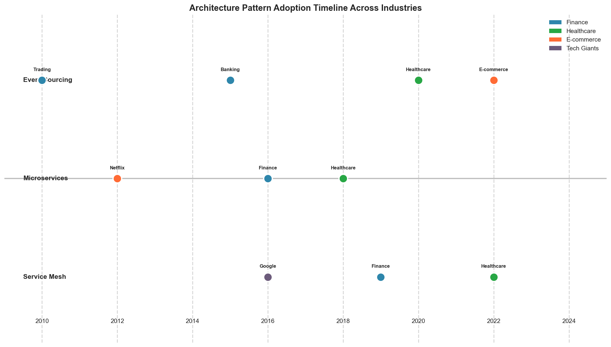
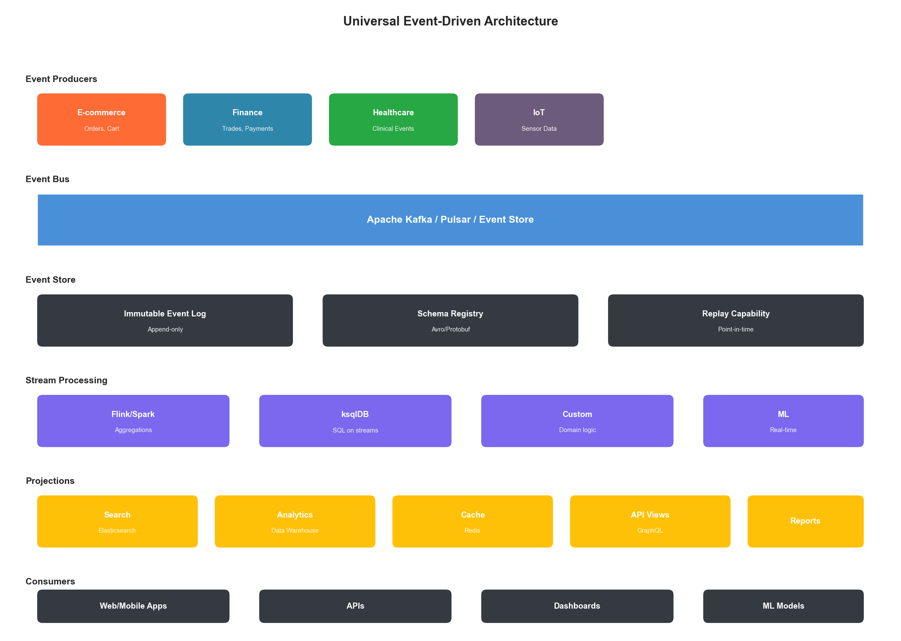
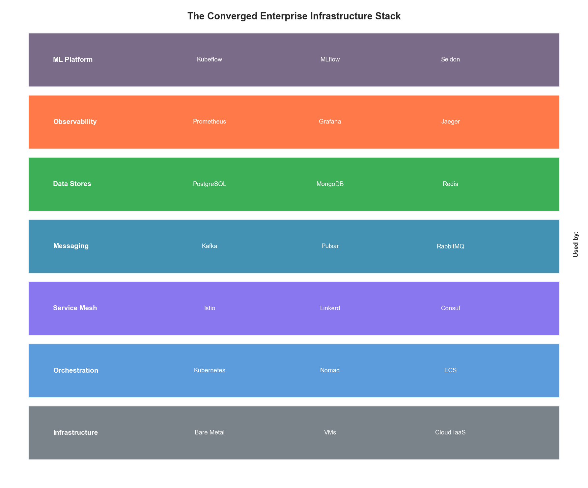
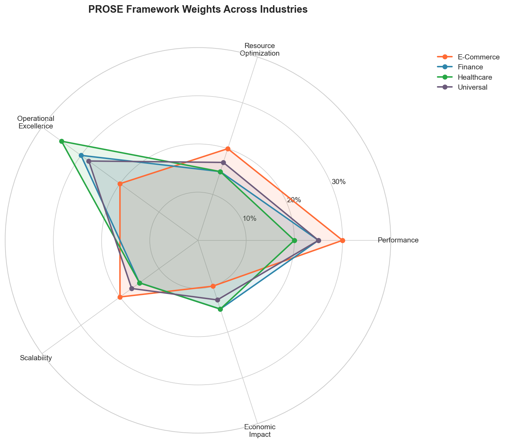

# Chapter 7: Cross-Industry Convergence Patterns

## Introduction

Having explored infrastructure optimization in e-commerce, financial services, and healthcare, a striking pattern emerges: despite their different requirements, these industries are converging toward remarkably similar architectural solutions. The techniques that enable sub-millisecond trading are being adapted for real-time fraud detection in retail. Healthcare's compliance frameworks are informing financial services' approach to data governance. E-commerce's auto-scaling strategies are becoming standard across all sectors.

This chapter synthesizes the lessons learned across industries to identify universal patterns, transferable techniques, and the emerging convergence toward intelligent, self-optimizing infrastructure.

## 7.1 The Convergence Thesis

### 7.1.1 Why Industries Are Converging

Three forces are driving infrastructure convergence across industries:

| Force | Description | Impact |
|-------|-------------|--------|
| Cloud commoditization | Same underlying infrastructure | Shared architectural patterns |
| Open source dominance | Common tooling (Kubernetes, Kafka, etc.) | Standardized operations |
| Talent mobility | Engineers move between industries | Cross-pollination of ideas |

### 7.1.2 Convergence Evidence

**Latency Requirements Convergence:**

| Industry | 2015 Requirement | 2024 Requirement | Trend |
|----------|------------------|------------------|-------|
| Trading | < 1ms | < 100μs | 10x faster |
| E-commerce | < 3s | < 200ms | 15x faster |
| Healthcare | < 10s | < 2s | 5x faster |
| Banking | < 5s | < 500ms | 10x faster |

**Architecture Pattern Adoption:**

```
Pattern Adoption Timeline:

Event Sourcing:    Trading (2010) → Banking (2015) → Healthcare (2020) → Retail (2022)
CQRS:              Trading (2012) → E-commerce (2016) → Healthcare (2021)
Microservices:     Netflix (2012) → All industries (2018+)
Service Mesh:      Google (2016) → Finance (2019) → Healthcare (2022)
```



**Figure 7.1: Timeline of Architecture Pattern Adoption Across Industries**

## 7.2 Universal Optimization Patterns

### 7.2.1 Pattern 1: Tiered Architecture

Every industry has adopted tiered architectures, though with different names:

| Tier | E-Commerce | Financial Services | Healthcare |
|------|------------|-------------------|------------|
| Hot | Product cache | Pre-trade risk cache | Active patient records |
| Warm | Session data | Position data | Recent encounters |
| Cold | Order history | Trade archive | Historical records |
| Archive | Analytics | Regulatory archive | Long-term retention |

**Universal Tiered Storage Implementation:**

```python
class UniversalTieredStorage:
    """
    Industry-agnostic tiered storage pattern.

    Applicable to: E-commerce, Finance, Healthcare, Media
    """

    def __init__(self, config: TierConfig):
        self.tiers = {
            "hot": HotTier(config.hot),      # SSD, in-memory
            "warm": WarmTier(config.warm),    # SSD/HDD hybrid
            "cold": ColdTier(config.cold),    # Object storage
            "archive": ArchiveTier(config.archive)  # Glacier/tape
        }
        self.policy_engine = TieringPolicyEngine()
        self.access_tracker = AccessPatternTracker()

    async def store(self, key: str, data: bytes, metadata: dict) -> str:
        """Store data in appropriate tier based on metadata."""
        # Determine initial tier
        tier = self.policy_engine.determine_initial_tier(metadata)

        # Store with tracking
        await self.tiers[tier].put(key, data)
        self.access_tracker.record_write(key, tier)

        return tier

    async def retrieve(self, key: str) -> tuple[bytes, str]:
        """Retrieve data, promoting to hotter tier if accessed frequently."""
        # Find which tier has the data
        current_tier = await self._locate(key)

        # Retrieve
        data = await self.tiers[current_tier].get(key)

        # Record access for tiering decisions
        self.access_tracker.record_read(key)

        # Check if promotion needed
        if self._should_promote(key, current_tier):
            await self._promote(key, data, current_tier)

        return data, current_tier

    def _should_promote(self, key: str, current_tier: str) -> bool:
        """Determine if data should be promoted to hotter tier."""
        access_pattern = self.access_tracker.get_pattern(key)
        return self.policy_engine.should_promote(access_pattern, current_tier)
```

### 7.2.2 Pattern 2: Circuit Breaker with Fallback

Originally from electrical engineering, adopted by Netflix, now universal:

```python
class UniversalCircuitBreaker:
    """
    Circuit breaker pattern applicable across all industries.

    Key insight: The pattern is identical; only thresholds and
    fallback strategies differ by industry.
    """

    def __init__(
        self,
        failure_threshold: int = 5,
        recovery_timeout: int = 30,
        half_open_requests: int = 3
    ):
        self.failure_threshold = failure_threshold
        self.recovery_timeout = recovery_timeout
        self.half_open_requests = half_open_requests

        self.state = CircuitState.CLOSED
        self.failure_count = 0
        self.last_failure_time = None
        self.success_count = 0

    async def call(
        self,
        operation: Callable,
        fallback: Callable,
        *args,
        **kwargs
    ):
        """Execute operation with circuit breaker protection."""
        if self.state == CircuitState.OPEN:
            if self._should_attempt_reset():
                self.state = CircuitState.HALF_OPEN
            else:
                return await fallback(*args, **kwargs)

        try:
            result = await operation(*args, **kwargs)
            self._record_success()
            return result
        except Exception as e:
            self._record_failure()
            if self.state == CircuitState.OPEN:
                return await fallback(*args, **kwargs)
            raise

    def _record_failure(self):
        """Record failure and potentially open circuit."""
        self.failure_count += 1
        self.last_failure_time = time.time()

        if self.failure_count >= self.failure_threshold:
            self.state = CircuitState.OPEN

    def _record_success(self):
        """Record success and potentially close circuit."""
        if self.state == CircuitState.HALF_OPEN:
            self.success_count += 1
            if self.success_count >= self.half_open_requests:
                self.state = CircuitState.CLOSED
                self.failure_count = 0
                self.success_count = 0


# Industry-specific configurations
CIRCUIT_BREAKER_CONFIGS = {
    "trading": {
        "failure_threshold": 2,      # Very aggressive
        "recovery_timeout": 5,       # Quick recovery attempts
        "half_open_requests": 1
    },
    "ecommerce": {
        "failure_threshold": 5,
        "recovery_timeout": 30,
        "half_open_requests": 3
    },
    "healthcare": {
        "failure_threshold": 3,
        "recovery_timeout": 60,      # More conservative
        "half_open_requests": 5      # More validation before closing
    }
}
```

### 7.2.3 Pattern 3: Event-Driven Architecture

Event sourcing and CQRS have become universal patterns:

```python
class UniversalEventStore:
    """
    Event store pattern used across industries.

    Trading: Order events, market data events
    E-commerce: Cart events, order events, inventory events
    Healthcare: Clinical events, audit events
    """

    def __init__(self, storage_backend, schema_registry):
        self.storage = storage_backend
        self.schemas = schema_registry
        self.projections = {}

    async def append(
        self,
        stream_id: str,
        event_type: str,
        event_data: dict,
        metadata: dict = None
    ) -> str:
        """Append event to stream."""
        # Validate against schema
        schema = self.schemas.get_schema(event_type)
        if not schema.validate(event_data):
            raise SchemaValidationError(event_type, event_data)

        # Create event envelope
        event = {
            "event_id": str(uuid.uuid4()),
            "stream_id": stream_id,
            "event_type": event_type,
            "event_data": event_data,
            "metadata": metadata or {},
            "timestamp": datetime.utcnow().isoformat(),
            "version": await self._get_next_version(stream_id)
        }

        # Append to storage
        await self.storage.append(stream_id, event)

        # Update projections
        await self._update_projections(event)

        return event["event_id"]

    async def get_stream(
        self,
        stream_id: str,
        from_version: int = 0,
        to_version: int = None
    ) -> list:
        """Get events from stream."""
        return await self.storage.get_range(
            stream_id, from_version, to_version
        )

    def register_projection(self, name: str, projection: Projection):
        """Register a projection (read model builder)."""
        self.projections[name] = projection

    async def _update_projections(self, event: dict):
        """Update all registered projections with new event."""
        for projection in self.projections.values():
            if projection.handles(event["event_type"]):
                await projection.apply(event)
```



**Figure 7.2: Event-Driven Architecture Pattern Across Industries**

### 7.2.4 Pattern 4: Predictive Scaling

All industries are moving toward ML-driven predictive scaling:

```python
class UniversalPredictiveScaler:
    """
    Predictive auto-scaling applicable across industries.

    Key insight: The ML models differ by domain (seasonality patterns),
    but the scaling infrastructure is identical.
    """

    def __init__(
        self,
        forecaster: DemandForecaster,
        orchestrator: ContainerOrchestrator,
        config: ScalingConfig
    ):
        self.forecaster = forecaster
        self.orchestrator = orchestrator
        self.config = config

    async def scale_ahead(self, service: str, horizon_minutes: int = 15):
        """Scale based on predicted demand."""
        # Get current metrics
        current_metrics = await self._get_current_metrics(service)

        # Predict future demand
        predictions = await self.forecaster.predict(
            service=service,
            current_metrics=current_metrics,
            horizon_minutes=horizon_minutes
        )

        # Calculate required capacity
        required_instances = self._calculate_capacity(
            predictions["peak_demand"],
            predictions["confidence"],
            service
        )

        # Get current capacity
        current_instances = await self.orchestrator.get_instance_count(service)

        # Scale if needed (with buffer for prediction uncertainty)
        if required_instances > current_instances:
            buffer = int(required_instances * (1 - predictions["confidence"]) * 0.5)
            target = required_instances + buffer

            await self.orchestrator.scale(service, target)

            return {
                "action": "scale_up",
                "from": current_instances,
                "to": target,
                "predicted_demand": predictions["peak_demand"],
                "confidence": predictions["confidence"]
            }

        return {"action": "no_change", "current": current_instances}


# Industry-specific forecasters
class EcommerceForecaster(DemandForecaster):
    """Handles flash sales, seasonal peaks, marketing events."""

    def __init__(self):
        self.seasonality_model = SeasonalARIMA()
        self.event_calendar = MarketingEventCalendar()

    async def predict(self, service, current_metrics, horizon_minutes):
        # Factor in known events (flash sales, promotions)
        scheduled_events = self.event_calendar.get_upcoming(horizon_minutes)

        base_prediction = self.seasonality_model.forecast(
            current_metrics, horizon_minutes
        )

        # Apply event multipliers
        for event in scheduled_events:
            base_prediction *= event.expected_traffic_multiplier

        return {
            "peak_demand": base_prediction,
            "confidence": 0.85 if not scheduled_events else 0.70
        }


class HealthcareForecaster(DemandForecaster):
    """Handles clinic schedules, seasonal illness patterns."""

    def __init__(self):
        self.schedule_model = ClinicScheduleModel()
        self.illness_model = SeasonalIllnessModel()

    async def predict(self, service, current_metrics, horizon_minutes):
        # Healthcare has more predictable patterns (scheduled appointments)
        scheduled_load = self.schedule_model.get_scheduled_load(horizon_minutes)

        # Plus walk-ins and emergency adjustments
        emergency_adjustment = self.illness_model.get_current_adjustment()

        return {
            "peak_demand": scheduled_load * emergency_adjustment,
            "confidence": 0.90  # Healthcare is more predictable
        }
```

## 7.3 Transferable Techniques

### 7.3.1 From Trading to E-Commerce: Low-Latency Patterns

Techniques originally developed for high-frequency trading are now appearing in e-commerce:

| Trading Technique | E-Commerce Application |
|-------------------|----------------------|
| Pre-computed order books | Pre-computed product rankings |
| Co-location | Edge computing for personalization |
| Lock-free data structures | High-throughput cart operations |
| FPGA acceleration | Real-time recommendation serving |
| Kernel bypass networking | High-volume API gateways |

```python
class TradingInspiredProductRanker:
    """
    Apply trading system techniques to product ranking.

    Borrowed from trading:
    - Pre-computation of likely queries
    - Lock-free updates
    - Tiered caching with speculation
    """

    def __init__(self, product_catalog, user_model):
        self.catalog = product_catalog
        self.user_model = user_model

        # Pre-computed rankings (like pre-computed order books)
        self.precomputed_rankings = LockFreeCache()

        # Speculative computation queue
        self.speculation_queue = SPSCQueue(1000)

    async def get_ranking(
        self,
        user_id: str,
        category: str,
        context: dict
    ) -> list:
        """Get product ranking with trading-inspired optimizations."""
        # Try pre-computed first (< 1ms)
        cache_key = self._compute_cache_key(user_id, category, context)
        precomputed = self.precomputed_rankings.get(cache_key)

        if precomputed and not precomputed.is_stale():
            # Trigger background refresh (speculative)
            self.speculation_queue.enqueue((cache_key, user_id, category, context))
            return precomputed.rankings

        # Compute fresh ranking
        rankings = await self._compute_ranking(user_id, category, context)

        # Cache with lock-free update
        self.precomputed_rankings.put(
            cache_key,
            RankingResult(rankings, ttl=300)
        )

        # Speculatively compute related rankings
        self._speculate_related(user_id, category)

        return rankings

    def _speculate_related(self, user_id: str, category: str):
        """Speculatively compute rankings user might request next."""
        # Based on user browsing patterns, pre-compute likely next queries
        likely_next = self.user_model.predict_next_categories(user_id, category)

        for next_category in likely_next[:3]:
            self.speculation_queue.enqueue(
                (None, user_id, next_category, {})
            )
```

### 7.3.2 From Healthcare to Finance: Compliance Patterns

Healthcare's mature compliance frameworks inform financial services:

| Healthcare Pattern | Financial Application |
|-------------------|----------------------|
| HIPAA audit trails | SOX compliance logging |
| Break-the-glass access | Emergency trading authorization |
| Consent management | Data sharing agreements |
| De-identification | PII tokenization |

```python
class HealthcareInspiredAuditFramework:
    """
    Apply healthcare compliance patterns to financial services.

    Borrowed from healthcare:
    - Comprehensive access logging
    - Break-the-glass with justification
    - Tamper-evident audit trails
    """

    def __init__(self, audit_store, alert_engine):
        self.audit = audit_store
        self.alerts = alert_engine
        self.hash_chain = None

    async def log_data_access(
        self,
        user_id: str,
        data_type: str,
        data_id: str,
        access_type: str,
        justification: str = None
    ) -> str:
        """Log data access with healthcare-grade audit trail."""
        # Determine if this is normal access or break-the-glass
        is_authorized = await self._check_authorization(user_id, data_type, data_id)

        access_record = {
            "audit_id": str(uuid.uuid4()),
            "timestamp": datetime.utcnow().isoformat(),
            "user_id": user_id,
            "data_type": data_type,
            "data_id_hash": self._hash_id(data_id),  # Don't log actual IDs
            "access_type": access_type,
            "authorized": is_authorized,
            "justification": justification,
            "source_ip": self._get_source_ip(),
            "session_id": self._get_session_id()
        }

        # Add to hash chain (tamper-evident)
        access_record["previous_hash"] = self.hash_chain
        access_record["record_hash"] = self._compute_hash(access_record)
        self.hash_chain = access_record["record_hash"]

        # Store
        await self.audit.append(access_record)

        # Alert on unauthorized access (break-the-glass)
        if not is_authorized:
            await self.alerts.send_alert({
                "type": "unauthorized_access",
                "severity": "high",
                "audit_id": access_record["audit_id"],
                "user_id": user_id,
                "requires_review": True
            })

        return access_record["audit_id"]
```

### 7.3.3 From E-Commerce to Healthcare: Personalization Patterns

E-commerce personalization techniques are transforming healthcare:

| E-Commerce Pattern | Healthcare Application |
|-------------------|----------------------|
| Recommendation engines | Clinical decision support |
| A/B testing | Treatment optimization |
| User segmentation | Patient risk stratification |
| Conversion funnels | Care pathway optimization |

```python
class EcommerceInspiredClinicalSupport:
    """
    Apply e-commerce personalization to clinical decision support.

    Borrowed from e-commerce:
    - Collaborative filtering for treatment suggestions
    - Real-time personalization
    - Outcome tracking and optimization
    """

    def __init__(self, treatment_model, outcome_tracker):
        self.model = treatment_model
        self.outcomes = outcome_tracker

    async def suggest_treatments(
        self,
        patient_context: dict,
        condition: str,
        current_treatments: list
    ) -> list:
        """
        Suggest treatments using collaborative filtering.

        Like product recommendations, but for treatments:
        "Patients similar to you who had this condition
        responded well to these treatments"
        """
        # Find similar patients (collaborative filtering)
        similar_patients = await self.model.find_similar_patients(
            patient_context, condition
        )

        # Get treatments that worked for similar patients
        effective_treatments = await self.model.get_effective_treatments(
            similar_patients, condition
        )

        # Filter out contraindicated treatments
        safe_treatments = self._filter_contraindicated(
            effective_treatments,
            patient_context,
            current_treatments
        )

        # Rank by expected efficacy (like product ranking)
        ranked_treatments = self._rank_by_efficacy(
            safe_treatments,
            patient_context
        )

        return [
            {
                "treatment": t.name,
                "expected_efficacy": t.efficacy_score,
                "similar_patient_outcomes": t.outcome_summary,
                "evidence_level": t.evidence_level,
                "contraindication_check": "passed"
            }
            for t in ranked_treatments[:5]
        ]
```

## 7.4 The Universal Infrastructure Stack

### 7.4.1 Converged Technology Stack

Despite different requirements, industries are converging on similar technology choices:



**Figure 7.3: The Converged Enterprise Infrastructure Stack**

| Layer | Common Choices | Industry Variations |
|-------|---------------|---------------------|
| Orchestration | Kubernetes | Trading: bare metal + K8s hybrid |
| Service Mesh | Istio, Linkerd | Finance: enhanced mTLS |
| Messaging | Kafka, Pulsar | Trading: custom low-latency |
| Databases | PostgreSQL, MongoDB | Finance: Oracle still common |
| Caching | Redis, Memcached | Trading: custom in-memory |
| Observability | Prometheus, Grafana, Jaeger | Healthcare: enhanced audit |
| ML Platform | Kubeflow, MLflow | All converging |

### 7.4.2 Universal Observability

All industries have converged on the three pillars of observability:

```python
class UniversalObservabilityStack:
    """
    Observability implementation applicable across all industries.
    """

    def __init__(self, config: ObservabilityConfig):
        # Metrics (Prometheus-compatible)
        self.metrics = MetricsCollector(config.metrics)

        # Logging (structured, centralized)
        self.logger = StructuredLogger(config.logging)

        # Tracing (OpenTelemetry)
        self.tracer = DistributedTracer(config.tracing)

        # Industry-specific enrichment
        self.enrichers = self._load_enrichers(config.industry)

    def instrument_operation(
        self,
        operation_name: str,
        operation_type: str
    ):
        """Decorator for comprehensive operation instrumentation."""
        def decorator(func):
            @functools.wraps(func)
            async def wrapper(*args, **kwargs):
                # Start trace span
                with self.tracer.start_span(operation_name) as span:
                    start_time = time.time()

                    try:
                        # Execute operation
                        result = await func(*args, **kwargs)

                        # Record success metrics
                        duration = time.time() - start_time
                        self.metrics.histogram(
                            f"{operation_type}.duration",
                            duration,
                            tags={"operation": operation_name, "status": "success"}
                        )

                        return result

                    except Exception as e:
                        # Record failure
                        duration = time.time() - start_time
                        self.metrics.histogram(
                            f"{operation_type}.duration",
                            duration,
                            tags={"operation": operation_name, "status": "error"}
                        )
                        self.metrics.counter(
                            f"{operation_type}.errors",
                            tags={"operation": operation_name, "error_type": type(e).__name__}
                        )

                        # Log error with context
                        self.logger.error(
                            "Operation failed",
                            operation=operation_name,
                            error=str(e),
                            trace_id=span.trace_id
                        )

                        raise

            return wrapper
        return decorator
```

## 7.5 Cross-Industry PROSE Analysis

### 7.5.1 Comparative PROSE Weights

| Dimension | E-Commerce | Finance | Healthcare | Universal |
|-----------|------------|---------|------------|-----------|
| Performance | 30% | 25% | 20% | 25% |
| Resource Opt | 20% | 15% | 15% | 17% |
| Operational | 20% | 30% | 35% | 28% |
| Scalability | 20% | 15% | 15% | 17% |
| Economic | 10% | 15% | 15% | 13% |

### 7.5.2 Universal Optimization Priorities

Based on cross-industry analysis, the universal optimization priority order is:

1. **Operational Excellence** (28%) - Reliability and compliance are universal
2. **Performance** (25%) - Speed matters everywhere
3. **Resource Optimization** (17%) - Efficiency for sustainability
4. **Scalability** (17%) - Handle growth gracefully
5. **Economic Impact** (13%) - Cost follows quality



**Figure 7.4: PROSE Framework Weights Across Industries**

## 7.6 Emerging Convergence Trends

### 7.6.1 AI-Native Infrastructure

All industries are moving toward AI-native infrastructure:

| Capability | Current State | Future State |
|------------|--------------|--------------|
| Scaling | Rule-based auto-scaling | ML-predicted scaling |
| Incident Response | Alert → Human → Action | Anomaly → Auto-remediate |
| Capacity Planning | Spreadsheet-based | Continuous ML optimization |
| Security | Signature-based | Behavioral AI detection |

### 7.6.2 Edge-Cloud Continuum

The boundary between edge and cloud is dissolving:

```
2020: Edge OR Cloud
2024: Edge AND Cloud
2028: Edge-Cloud Continuum (seamless)
```

### 7.6.3 Sustainability-Driven Optimization

Carbon-aware computing is becoming a universal requirement:

```python
class CarbonAwareScheduler:
    """
    Schedule workloads based on carbon intensity.

    Applicable across all industries.
    """

    def __init__(self, carbon_api, workload_classifier):
        self.carbon = carbon_api
        self.classifier = workload_classifier

    async def schedule_workload(
        self,
        workload: Workload,
        deadline: datetime
    ) -> ScheduleDecision:
        """Schedule workload to minimize carbon footprint."""
        # Classify workload flexibility
        flexibility = self.classifier.classify(workload)

        if flexibility == WorkloadFlexibility.REAL_TIME:
            # Must run now regardless of carbon
            return ScheduleDecision(run_now=True, reason="real_time")

        # Get carbon intensity forecast
        carbon_forecast = await self.carbon.get_forecast(
            until=deadline
        )

        # Find optimal window
        optimal_window = self._find_low_carbon_window(
            carbon_forecast,
            workload.estimated_duration,
            deadline
        )

        return ScheduleDecision(
            run_at=optimal_window.start,
            expected_carbon=optimal_window.carbon_intensity,
            carbon_saved=self._calculate_savings(carbon_forecast, optimal_window)
        )
```

## Key Takeaways

1. **Industries are converging** - Despite different requirements, architecture patterns are becoming universal thanks to cloud commoditization and talent mobility

2. **Patterns are transferable** - Trading's low-latency techniques work for e-commerce; healthcare's compliance frameworks apply to finance

3. **The stack is standardizing** - Kubernetes, Kafka, Prometheus, and similar tools are becoming universal across industries

4. **PROSE weights differ, principles don't** - Industries weight dimensions differently, but all five dimensions matter everywhere

5. **AI-native is the future** - All industries are moving toward self-optimizing, ML-driven infrastructure

6. **Sustainability is universal** - Carbon-aware computing is becoming a cross-industry requirement

## References

1. Newman, S. "Building Microservices." O'Reilly Media (2021)
2. Kleppmann, M. "Designing Data-Intensive Applications." O'Reilly Media (2017)
3. Burns, B. "Designing Distributed Systems." O'Reilly Media (2018)
4. Fowler, M. "Patterns of Enterprise Application Architecture." Addison-Wesley (2002)
5. Richardson, C. "Microservices Patterns." Manning (2018)

---

*Next Chapter: Intelligent Infrastructure Architecture*
