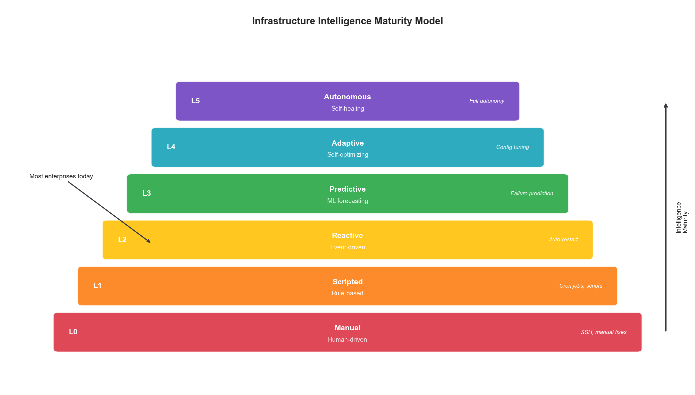
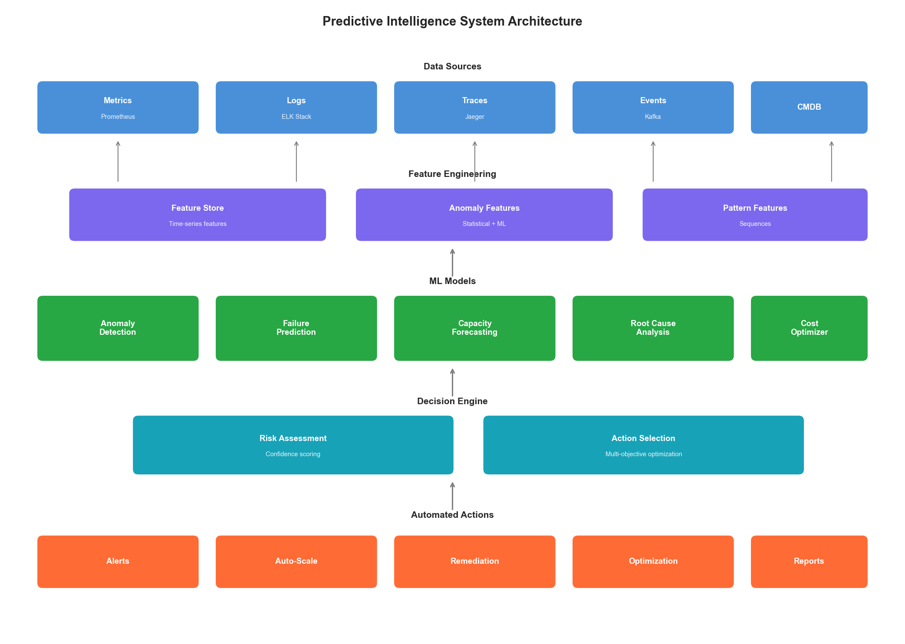
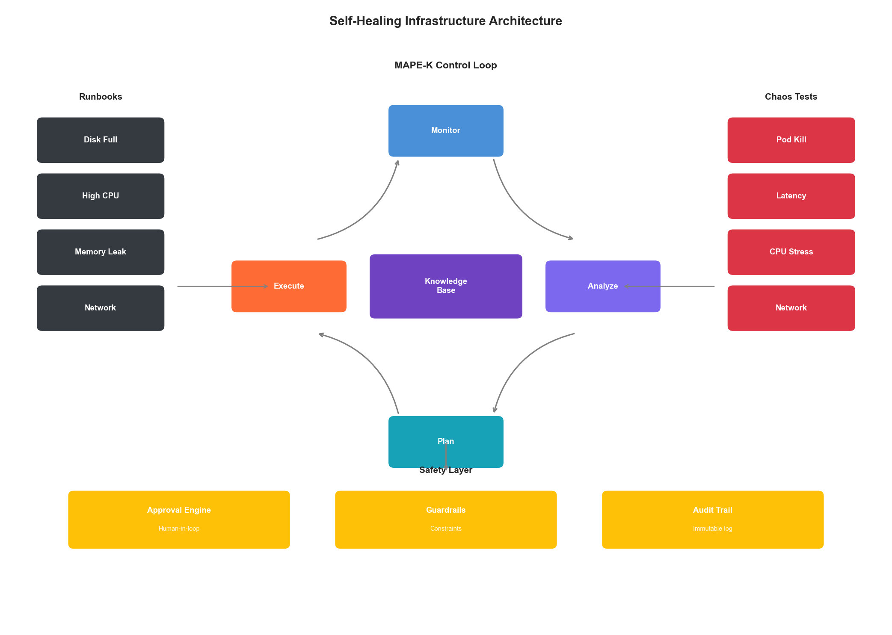
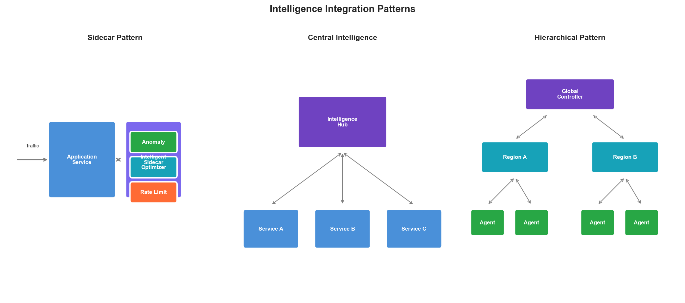

# Chapter 8: Intelligent Infrastructure Architecture

## Introduction

The evolution from reactive to intelligent infrastructure represents a fundamental shift in how enterprises manage their technology stack. Traditional infrastructure responds to problems after they occur. Intelligent infrastructure predicts, prevents, and self-optimizes. This chapter explores the architectural patterns, AI/ML components, and implementation strategies that transform static infrastructure into living, learning systems.

## 8.1 The Intelligence Hierarchy

### 8.1.1 Levels of Infrastructure Intelligence

Infrastructure intelligence exists on a spectrum from basic automation to full autonomy:

| Level | Name | Description | Example |
|-------|------|-------------|---------|
| 0 | Manual | Human-driven operations | SSH into servers to fix issues |
| 1 | Scripted | Rule-based automation | Cron jobs, simple scripts |
| 2 | Reactive | Event-driven automation | Auto-restart on crash |
| 3 | Predictive | ML-based forecasting | Predict and prevent failures |
| 4 | Adaptive | Self-optimizing systems | Continuous configuration tuning |
| 5 | Autonomous | Self-healing, self-evolving | Full autonomic computing |

Most enterprises today operate at Level 2-3. This chapter focuses on achieving Level 4-5.



**Figure 8.1: Infrastructure Intelligence Maturity Levels**

### 8.1.2 The Autonomous Operations Model

```python
class AutonomousOperationsController:
    """
    Controller for autonomous infrastructure operations.

    Implements the MAPE-K loop:
    - Monitor: Collect metrics and events
    - Analyze: Detect anomalies and predict issues
    - Plan: Determine corrective actions
    - Execute: Implement changes
    - Knowledge: Learn from outcomes
    """

    def __init__(self, config):
        self.monitor = MonitoringEngine(config.monitoring)
        self.analyzer = AnalysisEngine(config.analysis)
        self.planner = PlanningEngine(config.planning)
        self.executor = ExecutionEngine(config.execution)
        self.knowledge = KnowledgeBase(config.knowledge)

    async def run_control_loop(self):
        """Main autonomous control loop."""
        while True:
            # Monitor: Collect current state
            state = await self.monitor.collect_state()

            # Analyze: Detect issues and predict future state
            analysis = await self.analyzer.analyze(
                current_state=state,
                historical_knowledge=self.knowledge.get_patterns()
            )

            if analysis.requires_action:
                # Plan: Determine best action
                plan = await self.planner.create_plan(
                    analysis=analysis,
                    constraints=self.knowledge.get_constraints(),
                    past_actions=self.knowledge.get_action_history()
                )

                if plan.is_safe():
                    # Execute: Implement the plan
                    result = await self.executor.execute(plan)

                    # Knowledge: Learn from outcome
                    await self.knowledge.record_outcome(
                        state=state,
                        analysis=analysis,
                        plan=plan,
                        result=result
                    )

            await asyncio.sleep(self.config.loop_interval)
```

## 8.2 Predictive Intelligence Components

### 8.2.1 Anomaly Detection Architecture

Anomaly detection is the foundation of predictive infrastructure:

```python
class MultiModelAnomalyDetector:
    """
    Ensemble anomaly detection using multiple techniques.

    Combines:
    - Statistical methods (Z-score, IQR)
    - Machine learning (Isolation Forest, One-Class SVM)
    - Deep learning (Autoencoders, LSTM)
    """

    def __init__(self, config):
        self.statistical = StatisticalDetector()
        self.isolation_forest = IsolationForestDetector()
        self.autoencoder = AutoencoderDetector(config.autoencoder)
        self.lstm = LSTMDetector(config.lstm)

        # Ensemble weights (learned from historical performance)
        self.weights = {
            "statistical": 0.2,
            "isolation_forest": 0.25,
            "autoencoder": 0.3,
            "lstm": 0.25
        }

    async def detect(self, metrics: dict, context: dict) -> AnomalyResult:
        """Detect anomalies using ensemble of models."""
        # Run all detectors in parallel
        results = await asyncio.gather(
            self.statistical.detect(metrics),
            self.isolation_forest.detect(metrics),
            self.autoencoder.detect(metrics),
            self.lstm.detect(metrics, context.get("time_series"))
        )

        # Weighted ensemble
        scores = {
            "statistical": results[0].score,
            "isolation_forest": results[1].score,
            "autoencoder": results[2].score,
            "lstm": results[3].score
        }

        ensemble_score = sum(
            self.weights[k] * scores[k] for k in scores
        )

        # Determine anomaly status
        is_anomaly = ensemble_score > self.config.threshold

        # Explain which detectors flagged it
        flagged_by = [k for k, v in scores.items() if v > 0.5]

        return AnomalyResult(
            is_anomaly=is_anomaly,
            score=ensemble_score,
            individual_scores=scores,
            flagged_by=flagged_by,
            explanation=self._generate_explanation(metrics, scores, flagged_by)
        )

    def _generate_explanation(self, metrics, scores, flagged_by) -> str:
        """Generate human-readable explanation of anomaly."""
        if not flagged_by:
            return "No anomaly detected"

        explanations = []
        for detector in flagged_by:
            if detector == "statistical":
                explanations.append(
                    f"Statistical deviation detected in {self._find_outlier_metrics(metrics)}"
                )
            elif detector == "lstm":
                explanations.append(
                    "Temporal pattern deviates from learned baseline"
                )
            elif detector == "autoencoder":
                explanations.append(
                    "Reconstruction error indicates unusual metric combination"
                )

        return "; ".join(explanations)
```

### 8.2.2 Failure Prediction

Predicting failures before they occur:

```python
class FailurePredictionEngine:
    """
    Predict infrastructure failures using ML.

    Uses:
    - Historical failure patterns
    - Leading indicators
    - Correlation analysis
    """

    def __init__(self, model_path, feature_store):
        self.model = self._load_model(model_path)
        self.features = feature_store
        self.leading_indicators = LeadingIndicatorDetector()

    async def predict_failures(
        self,
        resource_id: str,
        horizon_hours: int = 24
    ) -> list[FailurePrediction]:
        """Predict potential failures for a resource."""
        # Get current metrics
        current_metrics = await self.features.get_current(resource_id)

        # Get historical patterns
        history = await self.features.get_history(resource_id, days=30)

        # Check leading indicators
        indicators = await self.leading_indicators.check(
            resource_id, current_metrics, history
        )

        # Build feature vector
        features = self._build_features(current_metrics, history, indicators)

        # Predict
        predictions = self.model.predict_proba(features, horizon_hours)

        return [
            FailurePrediction(
                resource_id=resource_id,
                failure_type=ft,
                probability=prob,
                predicted_time=self._estimate_time(prob, horizon_hours),
                contributing_factors=self._get_factors(features, ft),
                recommended_actions=self._get_recommendations(ft, prob)
            )
            for ft, prob in predictions.items()
            if prob > 0.1  # Only include non-trivial predictions
        ]

    def _get_recommendations(
        self,
        failure_type: str,
        probability: float
    ) -> list[str]:
        """Get recommended preventive actions."""
        recommendations = {
            "disk_full": [
                "Clean up old logs and temporary files",
                "Expand disk capacity",
                "Enable log rotation"
            ],
            "memory_exhaustion": [
                "Identify memory leaks",
                "Increase memory limits",
                "Scale horizontally"
            ],
            "cpu_saturation": [
                "Profile and optimize hot paths",
                "Scale horizontally",
                "Rate limit incoming traffic"
            ],
            "network_degradation": [
                "Check for packet loss",
                "Verify network configuration",
                "Contact network team"
            ]
        }

        actions = recommendations.get(failure_type, ["Investigate further"])

        # Add urgency based on probability
        if probability > 0.8:
            actions = ["URGENT: " + actions[0]] + actions[1:]

        return actions
```



**Figure 8.2: Predictive Intelligence System Architecture**

## 8.3 Self-Optimizing Systems

### 8.3.1 Continuous Configuration Optimization

```python
class ContinuousConfigurationOptimizer:
    """
    Continuously optimize system configuration using ML.

    Implements Bayesian optimization for:
    - Resource allocation
    - Tuning parameters
    - Scaling thresholds
    """

    def __init__(self, config):
        self.optimizer = BayesianOptimizer(config.optimization)
        self.constraints = config.constraints
        self.objective = config.objective
        self.safe_mode = config.safe_mode

    async def optimize(
        self,
        system: str,
        current_config: dict,
        metrics: dict
    ) -> OptimizationResult:
        """Find optimal configuration."""
        # Define search space
        search_space = self._get_search_space(system)

        # Get historical performance data
        history = await self._get_performance_history(system)

        # Run optimization
        suggested_config = self.optimizer.suggest(
            search_space=search_space,
            objective=self.objective,
            history=history,
            constraints=self.constraints
        )

        # Validate safety
        if self.safe_mode:
            safety_check = await self._validate_safety(
                system, current_config, suggested_config
            )
            if not safety_check.is_safe:
                return OptimizationResult(
                    applied=False,
                    reason=safety_check.reason,
                    suggested_config=suggested_config
                )

        # Calculate expected improvement
        expected_improvement = self._calculate_improvement(
            current_config, suggested_config, history
        )

        return OptimizationResult(
            applied=True,
            current_config=current_config,
            suggested_config=suggested_config,
            expected_improvement=expected_improvement,
            confidence=self.optimizer.confidence
        )

    def _get_search_space(self, system: str) -> dict:
        """Define configuration search space."""
        spaces = {
            "database": {
                "max_connections": (50, 500),
                "shared_buffers_gb": (1, 16),
                "work_mem_mb": (64, 1024),
                "effective_cache_size_gb": (4, 64),
                "checkpoint_completion_target": (0.5, 0.9)
            },
            "cache": {
                "maxmemory_gb": (1, 64),
                "maxmemory_policy": ["volatile-lru", "allkeys-lru", "volatile-ttl"],
                "tcp_keepalive": (0, 300)
            },
            "web_server": {
                "worker_processes": (1, 16),
                "worker_connections": (512, 4096),
                "keepalive_timeout": (15, 120),
                "client_body_buffer_size_kb": (8, 128)
            }
        }
        return spaces.get(system, {})
```

### 8.3.2 Adaptive Resource Allocation

```python
class AdaptiveResourceAllocator:
    """
    Dynamically allocate resources based on workload patterns.
    """

    def __init__(self, orchestrator, predictor, config):
        self.orchestrator = orchestrator
        self.predictor = predictor
        self.config = config
        self.allocation_history = []

    async def allocate(self, service: str) -> AllocationDecision:
        """Make adaptive allocation decision."""
        # Get current state
        current = await self.orchestrator.get_allocation(service)

        # Predict future demand
        demand_forecast = await self.predictor.forecast(
            service=service,
            horizon_minutes=30
        )

        # Get workload characteristics
        workload = await self._analyze_workload(service)

        # Determine optimal allocation
        optimal = self._calculate_optimal_allocation(
            current=current,
            forecast=demand_forecast,
            workload=workload
        )

        # Apply constraints
        constrained = self._apply_constraints(optimal, service)

        # Decide on action
        if self._should_reallocate(current, constrained):
            action = await self.orchestrator.reallocate(service, constrained)
            self.allocation_history.append({
                "service": service,
                "from": current,
                "to": constrained,
                "reason": action.reason,
                "timestamp": datetime.utcnow()
            })
            return AllocationDecision(
                action="reallocate",
                previous=current,
                new=constrained,
                reason=action.reason
            )

        return AllocationDecision(action="no_change", current=current)

    def _calculate_optimal_allocation(
        self,
        current: ResourceAllocation,
        forecast: DemandForecast,
        workload: WorkloadCharacteristics
    ) -> ResourceAllocation:
        """Calculate optimal resource allocation."""
        # Base on peak predicted demand
        peak_demand = forecast.peak_demand
        confidence = forecast.confidence

        # Add buffer based on confidence
        buffer = 1 + (1 - confidence) * 0.3

        # Calculate resources
        cpu = int(peak_demand.cpu_cores * buffer)
        memory = int(peak_demand.memory_gb * buffer)
        replicas = max(
            self.config.min_replicas,
            int(peak_demand.requests_per_second / workload.requests_per_replica)
        )

        return ResourceAllocation(
            cpu_cores=cpu,
            memory_gb=memory,
            replicas=replicas
        )
```

## 8.4 Self-Healing Architecture

### 8.4.1 Automated Remediation Framework

```python
class AutomatedRemediationEngine:
    """
    Automatically remediate detected issues.
    """

    def __init__(self, config):
        self.runbook_store = RunbookStore(config.runbooks)
        self.executor = RemediationExecutor(config.execution)
        self.approval_engine = ApprovalEngine(config.approval)
        self.audit = AuditLogger(config.audit)

    async def remediate(
        self,
        incident: Incident
    ) -> RemediationResult:
        """Automatically remediate an incident."""
        # Find matching runbook
        runbook = await self.runbook_store.find_matching(incident)

        if not runbook:
            return RemediationResult(
                success=False,
                reason="no_matching_runbook",
                requires_human=True
            )

        # Check if auto-remediation is allowed
        approval = await self.approval_engine.check(
            incident=incident,
            runbook=runbook
        )

        if not approval.auto_approved:
            # Queue for human approval
            await self._queue_for_approval(incident, runbook)
            return RemediationResult(
                success=False,
                reason="requires_approval",
                requires_human=True
            )

        # Execute remediation
        try:
            self.audit.log({
                "event": "remediation_started",
                "incident_id": incident.id,
                "runbook_id": runbook.id
            })

            result = await self.executor.execute(
                runbook=runbook,
                incident=incident
            )

            self.audit.log({
                "event": "remediation_completed",
                "incident_id": incident.id,
                "result": result.status
            })

            return RemediationResult(
                success=result.success,
                actions_taken=result.actions,
                duration=result.duration
            )

        except Exception as e:
            self.audit.log({
                "event": "remediation_failed",
                "incident_id": incident.id,
                "error": str(e)
            })
            return RemediationResult(
                success=False,
                reason=str(e),
                requires_human=True
            )


class RunbookStore:
    """Store and match runbooks to incidents."""

    def __init__(self, config):
        self.runbooks = self._load_runbooks(config.path)
        self.ml_matcher = RunbookMatcher(config.model)

    async def find_matching(self, incident: Incident) -> Runbook:
        """Find the best matching runbook for an incident."""
        # Try exact match first
        for runbook in self.runbooks:
            if self._exact_match(runbook, incident):
                return runbook

        # Fall back to ML-based matching
        best_match = self.ml_matcher.find_best(
            incident_description=incident.description,
            incident_symptoms=incident.symptoms,
            candidates=self.runbooks
        )

        if best_match and best_match.confidence > 0.8:
            return best_match.runbook

        return None
```

### 8.4.2 Chaos Engineering Integration

```python
class ChaosEngineeringOrchestrator:
    """
    Controlled chaos engineering to validate self-healing.
    """

    def __init__(self, config):
        self.experiments = ExperimentCatalog(config.experiments)
        self.safety = SafetyController(config.safety)
        self.metrics = MetricsCollector(config.metrics)

    async def run_experiment(
        self,
        experiment_type: str,
        target: str,
        parameters: dict
    ) -> ExperimentResult:
        """Run a chaos experiment."""
        experiment = self.experiments.get(experiment_type)

        # Pre-flight checks
        safety_check = await self.safety.pre_flight_check(
            experiment=experiment,
            target=target,
            parameters=parameters
        )

        if not safety_check.safe_to_proceed:
            return ExperimentResult(
                executed=False,
                reason=safety_check.reason
            )

        # Capture baseline
        baseline = await self.metrics.capture_baseline(target)

        # Execute chaos
        try:
            chaos_result = await experiment.execute(target, parameters)

            # Monitor recovery
            recovery = await self._monitor_recovery(target, baseline)

            return ExperimentResult(
                executed=True,
                chaos_introduced=chaos_result.description,
                recovery_time=recovery.time_to_recovery,
                recovered_successfully=recovery.success,
                metrics_during=recovery.metrics,
                insights=self._generate_insights(chaos_result, recovery)
            )

        finally:
            # Always clean up
            await experiment.cleanup(target)

    async def _monitor_recovery(
        self,
        target: str,
        baseline: Metrics
    ) -> RecoveryResult:
        """Monitor system recovery after chaos injection."""
        start_time = time.time()
        max_wait = 300  # 5 minutes

        while time.time() - start_time < max_wait:
            current = await self.metrics.capture_current(target)

            if self._has_recovered(current, baseline):
                return RecoveryResult(
                    success=True,
                    time_to_recovery=time.time() - start_time,
                    metrics=current
                )

            await asyncio.sleep(5)

        return RecoveryResult(
            success=False,
            time_to_recovery=max_wait,
            metrics=await self.metrics.capture_current(target)
        )
```



**Figure 8.3: Self-Healing Infrastructure Architecture**

## 8.5 Knowledge Management for Intelligent Systems

### 8.5.1 Operational Knowledge Graph

```python
class OperationalKnowledgeGraph:
    """
    Knowledge graph for infrastructure relationships and patterns.
    """

    def __init__(self, graph_db):
        self.db = graph_db

    async def add_relationship(
        self,
        source: Entity,
        relationship: str,
        target: Entity,
        properties: dict = None
    ):
        """Add relationship to knowledge graph."""
        await self.db.execute("""
            MERGE (s:Entity {id: $source_id, type: $source_type})
            MERGE (t:Entity {id: $target_id, type: $target_type})
            MERGE (s)-[r:$relationship]->(t)
            SET r += $properties
        """, {
            "source_id": source.id,
            "source_type": source.type,
            "target_id": target.id,
            "target_type": target.type,
            "relationship": relationship,
            "properties": properties or {}
        })

    async def query_impact(self, entity_id: str, depth: int = 3) -> list:
        """Query potential impact of an entity failure."""
        result = await self.db.execute("""
            MATCH path = (e:Entity {id: $entity_id})-[:DEPENDS_ON|IMPACTS*1..$depth]->(affected)
            RETURN affected, length(path) as distance
            ORDER BY distance
        """, {"entity_id": entity_id, "depth": depth})

        return [
            {
                "entity": row["affected"],
                "distance": row["distance"],
                "impact_probability": 1 / (row["distance"] + 1)
            }
            for row in result
        ]

    async def find_root_cause(
        self,
        symptom_entities: list[str]
    ) -> list[RootCauseCandidate]:
        """Find potential root causes for observed symptoms."""
        # Find common ancestors in dependency graph
        result = await self.db.execute("""
            MATCH (symptom:Entity)
            WHERE symptom.id IN $symptoms
            MATCH path = (root:Entity)-[:DEPENDS_ON*]->(symptom)
            WITH root, count(DISTINCT symptom) as symptom_count
            WHERE symptom_count > 1
            RETURN root, symptom_count
            ORDER BY symptom_count DESC
            LIMIT 10
        """, {"symptoms": symptom_entities})

        return [
            RootCauseCandidate(
                entity=row["root"],
                explains_symptoms=row["symptom_count"],
                confidence=row["symptom_count"] / len(symptom_entities)
            )
            for row in result
        ]
```

### 8.5.2 Learning from Incidents

```python
class IncidentLearningEngine:
    """
    Learn from past incidents to improve future responses.
    """

    def __init__(self, incident_store, ml_engine):
        self.incidents = incident_store
        self.ml = ml_engine

    async def learn_from_incident(
        self,
        incident: ResolvedIncident
    ):
        """Extract learnings from a resolved incident."""
        # Store incident for future reference
        await self.incidents.store(incident)

        # Extract patterns
        patterns = self._extract_patterns(incident)

        # Update models
        await self._update_detection_model(incident, patterns)
        await self._update_prediction_model(incident, patterns)
        await self._update_remediation_model(incident)

    async def suggest_similar_resolutions(
        self,
        current_incident: Incident
    ) -> list[SimilarIncident]:
        """Find similar past incidents and their resolutions."""
        # Encode current incident
        embedding = self.ml.encode_incident(current_incident)

        # Find similar
        similar = await self.incidents.search_similar(
            embedding=embedding,
            limit=5
        )

        return [
            SimilarIncident(
                incident=inc,
                similarity=sim,
                resolution=inc.resolution,
                resolution_effectiveness=inc.resolution_effectiveness
            )
            for inc, sim in similar
        ]

    def _extract_patterns(self, incident: ResolvedIncident) -> list[Pattern]:
        """Extract reusable patterns from incident."""
        patterns = []

        # Leading indicator pattern
        if incident.leading_indicators:
            patterns.append(Pattern(
                type="leading_indicator",
                indicators=incident.leading_indicators,
                lead_time=incident.lead_time,
                incident_type=incident.type
            ))

        # Remediation pattern
        if incident.resolution.success:
            patterns.append(Pattern(
                type="remediation",
                symptoms=incident.symptoms,
                actions=incident.resolution.actions,
                effectiveness=incident.resolution_effectiveness
            ))

        return patterns
```

## 8.6 Architecture Patterns for Intelligence

### 8.6.1 Sidecar Intelligence Pattern

```python
class IntelligentSidecar:
    """
    Sidecar pattern for adding intelligence to any service.

    Deployed alongside each service to provide:
    - Local anomaly detection
    - Request optimization
    - Adaptive rate limiting
    """

    def __init__(self, config):
        self.local_detector = LocalAnomalyDetector(config.detection)
        self.optimizer = RequestOptimizer(config.optimization)
        self.rate_limiter = AdaptiveRateLimiter(config.rate_limiting)

    async def intercept_request(
        self,
        request: Request
    ) -> InterceptResult:
        """Intercept and optionally modify request."""
        # Check rate limit
        if not await self.rate_limiter.allow(request):
            return InterceptResult(
                allowed=False,
                reason="rate_limited"
            )

        # Optimize request
        optimized = await self.optimizer.optimize(request)

        return InterceptResult(
            allowed=True,
            modified_request=optimized
        )

    async def intercept_response(
        self,
        request: Request,
        response: Response,
        latency: float
    ):
        """Analyze response for anomalies."""
        # Check for anomalies
        anomaly = await self.local_detector.check(
            request=request,
            response=response,
            latency=latency
        )

        if anomaly.detected:
            await self._report_anomaly(anomaly)

        # Update adaptive models
        await self.rate_limiter.update(request, response, latency)
        await self.optimizer.learn(request, response, latency)
```



**Figure 8.4: Intelligence Integration Patterns**

## Key Takeaways

1. **Intelligence is a spectrum** - Progress from reactive (Level 2) through predictive (Level 3) to truly autonomous (Level 5) systems incrementally

2. **Ensemble detection works best** - Combine statistical, ML, and deep learning anomaly detection for robust results

3. **Self-healing requires runbooks** - Automated remediation is only as good as the runbooks that encode operational knowledge

4. **Knowledge graphs enable understanding** - Model infrastructure relationships to enable root cause analysis and impact prediction

5. **Learn from every incident** - Systematic incident learning improves all components of intelligent infrastructure

6. **Safety is paramount** - Always implement safety constraints and human-in-the-loop for high-risk operations

## References

1. IBM. "An Architectural Blueprint for Autonomic Computing." IBM White Paper (2006)
2. Google. "Site Reliability Engineering." O'Reilly Media (2016)
3. Netflix. "Chaos Engineering." O'Reilly Media (2020)
4. Sculley, D. et al. "Hidden Technical Debt in Machine Learning Systems." NeurIPS (2015)
5. Amazon. "Building Self-Healing Infrastructure." AWS Architecture Blog (2023)

---

*Next Chapter: Reinforcement Learning for Infrastructure Optimization*
