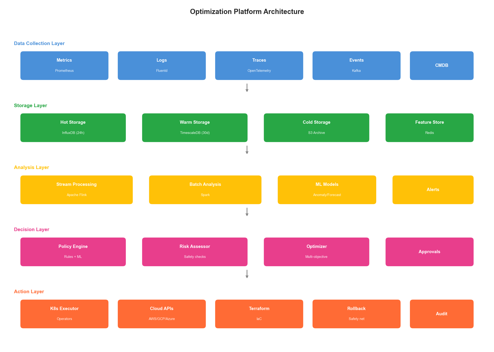
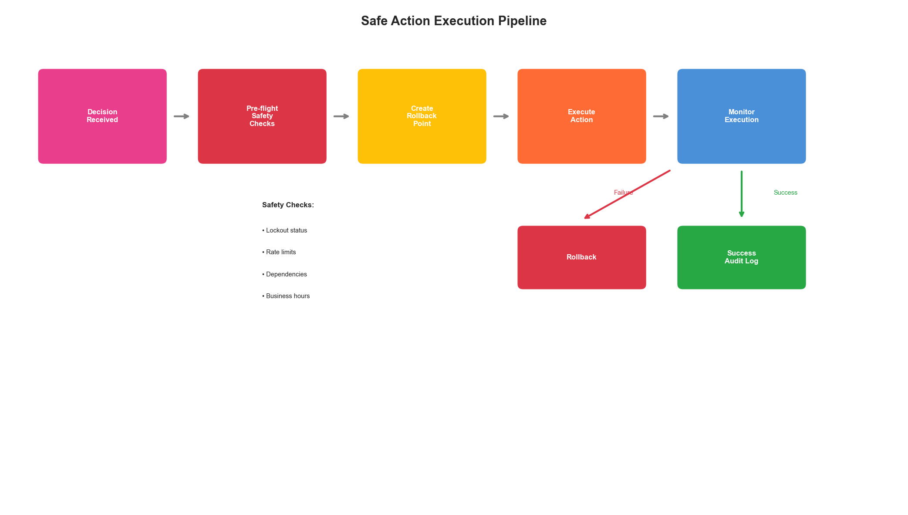

# Chapter 9: Building Your Optimization Platform

## Introduction

The previous chapters explored optimization strategies across e-commerce, financial services, and healthcare industries. Now it's time to build the platform that makes these optimizations possible. This chapter provides a comprehensive guide to architecting, implementing, and operating an AI-driven infrastructure optimization platform that serves as the foundation for everything that follows.

An optimization platform is not a single tool—it's an integrated ecosystem of data collection, analysis, decision-making, and action components. Building it correctly from the start determines whether your optimization efforts succeed at scale or collapse under their own complexity.

## 9.1 Platform Architecture Overview

### 9.1.1 Core Components

A complete optimization platform consists of five integrated layers:

| Layer | Function | Key Technologies |
|-------|----------|------------------|
| Data Collection | Gather metrics, logs, traces, events | Prometheus, OpenTelemetry, Fluentd |
| Data Storage | Store and query observability data | InfluxDB, TimescaleDB, Elasticsearch |
| Analysis Engine | Process and analyze data streams | Apache Flink, Spark Streaming, Custom ML |
| Decision Engine | Generate optimization recommendations | Custom ML models, Rule engines |
| Action Engine | Execute changes safely | Kubernetes operators, Ansible, Terraform |



**Figure 9.1: Complete Optimization Platform Architecture**

### 9.1.2 Design Principles

Building a robust optimization platform requires adherence to key principles:

**1. Separation of Concerns**
```python
class OptimizationPlatform:
    """
    Main platform orchestrator with clear separation of concerns.
    """

    def __init__(self, config: PlatformConfig):
        # Each component is independent and replaceable
        self.collector = DataCollector(config.collection)
        self.storage = DataStorage(config.storage)
        self.analyzer = AnalysisEngine(config.analysis)
        self.decision = DecisionEngine(config.decision)
        self.executor = ActionEngine(config.execution)

        # Event bus for loose coupling
        self.event_bus = EventBus(config.events)

    async def run(self):
        """Main optimization loop."""
        while True:
            # Collect -> Store -> Analyze -> Decide -> Act
            data = await self.collector.collect()
            await self.storage.store(data)

            analysis = await self.analyzer.analyze(data)

            if analysis.requires_action:
                decision = await self.decision.decide(analysis)

                if decision.approved:
                    await self.executor.execute(decision.actions)

            await asyncio.sleep(self.config.loop_interval)
```

**2. Observability First**

Every component must be observable:

```python
class ObservableComponent:
    """Base class for all platform components."""

    def __init__(self, name: str, metrics_client):
        self.name = name
        self.metrics = metrics_client
        self.tracer = opentelemetry.trace.get_tracer(name)
        self.logger = structlog.get_logger(name)

    async def execute(self, operation: str, func, *args, **kwargs):
        """Execute with full observability."""
        with self.tracer.start_as_current_span(operation) as span:
            start_time = time.time()

            try:
                result = await func(*args, **kwargs)

                self.metrics.counter(
                    f"{self.name}.{operation}.success"
                ).inc()

                return result

            except Exception as e:
                self.metrics.counter(
                    f"{self.name}.{operation}.error",
                    labels={"error_type": type(e).__name__}
                ).inc()

                span.record_exception(e)
                self.logger.error(
                    f"{operation} failed",
                    error=str(e),
                    exc_info=True
                )
                raise

            finally:
                duration = time.time() - start_time
                self.metrics.histogram(
                    f"{self.name}.{operation}.duration"
                ).observe(duration)
```

**3. Graceful Degradation**

The platform must continue operating even when components fail:

```python
class ResilientPipeline:
    """Pipeline with graceful degradation."""

    def __init__(self, components: list, fallbacks: dict):
        self.components = components
        self.fallbacks = fallbacks
        self.circuit_breakers = {
            c.name: CircuitBreaker(
                failure_threshold=5,
                recovery_timeout=60
            )
            for c in components
        }

    async def execute(self, data):
        """Execute pipeline with fallbacks."""
        result = data

        for component in self.components:
            breaker = self.circuit_breakers[component.name]

            if breaker.is_open:
                # Use fallback if available
                if component.name in self.fallbacks:
                    result = await self.fallbacks[component.name](result)
                    continue
                else:
                    # Skip component if no fallback
                    continue

            try:
                result = await breaker.execute(
                    component.process, result
                )
            except CircuitBreakerOpen:
                if component.name in self.fallbacks:
                    result = await self.fallbacks[component.name](result)

        return result
```

## 9.2 Data Collection Layer

### 9.2.1 Metrics Collection Architecture

```python
class MetricsCollector:
    """
    Unified metrics collection from multiple sources.
    """

    def __init__(self, config: MetricsConfig):
        self.sources = self._initialize_sources(config.sources)
        self.buffer = MetricsBuffer(config.buffer_size)
        self.normalizer = MetricsNormalizer()

    def _initialize_sources(self, source_configs: list) -> list:
        """Initialize metric sources."""
        sources = []

        for cfg in source_configs:
            if cfg.type == "prometheus":
                sources.append(PrometheusSource(cfg))
            elif cfg.type == "cloudwatch":
                sources.append(CloudWatchSource(cfg))
            elif cfg.type == "datadog":
                sources.append(DatadogSource(cfg))
            elif cfg.type == "custom":
                sources.append(CustomMetricsSource(cfg))

        return sources

    async def collect(self) -> MetricsBatch:
        """Collect metrics from all sources."""
        tasks = [source.scrape() for source in self.sources]
        results = await asyncio.gather(*tasks, return_exceptions=True)

        metrics = []
        for result, source in zip(results, self.sources):
            if isinstance(result, Exception):
                self.logger.warning(
                    f"Failed to collect from {source.name}",
                    error=str(result)
                )
                continue

            # Normalize to common format
            normalized = self.normalizer.normalize(result, source.name)
            metrics.extend(normalized)

        return MetricsBatch(
            timestamp=datetime.utcnow(),
            metrics=metrics
        )


class MetricsNormalizer:
    """Normalize metrics to a common schema."""

    def normalize(self, raw_metrics: list, source: str) -> list:
        """Normalize metrics to common format."""
        normalized = []

        for metric in raw_metrics:
            normalized.append(NormalizedMetric(
                name=self._normalize_name(metric.name, source),
                value=metric.value,
                timestamp=metric.timestamp or datetime.utcnow(),
                labels=self._normalize_labels(metric.labels),
                source=source,
                unit=self._infer_unit(metric.name)
            ))

        return normalized

    def _normalize_name(self, name: str, source: str) -> str:
        """Normalize metric names across sources."""
        # Map source-specific names to canonical names
        mappings = {
            "prometheus": {
                "container_cpu_usage_seconds_total": "cpu.usage",
                "container_memory_usage_bytes": "memory.usage",
                "container_network_receive_bytes_total": "network.rx.bytes"
            },
            "cloudwatch": {
                "CPUUtilization": "cpu.usage",
                "MemoryUtilization": "memory.usage",
                "NetworkIn": "network.rx.bytes"
            }
        }

        source_mappings = mappings.get(source, {})
        return source_mappings.get(name, name)
```

### 9.2.2 Log Collection and Processing

```python
class LogCollector:
    """
    Collect and process logs for optimization insights.
    """

    def __init__(self, config: LogConfig):
        self.sources = self._init_sources(config)
        self.parser = LogParser(config.patterns)
        self.enricher = LogEnricher(config.enrichment)

    async def collect_and_process(self) -> list[ProcessedLog]:
        """Collect and process logs."""
        raw_logs = await self._collect_from_sources()

        processed = []
        for log in raw_logs:
            # Parse structured data from log
            parsed = self.parser.parse(log)

            # Enrich with context
            enriched = await self.enricher.enrich(parsed)

            # Extract optimization-relevant fields
            optimization_data = self._extract_optimization_data(enriched)

            processed.append(ProcessedLog(
                raw=log,
                parsed=parsed,
                enriched=enriched,
                optimization_data=optimization_data
            ))

        return processed

    def _extract_optimization_data(self, log: dict) -> dict:
        """Extract data relevant for optimization decisions."""
        return {
            "latency": log.get("response_time_ms"),
            "status_code": log.get("status_code"),
            "error_type": log.get("error_type"),
            "resource_id": log.get("pod_name") or log.get("instance_id"),
            "endpoint": log.get("path"),
            "user_impact": self._calculate_user_impact(log)
        }


class LogParser:
    """Parse logs with multiple format support."""

    def __init__(self, patterns: dict):
        self.patterns = {
            name: re.compile(pattern)
            for name, pattern in patterns.items()
        }
        self.json_parser = JSONLogParser()

    def parse(self, log_line: str) -> dict:
        """Parse a log line."""
        # Try JSON first
        if log_line.strip().startswith('{'):
            return self.json_parser.parse(log_line)

        # Try pattern matching
        for name, pattern in self.patterns.items():
            match = pattern.match(log_line)
            if match:
                return {
                    "format": name,
                    **match.groupdict()
                }

        # Fallback to raw
        return {"raw": log_line, "format": "unknown"}
```

### 9.2.3 Distributed Tracing Integration

```python
class TraceCollector:
    """
    Collect and aggregate distributed traces.
    """

    def __init__(self, config: TracingConfig):
        self.backend = self._init_backend(config)
        self.aggregator = TraceAggregator()

    async def collect_traces(
        self,
        service: str,
        time_range: TimeRange
    ) -> list[AggregatedTrace]:
        """Collect and aggregate traces for a service."""
        # Query raw traces
        traces = await self.backend.query_traces(
            service=service,
            start=time_range.start,
            end=time_range.end
        )

        # Aggregate by operation
        aggregated = self.aggregator.aggregate(traces)

        return aggregated


class TraceAggregator:
    """Aggregate traces for optimization analysis."""

    def aggregate(self, traces: list[Trace]) -> list[AggregatedTrace]:
        """Aggregate traces by operation."""
        by_operation = defaultdict(list)

        for trace in traces:
            operation = trace.root_span.operation_name
            by_operation[operation].append(trace)

        aggregated = []
        for operation, op_traces in by_operation.items():
            durations = [t.duration_ms for t in op_traces]

            aggregated.append(AggregatedTrace(
                operation=operation,
                count=len(op_traces),
                p50_latency=np.percentile(durations, 50),
                p95_latency=np.percentile(durations, 95),
                p99_latency=np.percentile(durations, 99),
                error_rate=sum(1 for t in op_traces if t.has_error) / len(op_traces),
                bottleneck_spans=self._identify_bottlenecks(op_traces),
                dependency_graph=self._build_dependency_graph(op_traces)
            ))

        return aggregated

    def _identify_bottlenecks(self, traces: list[Trace]) -> list[str]:
        """Identify spans that contribute most to latency."""
        span_contributions = defaultdict(list)

        for trace in traces:
            for span in trace.spans:
                contribution = span.duration_ms / trace.duration_ms
                span_contributions[span.operation_name].append(contribution)

        # Find spans with high average contribution
        bottlenecks = []
        for span_name, contributions in span_contributions.items():
            avg_contribution = np.mean(contributions)
            if avg_contribution > 0.3:  # > 30% of total time
                bottlenecks.append(span_name)

        return bottlenecks
```


**Figure 9.2: Unified Data Collection Pipeline**

## 9.3 Storage Layer Design

### 9.3.1 Time-Series Database Architecture

```python
class TimeSeriesStorage:
    """
    Optimized time-series storage for metrics.
    """

    def __init__(self, config: StorageConfig):
        self.hot_storage = InfluxDBClient(config.hot)
        self.warm_storage = TimescaleDBClient(config.warm)
        self.cold_storage = S3Client(config.cold)

        self.retention_policy = RetentionPolicy(config.retention)
        self.downsampler = Downsampler(config.downsampling)

    async def write(self, metrics: list[Metric]):
        """Write metrics with automatic tiering."""
        # Always write to hot storage first
        await self.hot_storage.write(metrics)

    async def query(
        self,
        query: MetricQuery,
        time_range: TimeRange
    ) -> list[Metric]:
        """Query across storage tiers."""
        # Determine which tiers to query
        tiers = self._determine_tiers(time_range)

        results = []
        for tier in tiers:
            tier_results = await self._query_tier(tier, query, time_range)
            results.extend(tier_results)

        return self._merge_results(results)

    def _determine_tiers(self, time_range: TimeRange) -> list[str]:
        """Determine which storage tiers to query."""
        now = datetime.utcnow()
        tiers = []

        # Hot: last 24 hours
        if time_range.end > now - timedelta(hours=24):
            tiers.append("hot")

        # Warm: 1 day to 30 days
        if time_range.start < now - timedelta(hours=24):
            if time_range.end > now - timedelta(days=30):
                tiers.append("warm")

        # Cold: > 30 days
        if time_range.start < now - timedelta(days=30):
            tiers.append("cold")

        return tiers


class Downsampler:
    """Downsample metrics for long-term storage."""

    def __init__(self, config: DownsamplingConfig):
        self.rules = config.rules

    async def downsample(
        self,
        metrics: list[Metric],
        target_resolution: timedelta
    ) -> list[Metric]:
        """Downsample metrics to target resolution."""
        # Group by metric name and labels
        grouped = self._group_metrics(metrics)

        downsampled = []
        for key, group in grouped.items():
            # Apply aggregation
            aggregated = self._aggregate_group(
                group,
                target_resolution,
                self._get_aggregation_method(key)
            )
            downsampled.extend(aggregated)

        return downsampled

    def _get_aggregation_method(self, metric_name: str) -> str:
        """Get appropriate aggregation method for metric."""
        # Counters should sum, gauges should average
        if "total" in metric_name or "count" in metric_name:
            return "sum"
        elif "bucket" in metric_name:
            return "sum"  # Histogram buckets
        else:
            return "avg"
```

### 9.3.2 Feature Store for ML

```python
class FeatureStore:
    """
    Feature store for ML-based optimization.
    """

    def __init__(self, config: FeatureStoreConfig):
        self.online_store = RedisClient(config.online)
        self.offline_store = ParquetStore(config.offline)
        self.feature_registry = FeatureRegistry(config.registry)

    async def compute_features(
        self,
        entity_id: str,
        feature_set: str,
        timestamp: datetime = None
    ) -> dict:
        """Compute features for an entity."""
        # Get feature definitions
        definitions = self.feature_registry.get(feature_set)

        # Try online store first
        cached = await self.online_store.get(entity_id, feature_set)
        if cached and self._is_fresh(cached, definitions.max_age):
            return cached.features

        # Compute fresh features
        features = {}
        for feature_def in definitions.features:
            value = await self._compute_feature(
                entity_id, feature_def, timestamp
            )
            features[feature_def.name] = value

        # Cache in online store
        await self.online_store.set(
            entity_id, feature_set, features,
            ttl=definitions.cache_ttl
        )

        return features

    async def _compute_feature(
        self,
        entity_id: str,
        feature_def: FeatureDefinition,
        timestamp: datetime
    ):
        """Compute a single feature."""
        if feature_def.type == "aggregation":
            return await self._compute_aggregation(
                entity_id, feature_def, timestamp
            )
        elif feature_def.type == "derived":
            return await self._compute_derived(
                entity_id, feature_def, timestamp
            )
        elif feature_def.type == "lookup":
            return await self._lookup_feature(
                entity_id, feature_def
            )

    async def _compute_aggregation(
        self,
        entity_id: str,
        feature_def: FeatureDefinition,
        timestamp: datetime
    ):
        """Compute aggregation feature."""
        # Query raw data
        data = await self.offline_store.query(
            entity_id=entity_id,
            metric=feature_def.source_metric,
            start=timestamp - feature_def.window,
            end=timestamp
        )

        # Apply aggregation
        if feature_def.aggregation == "mean":
            return np.mean([d.value for d in data])
        elif feature_def.aggregation == "max":
            return np.max([d.value for d in data])
        elif feature_def.aggregation == "p99":
            return np.percentile([d.value for d in data], 99)
        elif feature_def.aggregation == "trend":
            return self._compute_trend([d.value for d in data])
```

## 9.4 Analysis Engine

### 9.4.1 Real-Time Stream Processing

```python
class StreamProcessor:
    """
    Real-time stream processing for optimization signals.
    """

    def __init__(self, config: StreamConfig):
        self.kafka_consumer = KafkaConsumer(config.kafka)
        self.processors = self._init_processors(config.processors)
        self.output_topics = config.output_topics

    async def run(self):
        """Main processing loop."""
        async for message in self.kafka_consumer:
            # Parse event
            event = self._parse_event(message)

            # Route to appropriate processors
            for processor in self._get_processors(event.type):
                try:
                    results = await processor.process(event)

                    # Emit results
                    for result in results:
                        await self._emit(result)

                except Exception as e:
                    self.logger.error(
                        f"Processor {processor.name} failed",
                        event_type=event.type,
                        error=str(e)
                    )

    def _init_processors(self, configs: list) -> list:
        """Initialize stream processors."""
        processors = []

        for cfg in configs:
            if cfg.type == "anomaly_detection":
                processors.append(AnomalyDetectionProcessor(cfg))
            elif cfg.type == "pattern_detection":
                processors.append(PatternDetectionProcessor(cfg))
            elif cfg.type == "threshold_alert":
                processors.append(ThresholdAlertProcessor(cfg))
            elif cfg.type == "trend_detection":
                processors.append(TrendDetectionProcessor(cfg))

        return processors


class AnomalyDetectionProcessor:
    """Real-time anomaly detection in streams."""

    def __init__(self, config):
        self.models = {}
        self.baseline_window = config.baseline_window
        self.sensitivity = config.sensitivity

    async def process(self, event: MetricEvent) -> list[Alert]:
        """Process metric event for anomalies."""
        key = f"{event.metric_name}:{event.labels_hash}"

        # Get or create model for this series
        if key not in self.models:
            self.models[key] = OnlineAnomalyModel(
                sensitivity=self.sensitivity
            )

        model = self.models[key]

        # Update model and check for anomaly
        is_anomaly, score = model.update_and_detect(event.value)

        if is_anomaly:
            return [Alert(
                type="anomaly",
                metric=event.metric_name,
                labels=event.labels,
                value=event.value,
                score=score,
                timestamp=event.timestamp
            )]

        return []


class OnlineAnomalyModel:
    """Online anomaly detection using streaming statistics."""

    def __init__(self, sensitivity: float = 3.0):
        self.sensitivity = sensitivity
        self.mean = 0
        self.variance = 0
        self.count = 0

        # Exponential moving average params
        self.alpha = 0.1

    def update_and_detect(self, value: float) -> tuple[bool, float]:
        """Update model and detect anomaly."""
        if self.count < 10:
            # Not enough data yet
            self._update_stats(value)
            return False, 0.0

        # Calculate z-score
        std = np.sqrt(self.variance)
        if std == 0:
            std = 1e-10

        z_score = abs(value - self.mean) / std

        # Update stats with new value
        self._update_stats(value)

        # Check if anomaly
        is_anomaly = z_score > self.sensitivity

        return is_anomaly, z_score

    def _update_stats(self, value: float):
        """Update running statistics."""
        self.count += 1

        # Welford's online algorithm for mean and variance
        delta = value - self.mean
        self.mean += self.alpha * delta
        delta2 = value - self.mean
        self.variance = (1 - self.alpha) * (self.variance + self.alpha * delta * delta2)
```

### 9.4.2 Batch Analysis Jobs

```python
class BatchAnalyzer:
    """
    Batch analysis for complex optimization insights.
    """

    def __init__(self, config: BatchConfig):
        self.spark = SparkSession.builder.config(config.spark).getOrCreate()
        self.storage = TimeSeriesStorage(config.storage)
        self.ml_models = MLModelRegistry(config.models)

    async def run_capacity_analysis(
        self,
        services: list[str],
        lookback_days: int = 30,
        forecast_days: int = 7
    ) -> list[CapacityForecast]:
        """Run capacity planning analysis."""
        forecasts = []

        for service in services:
            # Load historical data
            data = await self.storage.query(
                MetricQuery(
                    metrics=["cpu.usage", "memory.usage", "request.count"],
                    service=service
                ),
                TimeRange(
                    start=datetime.utcnow() - timedelta(days=lookback_days),
                    end=datetime.utcnow()
                )
            )

            # Convert to Spark DataFrame
            df = self.spark.createDataFrame(data)

            # Extract features
            features_df = self._extract_features(df)

            # Load forecasting model
            model = self.ml_models.get("capacity_forecast")

            # Generate forecast
            forecast = model.predict(features_df, horizon=forecast_days)

            # Determine scaling recommendations
            recommendations = self._generate_recommendations(
                service, forecast
            )

            forecasts.append(CapacityForecast(
                service=service,
                current_capacity=self._get_current_capacity(service),
                forecasted_demand=forecast,
                recommendations=recommendations,
                confidence=model.confidence
            ))

        return forecasts

    def _generate_recommendations(
        self,
        service: str,
        forecast: pd.DataFrame
    ) -> list[ScalingRecommendation]:
        """Generate scaling recommendations from forecast."""
        recommendations = []

        # Check CPU
        max_cpu = forecast["cpu_usage"].max()
        if max_cpu > 80:
            recommendations.append(ScalingRecommendation(
                resource="cpu",
                action="scale_up",
                target_value=int(max_cpu * 1.25),
                reason=f"Forecasted CPU usage will reach {max_cpu:.1f}%",
                urgency="high" if max_cpu > 90 else "medium"
            ))

        # Check memory
        max_memory = forecast["memory_usage"].max()
        if max_memory > 75:
            recommendations.append(ScalingRecommendation(
                resource="memory",
                action="scale_up",
                target_value=int(max_memory * 1.3),
                reason=f"Forecasted memory usage will reach {max_memory:.1f}%",
                urgency="high" if max_memory > 85 else "medium"
            ))

        return recommendations
```


**Figure 9.3: Multi-Layer Analysis Engine**

## 9.5 Decision Engine

### 9.5.1 Optimization Decision Framework

```python
class DecisionEngine:
    """
    Make optimization decisions based on analysis.
    """

    def __init__(self, config: DecisionConfig):
        self.policies = PolicyStore(config.policies)
        self.risk_assessor = RiskAssessor(config.risk)
        self.optimizer = MultiObjectiveOptimizer(config.optimization)
        self.approval_engine = ApprovalEngine(config.approval)

    async def decide(
        self,
        analysis: AnalysisResult
    ) -> Decision:
        """Make optimization decision."""
        # Get applicable policies
        policies = await self.policies.get_applicable(
            resource_type=analysis.resource_type,
            context=analysis.context
        )

        # Generate candidate actions
        candidates = self._generate_candidates(analysis, policies)

        if not candidates:
            return Decision(action="none", reason="no_applicable_actions")

        # Evaluate candidates
        evaluated = []
        for candidate in candidates:
            # Assess risk
            risk = await self.risk_assessor.assess(candidate)

            # Calculate expected benefit
            benefit = self._calculate_benefit(candidate, analysis)

            # Score candidate
            score = self._score_candidate(candidate, risk, benefit)

            evaluated.append(EvaluatedCandidate(
                candidate=candidate,
                risk=risk,
                benefit=benefit,
                score=score
            ))

        # Select best candidate
        best = max(evaluated, key=lambda x: x.score)

        # Check approval requirements
        approval = await self.approval_engine.check(best)

        return Decision(
            action=best.candidate.action,
            parameters=best.candidate.parameters,
            risk_assessment=best.risk,
            expected_benefit=best.benefit,
            requires_approval=not approval.auto_approved,
            approval_level=approval.required_level
        )

    def _generate_candidates(
        self,
        analysis: AnalysisResult,
        policies: list[Policy]
    ) -> list[ActionCandidate]:
        """Generate candidate actions based on analysis and policies."""
        candidates = []

        for policy in policies:
            if policy.condition_matches(analysis):
                actions = policy.generate_actions(analysis)
                candidates.extend(actions)

        return candidates

    def _score_candidate(
        self,
        candidate: ActionCandidate,
        risk: RiskAssessment,
        benefit: BenefitEstimate
    ) -> float:
        """Score a candidate action."""
        # Multi-objective scoring
        weights = {
            "cost_reduction": 0.3,
            "performance_improvement": 0.25,
            "reliability_improvement": 0.25,
            "risk_penalty": -0.2
        }

        score = (
            weights["cost_reduction"] * benefit.cost_reduction_score +
            weights["performance_improvement"] * benefit.performance_score +
            weights["reliability_improvement"] * benefit.reliability_score +
            weights["risk_penalty"] * risk.overall_score
        )

        return score


class RiskAssessor:
    """Assess risk of optimization actions."""

    def __init__(self, config: RiskConfig):
        self.thresholds = config.thresholds
        self.history = ActionHistory(config.history)

    async def assess(self, candidate: ActionCandidate) -> RiskAssessment:
        """Assess risk of an action."""
        factors = []

        # Check blast radius
        blast_radius = self._calculate_blast_radius(candidate)
        factors.append(RiskFactor(
            name="blast_radius",
            score=blast_radius / 100,
            description=f"Action affects {blast_radius}% of capacity"
        ))

        # Check reversibility
        reversibility = self._assess_reversibility(candidate)
        factors.append(RiskFactor(
            name="reversibility",
            score=1 - reversibility,
            description=f"Action is {reversibility*100:.0f}% reversible"
        ))

        # Check historical success rate
        history = await self.history.get_similar_actions(candidate)
        if history:
            success_rate = sum(1 for h in history if h.success) / len(history)
            factors.append(RiskFactor(
                name="historical_success",
                score=1 - success_rate,
                description=f"Similar actions succeeded {success_rate*100:.0f}% of the time"
            ))

        # Check timing
        timing_risk = self._assess_timing_risk(candidate)
        factors.append(RiskFactor(
            name="timing",
            score=timing_risk,
            description=self._get_timing_description(timing_risk)
        ))

        # Calculate overall risk
        overall = np.mean([f.score for f in factors])

        return RiskAssessment(
            overall_score=overall,
            factors=factors,
            recommendation=self._get_recommendation(overall)
        )
```

### 9.5.2 Multi-Objective Optimization

```python
class MultiObjectiveOptimizer:
    """
    Optimize for multiple objectives simultaneously.
    """

    def __init__(self, config: OptimizationConfig):
        self.objectives = config.objectives
        self.constraints = config.constraints

    def optimize(
        self,
        current_state: SystemState,
        candidates: list[ActionCandidate]
    ) -> list[ActionCandidate]:
        """Find Pareto-optimal actions."""
        # Evaluate all candidates against all objectives
        scores = []
        for candidate in candidates:
            candidate_scores = {}
            for objective in self.objectives:
                score = self._evaluate_objective(
                    candidate, current_state, objective
                )
                candidate_scores[objective.name] = score
            scores.append(candidate_scores)

        # Find Pareto frontier
        pareto_indices = self._find_pareto_frontier(scores)

        return [candidates[i] for i in pareto_indices]

    def _find_pareto_frontier(
        self,
        scores: list[dict]
    ) -> list[int]:
        """Find indices of Pareto-optimal solutions."""
        n = len(scores)
        is_dominated = [False] * n

        for i in range(n):
            if is_dominated[i]:
                continue

            for j in range(n):
                if i == j or is_dominated[j]:
                    continue

                # Check if j dominates i
                if self._dominates(scores[j], scores[i]):
                    is_dominated[i] = True
                    break

        return [i for i in range(n) if not is_dominated[i]]

    def _dominates(self, a: dict, b: dict) -> bool:
        """Check if solution a dominates solution b."""
        dominated = True
        strictly_better = False

        for obj in self.objectives:
            if obj.minimize:
                if a[obj.name] > b[obj.name]:
                    dominated = False
                elif a[obj.name] < b[obj.name]:
                    strictly_better = True
            else:
                if a[obj.name] < b[obj.name]:
                    dominated = False
                elif a[obj.name] > b[obj.name]:
                    strictly_better = True

        return dominated and strictly_better
```

## 9.6 Action Engine

### 9.6.1 Safe Action Execution

```python
class ActionEngine:
    """
    Execute optimization actions safely.
    """

    def __init__(self, config: ActionConfig):
        self.executors = self._init_executors(config.executors)
        self.safety = SafetyController(config.safety)
        self.rollback = RollbackManager(config.rollback)
        self.audit = AuditLogger(config.audit)

    async def execute(
        self,
        decision: Decision
    ) -> ExecutionResult:
        """Execute an optimization decision."""
        # Pre-flight safety checks
        safety_check = await self.safety.pre_flight(decision)
        if not safety_check.passed:
            return ExecutionResult(
                success=False,
                reason=safety_check.failure_reason,
                blocked_by="safety"
            )

        # Create rollback point
        rollback_point = await self.rollback.create_point(decision)

        # Get appropriate executor
        executor = self.executors.get(decision.action_type)
        if not executor:
            return ExecutionResult(
                success=False,
                reason=f"No executor for action type: {decision.action_type}"
            )

        # Execute with monitoring
        try:
            self.audit.log({
                "event": "action_started",
                "decision": decision.to_dict(),
                "rollback_point": rollback_point.id
            })

            result = await self._execute_with_monitoring(
                executor, decision, rollback_point
            )

            self.audit.log({
                "event": "action_completed",
                "decision_id": decision.id,
                "result": result.to_dict()
            })

            return result

        except Exception as e:
            self.audit.log({
                "event": "action_failed",
                "decision_id": decision.id,
                "error": str(e)
            })

            # Attempt rollback
            await self.rollback.rollback(rollback_point)

            return ExecutionResult(
                success=False,
                reason=str(e),
                rolled_back=True
            )

    async def _execute_with_monitoring(
        self,
        executor: ActionExecutor,
        decision: Decision,
        rollback_point: RollbackPoint
    ) -> ExecutionResult:
        """Execute action while monitoring for issues."""
        # Start action
        action_task = asyncio.create_task(
            executor.execute(decision)
        )

        # Monitor while executing
        monitor_task = asyncio.create_task(
            self._monitor_execution(decision, rollback_point)
        )

        done, pending = await asyncio.wait(
            [action_task, monitor_task],
            return_when=asyncio.FIRST_COMPLETED
        )

        if monitor_task in done:
            # Monitoring detected an issue
            action_task.cancel()
            monitor_result = monitor_task.result()

            if monitor_result.should_rollback:
                await self.rollback.rollback(rollback_point)

            return ExecutionResult(
                success=False,
                reason=monitor_result.issue,
                rolled_back=monitor_result.should_rollback
            )

        # Action completed
        monitor_task.cancel()
        return action_task.result()


class SafetyController:
    """Ensure safe execution of actions."""

    def __init__(self, config: SafetyConfig):
        self.rules = config.rules
        self.lockout_manager = LockoutManager(config.lockout)

    async def pre_flight(self, decision: Decision) -> SafetyCheck:
        """Perform pre-flight safety checks."""
        failures = []

        # Check lockout status
        if await self.lockout_manager.is_locked(decision.target):
            failures.append(f"Target {decision.target} is in lockout")

        # Check change rate limits
        recent_changes = await self._get_recent_changes(decision.target)
        if len(recent_changes) > self.rules.max_changes_per_hour:
            failures.append("Change rate limit exceeded")

        # Check business hours
        if self.rules.require_business_hours:
            if not self._is_business_hours():
                failures.append("Action requires business hours")

        # Check dependencies
        dep_check = await self._check_dependencies(decision)
        if not dep_check.passed:
            failures.append(dep_check.reason)

        return SafetyCheck(
            passed=len(failures) == 0,
            failure_reason="; ".join(failures) if failures else None
        )
```

### 9.6.2 Kubernetes Integration

```python
class KubernetesExecutor(ActionExecutor):
    """Execute optimization actions on Kubernetes."""

    def __init__(self, config: K8sConfig):
        self.client = kubernetes.client.ApiClient(
            kubernetes.config.load_incluster_config()
        )
        self.apps_v1 = kubernetes.client.AppsV1Api(self.client)
        self.core_v1 = kubernetes.client.CoreV1Api(self.client)
        self.autoscaling_v1 = kubernetes.client.AutoscalingV1Api(self.client)

    async def execute(self, decision: Decision) -> ExecutionResult:
        """Execute Kubernetes optimization action."""
        if decision.action == "scale_deployment":
            return await self._scale_deployment(decision)
        elif decision.action == "update_resources":
            return await self._update_resources(decision)
        elif decision.action == "update_hpa":
            return await self._update_hpa(decision)
        else:
            raise ValueError(f"Unknown action: {decision.action}")

    async def _scale_deployment(
        self,
        decision: Decision
    ) -> ExecutionResult:
        """Scale a deployment."""
        namespace = decision.parameters["namespace"]
        name = decision.parameters["deployment"]
        replicas = decision.parameters["replicas"]

        try:
            # Get current deployment
            deployment = self.apps_v1.read_namespaced_deployment(
                name, namespace
            )
            current_replicas = deployment.spec.replicas

            # Scale
            deployment.spec.replicas = replicas
            self.apps_v1.patch_namespaced_deployment(
                name, namespace, deployment
            )

            # Wait for rollout
            await self._wait_for_rollout(namespace, name)

            return ExecutionResult(
                success=True,
                action="scale_deployment",
                before={"replicas": current_replicas},
                after={"replicas": replicas}
            )

        except kubernetes.client.ApiException as e:
            return ExecutionResult(
                success=False,
                action="scale_deployment",
                reason=str(e)
            )

    async def _update_resources(
        self,
        decision: Decision
    ) -> ExecutionResult:
        """Update container resource requests/limits."""
        namespace = decision.parameters["namespace"]
        name = decision.parameters["deployment"]
        container = decision.parameters["container"]
        resources = decision.parameters["resources"]

        try:
            deployment = self.apps_v1.read_namespaced_deployment(
                name, namespace
            )

            # Find container and update resources
            for c in deployment.spec.template.spec.containers:
                if c.name == container:
                    old_resources = c.resources.to_dict()
                    c.resources = kubernetes.client.V1ResourceRequirements(
                        requests=resources.get("requests"),
                        limits=resources.get("limits")
                    )
                    break

            # Apply changes
            self.apps_v1.patch_namespaced_deployment(
                name, namespace, deployment
            )

            # Wait for rollout
            await self._wait_for_rollout(namespace, name)

            return ExecutionResult(
                success=True,
                action="update_resources",
                before={"resources": old_resources},
                after={"resources": resources}
            )

        except kubernetes.client.ApiException as e:
            return ExecutionResult(
                success=False,
                action="update_resources",
                reason=str(e)
            )
```



**Figure 9.4: Safe Action Execution Pipeline**

## 9.7 Platform Operations

### 9.7.1 Platform Monitoring

```python
class PlatformMonitor:
    """Monitor the optimization platform itself."""

    def __init__(self, config: MonitorConfig):
        self.metrics = PrometheusClient()
        self.alerts = AlertManager(config.alerts)

    def record_decision(self, decision: Decision, result: ExecutionResult):
        """Record decision metrics."""
        labels = {
            "action_type": decision.action_type,
            "target_type": decision.target_type,
            "success": str(result.success)
        }

        self.metrics.counter(
            "optimization_decisions_total", labels
        ).inc()

        if result.success:
            # Record improvement
            if result.improvement:
                self.metrics.gauge(
                    "optimization_improvement",
                    labels
                ).set(result.improvement)

    def record_pipeline_health(self, component: str, healthy: bool):
        """Record component health."""
        self.metrics.gauge(
            "platform_component_healthy",
            {"component": component}
        ).set(1 if healthy else 0)
```

### 9.7.2 Platform Configuration

```yaml
# platform-config.yaml
platform:
  name: "infrastructure-optimizer"
  version: "1.0.0"

collection:
  sources:
    - type: prometheus
      endpoint: "http://prometheus:9090"
      scrape_interval: 15s
    - type: cloudwatch
      regions: ["us-east-1", "us-west-2"]

storage:
  hot:
    type: influxdb
    retention: 24h
  warm:
    type: timescaledb
    retention: 30d
  cold:
    type: s3
    bucket: "metrics-archive"

analysis:
  stream_processors:
    - type: anomaly_detection
      sensitivity: 3.0
    - type: trend_detection
      window: 1h
  batch_jobs:
    - name: capacity_forecast
      schedule: "0 */6 * * *"

decision:
  risk_thresholds:
    low: 0.3
    medium: 0.6
    high: 0.8
  auto_approve_below: 0.3

execution:
  safety:
    max_changes_per_hour: 10
    require_business_hours: false
    lockout_on_incident: true
  rollback:
    auto_rollback_on_error: true
    max_rollback_age: 24h
```

## Key Takeaways

1. **Layered architecture** - Separate collection, storage, analysis, decision, and action layers for maintainability and flexibility

2. **Observability first** - Every component must be observable with metrics, logs, and traces

3. **Graceful degradation** - The platform must continue operating even when individual components fail

4. **Safety as a first-class concern** - Build safety checks, rollback capabilities, and audit trails into the core

5. **Multi-source data collection** - Normalize data from multiple sources to a common schema

6. **Risk-aware decisions** - Every optimization decision must include risk assessment

## References

1. Kleppmann, M. "Designing Data-Intensive Applications." O'Reilly Media (2017)
2. Burns, B. "Designing Distributed Systems." O'Reilly Media (2018)
3. Newman, S. "Building Microservices." O'Reilly Media (2021)
4. Google. "Site Reliability Engineering." O'Reilly Media (2016)
5. Humble, J. and Farley, D. "Continuous Delivery." Addison-Wesley (2010)

---

*Next Chapter: Observability and Data Pipelines*
