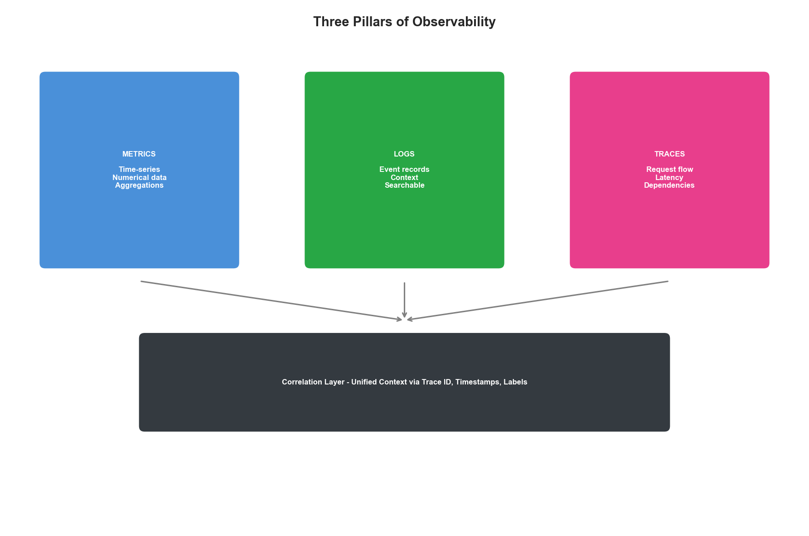
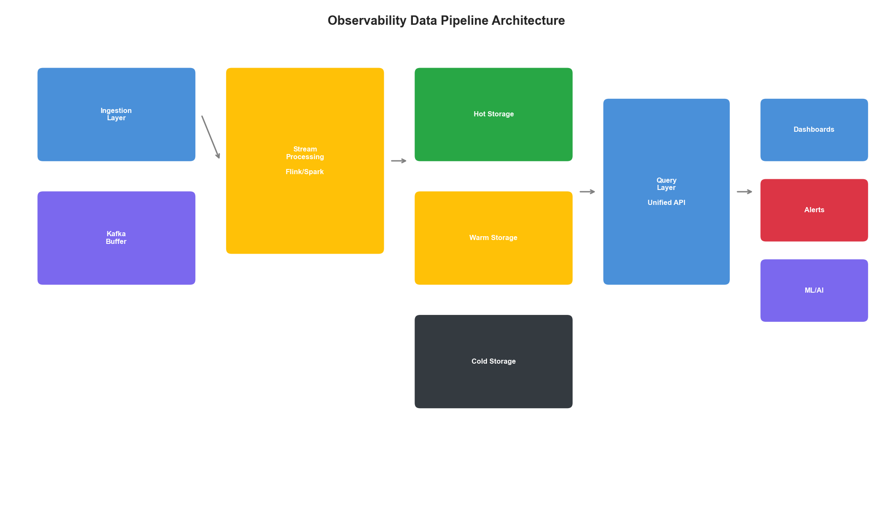
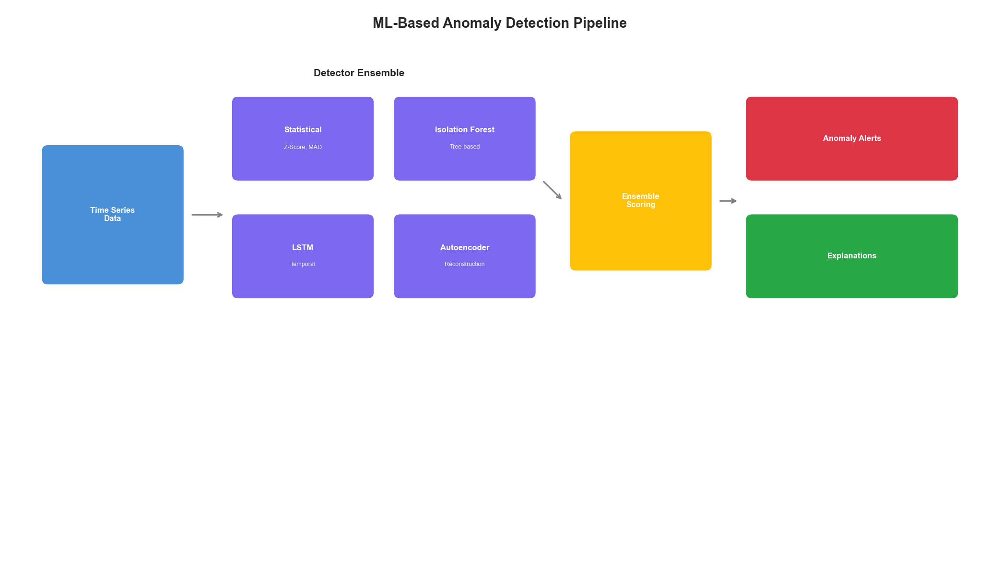

# Chapter 10: Observability and Data Pipelines

## Introduction

Observability is the foundation upon which all intelligent infrastructure optimization is built. Without comprehensive, real-time visibility into system behavior, optimization is guesswork. This chapter explores the architecture, implementation, and best practices for building observability pipelines that power AI-driven infrastructure optimization at enterprise scale.

The three pillars of observability—metrics, logs, and traces—must work together as an integrated system. This chapter shows how to design, implement, and operate these pipelines for maximum optimization value.

## 10.1 The Three Pillars of Observability

### 10.1.1 Metrics: The Quantitative Foundation

Metrics provide time-series numerical data about system behavior:

| Metric Type | Description | Example | Optimization Use |
|-------------|-------------|---------|------------------|
| Counter | Monotonically increasing | request_count | Throughput analysis |
| Gauge | Point-in-time value | memory_usage | Resource utilization |
| Histogram | Distribution of values | response_time | Latency optimization |
| Summary | Pre-calculated percentiles | request_duration | SLA monitoring |

```python
class MetricsPipeline:
    """
    Complete metrics pipeline for optimization.
    """

    def __init__(self, config: MetricsConfig):
        self.collectors = self._init_collectors(config)
        self.processor = MetricsProcessor(config.processing)
        self.storage = MetricsStorage(config.storage)
        self.alerter = MetricsAlerter(config.alerting)

    async def run(self):
        """Main metrics pipeline loop."""
        while True:
            # Collect from all sources
            raw_metrics = await self._collect_all()

            # Process and enrich
            processed = await self.processor.process(raw_metrics)

            # Store for querying
            await self.storage.write(processed)

            # Check alert conditions
            alerts = await self.alerter.check(processed)
            if alerts:
                await self._emit_alerts(alerts)

            await asyncio.sleep(self.config.scrape_interval)

    async def _collect_all(self) -> list[RawMetric]:
        """Collect metrics from all configured collectors."""
        tasks = [c.collect() for c in self.collectors]
        results = await asyncio.gather(*tasks, return_exceptions=True)

        metrics = []
        for result, collector in zip(results, self.collectors):
            if isinstance(result, Exception):
                self.logger.warning(
                    f"Collection failed for {collector.name}",
                    error=str(result)
                )
                # Record collection failure as metric
                metrics.append(RawMetric(
                    name="collector_error_total",
                    value=1,
                    labels={"collector": collector.name}
                ))
            else:
                metrics.extend(result)

        return metrics
```


**Figure 10.1: Enterprise Metrics Pipeline Architecture**

### 10.1.2 Logs: The Narrative Record

Logs provide detailed contextual information about system events:

```python
class LogPipeline:
    """
    Structured log processing pipeline.
    """

    def __init__(self, config: LogConfig):
        self.ingester = LogIngester(config.ingestion)
        self.parser = LogParser(config.parsing)
        self.enricher = LogEnricher(config.enrichment)
        self.indexer = LogIndexer(config.indexing)

    async def process_batch(self, logs: list[RawLog]) -> list[ProcessedLog]:
        """Process a batch of logs."""
        processed = []

        for log in logs:
            # Parse structure from log line
            parsed = self.parser.parse(log.message)

            # Enrich with context
            enriched = await self.enricher.enrich(
                parsed,
                source=log.source,
                timestamp=log.timestamp
            )

            # Extract optimization-relevant fields
            optimization_data = self._extract_optimization_data(enriched)

            processed.append(ProcessedLog(
                raw=log,
                parsed=parsed,
                enriched=enriched,
                optimization_data=optimization_data,
                searchable_text=self._create_searchable(enriched)
            ))

        # Index for search
        await self.indexer.index(processed)

        return processed

    def _extract_optimization_data(self, log: dict) -> OptimizationData:
        """Extract data useful for optimization decisions."""
        return OptimizationData(
            latency_ms=log.get("duration_ms") or log.get("response_time"),
            status_code=log.get("status") or log.get("http_status"),
            error_type=log.get("error_type") or log.get("exception_class"),
            resource_id=log.get("pod") or log.get("instance_id"),
            trace_id=log.get("trace_id"),
            user_id=log.get("user_id"),
            endpoint=log.get("path") or log.get("endpoint")
        )


class LogParser:
    """Multi-format log parser."""

    def __init__(self, config: ParserConfig):
        self.patterns = self._compile_patterns(config.patterns)
        self.json_fields = config.json_fields

    def parse(self, message: str) -> dict:
        """Parse log message into structured data."""
        # Try JSON first
        if message.strip().startswith('{'):
            try:
                return json.loads(message)
            except json.JSONDecodeError:
                pass

        # Try configured patterns
        for name, pattern in self.patterns.items():
            match = pattern.match(message)
            if match:
                return {
                    "_format": name,
                    **match.groupdict()
                }

        # Fallback: extract key=value pairs
        pairs = self._extract_key_value_pairs(message)
        if pairs:
            return {"_format": "key_value", **pairs}

        return {"_format": "raw", "message": message}
```

### 10.1.3 Traces: The Request Journey

Distributed traces show how requests flow through the system:

```python
class TracePipeline:
    """
    Distributed tracing pipeline for optimization.
    """

    def __init__(self, config: TraceConfig):
        self.collector = TraceCollector(config.collection)
        self.processor = TraceProcessor(config.processing)
        self.storage = TraceStorage(config.storage)
        self.analyzer = TraceAnalyzer(config.analysis)

    async def process_spans(self, spans: list[Span]) -> list[Trace]:
        """Process incoming spans into complete traces."""
        # Group spans by trace ID
        by_trace = defaultdict(list)
        for span in spans:
            by_trace[span.trace_id].append(span)

        traces = []
        for trace_id, trace_spans in by_trace.items():
            # Build trace tree
            trace = self._build_trace(trace_id, trace_spans)

            # Analyze for optimization insights
            insights = await self.analyzer.analyze(trace)
            trace.insights = insights

            traces.append(trace)

        # Store traces
        await self.storage.store(traces)

        return traces

    def _build_trace(self, trace_id: str, spans: list[Span]) -> Trace:
        """Build trace tree from spans."""
        # Find root span
        root = next((s for s in spans if s.parent_id is None), None)
        if not root:
            # Orphaned spans - create synthetic root
            root = self._create_synthetic_root(trace_id, spans)

        # Build tree recursively
        self._attach_children(root, spans)

        return Trace(
            trace_id=trace_id,
            root_span=root,
            spans=spans,
            duration_ms=root.duration_ms,
            service_count=len(set(s.service for s in spans)),
            span_count=len(spans)
        )


class TraceAnalyzer:
    """Analyze traces for optimization insights."""

    async def analyze(self, trace: Trace) -> TraceInsights:
        """Extract optimization insights from trace."""
        insights = TraceInsights()

        # Identify bottlenecks
        insights.bottlenecks = self._find_bottlenecks(trace)

        # Identify error patterns
        insights.errors = self._find_errors(trace)

        # Calculate service latency contributions
        insights.latency_breakdown = self._calculate_latency_breakdown(trace)

        # Identify optimization opportunities
        insights.opportunities = self._find_opportunities(trace)

        return insights

    def _find_bottlenecks(self, trace: Trace) -> list[Bottleneck]:
        """Find spans that contribute most to latency."""
        bottlenecks = []

        for span in trace.spans:
            # Calculate exclusive time (time not in child spans)
            child_time = sum(
                c.duration_ms for c in self._get_children(span, trace.spans)
            )
            exclusive_time = span.duration_ms - child_time

            # Flag if significant contribution
            contribution = exclusive_time / trace.duration_ms
            if contribution > 0.2:  # > 20% of trace time
                bottlenecks.append(Bottleneck(
                    span_id=span.span_id,
                    service=span.service,
                    operation=span.operation,
                    exclusive_time_ms=exclusive_time,
                    contribution_pct=contribution * 100
                ))

        return sorted(bottlenecks, key=lambda b: b.contribution_pct, reverse=True)

    def _find_opportunities(self, trace: Trace) -> list[OptimizationOpportunity]:
        """Identify potential optimization opportunities."""
        opportunities = []

        # Check for sequential calls that could be parallel
        sequential = self._find_sequential_siblings(trace)
        if sequential:
            opportunities.append(OptimizationOpportunity(
                type="parallelization",
                description=f"Found {len(sequential)} sequential calls that could be parallelized",
                potential_savings_ms=self._calculate_parallel_savings(sequential)
            ))

        # Check for N+1 query patterns
        db_spans = [s for s in trace.spans if "db" in s.service.lower()]
        if len(db_spans) > 10:
            opportunities.append(OptimizationOpportunity(
                type="n_plus_one",
                description=f"Potential N+1 pattern: {len(db_spans)} database calls",
                potential_savings_ms=sum(s.duration_ms for s in db_spans[1:]) * 0.8
            ))

        return opportunities
```



**Figure 10.2: Integrated Three Pillars of Observability**

## 10.2 Data Pipeline Architecture

### 10.2.1 Ingestion Layer

```python
class UnifiedIngestionLayer:
    """
    Unified ingestion for all observability data.
    """

    def __init__(self, config: IngestionConfig):
        self.kafka = KafkaProducer(config.kafka)
        self.receivers = self._init_receivers(config.receivers)
        self.validator = DataValidator(config.validation)
        self.router = DataRouter(config.routing)

    async def ingest(self, data: ObservabilityData) -> IngestResult:
        """Ingest observability data."""
        # Validate data
        validation = self.validator.validate(data)
        if not validation.valid:
            return IngestResult(
                success=False,
                reason=validation.errors
            )

        # Route to appropriate topic
        topic = self.router.get_topic(data)

        # Serialize and produce
        serialized = self._serialize(data)

        await self.kafka.produce(
            topic=topic,
            key=data.get_partition_key(),
            value=serialized
        )

        return IngestResult(success=True, topic=topic)


class DataValidator:
    """Validate observability data before ingestion."""

    def __init__(self, config: ValidationConfig):
        self.schemas = self._load_schemas(config.schema_path)
        self.required_fields = config.required_fields

    def validate(self, data: ObservabilityData) -> ValidationResult:
        """Validate data against schema and requirements."""
        errors = []

        # Check required fields
        for field in self.required_fields.get(data.type, []):
            if not data.has_field(field):
                errors.append(f"Missing required field: {field}")

        # Validate against schema
        schema = self.schemas.get(data.type)
        if schema:
            schema_errors = self._validate_schema(data, schema)
            errors.extend(schema_errors)

        # Check data quality
        quality_issues = self._check_quality(data)
        errors.extend(quality_issues)

        return ValidationResult(
            valid=len(errors) == 0,
            errors=errors
        )
```

### 10.2.2 Processing Layer

```python
class StreamProcessor:
    """
    Real-time stream processing for observability data.
    """

    def __init__(self, config: ProcessorConfig):
        self.consumer = KafkaConsumer(config.kafka)
        self.processors = self._init_processors(config.processors)
        self.output = OutputManager(config.output)

    async def run(self):
        """Main processing loop."""
        async for message in self.consumer:
            try:
                # Deserialize
                data = self._deserialize(message)

                # Process through pipeline
                result = await self._process(data)

                # Output results
                await self.output.emit(result)

            except Exception as e:
                self.logger.error(
                    "Processing failed",
                    error=str(e),
                    message_offset=message.offset
                )
                await self._handle_error(message, e)

    async def _process(self, data: ObservabilityData) -> ProcessedData:
        """Process data through all applicable processors."""
        result = data

        for processor in self.processors:
            if processor.should_process(result):
                result = await processor.process(result)

        return result


class AggregationProcessor:
    """Aggregate observability data for analysis."""

    def __init__(self, config: AggregationConfig):
        self.windows = config.windows
        self.aggregators = self._init_aggregators(config)
        self.state = WindowState()

    async def process(self, data: ProcessedData) -> AggregatedData:
        """Process data through aggregation windows."""
        results = []

        for window in self.windows:
            # Add to window state
            self.state.add(window.name, data)

            # Check if window is complete
            if self.state.is_complete(window.name, window.duration):
                # Aggregate window data
                window_data = self.state.get_window(window.name)
                aggregated = self._aggregate(window_data, window)

                results.append(aggregated)

                # Clear window
                self.state.clear(window.name)

        return AggregatedData(
            original=data,
            aggregations=results
        )

    def _aggregate(
        self,
        data: list[ProcessedData],
        window: WindowConfig
    ) -> dict:
        """Perform aggregation on window data."""
        result = {
            "window_start": data[0].timestamp,
            "window_end": data[-1].timestamp,
            "count": len(data)
        }

        for agg_config in window.aggregations:
            field = agg_config.field
            values = [d.get_field(field) for d in data if d.has_field(field)]

            if agg_config.type == "avg":
                result[f"{field}_avg"] = np.mean(values)
            elif agg_config.type == "max":
                result[f"{field}_max"] = np.max(values)
            elif agg_config.type == "min":
                result[f"{field}_min"] = np.min(values)
            elif agg_config.type == "p99":
                result[f"{field}_p99"] = np.percentile(values, 99)
            elif agg_config.type == "sum":
                result[f"{field}_sum"] = np.sum(values)

        return result
```

### 10.2.3 Storage Layer

```python
class TieredStorage:
    """
    Tiered storage for observability data.
    """

    def __init__(self, config: StorageConfig):
        self.hot = HotStorage(config.hot)      # Recent data, fast access
        self.warm = WarmStorage(config.warm)    # Older data, compressed
        self.cold = ColdStorage(config.cold)    # Archive, object storage

        self.tier_manager = TierManager(config.tiering)

    async def write(self, data: list[ProcessedData]):
        """Write data to appropriate tier."""
        # Always write to hot tier first
        await self.hot.write(data)

    async def query(
        self,
        query: Query,
        time_range: TimeRange
    ) -> QueryResult:
        """Query across tiers."""
        # Determine which tiers to query
        tiers = self.tier_manager.get_tiers_for_range(time_range)

        # Query each tier
        results = []
        for tier in tiers:
            tier_range = self.tier_manager.get_tier_range(tier, time_range)
            if tier_range:
                tier_result = await self._query_tier(tier, query, tier_range)
                results.extend(tier_result)

        # Merge and return
        return self._merge_results(results, query)

    async def manage_tiers(self):
        """Background task to manage data tiering."""
        while True:
            # Move data from hot to warm
            hot_data = await self.hot.get_aged_data(
                max_age=self.tier_manager.hot_retention
            )
            if hot_data:
                compressed = self._compress(hot_data)
                await self.warm.write(compressed)
                await self.hot.delete(hot_data)

            # Move data from warm to cold
            warm_data = await self.warm.get_aged_data(
                max_age=self.tier_manager.warm_retention
            )
            if warm_data:
                archived = self._archive(warm_data)
                await self.cold.write(archived)
                await self.warm.delete(warm_data)

            await asyncio.sleep(self.tier_manager.check_interval)


class HotStorage:
    """Fast access storage for recent data."""

    def __init__(self, config: HotStorageConfig):
        self.influx = InfluxDBClient(config.influxdb)
        self.retention = config.retention

    async def write(self, data: list[ProcessedData]):
        """Write to InfluxDB."""
        points = [self._to_point(d) for d in data]
        await self.influx.write(points)

    async def query(
        self,
        query: str,
        time_range: TimeRange
    ) -> list[dict]:
        """Execute InfluxDB query."""
        flux_query = self._build_flux_query(query, time_range)
        return await self.influx.query(flux_query)
```



**Figure 10.3: Complete Observability Data Pipeline**

## 10.3 OpenTelemetry Integration

### 10.3.1 Unified Instrumentation

```python
from opentelemetry import trace, metrics
from opentelemetry.sdk.trace import TracerProvider
from opentelemetry.sdk.metrics import MeterProvider
from opentelemetry.exporter.otlp.proto.grpc import (
    trace_exporter,
    metric_exporter
)

class OpenTelemetrySetup:
    """
    Configure OpenTelemetry for comprehensive observability.
    """

    def __init__(self, config: OTelConfig):
        self.config = config
        self._setup_tracing()
        self._setup_metrics()

    def _setup_tracing(self):
        """Configure distributed tracing."""
        # Create trace provider
        provider = TracerProvider(
            resource=self._create_resource()
        )

        # Add OTLP exporter
        exporter = trace_exporter.OTLPSpanExporter(
            endpoint=self.config.otlp_endpoint
        )
        provider.add_span_processor(
            BatchSpanProcessor(exporter)
        )

        # Set as global provider
        trace.set_tracer_provider(provider)

    def _setup_metrics(self):
        """Configure metrics collection."""
        provider = MeterProvider(
            resource=self._create_resource(),
            metric_readers=[
                PeriodicExportingMetricReader(
                    metric_exporter.OTLPMetricExporter(
                        endpoint=self.config.otlp_endpoint
                    ),
                    export_interval_millis=self.config.export_interval
                )
            ]
        )
        metrics.set_meter_provider(provider)

    def _create_resource(self):
        """Create resource with service information."""
        return Resource.create({
            "service.name": self.config.service_name,
            "service.version": self.config.service_version,
            "deployment.environment": self.config.environment
        })


class InstrumentedService:
    """Example of an instrumented service."""

    def __init__(self):
        self.tracer = trace.get_tracer(__name__)
        self.meter = metrics.get_meter(__name__)

        # Create metrics
        self.request_counter = self.meter.create_counter(
            "requests_total",
            description="Total requests"
        )
        self.request_duration = self.meter.create_histogram(
            "request_duration_ms",
            description="Request duration in milliseconds"
        )

    async def handle_request(self, request: Request) -> Response:
        """Handle request with full observability."""
        with self.tracer.start_as_current_span(
            "handle_request",
            attributes={
                "http.method": request.method,
                "http.url": request.url
            }
        ) as span:
            start_time = time.time()

            try:
                # Process request
                response = await self._process(request)

                span.set_attribute("http.status_code", response.status_code)

                return response

            except Exception as e:
                span.record_exception(e)
                span.set_status(Status(StatusCode.ERROR, str(e)))
                raise

            finally:
                duration = (time.time() - start_time) * 1000

                self.request_counter.add(1, {
                    "method": request.method,
                    "status": str(response.status_code)
                })
                self.request_duration.record(duration, {
                    "method": request.method
                })
```

### 10.3.2 Auto-Instrumentation

```python
class AutoInstrumentor:
    """
    Automatic instrumentation for common libraries.
    """

    def __init__(self, config: InstrumentationConfig):
        self.config = config
        self.instrumentors = []

    def instrument_all(self):
        """Apply all configured instrumentations."""
        if self.config.http:
            self._instrument_http()
        if self.config.database:
            self._instrument_database()
        if self.config.redis:
            self._instrument_redis()
        if self.config.kafka:
            self._instrument_kafka()

    def _instrument_http(self):
        """Instrument HTTP clients and servers."""
        from opentelemetry.instrumentation.requests import RequestsInstrumentor
        from opentelemetry.instrumentation.aiohttp import AioHttpClientInstrumentor
        from opentelemetry.instrumentation.fastapi import FastAPIInstrumentor

        RequestsInstrumentor().instrument()
        AioHttpClientInstrumentor().instrument()
        # FastAPI instrumented per-app

    def _instrument_database(self):
        """Instrument database clients."""
        from opentelemetry.instrumentation.sqlalchemy import SQLAlchemyInstrumentor
        from opentelemetry.instrumentation.asyncpg import AsyncPGInstrumentor

        SQLAlchemyInstrumentor().instrument()
        AsyncPGInstrumentor().instrument()

    def _instrument_redis(self):
        """Instrument Redis client."""
        from opentelemetry.instrumentation.redis import RedisInstrumentor
        RedisInstrumentor().instrument()

    def _instrument_kafka(self):
        """Instrument Kafka client."""
        from opentelemetry.instrumentation.kafka import KafkaInstrumentor
        KafkaInstrumentor().instrument()
```

## 10.4 Alerting and Anomaly Detection

### 10.4.1 Multi-Signal Alerting

```python
class AlertingPipeline:
    """
    Alerting pipeline with multi-signal correlation.
    """

    def __init__(self, config: AlertConfig):
        self.rules = AlertRuleEngine(config.rules)
        self.correlator = AlertCorrelator(config.correlation)
        self.notifier = AlertNotifier(config.notification)
        self.suppressor = AlertSuppressor(config.suppression)

    async def process(self, signals: list[Signal]) -> list[Alert]:
        """Process signals and generate alerts."""
        # Evaluate rules
        triggered = []
        for signal in signals:
            matching_rules = self.rules.evaluate(signal)
            for rule in matching_rules:
                triggered.append(Alert(
                    rule=rule,
                    signal=signal,
                    severity=rule.severity,
                    timestamp=datetime.utcnow()
                ))

        if not triggered:
            return []

        # Correlate related alerts
        correlated = await self.correlator.correlate(triggered)

        # Apply suppression
        unsuppressed = await self.suppressor.filter(correlated)

        # Send notifications
        for alert in unsuppressed:
            await self.notifier.notify(alert)

        return unsuppressed


class AlertCorrelator:
    """Correlate related alerts."""

    def __init__(self, config: CorrelationConfig):
        self.time_window = config.time_window
        self.rules = config.correlation_rules

    async def correlate(self, alerts: list[Alert]) -> list[Alert]:
        """Find and correlate related alerts."""
        # Group by time window
        groups = self._group_by_time(alerts, self.time_window)

        correlated = []
        for group in groups:
            if len(group) == 1:
                correlated.append(group[0])
                continue

            # Check correlation rules
            parent = self._find_parent(group)
            if parent:
                # Attach children to parent
                parent.correlated_alerts = [
                    a for a in group if a != parent
                ]
                correlated.append(parent)
            else:
                # No correlation found
                correlated.extend(group)

        return correlated

    def _find_parent(self, alerts: list[Alert]) -> Alert:
        """Find the root cause alert in a group."""
        for rule in self.rules:
            for alert in alerts:
                if rule.matches_parent(alert):
                    children = [
                        a for a in alerts
                        if a != alert and rule.matches_child(a, alert)
                    ]
                    if children:
                        return alert
        return None
```

### 10.4.2 ML-Based Anomaly Detection

```python
class AnomalyDetectionPipeline:
    """
    ML-based anomaly detection for observability data.
    """

    def __init__(self, config: AnomalyConfig):
        self.detectors = self._init_detectors(config)
        self.ensemble = EnsembleDetector(config.ensemble)
        self.explainer = AnomalyExplainer(config.explanation)

    async def detect(self, data: TimeSeriesData) -> list[Anomaly]:
        """Detect anomalies in time series data."""
        # Run all detectors
        detector_results = await asyncio.gather(*[
            d.detect(data) for d in self.detectors
        ])

        # Ensemble scoring
        anomalies = self.ensemble.combine(detector_results)

        # Generate explanations
        for anomaly in anomalies:
            anomaly.explanation = await self.explainer.explain(
                anomaly, data
            )

        return anomalies


class StatisticalDetector:
    """Statistical anomaly detection."""

    def __init__(self, config: StatConfig):
        self.sensitivity = config.sensitivity
        self.window_size = config.window_size

    async def detect(self, data: TimeSeriesData) -> list[DetectorResult]:
        """Detect statistical anomalies."""
        results = []

        for i, value in enumerate(data.values):
            if i < self.window_size:
                continue

            # Calculate rolling statistics
            window = data.values[i-self.window_size:i]
            mean = np.mean(window)
            std = np.std(window)

            # Z-score
            if std > 0:
                z_score = abs(value - mean) / std
            else:
                z_score = 0

            if z_score > self.sensitivity:
                results.append(DetectorResult(
                    index=i,
                    timestamp=data.timestamps[i],
                    score=z_score / self.sensitivity,
                    detector="statistical",
                    details={
                        "z_score": z_score,
                        "expected": mean,
                        "actual": value
                    }
                ))

        return results


class IsolationForestDetector:
    """Isolation Forest anomaly detection."""

    def __init__(self, config: IFConfig):
        self.model = IsolationForest(
            contamination=config.contamination,
            n_estimators=config.n_estimators
        )
        self.trained = False

    async def detect(self, data: TimeSeriesData) -> list[DetectorResult]:
        """Detect anomalies using Isolation Forest."""
        # Prepare features
        features = self._extract_features(data)

        # Train if needed
        if not self.trained:
            self.model.fit(features)
            self.trained = True

        # Predict
        predictions = self.model.predict(features)
        scores = self.model.score_samples(features)

        results = []
        for i, (pred, score) in enumerate(zip(predictions, scores)):
            if pred == -1:  # Anomaly
                results.append(DetectorResult(
                    index=i,
                    timestamp=data.timestamps[i],
                    score=abs(score),
                    detector="isolation_forest",
                    details={"raw_score": score}
                ))

        return results
```



**Figure 10.4: ML-Based Anomaly Detection Pipeline**

## 10.5 Dashboards and Visualization

### 10.5.1 Dashboard Configuration

```yaml
# optimization-dashboard.yaml
dashboard:
  title: "Infrastructure Optimization Dashboard"
  refresh: 30s

  variables:
    - name: service
      type: query
      query: "label_values(up, service)"
    - name: environment
      type: custom
      values: ["production", "staging", "development"]

  rows:
    - title: "Overview"
      panels:
        - title: "PROSE Score"
          type: gauge
          query: |
            avg(prose_score{service="$service", environment="$environment"})
          thresholds:
            - value: 0
              color: red
            - value: 50
              color: yellow
            - value: 80
              color: green

        - title: "Optimization Actions (24h)"
          type: stat
          query: |
            sum(increase(optimization_actions_total{service="$service"}[24h]))

    - title: "Performance"
      panels:
        - title: "Request Latency (p99)"
          type: timeseries
          query: |
            histogram_quantile(0.99,
              rate(request_duration_seconds_bucket{service="$service"}[5m])
            )

        - title: "Error Rate"
          type: timeseries
          query: |
            sum(rate(requests_total{status=~"5.."}[5m]))
            /
            sum(rate(requests_total[5m]))

    - title: "Resources"
      panels:
        - title: "CPU Usage"
          type: timeseries
          query: |
            avg(rate(container_cpu_usage_seconds_total{pod=~"$service.*"}[5m])) by (pod)

        - title: "Memory Usage"
          type: timeseries
          query: |
            avg(container_memory_usage_bytes{pod=~"$service.*"}) by (pod)
            /
            avg(container_spec_memory_limit_bytes{pod=~"$service.*"}) by (pod)
```

### 10.5.2 Real-Time Visualization

```python
class RealTimeDashboard:
    """
    Real-time dashboard for optimization insights.
    """

    def __init__(self, config: DashboardConfig):
        self.metrics_client = MetricsClient(config.metrics)
        self.websocket_server = WebSocketServer(config.websocket)
        self.cache = DashboardCache(config.cache)

    async def start(self):
        """Start real-time dashboard updates."""
        await self.websocket_server.start()

        # Start update loops
        asyncio.create_task(self._update_metrics())
        asyncio.create_task(self._update_alerts())
        asyncio.create_task(self._update_optimization_status())

    async def _update_metrics(self):
        """Push metric updates to connected clients."""
        while True:
            metrics = await self._fetch_current_metrics()

            # Cache for new connections
            await self.cache.set("current_metrics", metrics)

            # Push to all connected clients
            await self.websocket_server.broadcast({
                "type": "metrics_update",
                "data": metrics
            })

            await asyncio.sleep(5)

    async def _fetch_current_metrics(self) -> dict:
        """Fetch current optimization metrics."""
        return {
            "prose_score": await self._get_prose_score(),
            "active_optimizations": await self._get_active_optimizations(),
            "resource_utilization": await self._get_resource_utilization(),
            "cost_savings": await self._get_cost_savings(),
            "recent_actions": await self._get_recent_actions()
        }
```

## Key Takeaways

1. **Three pillars work together** - Metrics, logs, and traces must be correlated for complete observability

2. **Design for scale** - Tiered storage and streaming architectures handle enterprise data volumes

3. **OpenTelemetry is the standard** - Use OpenTelemetry for vendor-neutral, comprehensive instrumentation

4. **Automate instrumentation** - Auto-instrumentation reduces developer burden and ensures consistency

5. **Correlate alerts** - Multi-signal correlation reduces alert fatigue and surfaces root causes

6. **ML enhances detection** - Combine statistical and ML methods for robust anomaly detection

## References

1. Majors, C. et al. "Observability Engineering." O'Reilly Media (2022)
2. Sridharan, C. "Distributed Systems Observability." O'Reilly Media (2018)
3. OpenTelemetry. "OpenTelemetry Specification." CNCF (2024)
4. Prometheus. "Prometheus Documentation." CNCF (2024)
5. Grafana Labs. "Grafana Documentation." (2024)

---

*Next Chapter: Reinforcement Learning and GRPO for Infrastructure*
