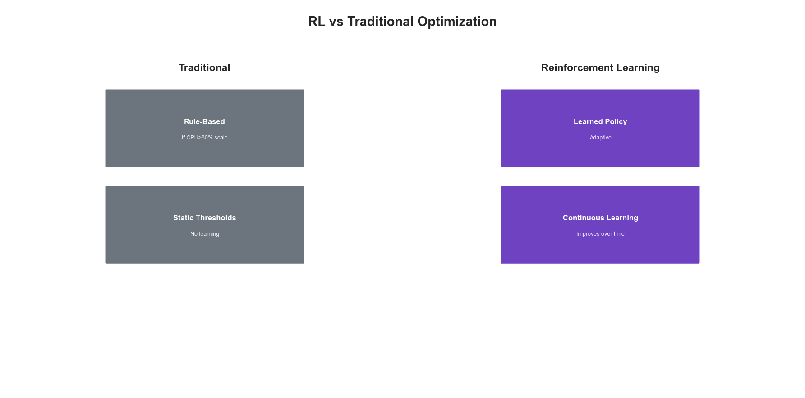
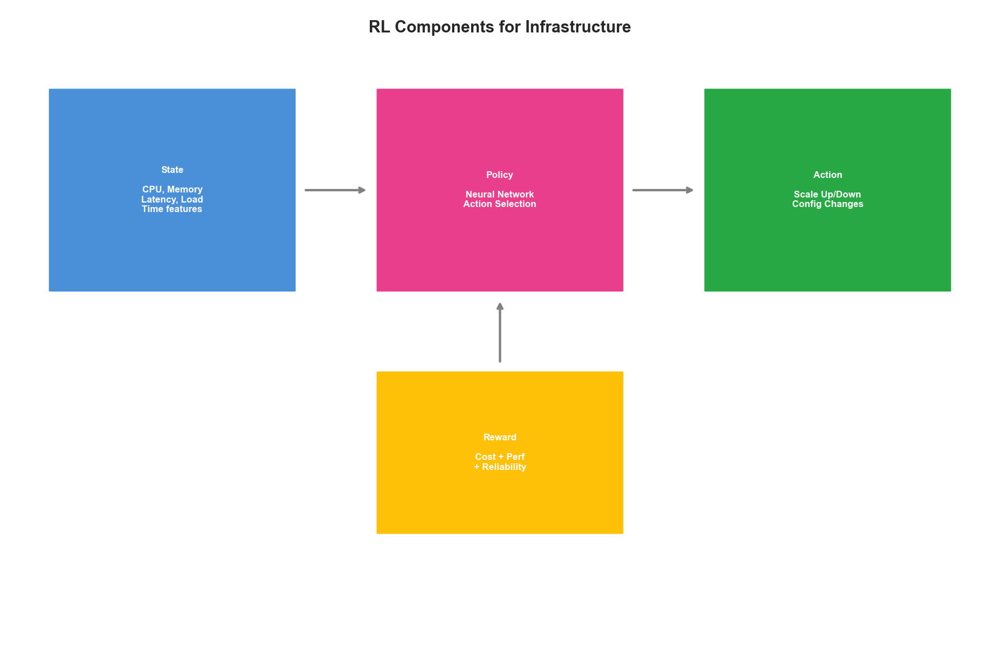
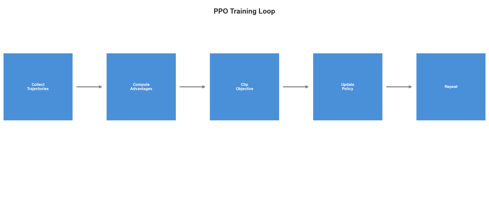
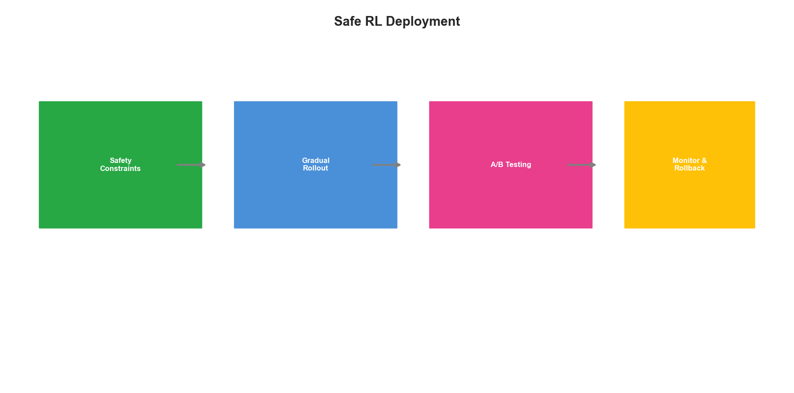

# Chapter 11: Reinforcement Learning for Infrastructure Optimization

## Introduction

Reinforcement Learning (RL) represents a paradigm shift in infrastructure optimization. Unlike supervised learning that requires labeled examples, RL learns optimal policies through interaction with the environment. This chapter introduces RL concepts for infrastructure optimization and provides the foundation for GRPO (Group Relative Policy Optimization), which we'll implement in detail in the next chapter.

Infrastructure optimization is inherently a sequential decision-making problem—the perfect application domain for reinforcement learning.

## 11.1 Why Reinforcement Learning for Infrastructure?

### 11.1.1 The Sequential Decision Problem

Infrastructure management involves continuous decisions with long-term consequences:

| Decision | Immediate Effect | Long-term Impact |
|----------|------------------|------------------|
| Scale up resources | Higher cost | Better user experience, capacity buffer |
| Scale down resources | Lower cost | Risk of performance degradation |
| Migrate workload | Temporary disruption | Better placement, lower latency |
| Update configuration | Restart/reload | Optimized performance |

Traditional rule-based systems struggle with:
- Complex interdependencies between decisions
- Delayed rewards (effects seen hours/days later)
- Dynamic environments where optimal actions change
- Multi-objective tradeoffs (cost vs performance vs reliability)

### 11.1.2 RL Advantage Over Traditional Approaches

```python
class TraditionalOptimizer:
    """Rule-based optimization - limited and brittle."""

    def decide(self, metrics: dict) -> Action:
        # Hard-coded thresholds
        if metrics["cpu_usage"] > 80:
            return Action.SCALE_UP
        elif metrics["cpu_usage"] < 20:
            return Action.SCALE_DOWN
        return Action.NO_OP

    # Problems:
    # - Doesn't consider memory, network, etc.
    # - Doesn't anticipate future load
    # - Doesn't learn from outcomes
    # - Single threshold for all services


class RLOptimizer:
    """RL-based optimization - adaptive and intelligent."""

    def __init__(self):
        self.policy = PolicyNetwork()
        self.value = ValueNetwork()

    def decide(self, state: State) -> Action:
        # Considers full state
        # Learned from experience
        # Anticipates future rewards
        # Adapts to each service's characteristics
        return self.policy.select_action(state)

    def learn(self, trajectory: Trajectory):
        # Continuously improves from outcomes
        self.update_policy(trajectory)
```



**Figure 11.1: Reinforcement Learning vs Traditional Optimization**

## 11.2 RL Fundamentals for Infrastructure

### 11.2.1 The RL Framework

```python
class InfrastructureEnvironment:
    """
    Infrastructure as an RL environment.

    State: Current infrastructure metrics and configuration
    Action: Optimization actions (scale, configure, migrate)
    Reward: Combination of cost, performance, reliability
    """

    def __init__(self, config: EnvironmentConfig):
        self.infrastructure = InfrastructureClient(config.infra)
        self.metrics = MetricsClient(config.metrics)
        self.reward_function = RewardFunction(config.reward)

    def get_state(self) -> State:
        """Get current infrastructure state."""
        metrics = self.metrics.get_current()

        return State(
            # Resource utilization
            cpu_usage=metrics["cpu_usage"],
            memory_usage=metrics["memory_usage"],
            network_io=metrics["network_io"],
            disk_io=metrics["disk_io"],

            # Performance metrics
            request_latency_p50=metrics["latency_p50"],
            request_latency_p99=metrics["latency_p99"],
            error_rate=metrics["error_rate"],
            throughput=metrics["throughput"],

            # Capacity
            current_replicas=metrics["replicas"],
            pending_requests=metrics["queue_depth"],

            # Context
            time_of_day=self._get_time_features(),
            day_of_week=self._get_day_features(),

            # Historical
            cpu_trend=self._compute_trend("cpu_usage"),
            latency_trend=self._compute_trend("latency_p99")
        )

    def step(self, action: Action) -> tuple[State, float, bool]:
        """Execute action and return (new_state, reward, done)."""
        # Execute action
        self.infrastructure.execute(action)

        # Wait for effect
        await asyncio.sleep(self.config.action_delay)

        # Get new state
        new_state = self.get_state()

        # Calculate reward
        reward = self.reward_function.calculate(
            previous_state=self.current_state,
            action=action,
            new_state=new_state
        )

        # Update current state
        self.current_state = new_state

        return new_state, reward, False


class RewardFunction:
    """
    Multi-objective reward function for infrastructure optimization.
    """

    def __init__(self, config: RewardConfig):
        self.weights = config.weights
        self.thresholds = config.thresholds

    def calculate(
        self,
        previous_state: State,
        action: Action,
        new_state: State
    ) -> float:
        """Calculate reward for action."""
        reward = 0.0

        # Performance reward
        latency_improvement = (
            previous_state.request_latency_p99 -
            new_state.request_latency_p99
        ) / previous_state.request_latency_p99

        reward += self.weights["performance"] * self._normalize(
            latency_improvement, -0.5, 0.5
        )

        # Cost reward (negative for increased cost)
        cost_change = self._calculate_cost_change(
            previous_state, new_state, action
        )
        reward += self.weights["cost"] * (-cost_change)

        # Reliability reward
        error_improvement = (
            previous_state.error_rate - new_state.error_rate
        )
        reward += self.weights["reliability"] * self._normalize(
            error_improvement, -0.1, 0.1
        )

        # Utilization efficiency
        utilization = new_state.cpu_usage / 100
        efficiency = 1.0 - abs(utilization - self.thresholds["target_utilization"])
        reward += self.weights["efficiency"] * efficiency

        # Penalty for SLA violations
        if new_state.request_latency_p99 > self.thresholds["sla_latency"]:
            reward -= self.weights["sla_penalty"]

        return reward
```

### 11.2.2 State Representation

```python
class StateEncoder:
    """
    Encode infrastructure state for neural network processing.
    """

    def __init__(self, config: EncoderConfig):
        self.normalizers = {}
        self.feature_dim = config.feature_dim

    def encode(self, state: State) -> torch.Tensor:
        """Encode state to feature vector."""
        features = []

        # Normalize numerical features
        numerical = [
            ("cpu_usage", 0, 100),
            ("memory_usage", 0, 100),
            ("network_io", 0, 1e9),
            ("disk_io", 0, 1e8),
            ("request_latency_p50", 0, 1000),
            ("request_latency_p99", 0, 5000),
            ("error_rate", 0, 1),
            ("throughput", 0, 100000),
            ("current_replicas", 1, 100),
            ("pending_requests", 0, 10000)
        ]

        for name, min_val, max_val in numerical:
            value = getattr(state, name)
            normalized = (value - min_val) / (max_val - min_val)
            features.append(np.clip(normalized, 0, 1))

        # Encode time features (cyclical)
        hour = state.time_of_day
        features.append(np.sin(2 * np.pi * hour / 24))
        features.append(np.cos(2 * np.pi * hour / 24))

        day = state.day_of_week
        features.append(np.sin(2 * np.pi * day / 7))
        features.append(np.cos(2 * np.pi * day / 7))

        # Trend features
        features.append(self._encode_trend(state.cpu_trend))
        features.append(self._encode_trend(state.latency_trend))

        return torch.tensor(features, dtype=torch.float32)

    def _encode_trend(self, trend: float) -> float:
        """Encode trend direction and magnitude."""
        return np.tanh(trend)  # Squash to [-1, 1]
```

### 11.2.3 Action Space Design

```python
class ActionSpace:
    """
    Define available infrastructure actions.
    """

    # Discrete actions
    ACTIONS = {
        0: Action("no_op", {}),
        1: Action("scale_up", {"delta": 1}),
        2: Action("scale_up", {"delta": 2}),
        3: Action("scale_down", {"delta": 1}),
        4: Action("scale_down", {"delta": 2}),
        5: Action("increase_cpu_limit", {"delta": 0.5}),
        6: Action("decrease_cpu_limit", {"delta": 0.5}),
        7: Action("increase_memory_limit", {"delta": 256}),
        8: Action("decrease_memory_limit", {"delta": 256}),
    }

    @classmethod
    def get_action(cls, index: int) -> Action:
        return cls.ACTIONS[index]

    @classmethod
    def num_actions(cls) -> int:
        return len(cls.ACTIONS)


class ContinuousActionSpace:
    """
    Continuous action space for fine-grained control.
    """

    def __init__(self, config: ActionConfig):
        self.bounds = config.bounds

    def sample(self) -> np.ndarray:
        """Sample random action."""
        return np.random.uniform(
            low=self.bounds["low"],
            high=self.bounds["high"]
        )

    def clip(self, action: np.ndarray) -> np.ndarray:
        """Clip action to valid bounds."""
        return np.clip(
            action,
            self.bounds["low"],
            self.bounds["high"]
        )

    def to_infrastructure_action(
        self,
        action: np.ndarray
    ) -> InfrastructureAction:
        """Convert continuous action to infrastructure command."""
        return InfrastructureAction(
            replica_delta=int(round(action[0])),
            cpu_limit_delta=action[1],
            memory_limit_delta=int(round(action[2] * 256))
        )
```



**Figure 11.2: RL Components for Infrastructure Optimization**

## 11.3 Policy Gradient Methods

### 11.3.1 REINFORCE Algorithm

```python
class REINFORCEAgent:
    """
    Basic policy gradient agent for infrastructure optimization.
    """

    def __init__(self, config: AgentConfig):
        self.policy = PolicyNetwork(
            input_dim=config.state_dim,
            hidden_dim=config.hidden_dim,
            output_dim=config.action_dim
        )
        self.optimizer = torch.optim.Adam(
            self.policy.parameters(),
            lr=config.learning_rate
        )
        self.gamma = config.gamma

    def select_action(self, state: torch.Tensor) -> tuple[int, torch.Tensor]:
        """Select action using current policy."""
        probs = self.policy(state)
        dist = torch.distributions.Categorical(probs)
        action = dist.sample()
        log_prob = dist.log_prob(action)
        return action.item(), log_prob

    def update(self, trajectory: list[tuple]):
        """Update policy using collected trajectory."""
        # Calculate returns
        returns = self._calculate_returns(trajectory)

        # Calculate loss
        policy_loss = []
        for (state, action, log_prob, reward), G in zip(trajectory, returns):
            policy_loss.append(-log_prob * G)

        loss = torch.stack(policy_loss).sum()

        # Update
        self.optimizer.zero_grad()
        loss.backward()
        self.optimizer.step()

        return loss.item()

    def _calculate_returns(
        self,
        trajectory: list[tuple]
    ) -> list[float]:
        """Calculate discounted returns."""
        rewards = [t[3] for t in trajectory]
        returns = []
        G = 0

        for r in reversed(rewards):
            G = r + self.gamma * G
            returns.insert(0, G)

        # Normalize returns
        returns = torch.tensor(returns)
        returns = (returns - returns.mean()) / (returns.std() + 1e-8)

        return returns.tolist()


class PolicyNetwork(nn.Module):
    """Neural network policy."""

    def __init__(self, input_dim: int, hidden_dim: int, output_dim: int):
        super().__init__()
        self.network = nn.Sequential(
            nn.Linear(input_dim, hidden_dim),
            nn.ReLU(),
            nn.Linear(hidden_dim, hidden_dim),
            nn.ReLU(),
            nn.Linear(hidden_dim, output_dim),
            nn.Softmax(dim=-1)
        )

    def forward(self, state: torch.Tensor) -> torch.Tensor:
        return self.network(state)
```

### 11.3.2 Actor-Critic Methods

```python
class ActorCriticAgent:
    """
    Actor-Critic agent with baseline for variance reduction.
    """

    def __init__(self, config: AgentConfig):
        self.actor = PolicyNetwork(
            input_dim=config.state_dim,
            hidden_dim=config.hidden_dim,
            output_dim=config.action_dim
        )
        self.critic = ValueNetwork(
            input_dim=config.state_dim,
            hidden_dim=config.hidden_dim
        )
        self.actor_optimizer = torch.optim.Adam(
            self.actor.parameters(), lr=config.actor_lr
        )
        self.critic_optimizer = torch.optim.Adam(
            self.critic.parameters(), lr=config.critic_lr
        )
        self.gamma = config.gamma

    def select_action(self, state: torch.Tensor) -> tuple[int, torch.Tensor]:
        """Select action and return log probability."""
        probs = self.actor(state)
        dist = torch.distributions.Categorical(probs)
        action = dist.sample()
        return action.item(), dist.log_prob(action)

    def update(
        self,
        state: torch.Tensor,
        action: int,
        reward: float,
        next_state: torch.Tensor,
        done: bool,
        log_prob: torch.Tensor
    ):
        """Single-step actor-critic update."""
        # Critic update
        value = self.critic(state)
        next_value = self.critic(next_state) if not done else 0
        target = reward + self.gamma * next_value
        advantage = target - value

        critic_loss = F.mse_loss(value, target.detach())
        self.critic_optimizer.zero_grad()
        critic_loss.backward()
        self.critic_optimizer.step()

        # Actor update
        actor_loss = -log_prob * advantage.detach()
        self.actor_optimizer.zero_grad()
        actor_loss.backward()
        self.actor_optimizer.step()

        return actor_loss.item(), critic_loss.item()


class ValueNetwork(nn.Module):
    """Value function approximator."""

    def __init__(self, input_dim: int, hidden_dim: int):
        super().__init__()
        self.network = nn.Sequential(
            nn.Linear(input_dim, hidden_dim),
            nn.ReLU(),
            nn.Linear(hidden_dim, hidden_dim),
            nn.ReLU(),
            nn.Linear(hidden_dim, 1)
        )

    def forward(self, state: torch.Tensor) -> torch.Tensor:
        return self.network(state)
```

## 11.4 Proximal Policy Optimization (PPO)

### 11.4.1 PPO Implementation

```python
class PPOAgent:
    """
    PPO agent for stable infrastructure optimization.

    PPO prevents destructive policy updates through clipping.
    """

    def __init__(self, config: PPOConfig):
        self.actor = PolicyNetwork(
            input_dim=config.state_dim,
            hidden_dim=config.hidden_dim,
            output_dim=config.action_dim
        )
        self.critic = ValueNetwork(
            input_dim=config.state_dim,
            hidden_dim=config.hidden_dim
        )
        self.optimizer = torch.optim.Adam([
            {"params": self.actor.parameters(), "lr": config.actor_lr},
            {"params": self.critic.parameters(), "lr": config.critic_lr}
        ])

        self.clip_epsilon = config.clip_epsilon
        self.gamma = config.gamma
        self.gae_lambda = config.gae_lambda
        self.update_epochs = config.update_epochs
        self.minibatch_size = config.minibatch_size

    def collect_trajectories(
        self,
        env: InfrastructureEnvironment,
        num_steps: int
    ) -> Buffer:
        """Collect trajectories for PPO update."""
        buffer = Buffer()
        state = env.get_state()

        for _ in range(num_steps):
            state_tensor = self.encode_state(state)

            # Get action from current policy
            with torch.no_grad():
                probs = self.actor(state_tensor)
                dist = torch.distributions.Categorical(probs)
                action = dist.sample()
                log_prob = dist.log_prob(action)
                value = self.critic(state_tensor)

            # Execute action
            next_state, reward, done = env.step(
                ActionSpace.get_action(action.item())
            )

            buffer.add(
                state=state_tensor,
                action=action,
                reward=reward,
                value=value,
                log_prob=log_prob,
                done=done
            )

            state = next_state

        return buffer

    def update(self, buffer: Buffer):
        """PPO update with multiple epochs."""
        # Calculate advantages using GAE
        advantages, returns = self._compute_gae(buffer)

        # Normalize advantages
        advantages = (advantages - advantages.mean()) / (advantages.std() + 1e-8)

        # Store old log probs for ratio calculation
        old_log_probs = torch.stack(buffer.log_probs).detach()

        # Multiple update epochs
        for _ in range(self.update_epochs):
            # Shuffle and create minibatches
            indices = torch.randperm(len(buffer))

            for start in range(0, len(buffer), self.minibatch_size):
                end = start + self.minibatch_size
                batch_indices = indices[start:end]

                # Get batch data
                states = torch.stack([buffer.states[i] for i in batch_indices])
                actions = torch.stack([buffer.actions[i] for i in batch_indices])
                old_log_probs_batch = old_log_probs[batch_indices]
                advantages_batch = advantages[batch_indices]
                returns_batch = returns[batch_indices]

                # Calculate new log probs
                probs = self.actor(states)
                dist = torch.distributions.Categorical(probs)
                new_log_probs = dist.log_prob(actions)
                entropy = dist.entropy().mean()

                # Calculate ratio
                ratio = torch.exp(new_log_probs - old_log_probs_batch)

                # Clipped objective
                surr1 = ratio * advantages_batch
                surr2 = torch.clamp(
                    ratio,
                    1 - self.clip_epsilon,
                    1 + self.clip_epsilon
                ) * advantages_batch
                actor_loss = -torch.min(surr1, surr2).mean()

                # Value loss
                values = self.critic(states).squeeze()
                critic_loss = F.mse_loss(values, returns_batch)

                # Total loss
                loss = actor_loss + 0.5 * critic_loss - 0.01 * entropy

                # Update
                self.optimizer.zero_grad()
                loss.backward()
                nn.utils.clip_grad_norm_(
                    list(self.actor.parameters()) +
                    list(self.critic.parameters()),
                    max_norm=0.5
                )
                self.optimizer.step()

    def _compute_gae(self, buffer: Buffer) -> tuple[torch.Tensor, torch.Tensor]:
        """Compute Generalized Advantage Estimation."""
        rewards = torch.tensor(buffer.rewards)
        values = torch.stack(buffer.values).squeeze()
        dones = torch.tensor(buffer.dones, dtype=torch.float32)

        advantages = torch.zeros_like(rewards)
        last_advantage = 0

        for t in reversed(range(len(rewards))):
            if t == len(rewards) - 1:
                next_value = 0
            else:
                next_value = values[t + 1]

            delta = rewards[t] + self.gamma * next_value * (1 - dones[t]) - values[t]
            advantages[t] = delta + self.gamma * self.gae_lambda * (1 - dones[t]) * last_advantage
            last_advantage = advantages[t]

        returns = advantages + values
        return advantages, returns
```



**Figure 11.3: PPO Training Loop for Infrastructure**

## 11.5 Introduction to GRPO

### 11.5.1 From PPO to GRPO

Group Relative Policy Optimization (GRPO) extends PPO for scenarios where:
- Multiple related policies need coordinated optimization
- Relative performance matters more than absolute
- Group dynamics influence individual decisions

```python
class GRPOAgent:
    """
    Group Relative Policy Optimization for infrastructure.

    Key innovations:
    1. Group-aware advantage estimation
    2. Relative reward normalization within groups
    3. Coordinated policy updates
    """

    def __init__(self, config: GRPOConfig):
        self.agents = {
            service: PPOAgent(config.ppo)
            for service in config.services
        }
        self.group_coordinator = GroupCoordinator(config.coordination)
        self.relative_reward = RelativeRewardCalculator(config.reward)

    async def collect_group_trajectories(
        self,
        envs: dict[str, InfrastructureEnvironment],
        num_steps: int
    ) -> dict[str, Buffer]:
        """Collect trajectories for all services in the group."""
        # Collect in parallel
        tasks = {
            service: self.agents[service].collect_trajectories(env, num_steps)
            for service, env in envs.items()
        }

        buffers = {}
        for service, task in tasks.items():
            buffers[service] = await task

        # Calculate relative rewards
        self._apply_relative_rewards(buffers)

        return buffers

    def _apply_relative_rewards(self, buffers: dict[str, Buffer]):
        """Transform rewards to be relative within the group."""
        # Collect all rewards
        all_rewards = []
        for buffer in buffers.values():
            all_rewards.extend(buffer.rewards)

        # Calculate group statistics
        group_mean = np.mean(all_rewards)
        group_std = np.std(all_rewards) + 1e-8

        # Apply relative transformation
        for buffer in buffers.values():
            buffer.rewards = [
                (r - group_mean) / group_std
                for r in buffer.rewards
            ]

    def update_group(self, buffers: dict[str, Buffer]):
        """Coordinated group update."""
        # Calculate group advantage
        group_advantage = self._compute_group_advantage(buffers)

        # Update each agent with group context
        for service, buffer in buffers.items():
            self.agents[service].update(
                buffer,
                group_context=group_advantage
            )

        # Coordinate policies
        self.group_coordinator.align_policies(
            {s: a.actor for s, a in self.agents.items()}
        )
```

### 11.5.2 GRPO Advantages for Infrastructure

| Aspect | PPO | GRPO |
|--------|-----|------|
| Scope | Single service | Multiple related services |
| Rewards | Absolute | Relative to group |
| Coordination | None | Explicit policy alignment |
| Scaling | Linear | Sub-linear (shared learning) |
| Stability | Good | Better (group regularization) |

## 11.6 Safe RL for Production

### 11.6.1 Safety Constraints

```python
class SafeRLAgent:
    """
    RL agent with safety constraints for production.
    """

    def __init__(self, config: SafeRLConfig):
        self.policy_agent = PPOAgent(config.ppo)
        self.safety_critic = SafetyCritic(config.safety)
        self.constraints = config.constraints

    def select_safe_action(
        self,
        state: torch.Tensor
    ) -> tuple[int, torch.Tensor]:
        """Select action that satisfies safety constraints."""
        # Get action distribution from policy
        probs = self.policy_agent.actor(state)

        # Evaluate safety of each action
        safety_scores = []
        for action_idx in range(len(probs)):
            safety = self.safety_critic.evaluate(state, action_idx)
            safety_scores.append(safety)

        # Mask unsafe actions
        safe_mask = torch.tensor([
            s > self.constraints.min_safety
            for s in safety_scores
        ])

        if safe_mask.any():
            # Select from safe actions only
            masked_probs = probs * safe_mask.float()
            masked_probs = masked_probs / masked_probs.sum()
            dist = torch.distributions.Categorical(masked_probs)
        else:
            # No safe actions - choose safest one
            safest = torch.argmax(torch.tensor(safety_scores))
            return safest.item(), torch.tensor(0.0)

        action = dist.sample()
        return action.item(), dist.log_prob(action)


class SafetyCritic(nn.Module):
    """Predict safety of state-action pairs."""

    def __init__(self, config: SafetyConfig):
        super().__init__()
        self.network = nn.Sequential(
            nn.Linear(config.state_dim + config.action_dim, config.hidden_dim),
            nn.ReLU(),
            nn.Linear(config.hidden_dim, config.hidden_dim),
            nn.ReLU(),
            nn.Linear(config.hidden_dim, 1),
            nn.Sigmoid()
        )

    def forward(self, state: torch.Tensor, action: int) -> torch.Tensor:
        action_onehot = F.one_hot(
            torch.tensor(action),
            num_classes=self.action_dim
        )
        combined = torch.cat([state, action_onehot])
        return self.network(combined)
```

### 11.6.2 Gradual Deployment

```python
class GradualDeployment:
    """
    Gradually deploy RL policy with safety checks.
    """

    def __init__(self, config: DeploymentConfig):
        self.rl_agent = RLAgent(config.agent)
        self.baseline_policy = BaselinePolicy(config.baseline)
        self.traffic_ratio = config.initial_ratio
        self.safety_monitor = SafetyMonitor(config.safety)

    async def get_action(self, state: State) -> Action:
        """Get action with gradual RL deployment."""
        if random.random() < self.traffic_ratio:
            # Use RL policy
            action = self.rl_agent.select_action(state)
            source = "rl"
        else:
            # Use baseline policy
            action = self.baseline_policy.select_action(state)
            source = "baseline"

        # Record for comparison
        self.safety_monitor.record(state, action, source)

        return action

    async def update_ratio(self):
        """Update RL traffic ratio based on performance."""
        comparison = self.safety_monitor.compare_performance()

        if comparison["rl_better"] and comparison["rl_safe"]:
            # Increase RL traffic
            self.traffic_ratio = min(1.0, self.traffic_ratio + 0.1)
        elif not comparison["rl_safe"]:
            # Decrease RL traffic
            self.traffic_ratio = max(0.0, self.traffic_ratio - 0.2)
```



**Figure 11.4: Safe RL Deployment Pipeline**

## Key Takeaways

1. **RL fits infrastructure optimization naturally** - Sequential decisions with delayed rewards and complex tradeoffs

2. **State design matters** - Include utilization, performance, capacity, and temporal features

3. **Reward engineering is critical** - Multi-objective rewards balancing cost, performance, and reliability

4. **PPO provides stability** - Clipped objectives prevent destructive updates

5. **GRPO enables coordination** - Group-relative optimization for multi-service environments

6. **Safety first** - Constrained RL and gradual deployment for production safety

## References

1. Sutton, R. and Barto, A. "Reinforcement Learning: An Introduction." MIT Press (2018)
2. Schulman, J. et al. "Proximal Policy Optimization Algorithms." arXiv (2017)
3. DeepMind. "GRPO: Group Relative Policy Optimization." (2024)
4. Achiam, J. "Constrained Policy Optimization." ICML (2017)
5. Google. "Reinforcement Learning for Resource Management." ICML (2017)

---

*Next Chapter: GRPO Implementation Deep Dive*
