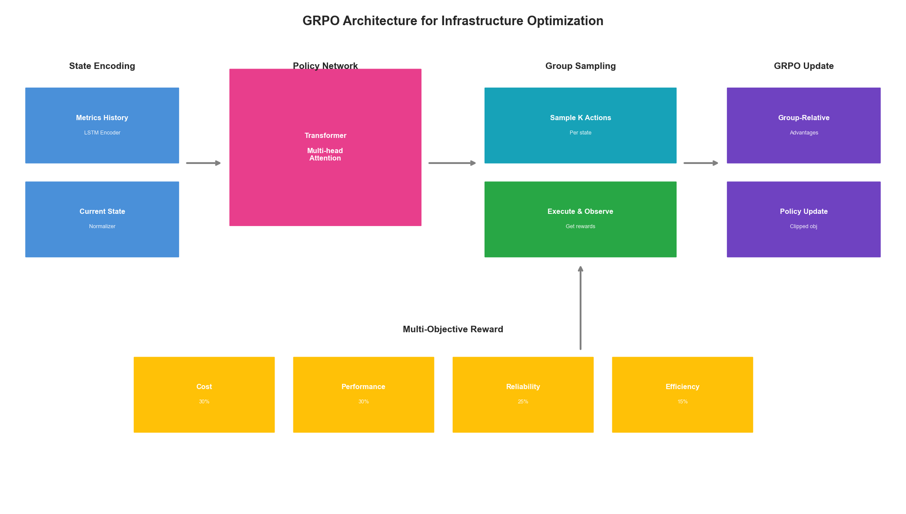
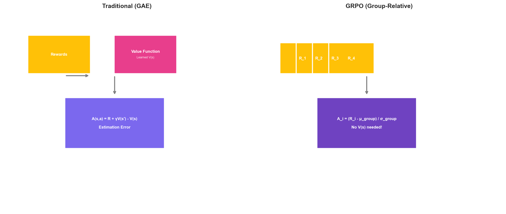
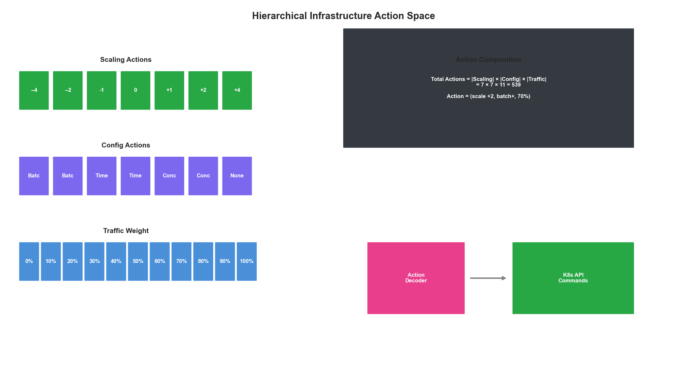
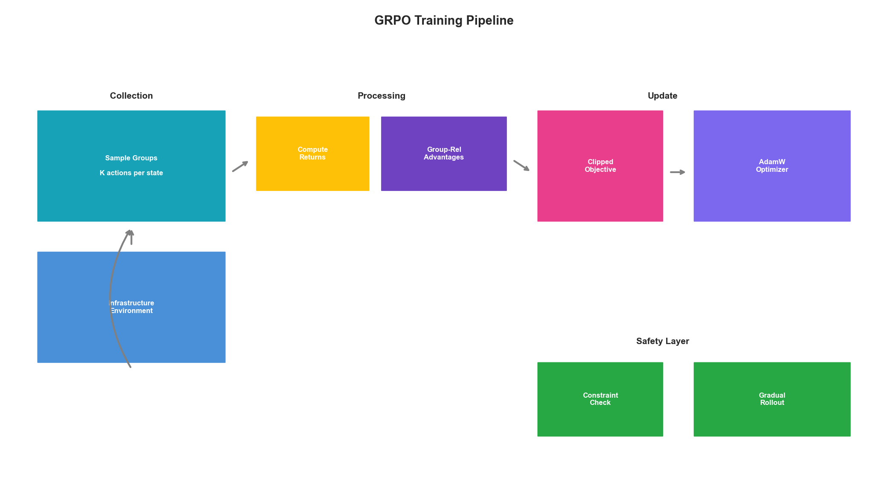

# Chapter 12: GRPO Implementation Deep Dive

## Introduction

Group Relative Policy Optimization (GRPO) represents a significant advancement over traditional reinforcement learning approaches for infrastructure optimization. Building on the foundations established in Chapter 11, this chapter provides a comprehensive implementation guide for deploying GRPO in production infrastructure environments.

GRPO addresses key limitations of standard policy optimization methods by comparing actions within groups rather than against absolute baselines. This approach proves particularly effective for infrastructure optimization where the "correct" action depends heavily on current system state and where reward signals can be noisy.



## Understanding GRPO Mathematics

### The Core GRPO Objective

GRPO modifies the standard policy gradient objective by introducing group-relative comparisons:

```python
import torch
import torch.nn as nn
import torch.nn.functional as F
from dataclasses import dataclass
from typing import List, Tuple, Optional
import numpy as np

@dataclass
class GRPOConfig:
    """Configuration for GRPO training."""
    group_size: int = 8
    clip_epsilon: float = 0.2
    kl_coefficient: float = 0.1
    entropy_coefficient: float = 0.01
    learning_rate: float = 3e-4
    gamma: float = 0.99
    gae_lambda: float = 0.95
    max_grad_norm: float = 0.5
    num_epochs: int = 4
    batch_size: int = 64

class GRPOLoss(nn.Module):
    """
    GRPO loss function with group-relative advantage estimation.

    Key insight: Instead of comparing against a learned baseline,
    GRPO compares actions within groups of sampled trajectories.
    """

    def __init__(self, config: GRPOConfig):
        super().__init__()
        self.config = config

    def compute_group_advantages(
        self,
        rewards: torch.Tensor,  # Shape: (batch, group_size)
        group_mask: Optional[torch.Tensor] = None
    ) -> torch.Tensor:
        """
        Compute advantages relative to group mean.

        This is the core GRPO innovation: advantages are computed
        relative to other samples in the same group.
        """
        # Compute group statistics
        if group_mask is not None:
            masked_rewards = rewards * group_mask
            group_sum = masked_rewards.sum(dim=-1, keepdim=True)
            group_count = group_mask.sum(dim=-1, keepdim=True)
            group_mean = group_sum / group_count.clamp(min=1)

            # Compute variance for normalization
            diff_squared = ((rewards - group_mean) ** 2) * group_mask
            group_var = diff_squared.sum(dim=-1, keepdim=True) / group_count.clamp(min=1)
            group_std = (group_var + 1e-8).sqrt()
        else:
            group_mean = rewards.mean(dim=-1, keepdim=True)
            group_std = rewards.std(dim=-1, keepdim=True) + 1e-8

        # Normalize advantages within group
        advantages = (rewards - group_mean) / group_std
        return advantages

    def forward(
        self,
        log_probs: torch.Tensor,
        old_log_probs: torch.Tensor,
        rewards: torch.Tensor,
        group_indices: torch.Tensor
    ) -> Tuple[torch.Tensor, dict]:
        """
        Compute GRPO loss.

        Args:
            log_probs: Current policy log probabilities
            old_log_probs: Old policy log probabilities
            rewards: Reward values for each action
            group_indices: Indices mapping samples to groups
        """
        # Reshape into groups
        batch_size = log_probs.shape[0]
        num_groups = batch_size // self.config.group_size

        rewards_grouped = rewards.view(num_groups, self.config.group_size)
        log_probs_grouped = log_probs.view(num_groups, self.config.group_size)
        old_log_probs_grouped = old_log_probs.view(num_groups, self.config.group_size)

        # Compute group-relative advantages
        advantages = self.compute_group_advantages(rewards_grouped)
        advantages = advantages.view(-1)  # Flatten back

        # Compute probability ratio
        ratio = torch.exp(log_probs - old_log_probs)

        # Clipped surrogate objective
        clipped_ratio = torch.clamp(
            ratio,
            1 - self.config.clip_epsilon,
            1 + self.config.clip_epsilon
        )

        # GRPO objective
        surrogate1 = ratio * advantages
        surrogate2 = clipped_ratio * advantages
        policy_loss = -torch.min(surrogate1, surrogate2).mean()

        # KL divergence penalty
        kl_div = (old_log_probs - log_probs).mean()
        kl_loss = self.config.kl_coefficient * kl_div

        # Entropy bonus for exploration
        entropy = -(log_probs * torch.exp(log_probs)).mean()
        entropy_loss = -self.config.entropy_coefficient * entropy

        total_loss = policy_loss + kl_loss + entropy_loss

        metrics = {
            'policy_loss': policy_loss.item(),
            'kl_div': kl_div.item(),
            'entropy': entropy.item(),
            'advantage_mean': advantages.mean().item(),
            'advantage_std': advantages.std().item(),
            'ratio_mean': ratio.mean().item()
        }

        return total_loss, metrics
```

### Why Group-Relative Advantages Matter

Traditional RL uses learned value functions to compute advantages, introducing estimation error and training instability. GRPO sidesteps this by using empirical comparisons within groups:

```python
class AdvantageComparison:
    """
    Demonstrates the difference between traditional and GRPO advantages.
    """

    @staticmethod
    def traditional_advantage(
        rewards: np.ndarray,
        values: np.ndarray,  # From learned value function
        gamma: float = 0.99
    ) -> np.ndarray:
        """
        Traditional GAE-style advantages.
        Requires accurate value function estimation.
        """
        advantages = np.zeros_like(rewards)
        last_advantage = 0

        for t in reversed(range(len(rewards))):
            next_value = values[t + 1] if t + 1 < len(values) else 0
            delta = rewards[t] + gamma * next_value - values[t]
            advantages[t] = last_advantage = delta + gamma * 0.95 * last_advantage

        return advantages

    @staticmethod
    def grpo_advantage(
        rewards: np.ndarray,
        group_size: int = 8
    ) -> np.ndarray:
        """
        GRPO group-relative advantages.
        No value function needed - purely empirical.
        """
        # Reshape into groups
        num_samples = len(rewards)
        num_groups = num_samples // group_size
        rewards_grouped = rewards[:num_groups * group_size].reshape(num_groups, group_size)

        # Compute group statistics
        group_means = rewards_grouped.mean(axis=1, keepdims=True)
        group_stds = rewards_grouped.std(axis=1, keepdims=True) + 1e-8

        # Normalize within group
        advantages = (rewards_grouped - group_means) / group_stds

        return advantages.flatten()
```



## Infrastructure-Specific GRPO Implementation

### State Representation for Infrastructure

Effective GRPO requires careful state representation:

```python
from typing import Dict, Any
import numpy as np

class InfrastructureStateEncoder(nn.Module):
    """
    Encodes infrastructure state into policy network input.

    Infrastructure state includes:
    - Resource utilization (CPU, memory, network, disk)
    - Queue depths and latencies
    - Time-based features
    - Historical patterns
    """

    def __init__(
        self,
        num_metrics: int = 20,
        hidden_dim: int = 128,
        history_length: int = 60
    ):
        super().__init__()
        self.history_length = history_length

        # Temporal encoder for time series
        self.temporal_encoder = nn.LSTM(
            input_size=num_metrics,
            hidden_size=hidden_dim,
            num_layers=2,
            batch_first=True,
            dropout=0.1
        )

        # Attention for focusing on relevant time periods
        self.attention = nn.MultiheadAttention(
            embed_dim=hidden_dim,
            num_heads=4,
            batch_first=True
        )

        # Final encoding
        self.encoder = nn.Sequential(
            nn.Linear(hidden_dim * 2, hidden_dim),
            nn.LayerNorm(hidden_dim),
            nn.ReLU(),
            nn.Linear(hidden_dim, hidden_dim)
        )

    def forward(
        self,
        metrics_history: torch.Tensor,  # (batch, time, metrics)
        current_state: torch.Tensor     # (batch, metrics)
    ) -> torch.Tensor:
        # Encode temporal patterns
        temporal_out, (h_n, c_n) = self.temporal_encoder(metrics_history)

        # Apply attention
        attended, _ = self.attention(
            temporal_out, temporal_out, temporal_out
        )

        # Combine with current state
        temporal_summary = attended[:, -1, :]  # Last timestep
        current_encoded = h_n[-1]  # Last layer hidden state

        combined = torch.cat([temporal_summary, current_encoded], dim=-1)
        return self.encoder(combined)


class InfrastructureMetricsNormalizer:
    """
    Normalizes infrastructure metrics for consistent model input.

    Different metrics have vastly different scales:
    - CPU: 0-100%
    - Memory: 0-100%
    - Latency: 0-10000ms
    - Request rate: 0-100000 RPS
    """

    def __init__(self):
        self.metric_ranges = {
            'cpu_percent': (0, 100),
            'memory_percent': (0, 100),
            'network_mbps': (0, 10000),
            'disk_iops': (0, 100000),
            'latency_p50_ms': (0, 1000),
            'latency_p99_ms': (0, 10000),
            'request_rate': (0, 100000),
            'error_rate': (0, 100),
            'queue_depth': (0, 10000),
            'replica_count': (0, 100)
        }

        self.running_stats = {}

    def normalize(
        self,
        metrics: Dict[str, float],
        use_running_stats: bool = True
    ) -> np.ndarray:
        """Normalize metrics to [-1, 1] range."""
        normalized = []

        for name, value in metrics.items():
            if name in self.metric_ranges:
                min_val, max_val = self.metric_ranges[name]
                norm_value = 2 * (value - min_val) / (max_val - min_val) - 1
                norm_value = np.clip(norm_value, -1, 1)
            elif use_running_stats and name in self.running_stats:
                mean, std = self.running_stats[name]
                norm_value = (value - mean) / (std + 1e-8)
                norm_value = np.clip(norm_value, -3, 3) / 3
            else:
                # Fallback: log transform for unknown metrics
                norm_value = np.sign(value) * np.log1p(np.abs(value)) / 10

            normalized.append(norm_value)

        return np.array(normalized, dtype=np.float32)
```

### Action Space Design

Infrastructure actions require careful discretization:

```python
from enum import Enum
from typing import List

class ScalingAction(Enum):
    """Discrete scaling actions."""
    SCALE_DOWN_LARGE = -4
    SCALE_DOWN_MEDIUM = -2
    SCALE_DOWN_SMALL = -1
    MAINTAIN = 0
    SCALE_UP_SMALL = 1
    SCALE_UP_MEDIUM = 2
    SCALE_UP_LARGE = 4

class ConfigAction(Enum):
    """Configuration tuning actions."""
    DECREASE_BATCH_SIZE = 0
    INCREASE_BATCH_SIZE = 1
    DECREASE_TIMEOUT = 2
    INCREASE_TIMEOUT = 3
    DECREASE_CONCURRENCY = 4
    INCREASE_CONCURRENCY = 5
    NO_CHANGE = 6

class InfrastructureActionSpace:
    """
    Defines the action space for infrastructure optimization.

    Actions are hierarchical:
    1. Resource scaling (replicas, instance types)
    2. Configuration tuning (batch sizes, timeouts)
    3. Traffic management (routing weights)
    """

    def __init__(
        self,
        scaling_actions: List[ScalingAction] = None,
        config_actions: List[ConfigAction] = None,
        enable_traffic_actions: bool = True
    ):
        self.scaling_actions = scaling_actions or list(ScalingAction)
        self.config_actions = config_actions or list(ConfigAction)
        self.enable_traffic_actions = enable_traffic_actions

        # Compute total action space size
        self.num_scaling = len(self.scaling_actions)
        self.num_config = len(self.config_actions)
        self.num_traffic = 11 if enable_traffic_actions else 0  # 0-100% in 10% steps

        self.total_actions = self.num_scaling * self.num_config
        if enable_traffic_actions:
            self.total_actions *= self.num_traffic

    def decode_action(self, action_idx: int) -> Dict[str, Any]:
        """Convert action index to infrastructure commands."""
        if self.enable_traffic_actions:
            traffic_idx = action_idx % self.num_traffic
            action_idx //= self.num_traffic
            traffic_weight = traffic_idx * 10  # 0-100%
        else:
            traffic_weight = None

        config_idx = action_idx % self.num_config
        scaling_idx = action_idx // self.num_config

        return {
            'scaling': self.scaling_actions[scaling_idx],
            'config': self.config_actions[config_idx],
            'traffic_weight': traffic_weight
        }

    def encode_action(
        self,
        scaling: ScalingAction,
        config: ConfigAction,
        traffic_weight: Optional[int] = None
    ) -> int:
        """Convert infrastructure commands to action index."""
        scaling_idx = self.scaling_actions.index(scaling)
        config_idx = self.config_actions.index(config)

        action_idx = scaling_idx * self.num_config + config_idx

        if self.enable_traffic_actions:
            traffic_idx = traffic_weight // 10 if traffic_weight else 0
            action_idx = action_idx * self.num_traffic + traffic_idx

        return action_idx
```



## Multi-Objective Reward Engineering

### Composite Reward Function

Infrastructure optimization requires balancing multiple objectives:

```python
@dataclass
class RewardWeights:
    """Weights for multi-objective optimization."""
    cost: float = 0.3
    performance: float = 0.3
    reliability: float = 0.25
    efficiency: float = 0.15

class InfrastructureRewardFunction:
    """
    Multi-objective reward function for infrastructure optimization.

    Balances:
    - Cost: Resource expenditure
    - Performance: Latency and throughput
    - Reliability: Error rates and availability
    - Efficiency: Resource utilization
    """

    def __init__(self, weights: RewardWeights = None):
        self.weights = weights or RewardWeights()

        # SLA thresholds
        self.sla = {
            'latency_p99_ms': 200,
            'error_rate_percent': 0.1,
            'availability_percent': 99.9
        }

        # Cost baseline for normalization
        self.cost_baseline = 1000  # $/hour

    def compute_cost_reward(
        self,
        current_cost: float,
        previous_cost: float
    ) -> float:
        """
        Reward for cost reduction.
        Positive when costs decrease, negative when they increase.
        """
        cost_change = (previous_cost - current_cost) / self.cost_baseline

        # Bonus for being under budget
        if current_cost < self.cost_baseline * 0.8:
            cost_change += 0.1

        return np.clip(cost_change, -1, 1)

    def compute_performance_reward(
        self,
        latency_p99: float,
        throughput: float,
        target_throughput: float
    ) -> float:
        """
        Reward for meeting performance targets.
        """
        # Latency component
        latency_ratio = self.sla['latency_p99_ms'] / max(latency_p99, 1)
        latency_reward = np.clip(latency_ratio - 1, -1, 0.5)

        # Throughput component
        throughput_ratio = throughput / max(target_throughput, 1)
        throughput_reward = np.clip(throughput_ratio - 0.9, -1, 0.5)

        return (latency_reward + throughput_reward) / 2

    def compute_reliability_reward(
        self,
        error_rate: float,
        availability: float
    ) -> float:
        """
        Reward for maintaining reliability.
        Heavy penalties for SLA violations.
        """
        # Error rate component
        if error_rate <= self.sla['error_rate_percent']:
            error_reward = 0.5
        else:
            # Exponential penalty for errors
            excess = error_rate - self.sla['error_rate_percent']
            error_reward = -np.exp(excess) + 1

        # Availability component
        if availability >= self.sla['availability_percent']:
            availability_reward = 0.5
        else:
            # Sharp penalty for availability drops
            gap = self.sla['availability_percent'] - availability
            availability_reward = -gap * 10

        return np.clip((error_reward + availability_reward) / 2, -2, 1)

    def compute_efficiency_reward(
        self,
        cpu_utilization: float,
        memory_utilization: float,
        target_utilization: float = 70
    ) -> float:
        """
        Reward for efficient resource utilization.
        Optimal around target utilization.
        """
        avg_utilization = (cpu_utilization + memory_utilization) / 2

        # Gaussian reward centered on target
        efficiency = np.exp(
            -((avg_utilization - target_utilization) ** 2) / (2 * 20 ** 2)
        )

        # Penalty for very low utilization (waste)
        if avg_utilization < 30:
            efficiency -= 0.3

        # Penalty for very high utilization (risk)
        if avg_utilization > 90:
            efficiency -= 0.5

        return np.clip(efficiency, -1, 1)

    def compute_reward(
        self,
        state: Dict[str, float],
        previous_state: Dict[str, float],
        action_taken: Dict[str, Any]
    ) -> Tuple[float, Dict[str, float]]:
        """
        Compute total reward from state transition.
        """
        components = {}

        components['cost'] = self.compute_cost_reward(
            state['cost_per_hour'],
            previous_state['cost_per_hour']
        )

        components['performance'] = self.compute_performance_reward(
            state['latency_p99_ms'],
            state['throughput_rps'],
            state.get('target_throughput', 1000)
        )

        components['reliability'] = self.compute_reliability_reward(
            state['error_rate_percent'],
            state['availability_percent']
        )

        components['efficiency'] = self.compute_efficiency_reward(
            state['cpu_percent'],
            state['memory_percent']
        )

        # Weighted sum
        total_reward = (
            self.weights.cost * components['cost'] +
            self.weights.performance * components['performance'] +
            self.weights.reliability * components['reliability'] +
            self.weights.efficiency * components['efficiency']
        )

        return total_reward, components
```

### Reward Shaping for Stable Training

```python
class RewardShaper:
    """
    Applies reward shaping for stable GRPO training.
    """

    def __init__(
        self,
        gamma: float = 0.99,
        clip_range: Tuple[float, float] = (-10, 10)
    ):
        self.gamma = gamma
        self.clip_range = clip_range
        self.reward_history = []
        self.running_mean = 0
        self.running_std = 1

    def shape(
        self,
        reward: float,
        potential_current: float,
        potential_next: float
    ) -> float:
        """
        Apply potential-based reward shaping.

        F(s, s') = gamma * phi(s') - phi(s)

        This preserves optimal policy while providing
        denser learning signal.
        """
        shaping = self.gamma * potential_next - potential_current
        shaped_reward = reward + shaping

        # Update running statistics
        self.reward_history.append(shaped_reward)
        if len(self.reward_history) > 1000:
            self.reward_history.pop(0)

        self.running_mean = np.mean(self.reward_history)
        self.running_std = np.std(self.reward_history) + 1e-8

        # Normalize
        normalized = (shaped_reward - self.running_mean) / self.running_std

        return np.clip(normalized, *self.clip_range)

    @staticmethod
    def compute_potential(state: Dict[str, float]) -> float:
        """
        Compute potential function for shaping.

        Higher potential = closer to desired state
        """
        # Optimal state: low latency, high throughput, moderate utilization
        latency_potential = -state['latency_p99_ms'] / 1000
        error_potential = -state['error_rate_percent'] * 10

        utilization = (state['cpu_percent'] + state['memory_percent']) / 2
        utilization_potential = -abs(utilization - 70) / 100

        return latency_potential + error_potential + utilization_potential
```

## Policy Network Architecture

### Transformer-Based Policy

```python
class GRPOPolicyNetwork(nn.Module):
    """
    Policy network for infrastructure GRPO.

    Uses transformer architecture for handling
    variable-length state histories and capturing
    long-range dependencies in metrics patterns.
    """

    def __init__(
        self,
        state_dim: int = 128,
        action_dim: int = 49,  # 7 scaling * 7 config actions
        hidden_dim: int = 256,
        num_heads: int = 8,
        num_layers: int = 4,
        dropout: float = 0.1
    ):
        super().__init__()

        self.state_encoder = InfrastructureStateEncoder(
            num_metrics=20,
            hidden_dim=state_dim,
            history_length=60
        )

        # Transformer for sequential decision making
        encoder_layer = nn.TransformerEncoderLayer(
            d_model=state_dim,
            nhead=num_heads,
            dim_feedforward=hidden_dim,
            dropout=dropout,
            batch_first=True
        )
        self.transformer = nn.TransformerEncoder(
            encoder_layer,
            num_layers=num_layers
        )

        # Policy head
        self.policy_head = nn.Sequential(
            nn.Linear(state_dim, hidden_dim),
            nn.LayerNorm(hidden_dim),
            nn.ReLU(),
            nn.Dropout(dropout),
            nn.Linear(hidden_dim, hidden_dim),
            nn.ReLU(),
            nn.Linear(hidden_dim, action_dim)
        )

        # Value head for baseline (optional for GRPO)
        self.value_head = nn.Sequential(
            nn.Linear(state_dim, hidden_dim),
            nn.LayerNorm(hidden_dim),
            nn.ReLU(),
            nn.Linear(hidden_dim, 1)
        )

        self._init_weights()

    def _init_weights(self):
        """Initialize weights with orthogonal initialization."""
        for module in self.modules():
            if isinstance(module, nn.Linear):
                nn.init.orthogonal_(module.weight, gain=np.sqrt(2))
                if module.bias is not None:
                    nn.init.zeros_(module.bias)

    def forward(
        self,
        metrics_history: torch.Tensor,
        current_state: torch.Tensor
    ) -> Tuple[torch.Tensor, torch.Tensor]:
        """
        Forward pass returning action logits and value estimate.
        """
        # Encode state
        state_encoding = self.state_encoder(metrics_history, current_state)

        # Add batch dimension for transformer if needed
        if state_encoding.dim() == 2:
            state_encoding = state_encoding.unsqueeze(1)

        # Transform
        transformed = self.transformer(state_encoding)
        features = transformed[:, -1, :]  # Use last position

        # Get action distribution and value
        action_logits = self.policy_head(features)
        value = self.value_head(features)

        return action_logits, value

    def get_action(
        self,
        metrics_history: torch.Tensor,
        current_state: torch.Tensor,
        deterministic: bool = False
    ) -> Tuple[int, float]:
        """
        Sample action from policy.
        """
        with torch.no_grad():
            logits, value = self.forward(metrics_history, current_state)

        probs = F.softmax(logits, dim=-1)

        if deterministic:
            action = probs.argmax(dim=-1).item()
        else:
            dist = torch.distributions.Categorical(probs)
            action = dist.sample().item()

        log_prob = F.log_softmax(logits, dim=-1)[0, action].item()

        return action, log_prob
```

## Training Loop Implementation

### Complete GRPO Trainer

```python
from collections import deque
import logging

class GRPOTrainer:
    """
    Complete GRPO training implementation for infrastructure optimization.
    """

    def __init__(
        self,
        policy: GRPOPolicyNetwork,
        config: GRPOConfig,
        action_space: InfrastructureActionSpace,
        reward_fn: InfrastructureRewardFunction,
        device: str = 'cuda'
    ):
        self.policy = policy.to(device)
        self.config = config
        self.action_space = action_space
        self.reward_fn = reward_fn
        self.device = device

        self.optimizer = torch.optim.AdamW(
            policy.parameters(),
            lr=config.learning_rate,
            weight_decay=0.01
        )

        self.scheduler = torch.optim.lr_scheduler.CosineAnnealingLR(
            self.optimizer,
            T_max=10000,
            eta_min=1e-6
        )

        self.grpo_loss = GRPOLoss(config)

        # Experience buffer organized by groups
        self.experience_buffer = []
        self.group_buffer = []

        # Logging
        self.logger = logging.getLogger('GRPOTrainer')
        self.metrics_history = deque(maxlen=1000)

    def collect_experience(
        self,
        env,  # Infrastructure environment
        num_steps: int = 1024
    ) -> List[Dict]:
        """
        Collect experience for training.

        Groups trajectories for GRPO advantage computation.
        """
        experiences = []
        current_group = []

        state = env.reset()

        for step in range(num_steps):
            # Get action from policy
            metrics_history = torch.FloatTensor(
                state['metrics_history']
            ).unsqueeze(0).to(self.device)
            current_metrics = torch.FloatTensor(
                state['current_metrics']
            ).unsqueeze(0).to(self.device)

            action_idx, log_prob = self.policy.get_action(
                metrics_history, current_metrics
            )
            action = self.action_space.decode_action(action_idx)

            # Execute action
            next_state, info = env.step(action)

            # Compute reward
            reward, reward_components = self.reward_fn.compute_reward(
                next_state, state, action
            )

            # Store experience
            experience = {
                'state': state,
                'action': action_idx,
                'log_prob': log_prob,
                'reward': reward,
                'reward_components': reward_components,
                'next_state': next_state,
                'done': info.get('done', False)
            }

            current_group.append(experience)

            # Complete group when full
            if len(current_group) == self.config.group_size:
                experiences.extend(current_group)
                self.group_buffer.append(current_group)
                current_group = []

            state = next_state

            if info.get('done', False):
                state = env.reset()

        return experiences

    def compute_returns_and_advantages(
        self,
        experiences: List[Dict]
    ) -> Tuple[torch.Tensor, torch.Tensor]:
        """
        Compute returns and GRPO group-relative advantages.
        """
        # Extract rewards and organize by groups
        num_groups = len(experiences) // self.config.group_size
        rewards = torch.FloatTensor(
            [exp['reward'] for exp in experiences]
        )

        # Compute discounted returns
        returns = torch.zeros_like(rewards)
        running_return = 0

        for t in reversed(range(len(rewards))):
            if t % self.config.group_size == self.config.group_size - 1:
                running_return = 0  # Reset at group boundary
            running_return = rewards[t] + self.config.gamma * running_return
            returns[t] = running_return

        # Compute GRPO advantages
        returns_grouped = returns.view(num_groups, self.config.group_size)
        advantages = self.grpo_loss.compute_group_advantages(returns_grouped)
        advantages = advantages.view(-1)

        return returns, advantages

    def update_policy(
        self,
        experiences: List[Dict],
        returns: torch.Tensor,
        advantages: torch.Tensor
    ) -> Dict[str, float]:
        """
        Perform GRPO policy update.
        """
        # Prepare batch data
        batch_size = len(experiences)

        # Convert experiences to tensors
        states_history = torch.stack([
            torch.FloatTensor(exp['state']['metrics_history'])
            for exp in experiences
        ]).to(self.device)

        states_current = torch.stack([
            torch.FloatTensor(exp['state']['current_metrics'])
            for exp in experiences
        ]).to(self.device)

        actions = torch.LongTensor(
            [exp['action'] for exp in experiences]
        ).to(self.device)

        old_log_probs = torch.FloatTensor(
            [exp['log_prob'] for exp in experiences]
        ).to(self.device)

        advantages = advantages.to(self.device)
        returns = returns.to(self.device)

        # Training epochs
        total_metrics = {
            'policy_loss': 0,
            'value_loss': 0,
            'entropy': 0,
            'kl_div': 0
        }

        for epoch in range(self.config.num_epochs):
            # Shuffle within groups (preserve group structure)
            indices = self._get_shuffled_group_indices(batch_size)

            for start in range(0, batch_size, self.config.batch_size):
                end = min(start + self.config.batch_size, batch_size)
                batch_indices = indices[start:end]

                # Get batch
                batch_history = states_history[batch_indices]
                batch_current = states_current[batch_indices]
                batch_actions = actions[batch_indices]
                batch_old_log_probs = old_log_probs[batch_indices]
                batch_advantages = advantages[batch_indices]
                batch_returns = returns[batch_indices]

                # Forward pass
                logits, values = self.policy(batch_history, batch_current)

                # Compute log probs for taken actions
                log_probs = F.log_softmax(logits, dim=-1)
                action_log_probs = log_probs.gather(
                    1, batch_actions.unsqueeze(-1)
                ).squeeze(-1)

                # Policy loss (GRPO objective)
                ratio = torch.exp(action_log_probs - batch_old_log_probs)
                clipped_ratio = torch.clamp(
                    ratio,
                    1 - self.config.clip_epsilon,
                    1 + self.config.clip_epsilon
                )

                policy_loss = -torch.min(
                    ratio * batch_advantages,
                    clipped_ratio * batch_advantages
                ).mean()

                # Value loss
                value_loss = F.mse_loss(values.squeeze(-1), batch_returns)

                # Entropy bonus
                probs = F.softmax(logits, dim=-1)
                entropy = -(probs * log_probs).sum(dim=-1).mean()

                # KL divergence
                kl_div = (batch_old_log_probs - action_log_probs).mean()

                # Total loss
                loss = (
                    policy_loss +
                    0.5 * value_loss -
                    self.config.entropy_coefficient * entropy +
                    self.config.kl_coefficient * kl_div
                )

                # Backward pass
                self.optimizer.zero_grad()
                loss.backward()
                nn.utils.clip_grad_norm_(
                    self.policy.parameters(),
                    self.config.max_grad_norm
                )
                self.optimizer.step()

                # Accumulate metrics
                total_metrics['policy_loss'] += policy_loss.item()
                total_metrics['value_loss'] += value_loss.item()
                total_metrics['entropy'] += entropy.item()
                total_metrics['kl_div'] += kl_div.item()

        self.scheduler.step()

        # Average metrics
        num_updates = self.config.num_epochs * (batch_size // self.config.batch_size)
        for key in total_metrics:
            total_metrics[key] /= num_updates

        return total_metrics

    def _get_shuffled_group_indices(self, batch_size: int) -> torch.Tensor:
        """Shuffle indices while preserving group structure."""
        num_groups = batch_size // self.config.group_size
        group_order = torch.randperm(num_groups)

        indices = []
        for g in group_order:
            start = g * self.config.group_size
            group_indices = list(range(start, start + self.config.group_size))
            np.random.shuffle(group_indices)
            indices.extend(group_indices)

        return torch.LongTensor(indices)

    def train(
        self,
        env,
        total_steps: int = 1000000,
        eval_interval: int = 10000,
        save_interval: int = 50000
    ):
        """
        Main training loop.
        """
        self.logger.info("Starting GRPO training...")

        steps_completed = 0
        best_reward = float('-inf')

        while steps_completed < total_steps:
            # Collect experience
            experiences = self.collect_experience(env, num_steps=2048)

            # Compute returns and advantages
            returns, advantages = self.compute_returns_and_advantages(experiences)

            # Update policy
            metrics = self.update_policy(experiences, returns, advantages)

            steps_completed += len(experiences)

            # Logging
            mean_reward = np.mean([exp['reward'] for exp in experiences])
            self.metrics_history.append({
                'step': steps_completed,
                'mean_reward': mean_reward,
                **metrics
            })

            self.logger.info(
                f"Step {steps_completed}: "
                f"reward={mean_reward:.3f}, "
                f"policy_loss={metrics['policy_loss']:.4f}, "
                f"entropy={metrics['entropy']:.4f}"
            )

            # Evaluation
            if steps_completed % eval_interval == 0:
                eval_reward = self.evaluate(env)
                self.logger.info(f"Evaluation reward: {eval_reward:.3f}")

                if eval_reward > best_reward:
                    best_reward = eval_reward
                    self.save_checkpoint('best_model.pt')

            # Periodic save
            if steps_completed % save_interval == 0:
                self.save_checkpoint(f'checkpoint_{steps_completed}.pt')

    def evaluate(
        self,
        env,
        num_episodes: int = 10
    ) -> float:
        """Evaluate policy performance."""
        self.policy.eval()
        total_reward = 0

        for _ in range(num_episodes):
            state = env.reset()
            episode_reward = 0
            done = False

            while not done:
                metrics_history = torch.FloatTensor(
                    state['metrics_history']
                ).unsqueeze(0).to(self.device)
                current_metrics = torch.FloatTensor(
                    state['current_metrics']
                ).unsqueeze(0).to(self.device)

                action_idx, _ = self.policy.get_action(
                    metrics_history, current_metrics, deterministic=True
                )
                action = self.action_space.decode_action(action_idx)

                state, info = env.step(action)
                reward, _ = self.reward_fn.compute_reward(
                    state, state, action
                )
                episode_reward += reward
                done = info.get('done', False)

            total_reward += episode_reward

        self.policy.train()
        return total_reward / num_episodes

    def save_checkpoint(self, path: str):
        """Save model checkpoint."""
        torch.save({
            'policy_state_dict': self.policy.state_dict(),
            'optimizer_state_dict': self.optimizer.state_dict(),
            'scheduler_state_dict': self.scheduler.state_dict(),
            'config': self.config
        }, path)

    def load_checkpoint(self, path: str):
        """Load model checkpoint."""
        checkpoint = torch.load(path, map_location=self.device)
        self.policy.load_state_dict(checkpoint['policy_state_dict'])
        self.optimizer.load_state_dict(checkpoint['optimizer_state_dict'])
        self.scheduler.load_state_dict(checkpoint['scheduler_state_dict'])
```



## Production Deployment

### Safe Deployment Strategy

```python
from typing import Callable
from datetime import datetime, timedelta

class SafeGRPODeployment:
    """
    Safe deployment wrapper for GRPO policies in production.

    Implements:
    - Shadow mode evaluation
    - Gradual rollout
    - Automatic rollback
    - Action filtering
    """

    def __init__(
        self,
        policy: GRPOPolicyNetwork,
        action_space: InfrastructureActionSpace,
        safety_constraints: Dict[str, Callable]
    ):
        self.policy = policy
        self.action_space = action_space
        self.safety_constraints = safety_constraints

        # Deployment state
        self.deployment_mode = 'shadow'  # shadow, gradual, full
        self.rollout_percentage = 0.0
        self.deployment_start = None

        # Safety metrics
        self.action_history = deque(maxlen=1000)
        self.violation_count = 0
        self.rollback_triggered = False

    def set_deployment_mode(self, mode: str, rollout_pct: float = 0.0):
        """Set deployment mode and rollout percentage."""
        if mode not in ['shadow', 'gradual', 'full']:
            raise ValueError(f"Unknown mode: {mode}")

        self.deployment_mode = mode
        self.rollout_percentage = rollout_pct
        self.deployment_start = datetime.now()

    def get_action(
        self,
        state: Dict[str, Any],
        fallback_action: Dict[str, Any]
    ) -> Tuple[Dict[str, Any], Dict[str, Any]]:
        """
        Get action with safety checks and deployment controls.

        Returns:
            Tuple of (action_to_execute, policy_action_for_logging)
        """
        # Get policy action
        metrics_history = torch.FloatTensor(
            state['metrics_history']
        ).unsqueeze(0)
        current_metrics = torch.FloatTensor(
            state['current_metrics']
        ).unsqueeze(0)

        action_idx, log_prob = self.policy.get_action(
            metrics_history, current_metrics
        )
        policy_action = self.action_space.decode_action(action_idx)

        # Check safety constraints
        is_safe, violations = self._check_safety(policy_action, state)

        if not is_safe:
            self.violation_count += 1
            self._log_violation(policy_action, violations)

            # Use safe fallback
            policy_action = self._get_safe_alternative(
                policy_action, state, fallback_action
            )

        # Determine what to execute based on mode
        if self.deployment_mode == 'shadow':
            # Log policy action but execute fallback
            execute_action = fallback_action

        elif self.deployment_mode == 'gradual':
            # Probabilistic execution
            if np.random.random() < self.rollout_percentage:
                execute_action = policy_action
            else:
                execute_action = fallback_action

        else:  # full
            execute_action = policy_action

        # Record action
        self.action_history.append({
            'timestamp': datetime.now(),
            'policy_action': policy_action,
            'executed_action': execute_action,
            'was_safe': is_safe,
            'mode': self.deployment_mode
        })

        # Check for automatic rollback
        self._check_rollback_conditions()

        return execute_action, policy_action

    def _check_safety(
        self,
        action: Dict[str, Any],
        state: Dict[str, Any]
    ) -> Tuple[bool, List[str]]:
        """Check if action satisfies all safety constraints."""
        violations = []

        for name, constraint_fn in self.safety_constraints.items():
            try:
                if not constraint_fn(action, state):
                    violations.append(name)
            except Exception as e:
                violations.append(f"{name}: {str(e)}")

        return len(violations) == 0, violations

    def _get_safe_alternative(
        self,
        unsafe_action: Dict[str, Any],
        state: Dict[str, Any],
        fallback: Dict[str, Any]
    ) -> Dict[str, Any]:
        """Find a safe alternative action."""
        # Try progressively less aggressive versions
        scaling_order = [
            ScalingAction.MAINTAIN,
            ScalingAction.SCALE_UP_SMALL,
            ScalingAction.SCALE_DOWN_SMALL
        ]

        for scaling in scaling_order:
            candidate = {
                'scaling': scaling,
                'config': ConfigAction.NO_CHANGE,
                'traffic_weight': unsafe_action.get('traffic_weight')
            }

            is_safe, _ = self._check_safety(candidate, state)
            if is_safe:
                return candidate

        return fallback

    def _check_rollback_conditions(self):
        """Check if automatic rollback should trigger."""
        if self.rollback_triggered:
            return

        # Check violation rate
        recent_actions = list(self.action_history)[-100:]
        if len(recent_actions) >= 100:
            violation_rate = sum(
                1 for a in recent_actions if not a['was_safe']
            ) / len(recent_actions)

            if violation_rate > 0.1:  # 10% violation threshold
                self._trigger_rollback("High violation rate")

        # Check time since deployment
        if self.deployment_start:
            deployment_duration = datetime.now() - self.deployment_start

            # If in gradual mode for >1 hour without issues, increase rollout
            if (self.deployment_mode == 'gradual' and
                deployment_duration > timedelta(hours=1) and
                self.violation_count == 0):
                self._increase_rollout()

    def _trigger_rollback(self, reason: str):
        """Trigger automatic rollback to shadow mode."""
        self.rollback_triggered = True
        self.deployment_mode = 'shadow'
        self.rollout_percentage = 0.0

        # Alert operations team
        logging.critical(f"GRPO rollback triggered: {reason}")

    def _increase_rollout(self):
        """Gradually increase rollout percentage."""
        new_pct = min(self.rollout_percentage + 0.1, 1.0)
        self.rollout_percentage = new_pct
        self.deployment_start = datetime.now()

        if new_pct >= 1.0:
            self.deployment_mode = 'full'

        logging.info(f"Increased rollout to {new_pct * 100:.0f}%")


# Example safety constraints
def max_scaling_constraint(action: Dict, state: Dict) -> bool:
    """Prevent scaling more than 50% at once."""
    current_replicas = state.get('replica_count', 1)
    scaling = action['scaling'].value
    new_replicas = current_replicas + scaling

    max_change = max(current_replicas * 0.5, 2)
    return abs(scaling) <= max_change

def min_replicas_constraint(action: Dict, state: Dict) -> bool:
    """Ensure minimum replica count."""
    current_replicas = state.get('replica_count', 1)
    scaling = action['scaling'].value
    new_replicas = current_replicas + scaling

    return new_replicas >= 2

def rate_limit_constraint(action: Dict, state: Dict) -> bool:
    """Prevent rapid successive scaling."""
    last_scale_time = state.get('last_scale_time')
    if last_scale_time is None:
        return True

    min_interval = timedelta(minutes=5)
    return datetime.now() - last_scale_time >= min_interval
```

## Key Takeaways

1. **GRPO Advantage**: Group-relative advantages eliminate value function estimation error
2. **State Representation**: Proper encoding of infrastructure metrics is critical
3. **Multi-Objective Rewards**: Balance cost, performance, reliability, and efficiency
4. **Safety First**: Deploy with shadow mode, gradual rollout, and automatic rollback
5. **Group Structure**: Maintain group boundaries during training for valid advantage estimates

GRPO provides a robust foundation for infrastructure optimization by leveraging empirical comparisons rather than learned baselines. Combined with proper safety constraints and gradual deployment strategies, it enables autonomous infrastructure management with minimal risk.
