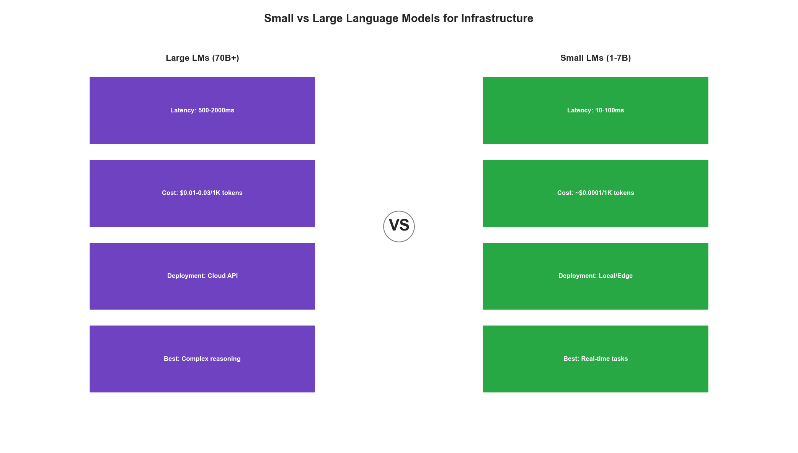
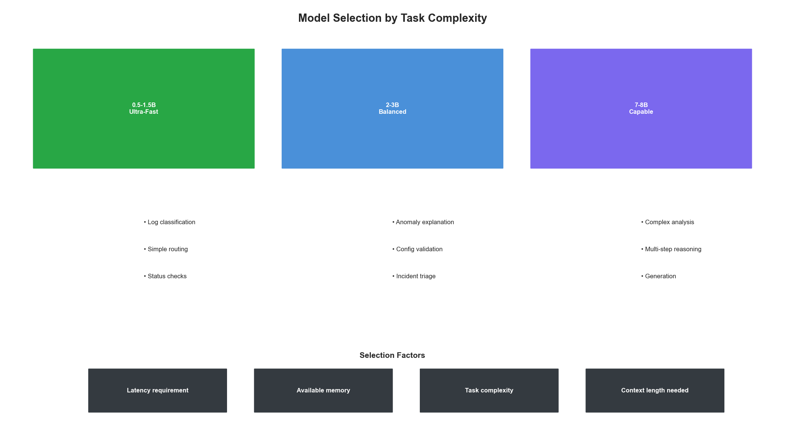
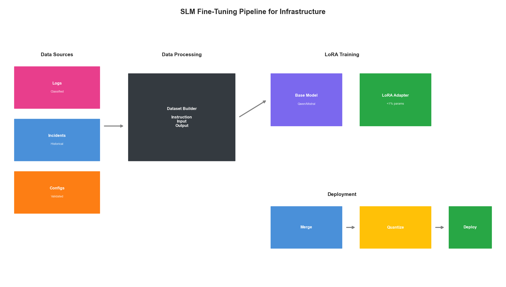
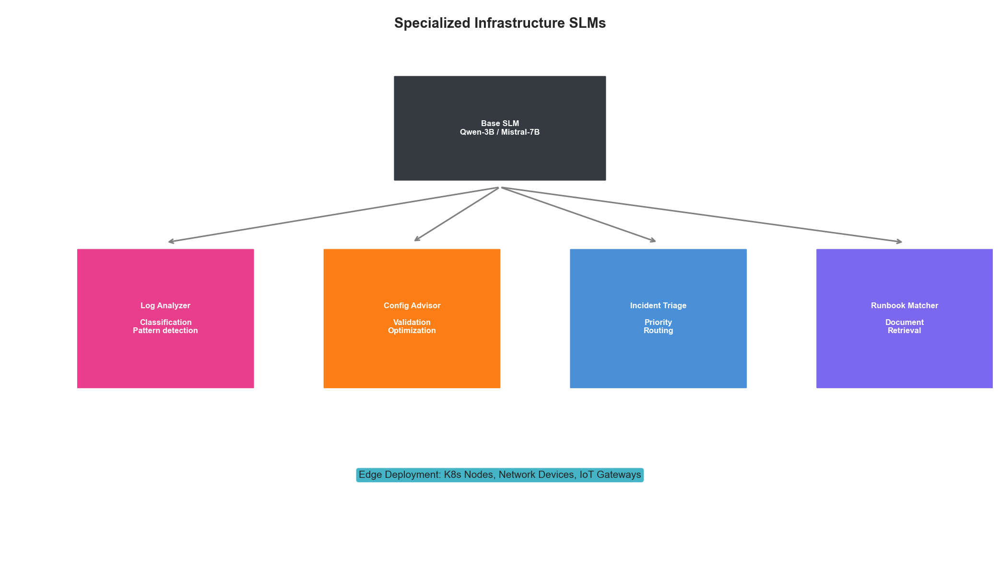

# Chapter 13: Small Language Models for Infrastructure

## Introduction

While large language models (LLMs) like GPT-4 and Claude offer impressive capabilities, they present significant challenges for infrastructure optimization: high latency, substantial compute costs, and dependency on external APIs. Small Language Models (SLMs) offer a compelling alternative for many infrastructure tasks—models with 1-7 billion parameters that can run locally with millisecond-level latency.

This chapter explores how to leverage SLMs for infrastructure automation, from log analysis and anomaly detection to automated remediation and configuration generation.



## Why Small Models for Infrastructure?

### The Case for SLMs

Infrastructure operations have unique requirements that favor smaller, specialized models:

```python
from dataclasses import dataclass
from typing import List, Dict
import time

@dataclass
class ModelComparison:
    """Compare LLM vs SLM characteristics for infrastructure."""

    @staticmethod
    def evaluate_trade_offs():
        return {
            'LLM (70B+)': {
                'latency': '500-2000ms',
                'cost_per_1k_tokens': '$0.01-0.03',
                'deployment': 'API/Cloud',
                'privacy': 'Data leaves network',
                'availability': 'Dependent on provider',
                'customization': 'Prompt engineering only',
                'best_for': 'Complex reasoning, novel problems'
            },
            'SLM (1-7B)': {
                'latency': '10-100ms',
                'cost_per_1k_tokens': '$0.0001 (self-hosted)',
                'deployment': 'Local/Edge',
                'privacy': 'Data stays on-premise',
                'availability': 'Self-controlled',
                'customization': 'Fine-tuning possible',
                'best_for': 'Repetitive tasks, real-time decisions'
            }
        }

class InfrastructureSLMUseCases:
    """
    Infrastructure tasks well-suited for SLMs.

    Key insight: Most infrastructure decisions are pattern matching
    rather than novel reasoning, making them ideal for fine-tuned SLMs.
    """

    IDEAL_USE_CASES = [
        {
            'task': 'Log Classification',
            'description': 'Categorize log entries by severity and type',
            'latency_requirement': '<50ms',
            'reasoning_complexity': 'Low',
            'data_sensitivity': 'High'
        },
        {
            'task': 'Anomaly Explanation',
            'description': 'Generate human-readable explanations for detected anomalies',
            'latency_requirement': '<200ms',
            'reasoning_complexity': 'Medium',
            'data_sensitivity': 'High'
        },
        {
            'task': 'Config Validation',
            'description': 'Validate and suggest fixes for configuration files',
            'latency_requirement': '<100ms',
            'reasoning_complexity': 'Medium',
            'data_sensitivity': 'High'
        },
        {
            'task': 'Incident Triage',
            'description': 'Prioritize and route incidents based on description',
            'latency_requirement': '<100ms',
            'reasoning_complexity': 'Medium',
            'data_sensitivity': 'Medium'
        },
        {
            'task': 'Runbook Selection',
            'description': 'Match incidents to appropriate runbooks',
            'latency_requirement': '<50ms',
            'reasoning_complexity': 'Low',
            'data_sensitivity': 'Low'
        }
    ]
```

### Model Selection for Infrastructure

```python
from enum import Enum
from typing import Optional

class InfrastructureModel(Enum):
    """Recommended models for infrastructure tasks."""

    # Ultra-fast, edge deployable
    QWEN_0_5B = "Qwen/Qwen2.5-0.5B-Instruct"
    PHI_1_5B = "microsoft/phi-1_5"

    # Balanced performance
    QWEN_1_5B = "Qwen/Qwen2.5-1.5B-Instruct"
    GEMMA_2B = "google/gemma-2b-it"
    PHI_2 = "microsoft/phi-2"

    # Higher capability
    QWEN_3B = "Qwen/Qwen2.5-3B-Instruct"
    PHI_3_MINI = "microsoft/Phi-3-mini-4k-instruct"
    LLAMA_3_2_3B = "meta-llama/Llama-3.2-3B-Instruct"

    # Maximum capability (still edge-deployable)
    QWEN_7B = "Qwen/Qwen2.5-7B-Instruct"
    MISTRAL_7B = "mistralai/Mistral-7B-Instruct-v0.3"
    LLAMA_3_1_8B = "meta-llama/Llama-3.1-8B-Instruct"


class ModelSelector:
    """Select appropriate model based on task requirements."""

    def __init__(self):
        self.model_specs = {
            InfrastructureModel.QWEN_0_5B: {
                'params': '0.5B',
                'memory_gb': 1,
                'tokens_per_sec': 200,
                'context_length': 32768
            },
            InfrastructureModel.QWEN_1_5B: {
                'params': '1.5B',
                'memory_gb': 3,
                'tokens_per_sec': 150,
                'context_length': 32768
            },
            InfrastructureModel.QWEN_3B: {
                'params': '3B',
                'memory_gb': 6,
                'tokens_per_sec': 100,
                'context_length': 32768
            },
            InfrastructureModel.QWEN_7B: {
                'params': '7B',
                'memory_gb': 14,
                'tokens_per_sec': 50,
                'context_length': 32768
            },
            InfrastructureModel.MISTRAL_7B: {
                'params': '7B',
                'memory_gb': 14,
                'tokens_per_sec': 45,
                'context_length': 8192
            }
        }

    def select_model(
        self,
        task_complexity: str,  # 'low', 'medium', 'high'
        max_latency_ms: int,
        available_memory_gb: int,
        context_needed: int = 4096
    ) -> Optional[InfrastructureModel]:
        """Select best model for given constraints."""

        candidates = []

        for model, specs in self.model_specs.items():
            # Check memory constraint
            if specs['memory_gb'] > available_memory_gb:
                continue

            # Check context constraint
            if specs['context_length'] < context_needed:
                continue

            # Estimate latency (assuming 100 token response)
            estimated_latency = (100 / specs['tokens_per_sec']) * 1000
            if estimated_latency > max_latency_ms:
                continue

            candidates.append((model, specs))

        if not candidates:
            return None

        # Sort by capability (larger = more capable)
        candidates.sort(key=lambda x: float(x[1]['params'].replace('B', '')), reverse=True)

        # For low complexity, prefer smaller models
        if task_complexity == 'low':
            candidates.sort(key=lambda x: float(x[1]['params'].replace('B', '')))

        return candidates[0][0]
```



## Fine-Tuning SLMs for Infrastructure

### Creating Training Data

High-quality training data is essential for infrastructure-focused SLMs:

```python
import json
from typing import List, Dict, Tuple
from dataclasses import dataclass, asdict

@dataclass
class InfrastructureExample:
    """Training example for infrastructure SLM."""
    instruction: str
    input_context: str
    output: str
    task_type: str
    metadata: Dict = None

class InfrastructureDatasetBuilder:
    """
    Build training datasets from infrastructure data.

    Sources:
    - Historical incident tickets
    - Log files with annotations
    - Configuration files with comments
    - Runbooks and documentation
    """

    def __init__(self):
        self.examples = []

    def add_log_classification_examples(
        self,
        logs: List[Dict[str, str]]
    ) -> None:
        """
        Create examples from classified logs.

        Expected format:
        {'log': '...', 'severity': 'ERROR', 'category': 'database'}
        """
        for log_entry in logs:
            example = InfrastructureExample(
                instruction="Classify this log entry by severity and category.",
                input_context=log_entry['log'],
                output=json.dumps({
                    'severity': log_entry['severity'],
                    'category': log_entry['category']
                }),
                task_type='log_classification'
            )
            self.examples.append(example)

    def add_anomaly_explanation_examples(
        self,
        anomalies: List[Dict]
    ) -> None:
        """
        Create examples from annotated anomalies.

        Expected format:
        {
            'metrics': {...},
            'anomaly_type': 'cpu_spike',
            'explanation': 'CPU spiked due to...',
            'recommended_action': 'Scale up...'
        }
        """
        for anomaly in anomalies:
            metrics_str = json.dumps(anomaly['metrics'], indent=2)
            example = InfrastructureExample(
                instruction="Explain this infrastructure anomaly and recommend action.",
                input_context=f"Anomaly detected:\n{metrics_str}",
                output=f"Explanation: {anomaly['explanation']}\n\nRecommended Action: {anomaly['recommended_action']}",
                task_type='anomaly_explanation'
            )
            self.examples.append(example)

    def add_config_validation_examples(
        self,
        configs: List[Dict]
    ) -> None:
        """
        Create examples from configuration validations.
        """
        for config in configs:
            example = InfrastructureExample(
                instruction="Validate this configuration and identify any issues.",
                input_context=config['config_content'],
                output=json.dumps({
                    'valid': config['is_valid'],
                    'issues': config.get('issues', []),
                    'suggestions': config.get('suggestions', [])
                }),
                task_type='config_validation'
            )
            self.examples.append(example)

    def add_incident_triage_examples(
        self,
        incidents: List[Dict]
    ) -> None:
        """
        Create examples from historical incidents.
        """
        for incident in incidents:
            example = InfrastructureExample(
                instruction="Triage this incident: determine priority, category, and suggested team.",
                input_context=f"Title: {incident['title']}\nDescription: {incident['description']}",
                output=json.dumps({
                    'priority': incident['priority'],
                    'category': incident['category'],
                    'suggested_team': incident['assigned_team'],
                    'estimated_impact': incident.get('impact', 'unknown')
                }),
                task_type='incident_triage'
            )
            self.examples.append(example)

    def export_for_training(
        self,
        output_path: str,
        format: str = 'jsonl'  # 'jsonl', 'alpaca', 'sharegpt'
    ) -> None:
        """Export dataset in common fine-tuning formats."""

        if format == 'jsonl':
            with open(output_path, 'w') as f:
                for example in self.examples:
                    line = {
                        'instruction': example.instruction,
                        'input': example.input_context,
                        'output': example.output
                    }
                    f.write(json.dumps(line) + '\n')

        elif format == 'alpaca':
            data = []
            for example in self.examples:
                data.append({
                    'instruction': example.instruction,
                    'input': example.input_context,
                    'output': example.output
                })
            with open(output_path, 'w') as f:
                json.dump(data, f, indent=2)

        elif format == 'sharegpt':
            data = []
            for example in self.examples:
                data.append({
                    'conversations': [
                        {'from': 'human', 'value': f"{example.instruction}\n\n{example.input_context}"},
                        {'from': 'gpt', 'value': example.output}
                    ]
                })
            with open(output_path, 'w') as f:
                json.dump(data, f, indent=2)

    def get_statistics(self) -> Dict:
        """Get dataset statistics."""
        task_counts = {}
        for example in self.examples:
            task_type = example.task_type
            task_counts[task_type] = task_counts.get(task_type, 0) + 1

        return {
            'total_examples': len(self.examples),
            'task_distribution': task_counts,
            'avg_input_length': sum(len(e.input_context) for e in self.examples) / len(self.examples),
            'avg_output_length': sum(len(e.output) for e in self.examples) / len(self.examples)
        }
```

### Fine-Tuning with LoRA

```python
from transformers import AutoModelForCausalLM, AutoTokenizer, TrainingArguments
from peft import LoraConfig, get_peft_model, TaskType
from datasets import load_dataset
import torch

class InfrastructureSLMTrainer:
    """
    Fine-tune SLMs for infrastructure tasks using LoRA.

    LoRA (Low-Rank Adaptation) enables efficient fine-tuning
    by training only a small number of additional parameters.
    """

    def __init__(
        self,
        base_model: str = "Qwen/Qwen2.5-3B-Instruct",
        lora_rank: int = 16,
        lora_alpha: int = 32,
        target_modules: List[str] = None
    ):
        self.base_model = base_model
        self.device = "cuda" if torch.cuda.is_available() else "cpu"

        # Load tokenizer
        self.tokenizer = AutoTokenizer.from_pretrained(base_model)
        if self.tokenizer.pad_token is None:
            self.tokenizer.pad_token = self.tokenizer.eos_token

        # Load model
        self.model = AutoModelForCausalLM.from_pretrained(
            base_model,
            torch_dtype=torch.bfloat16,
            device_map="auto"
        )

        # Configure LoRA
        self.lora_config = LoraConfig(
            task_type=TaskType.CAUSAL_LM,
            r=lora_rank,
            lora_alpha=lora_alpha,
            lora_dropout=0.1,
            target_modules=target_modules or ["q_proj", "v_proj", "k_proj", "o_proj"],
            bias="none"
        )

        # Apply LoRA
        self.model = get_peft_model(self.model, self.lora_config)
        self._print_trainable_params()

    def _print_trainable_params(self):
        """Print number of trainable parameters."""
        trainable = sum(p.numel() for p in self.model.parameters() if p.requires_grad)
        total = sum(p.numel() for p in self.model.parameters())
        print(f"Trainable: {trainable:,} / {total:,} ({100 * trainable / total:.2f}%)")

    def prepare_dataset(
        self,
        data_path: str,
        max_length: int = 2048
    ):
        """Prepare dataset for training."""

        dataset = load_dataset('json', data_files=data_path, split='train')

        def format_example(example):
            prompt = f"""### Instruction:
{example['instruction']}

### Input:
{example['input']}

### Response:
{example['output']}"""
            return {'text': prompt}

        dataset = dataset.map(format_example)

        def tokenize(example):
            return self.tokenizer(
                example['text'],
                truncation=True,
                max_length=max_length,
                padding='max_length'
            )

        dataset = dataset.map(tokenize, remove_columns=['text'])
        return dataset

    def train(
        self,
        train_dataset,
        output_dir: str = "./infrastructure_slm",
        num_epochs: int = 3,
        batch_size: int = 4,
        learning_rate: float = 2e-4,
        gradient_accumulation: int = 4
    ):
        """Train the model."""

        training_args = TrainingArguments(
            output_dir=output_dir,
            num_train_epochs=num_epochs,
            per_device_train_batch_size=batch_size,
            gradient_accumulation_steps=gradient_accumulation,
            learning_rate=learning_rate,
            weight_decay=0.01,
            warmup_ratio=0.1,
            logging_steps=10,
            save_steps=100,
            save_total_limit=3,
            bf16=True,
            gradient_checkpointing=True,
            optim="adamw_torch_fused",
            report_to="tensorboard"
        )

        from trl import SFTTrainer

        trainer = SFTTrainer(
            model=self.model,
            args=training_args,
            train_dataset=train_dataset,
            tokenizer=self.tokenizer,
            dataset_text_field="text",
            max_seq_length=2048,
            packing=True
        )

        trainer.train()
        trainer.save_model(output_dir)

    def merge_and_export(
        self,
        output_dir: str,
        quantize: bool = True
    ):
        """Merge LoRA weights and optionally quantize."""

        # Merge LoRA weights
        merged_model = self.model.merge_and_unload()

        if quantize:
            # Quantize to 4-bit for efficient deployment
            from transformers import BitsAndBytesConfig

            quantization_config = BitsAndBytesConfig(
                load_in_4bit=True,
                bnb_4bit_compute_dtype=torch.bfloat16,
                bnb_4bit_use_double_quant=True,
                bnb_4bit_quant_type="nf4"
            )

            # Save with quantization config
            merged_model.save_pretrained(
                output_dir,
                quantization_config=quantization_config
            )
        else:
            merged_model.save_pretrained(output_dir)

        self.tokenizer.save_pretrained(output_dir)
```



## Deploying SLMs for Real-Time Infrastructure

### High-Performance Inference Server

```python
from fastapi import FastAPI, HTTPException
from pydantic import BaseModel
from typing import Optional, List
import asyncio
from concurrent.futures import ThreadPoolExecutor
import torch

class InferenceRequest(BaseModel):
    task: str  # 'log_classification', 'anomaly_explanation', etc.
    input_text: str
    max_tokens: int = 256
    temperature: float = 0.1

class InferenceResponse(BaseModel):
    output: str
    latency_ms: float
    tokens_generated: int

class InfrastructureSLMServer:
    """
    High-performance inference server for infrastructure SLM.

    Features:
    - Batched inference for throughput
    - Request prioritization
    - Health monitoring
    - Graceful degradation
    """

    def __init__(
        self,
        model_path: str,
        max_batch_size: int = 8,
        max_concurrent: int = 4
    ):
        self.model_path = model_path
        self.max_batch_size = max_batch_size
        self.executor = ThreadPoolExecutor(max_workers=max_concurrent)

        # Load model
        self._load_model()

        # Request queue for batching
        self.request_queue = asyncio.Queue()
        self.batch_timeout = 0.01  # 10ms max wait for batching

        # Metrics
        self.total_requests = 0
        self.total_latency = 0

    def _load_model(self):
        """Load model with optimizations."""
        from transformers import AutoModelForCausalLM, AutoTokenizer

        self.tokenizer = AutoTokenizer.from_pretrained(self.model_path)

        self.model = AutoModelForCausalLM.from_pretrained(
            self.model_path,
            torch_dtype=torch.float16,
            device_map="auto",
            attn_implementation="flash_attention_2"  # Use Flash Attention
        )
        self.model.eval()

        # Compile for faster inference (PyTorch 2.0+)
        if hasattr(torch, 'compile'):
            self.model = torch.compile(self.model, mode="reduce-overhead")

    def _get_task_prompt(self, task: str, input_text: str) -> str:
        """Get task-specific prompt template."""
        prompts = {
            'log_classification': f"""Classify this log entry by severity (DEBUG/INFO/WARNING/ERROR/CRITICAL) and category.

Log: {input_text}

Output as JSON: {{"severity": "...", "category": "..."}}""",

            'anomaly_explanation': f"""Explain this infrastructure anomaly and recommend action.

{input_text}

Provide brief explanation and recommended action.""",

            'config_validation': f"""Validate this configuration and identify issues.

{input_text}

Output as JSON: {{"valid": true/false, "issues": [...], "suggestions": [...]}}""",

            'incident_triage': f"""Triage this incident: determine priority, category, and team.

{input_text}

Output as JSON: {{"priority": "P1/P2/P3/P4", "category": "...", "team": "..."}}"""
        }
        return prompts.get(task, f"{task}:\n{input_text}")

    @torch.inference_mode()
    def _generate(
        self,
        prompts: List[str],
        max_tokens: int,
        temperature: float
    ) -> List[str]:
        """Generate responses for a batch of prompts."""

        inputs = self.tokenizer(
            prompts,
            return_tensors="pt",
            padding=True,
            truncation=True,
            max_length=2048
        ).to(self.model.device)

        outputs = self.model.generate(
            **inputs,
            max_new_tokens=max_tokens,
            temperature=temperature if temperature > 0 else None,
            do_sample=temperature > 0,
            pad_token_id=self.tokenizer.pad_token_id,
            eos_token_id=self.tokenizer.eos_token_id
        )

        # Decode only new tokens
        responses = []
        for i, output in enumerate(outputs):
            input_length = inputs['input_ids'][i].shape[0]
            new_tokens = output[input_length:]
            response = self.tokenizer.decode(new_tokens, skip_special_tokens=True)
            responses.append(response)

        return responses

    async def infer(self, request: InferenceRequest) -> InferenceResponse:
        """Process single inference request."""
        import time

        start = time.perf_counter()

        prompt = self._get_task_prompt(request.task, request.input_text)

        # Run inference in thread pool
        loop = asyncio.get_event_loop()
        responses = await loop.run_in_executor(
            self.executor,
            self._generate,
            [prompt],
            request.max_tokens,
            request.temperature
        )

        latency_ms = (time.perf_counter() - start) * 1000

        # Update metrics
        self.total_requests += 1
        self.total_latency += latency_ms

        return InferenceResponse(
            output=responses[0],
            latency_ms=latency_ms,
            tokens_generated=len(self.tokenizer.encode(responses[0]))
        )

    def get_metrics(self) -> Dict:
        """Get server metrics."""
        return {
            'total_requests': self.total_requests,
            'avg_latency_ms': self.total_latency / max(self.total_requests, 1),
            'model': self.model_path
        }


# FastAPI application
app = FastAPI(title="Infrastructure SLM API")
server: Optional[InfrastructureSLMServer] = None

@app.on_event("startup")
async def startup():
    global server
    server = InfrastructureSLMServer(
        model_path="./infrastructure_slm",
        max_batch_size=8,
        max_concurrent=4
    )

@app.post("/infer", response_model=InferenceResponse)
async def infer(request: InferenceRequest):
    if server is None:
        raise HTTPException(status_code=503, detail="Model not loaded")
    return await server.infer(request)

@app.get("/health")
async def health():
    return {"status": "healthy", "metrics": server.get_metrics() if server else {}}
```

### Edge Deployment with ONNX

```python
from optimum.onnxruntime import ORTModelForCausalLM
from transformers import AutoTokenizer
import numpy as np

class EdgeInfrastructureSLM:
    """
    Deploy SLM on edge devices using ONNX Runtime.

    Enables running on:
    - Kubernetes nodes
    - Network devices
    - IoT gateways
    """

    def __init__(
        self,
        model_path: str,
        onnx_path: str = None
    ):
        self.tokenizer = AutoTokenizer.from_pretrained(model_path)

        if onnx_path:
            # Load pre-converted ONNX model
            self.model = ORTModelForCausalLM.from_pretrained(onnx_path)
        else:
            # Convert on the fly
            self.model = ORTModelForCausalLM.from_pretrained(
                model_path,
                export=True
            )

    @classmethod
    def convert_to_onnx(
        cls,
        model_path: str,
        output_path: str,
        optimize: bool = True
    ):
        """Convert PyTorch model to optimized ONNX."""
        from optimum.onnxruntime import ORTOptimizer
        from optimum.onnxruntime.configuration import OptimizationConfig

        # Export to ONNX
        model = ORTModelForCausalLM.from_pretrained(model_path, export=True)
        model.save_pretrained(output_path)

        if optimize:
            # Optimize the ONNX model
            optimizer = ORTOptimizer.from_pretrained(output_path)
            optimization_config = OptimizationConfig(
                optimization_level=99,  # Full optimization
                enable_transformers_specific_optimizations=True,
                fp16=True
            )
            optimizer.optimize(
                save_dir=output_path,
                optimization_config=optimization_config
            )

    def generate(
        self,
        prompt: str,
        max_tokens: int = 128
    ) -> str:
        """Generate response."""
        inputs = self.tokenizer(prompt, return_tensors="pt")

        outputs = self.model.generate(
            **inputs,
            max_new_tokens=max_tokens,
            do_sample=False
        )

        response = self.tokenizer.decode(
            outputs[0][inputs['input_ids'].shape[1]:],
            skip_special_tokens=True
        )
        return response


class EdgeDeploymentManager:
    """
    Manage SLM deployment across edge locations.
    """

    def __init__(self):
        self.deployments = {}

    def deploy_to_node(
        self,
        node_id: str,
        model_path: str,
        resources: Dict
    ) -> Dict:
        """Deploy SLM to a specific node."""

        deployment_spec = {
            'node_id': node_id,
            'model_path': model_path,
            'resources': resources,
            'status': 'deploying'
        }

        # Kubernetes deployment manifest
        k8s_manifest = {
            'apiVersion': 'apps/v1',
            'kind': 'Deployment',
            'metadata': {
                'name': f'slm-{node_id}',
                'labels': {'app': 'infrastructure-slm'}
            },
            'spec': {
                'replicas': 1,
                'selector': {
                    'matchLabels': {'app': f'slm-{node_id}'}
                },
                'template': {
                    'metadata': {'labels': {'app': f'slm-{node_id}'}},
                    'spec': {
                        'nodeSelector': {'kubernetes.io/hostname': node_id},
                        'containers': [{
                            'name': 'slm',
                            'image': 'infrastructure-slm:latest',
                            'resources': {
                                'limits': {
                                    'memory': f"{resources['memory_gb']}Gi",
                                    'nvidia.com/gpu': resources.get('gpu', 0)
                                }
                            },
                            'volumeMounts': [{
                                'name': 'model-storage',
                                'mountPath': '/models'
                            }],
                            'env': [{
                                'name': 'MODEL_PATH',
                                'value': '/models/infrastructure_slm'
                            }]
                        }],
                        'volumes': [{
                            'name': 'model-storage',
                            'persistentVolumeClaim': {
                                'claimName': f'slm-models-{node_id}'
                            }
                        }]
                    }
                }
            }
        }

        self.deployments[node_id] = deployment_spec
        return {'manifest': k8s_manifest, 'deployment': deployment_spec}
```

## Specialized Infrastructure Models

### Log Analysis Model

```python
class LogAnalysisSLM:
    """
    Specialized SLM for log analysis tasks.

    Capabilities:
    - Log classification
    - Error extraction
    - Pattern recognition
    - Anomaly flagging
    """

    def __init__(self, model_path: str):
        self.tokenizer = AutoTokenizer.from_pretrained(model_path)
        self.model = AutoModelForCausalLM.from_pretrained(
            model_path,
            torch_dtype=torch.float16,
            device_map="auto"
        )

    def classify_log(self, log_entry: str) -> Dict:
        """Classify a log entry."""
        prompt = f"""Analyze this log entry:

{log_entry}

Respond with JSON:
{{"severity": "DEBUG|INFO|WARNING|ERROR|CRITICAL", "category": "...", "actionable": true/false}}"""

        response = self._generate(prompt, max_tokens=100)
        return self._parse_json(response)

    def extract_errors(self, logs: List[str]) -> List[Dict]:
        """Extract and summarize errors from logs."""
        log_block = "\n".join(logs[-50:])  # Last 50 lines

        prompt = f"""Extract all errors from these logs:

{log_block}

List each error with: timestamp, error_type, message, and likely cause."""

        response = self._generate(prompt, max_tokens=500)
        return self._parse_error_list(response)

    def detect_patterns(self, logs: List[str]) -> Dict:
        """Detect patterns in log stream."""
        log_sample = "\n".join(logs[-100:])

        prompt = f"""Analyze these logs for patterns:

{log_sample}

Identify: recurring errors, performance issues, security concerns, unusual activity."""

        response = self._generate(prompt, max_tokens=400)
        return {'analysis': response}

    def _generate(self, prompt: str, max_tokens: int) -> str:
        inputs = self.tokenizer(prompt, return_tensors="pt").to(self.model.device)

        with torch.inference_mode():
            outputs = self.model.generate(
                **inputs,
                max_new_tokens=max_tokens,
                temperature=0.1,
                do_sample=True
            )

        return self.tokenizer.decode(
            outputs[0][inputs['input_ids'].shape[1]:],
            skip_special_tokens=True
        )

    def _parse_json(self, text: str) -> Dict:
        """Parse JSON from model output."""
        import re
        match = re.search(r'\{[^}]+\}', text)
        if match:
            try:
                return json.loads(match.group())
            except json.JSONDecodeError:
                pass
        return {'raw': text}

    def _parse_error_list(self, text: str) -> List[Dict]:
        """Parse error list from model output."""
        errors = []
        for line in text.split('\n'):
            if line.strip():
                errors.append({'description': line.strip()})
        return errors
```

### Configuration Advisor Model

```python
class ConfigAdvisorSLM:
    """
    SLM specialized for configuration validation and optimization.

    Supports:
    - Kubernetes manifests
    - Docker Compose files
    - Terraform configurations
    - Prometheus rules
    """

    CONFIG_TYPES = {
        'kubernetes': 'yaml',
        'docker-compose': 'yaml',
        'terraform': 'hcl',
        'prometheus': 'yaml',
        'nginx': 'conf'
    }

    def __init__(self, model_path: str):
        self.tokenizer = AutoTokenizer.from_pretrained(model_path)
        self.model = AutoModelForCausalLM.from_pretrained(
            model_path,
            torch_dtype=torch.float16,
            device_map="auto"
        )

    def validate_config(
        self,
        config: str,
        config_type: str
    ) -> Dict:
        """Validate configuration and identify issues."""

        prompt = f"""Validate this {config_type} configuration:

```{self.CONFIG_TYPES.get(config_type, 'text')}
{config}
```

Check for:
1. Syntax errors
2. Security issues
3. Best practice violations
4. Performance concerns

Output JSON: {{"valid": bool, "issues": [...], "severity": "low|medium|high"}}"""

        response = self._generate(prompt, max_tokens=500)
        return self._parse_validation(response)

    def suggest_improvements(
        self,
        config: str,
        config_type: str,
        context: str = ""
    ) -> Dict:
        """Suggest configuration improvements."""

        prompt = f"""Suggest improvements for this {config_type} configuration:

```
{config}
```

Context: {context if context else 'Production deployment'}

Provide specific, actionable improvements with examples."""

        response = self._generate(prompt, max_tokens=600)
        return {'suggestions': response}

    def generate_config(
        self,
        requirements: str,
        config_type: str
    ) -> str:
        """Generate configuration from requirements."""

        prompt = f"""Generate a {config_type} configuration for:

{requirements}

Provide a complete, production-ready configuration with comments."""

        return self._generate(prompt, max_tokens=1000)

    def _generate(self, prompt: str, max_tokens: int) -> str:
        inputs = self.tokenizer(prompt, return_tensors="pt").to(self.model.device)

        with torch.inference_mode():
            outputs = self.model.generate(
                **inputs,
                max_new_tokens=max_tokens,
                temperature=0.2,
                do_sample=True
            )

        return self.tokenizer.decode(
            outputs[0][inputs['input_ids'].shape[1]:],
            skip_special_tokens=True
        )

    def _parse_validation(self, text: str) -> Dict:
        """Parse validation results."""
        import re
        match = re.search(r'\{[^}]+\}', text, re.DOTALL)
        if match:
            try:
                return json.loads(match.group())
            except:
                pass
        return {'valid': False, 'issues': [text], 'severity': 'unknown'}
```



## Key Takeaways

1. **Right-Size Your Models**: Use 0.5B-3B models for simple tasks, 7B for complex reasoning
2. **Fine-Tune for Your Domain**: Generic models underperform on infrastructure-specific tasks
3. **Optimize for Latency**: Use ONNX, quantization, and Flash Attention for production
4. **Deploy at the Edge**: Run SLMs on Kubernetes nodes for truly local inference
5. **Specialize by Task**: Different infrastructure tasks benefit from specialized model variants

Small Language Models offer a practical path to AI-powered infrastructure automation without the complexity, cost, and latency of large cloud-based models. By fine-tuning for your specific infrastructure patterns and deploying close to the data source, you can achieve real-time intelligent automation that was previously impossible.
