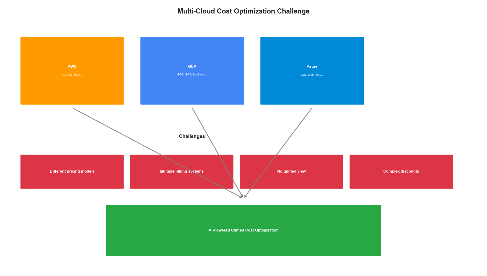
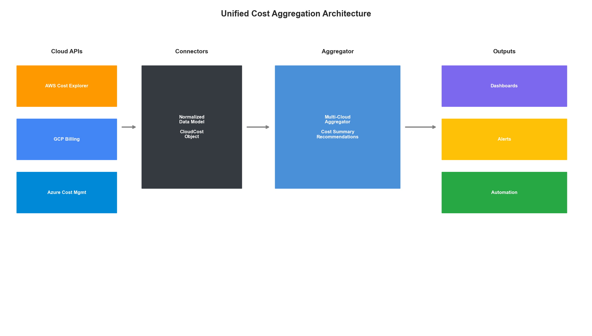
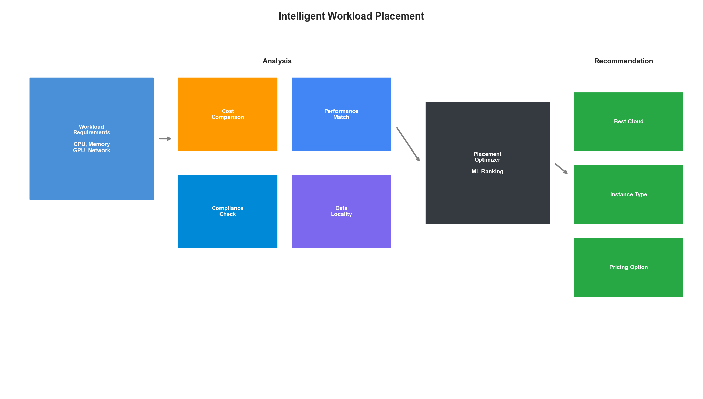
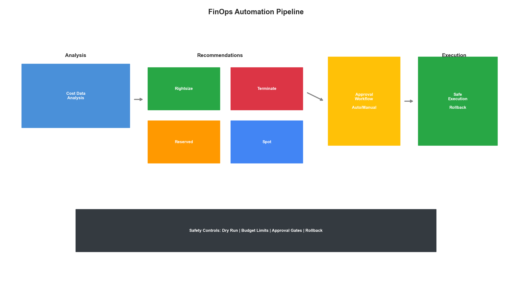

# Chapter 15: Multi-Cloud Cost Optimization

## Introduction

Multi-cloud strategies have become the norm for enterprises seeking resilience, avoiding vendor lock-in, and leveraging best-of-breed services. However, this approach introduces significant cost management complexity. Each cloud provider has different pricing models, discount mechanisms, and optimization opportunities.

This chapter presents AI-driven approaches to multi-cloud cost optimization—from unified cost visibility to intelligent workload placement and automated savings programs.



## Unified Cost Visibility

### Multi-Cloud Cost Aggregation

The first step in optimization is unified visibility across all cloud providers:

```python
from dataclasses import dataclass
from typing import Dict, List, Optional
from datetime import datetime, timedelta
from abc import ABC, abstractmethod
import pandas as pd

@dataclass
class CloudCost:
    """Normalized cloud cost record."""
    provider: str  # aws, gcp, azure
    service: str
    resource_id: str
    cost: float
    currency: str
    usage_quantity: float
    usage_unit: str
    timestamp: datetime
    tags: Dict[str, str]
    region: str
    account_id: str

class CloudCostConnector(ABC):
    """Abstract base for cloud cost connectors."""

    @abstractmethod
    def fetch_costs(
        self,
        start_date: datetime,
        end_date: datetime
    ) -> List[CloudCost]:
        pass

    @abstractmethod
    def get_recommendations(self) -> List[Dict]:
        pass

class AWSCostConnector(CloudCostConnector):
    """AWS Cost Explorer connector."""

    def __init__(self, session):
        self.ce_client = session.client('ce')
        self.org_client = session.client('organizations')

    def fetch_costs(
        self,
        start_date: datetime,
        end_date: datetime
    ) -> List[CloudCost]:
        costs = []

        response = self.ce_client.get_cost_and_usage(
            TimePeriod={
                'Start': start_date.strftime('%Y-%m-%d'),
                'End': end_date.strftime('%Y-%m-%d')
            },
            Granularity='DAILY',
            Metrics=['UnblendedCost', 'UsageQuantity'],
            GroupBy=[
                {'Type': 'DIMENSION', 'Key': 'SERVICE'},
                {'Type': 'DIMENSION', 'Key': 'REGION'},
                {'Type': 'TAG', 'Key': 'Environment'}
            ]
        )

        for result in response['ResultsByTime']:
            date = datetime.strptime(result['TimePeriod']['Start'], '%Y-%m-%d')
            for group in result['Groups']:
                service = group['Keys'][0]
                region = group['Keys'][1] if len(group['Keys']) > 1 else 'global'

                costs.append(CloudCost(
                    provider='aws',
                    service=service,
                    resource_id='aggregated',
                    cost=float(group['Metrics']['UnblendedCost']['Amount']),
                    currency='USD',
                    usage_quantity=float(group['Metrics']['UsageQuantity']['Amount']),
                    usage_unit=group['Metrics']['UsageQuantity']['Unit'],
                    timestamp=date,
                    tags={'Environment': group['Keys'][2] if len(group['Keys']) > 2 else 'unknown'},
                    region=region,
                    account_id='consolidated'
                ))

        return costs

    def get_recommendations(self) -> List[Dict]:
        """Get AWS Cost Explorer recommendations."""
        recommendations = []

        # Rightsizing recommendations
        try:
            response = self.ce_client.get_rightsizing_recommendation(
                Service='AmazonEC2'
            )
            for rec in response.get('RightsizingRecommendations', []):
                recommendations.append({
                    'provider': 'aws',
                    'type': 'rightsizing',
                    'resource_id': rec['CurrentInstance']['ResourceId'],
                    'current': rec['CurrentInstance']['InstanceType'],
                    'recommended': rec['ModifyRecommendationDetail']['TargetInstances'][0]['InstanceType'],
                    'estimated_savings': float(rec['ModifyRecommendationDetail']['TargetInstances'][0]['EstimatedMonthlySavings']['Value'])
                })
        except Exception as e:
            print(f"Error fetching rightsizing recommendations: {e}")

        return recommendations


class GCPCostConnector(CloudCostConnector):
    """Google Cloud Billing connector."""

    def __init__(self, project_id: str, credentials):
        from google.cloud import bigquery
        self.project_id = project_id
        self.client = bigquery.Client(project=project_id, credentials=credentials)
        self.billing_export_table = f"{project_id}.billing_export.gcp_billing_export_v1"

    def fetch_costs(
        self,
        start_date: datetime,
        end_date: datetime
    ) -> List[CloudCost]:
        query = f"""
        SELECT
            service.description as service,
            sku.description as sku,
            location.region as region,
            project.id as project_id,
            SUM(cost) as cost,
            SUM(usage.amount) as usage_amount,
            usage.unit as usage_unit,
            DATE(usage_start_time) as date
        FROM `{self.billing_export_table}`
        WHERE usage_start_time >= @start_date
            AND usage_start_time < @end_date
        GROUP BY service, sku, region, project_id, usage_unit, date
        """

        job_config = self.client.QueryJobConfig(
            query_parameters=[
                self.client.ScalarQueryParameter("start_date", "TIMESTAMP", start_date),
                self.client.ScalarQueryParameter("end_date", "TIMESTAMP", end_date)
            ]
        )

        results = self.client.query(query, job_config=job_config)

        costs = []
        for row in results:
            costs.append(CloudCost(
                provider='gcp',
                service=row.service,
                resource_id=row.sku,
                cost=float(row.cost),
                currency='USD',
                usage_quantity=float(row.usage_amount) if row.usage_amount else 0,
                usage_unit=row.usage_unit or 'units',
                timestamp=datetime.combine(row.date, datetime.min.time()),
                tags={},
                region=row.region or 'global',
                account_id=row.project_id
            ))

        return costs

    def get_recommendations(self) -> List[Dict]:
        """Get GCP recommender recommendations."""
        from google.cloud import recommender_v1

        client = recommender_v1.RecommenderClient()
        recommendations = []

        # Fetch VM rightsizing recommendations
        parent = f"projects/{self.project_id}/locations/-/recommenders/google.compute.instance.MachineTypeRecommender"

        try:
            for rec in client.list_recommendations(parent=parent):
                recommendations.append({
                    'provider': 'gcp',
                    'type': 'rightsizing',
                    'resource_id': rec.name,
                    'description': rec.description,
                    'estimated_savings': rec.primary_impact.cost_projection.cost.units
                })
        except Exception as e:
            print(f"Error fetching GCP recommendations: {e}")

        return recommendations


class AzureCostConnector(CloudCostConnector):
    """Azure Cost Management connector."""

    def __init__(self, subscription_id: str, credentials):
        from azure.mgmt.costmanagement import CostManagementClient
        self.subscription_id = subscription_id
        self.client = CostManagementClient(credentials, subscription_id)

    def fetch_costs(
        self,
        start_date: datetime,
        end_date: datetime
    ) -> List[CloudCost]:
        from azure.mgmt.costmanagement.models import QueryDefinition, QueryTimePeriod

        scope = f"/subscriptions/{self.subscription_id}"

        query = QueryDefinition(
            type="ActualCost",
            timeframe="Custom",
            time_period=QueryTimePeriod(
                from_property=start_date,
                to=end_date
            ),
            dataset={
                "granularity": "Daily",
                "aggregation": {
                    "totalCost": {"name": "Cost", "function": "Sum"}
                },
                "grouping": [
                    {"type": "Dimension", "name": "ServiceName"},
                    {"type": "Dimension", "name": "ResourceLocation"}
                ]
            }
        )

        result = self.client.query.usage(scope, query)

        costs = []
        for row in result.rows:
            costs.append(CloudCost(
                provider='azure',
                service=row[2],  # ServiceName
                resource_id='aggregated',
                cost=float(row[0]),  # Cost
                currency='USD',
                usage_quantity=0,
                usage_unit='units',
                timestamp=datetime.strptime(row[1], '%Y%m%d'),  # Date
                tags={},
                region=row[3],  # ResourceLocation
                account_id=self.subscription_id
            ))

        return costs

    def get_recommendations(self) -> List[Dict]:
        """Get Azure Advisor recommendations."""
        from azure.mgmt.advisor import AdvisorManagementClient

        advisor = AdvisorManagementClient(self.client._config.credential, self.subscription_id)
        recommendations = []

        for rec in advisor.recommendations.list(filter="Category eq 'Cost'"):
            recommendations.append({
                'provider': 'azure',
                'type': rec.category,
                'resource_id': rec.resource_metadata.resource_id if rec.resource_metadata else 'unknown',
                'description': rec.short_description.solution,
                'estimated_savings': rec.extended_properties.get('annualSavingsAmount', 0) if rec.extended_properties else 0
            })

        return recommendations


class MultiCloudCostAggregator:
    """Aggregate and normalize costs across clouds."""

    def __init__(self):
        self.connectors: Dict[str, CloudCostConnector] = {}
        self.cost_data: pd.DataFrame = None

    def add_connector(self, name: str, connector: CloudCostConnector):
        self.connectors[name] = connector

    def fetch_all_costs(
        self,
        start_date: datetime,
        end_date: datetime
    ) -> pd.DataFrame:
        """Fetch costs from all connected clouds."""
        all_costs = []

        for name, connector in self.connectors.items():
            try:
                costs = connector.fetch_costs(start_date, end_date)
                all_costs.extend(costs)
            except Exception as e:
                print(f"Error fetching from {name}: {e}")

        # Convert to DataFrame
        self.cost_data = pd.DataFrame([vars(c) for c in all_costs])
        return self.cost_data

    def get_cost_summary(self) -> Dict:
        """Get summary statistics across clouds."""
        if self.cost_data is None or self.cost_data.empty:
            return {}

        return {
            'total_cost': self.cost_data['cost'].sum(),
            'by_provider': self.cost_data.groupby('provider')['cost'].sum().to_dict(),
            'by_service': self.cost_data.groupby('service')['cost'].sum().nlargest(10).to_dict(),
            'daily_trend': self.cost_data.groupby(self.cost_data['timestamp'].dt.date)['cost'].sum().to_dict()
        }

    def get_all_recommendations(self) -> List[Dict]:
        """Aggregate recommendations from all clouds."""
        all_recommendations = []

        for name, connector in self.connectors.items():
            try:
                recs = connector.get_recommendations()
                all_recommendations.extend(recs)
            except Exception as e:
                print(f"Error fetching recommendations from {name}: {e}")

        # Sort by estimated savings
        all_recommendations.sort(
            key=lambda x: x.get('estimated_savings', 0),
            reverse=True
        )

        return all_recommendations
```



## AI-Powered Cost Forecasting

### Time Series Forecasting for Cloud Costs

```python
import numpy as np
from sklearn.preprocessing import StandardScaler
import torch
import torch.nn as nn

class CloudCostForecaster:
    """
    AI-powered cost forecasting using temporal patterns.

    Predicts:
    - Daily/weekly/monthly costs
    - Anomalous spending
    - Budget breach probability
    """

    def __init__(
        self,
        forecast_horizon: int = 30,
        history_days: int = 90
    ):
        self.forecast_horizon = forecast_horizon
        self.history_days = history_days
        self.scaler = StandardScaler()
        self.model = None

    def prepare_features(
        self,
        cost_data: pd.DataFrame
    ) -> np.ndarray:
        """Extract temporal features from cost data."""

        # Aggregate to daily
        daily = cost_data.groupby(
            cost_data['timestamp'].dt.date
        )['cost'].sum().reset_index()
        daily.columns = ['date', 'cost']
        daily['date'] = pd.to_datetime(daily['date'])

        # Add temporal features
        daily['day_of_week'] = daily['date'].dt.dayofweek
        daily['day_of_month'] = daily['date'].dt.day
        daily['month'] = daily['date'].dt.month
        daily['is_weekend'] = daily['day_of_week'].isin([5, 6]).astype(int)
        daily['is_month_end'] = (daily['date'].dt.is_month_end).astype(int)

        # Add lag features
        for lag in [1, 7, 14, 30]:
            daily[f'cost_lag_{lag}'] = daily['cost'].shift(lag)

        # Add rolling statistics
        for window in [7, 14, 30]:
            daily[f'cost_rolling_mean_{window}'] = daily['cost'].rolling(window).mean()
            daily[f'cost_rolling_std_{window}'] = daily['cost'].rolling(window).std()

        # Drop rows with NaN from lag features
        daily = daily.dropna()

        return daily

    def build_model(self, input_dim: int):
        """Build LSTM forecasting model."""

        class CostLSTM(nn.Module):
            def __init__(self, input_dim, hidden_dim=64, num_layers=2):
                super().__init__()
                self.lstm = nn.LSTM(
                    input_dim, hidden_dim, num_layers,
                    batch_first=True, dropout=0.2
                )
                self.fc = nn.Sequential(
                    nn.Linear(hidden_dim, 32),
                    nn.ReLU(),
                    nn.Dropout(0.2),
                    nn.Linear(32, 1)
                )

            def forward(self, x):
                lstm_out, _ = self.lstm(x)
                return self.fc(lstm_out[:, -1, :])

        self.model = CostLSTM(input_dim)
        return self.model

    def train(
        self,
        cost_data: pd.DataFrame,
        epochs: int = 100
    ):
        """Train the forecasting model."""
        # Prepare data
        df = self.prepare_features(cost_data)

        feature_cols = [c for c in df.columns if c not in ['date', 'cost']]
        X = df[feature_cols].values
        y = df['cost'].values

        # Scale features
        X_scaled = self.scaler.fit_transform(X)

        # Create sequences
        seq_length = 14
        X_seq, y_seq = [], []
        for i in range(seq_length, len(X_scaled)):
            X_seq.append(X_scaled[i-seq_length:i])
            y_seq.append(y[i])

        X_tensor = torch.FloatTensor(np.array(X_seq))
        y_tensor = torch.FloatTensor(np.array(y_seq)).unsqueeze(1)

        # Build and train
        self.build_model(X_tensor.shape[2])
        optimizer = torch.optim.Adam(self.model.parameters(), lr=0.001)
        criterion = nn.MSELoss()

        self.model.train()
        for epoch in range(epochs):
            optimizer.zero_grad()
            predictions = self.model(X_tensor)
            loss = criterion(predictions, y_tensor)
            loss.backward()
            optimizer.step()

            if epoch % 20 == 0:
                print(f"Epoch {epoch}, Loss: {loss.item():.4f}")

    def forecast(
        self,
        cost_data: pd.DataFrame,
        days_ahead: int = 30
    ) -> pd.DataFrame:
        """Generate cost forecast."""
        df = self.prepare_features(cost_data)
        feature_cols = [c for c in df.columns if c not in ['date', 'cost']]

        self.model.eval()
        predictions = []
        current_features = df[feature_cols].values[-14:]

        with torch.no_grad():
            for day in range(days_ahead):
                X = self.scaler.transform(current_features)
                X_tensor = torch.FloatTensor(X).unsqueeze(0)
                pred = self.model(X_tensor).item()
                predictions.append(pred)

                # Update features for next prediction (simplified)
                new_features = current_features[-1].copy()
                new_features[feature_cols.index('cost_lag_1')] = pred
                current_features = np.vstack([current_features[1:], new_features])

        # Create forecast dataframe
        last_date = df['date'].max()
        forecast_dates = pd.date_range(
            start=last_date + timedelta(days=1),
            periods=days_ahead
        )

        return pd.DataFrame({
            'date': forecast_dates,
            'predicted_cost': predictions
        })

    def detect_anomalies(
        self,
        cost_data: pd.DataFrame,
        threshold: float = 2.0
    ) -> List[Dict]:
        """Detect cost anomalies using prediction error."""
        df = self.prepare_features(cost_data)
        feature_cols = [c for c in df.columns if c not in ['date', 'cost']]

        self.model.eval()
        anomalies = []

        # Get predictions for historical data
        X_scaled = self.scaler.transform(df[feature_cols].values)
        seq_length = 14

        with torch.no_grad():
            for i in range(seq_length, len(X_scaled)):
                X = X_scaled[i-seq_length:i]
                X_tensor = torch.FloatTensor(X).unsqueeze(0)
                pred = self.model(X_tensor).item()

                actual = df.iloc[i]['cost']
                error = abs(actual - pred) / max(pred, 1)

                if error > threshold:
                    anomalies.append({
                        'date': df.iloc[i]['date'],
                        'actual_cost': actual,
                        'predicted_cost': pred,
                        'deviation': error
                    })

        return anomalies
```

## Intelligent Workload Placement

### Cross-Cloud Workload Optimizer

```python
from typing import Tuple
from enum import Enum

class WorkloadType(Enum):
    COMPUTE_INTENSIVE = "compute"
    MEMORY_INTENSIVE = "memory"
    STORAGE_INTENSIVE = "storage"
    NETWORK_INTENSIVE = "network"
    GPU_INTENSIVE = "gpu"
    GENERAL_PURPOSE = "general"

@dataclass
class WorkloadRequirements:
    """Workload resource requirements."""
    vcpus: int
    memory_gb: float
    storage_gb: float
    network_gbps: float
    gpu_count: int = 0
    gpu_type: Optional[str] = None
    availability_zone_count: int = 1
    workload_type: WorkloadType = WorkloadType.GENERAL_PURPOSE

@dataclass
class CloudPricing:
    """Normalized cloud pricing information."""
    provider: str
    region: str
    instance_type: str
    vcpus: int
    memory_gb: float
    hourly_on_demand: float
    hourly_spot: float
    hourly_reserved_1yr: float
    hourly_reserved_3yr: float
    gpu_type: Optional[str] = None
    gpu_count: int = 0

class WorkloadPlacementOptimizer:
    """
    AI-powered workload placement across clouds.

    Considers:
    - Cost (on-demand, spot, reserved)
    - Performance requirements
    - Data locality
    - Compliance constraints
    - Availability requirements
    """

    def __init__(self):
        self.pricing_data: Dict[str, List[CloudPricing]] = {}
        self.placement_history: List[Dict] = []

    def load_pricing(
        self,
        provider: str,
        pricing_data: List[CloudPricing]
    ):
        """Load pricing data for a cloud provider."""
        self.pricing_data[provider] = pricing_data

    def find_optimal_placement(
        self,
        requirements: WorkloadRequirements,
        constraints: Dict = None,
        optimization_target: str = 'cost'  # 'cost', 'performance', 'balanced'
    ) -> List[Dict]:
        """
        Find optimal cloud placement for workload.

        Returns ranked list of placement options.
        """
        constraints = constraints or {}
        candidates = []

        for provider, pricing_list in self.pricing_data.items():
            # Apply provider constraints
            if 'excluded_providers' in constraints:
                if provider in constraints['excluded_providers']:
                    continue

            for pricing in pricing_list:
                # Check resource requirements
                if pricing.vcpus < requirements.vcpus:
                    continue
                if pricing.memory_gb < requirements.memory_gb:
                    continue
                if requirements.gpu_count > 0:
                    if pricing.gpu_count < requirements.gpu_count:
                        continue
                    if requirements.gpu_type and pricing.gpu_type != requirements.gpu_type:
                        continue

                # Apply region constraints
                if 'allowed_regions' in constraints:
                    if pricing.region not in constraints['allowed_regions']:
                        continue

                # Calculate costs
                monthly_on_demand = pricing.hourly_on_demand * 730
                monthly_spot = pricing.hourly_spot * 730
                monthly_reserved_1yr = pricing.hourly_reserved_1yr * 730
                monthly_reserved_3yr = pricing.hourly_reserved_3yr * 730

                # Calculate efficiency score
                efficiency = self._calculate_efficiency(
                    requirements, pricing, optimization_target
                )

                candidates.append({
                    'provider': provider,
                    'region': pricing.region,
                    'instance_type': pricing.instance_type,
                    'vcpus': pricing.vcpus,
                    'memory_gb': pricing.memory_gb,
                    'monthly_cost_on_demand': monthly_on_demand,
                    'monthly_cost_spot': monthly_spot,
                    'monthly_cost_reserved_1yr': monthly_reserved_1yr,
                    'monthly_cost_reserved_3yr': monthly_reserved_3yr,
                    'efficiency_score': efficiency,
                    'savings_vs_on_demand': {
                        'spot': (monthly_on_demand - monthly_spot) / monthly_on_demand * 100,
                        'reserved_1yr': (monthly_on_demand - monthly_reserved_1yr) / monthly_on_demand * 100,
                        'reserved_3yr': (monthly_on_demand - monthly_reserved_3yr) / monthly_on_demand * 100
                    }
                })

        # Sort by optimization target
        if optimization_target == 'cost':
            candidates.sort(key=lambda x: x['monthly_cost_on_demand'])
        elif optimization_target == 'performance':
            candidates.sort(key=lambda x: x['efficiency_score'], reverse=True)
        else:  # balanced
            candidates.sort(
                key=lambda x: x['monthly_cost_on_demand'] / max(x['efficiency_score'], 0.1)
            )

        return candidates[:10]  # Return top 10 options

    def _calculate_efficiency(
        self,
        requirements: WorkloadRequirements,
        pricing: CloudPricing,
        optimization_target: str
    ) -> float:
        """Calculate efficiency score for placement."""
        # Resource utilization efficiency
        cpu_util = requirements.vcpus / pricing.vcpus
        mem_util = requirements.memory_gb / pricing.memory_gb

        # Penalize over-provisioning
        over_provision_penalty = max(0, (1 - cpu_util) * 0.3 + (1 - mem_util) * 0.3)

        # Workload type bonus
        workload_bonus = 0
        if requirements.workload_type == WorkloadType.COMPUTE_INTENSIVE:
            workload_bonus = cpu_util * 0.2
        elif requirements.workload_type == WorkloadType.MEMORY_INTENSIVE:
            workload_bonus = mem_util * 0.2
        elif requirements.workload_type == WorkloadType.GPU_INTENSIVE:
            if pricing.gpu_count >= requirements.gpu_count:
                workload_bonus = 0.3

        efficiency = 1.0 - over_provision_penalty + workload_bonus

        return max(0, min(1, efficiency))

    def recommend_commitment(
        self,
        workload_history: List[Dict],
        forecast: pd.DataFrame
    ) -> Dict:
        """
        Recommend reserved instances or savings plans.

        Analyzes usage patterns to recommend commitment levels.
        """
        # Calculate baseline usage (minimum sustained)
        daily_costs = pd.DataFrame(workload_history)
        baseline = daily_costs['cost'].quantile(0.1)  # 10th percentile

        # Calculate average and peak
        average = daily_costs['cost'].mean()
        peak = daily_costs['cost'].quantile(0.95)

        # Recommend commitment based on patterns
        recommendations = {
            'baseline_commitment': {
                'amount': baseline * 0.8,  # 80% of baseline
                'confidence': 'high',
                'savings_estimate': baseline * 0.3  # ~30% savings
            },
            'average_commitment': {
                'amount': average * 0.6,  # 60% of average
                'confidence': 'medium',
                'savings_estimate': average * 0.2
            },
            'analysis': {
                'baseline_cost': baseline,
                'average_cost': average,
                'peak_cost': peak,
                'variability': (peak - baseline) / average
            }
        }

        # Add specific recommendations by workload type
        if recommendations['analysis']['variability'] < 0.3:
            recommendations['strategy'] = 'reserved_instances'
            recommendations['term'] = '3_year'
        elif recommendations['analysis']['variability'] < 0.6:
            recommendations['strategy'] = 'savings_plans'
            recommendations['term'] = '1_year'
        else:
            recommendations['strategy'] = 'spot_with_fallback'
            recommendations['term'] = 'none'

        return recommendations
```



## Automated Cost Optimization Actions

### FinOps Automation Engine

```python
from enum import Enum
from typing import Callable

class OptimizationAction(Enum):
    RIGHTSIZE = "rightsize"
    TERMINATE_UNUSED = "terminate_unused"
    PURCHASE_RESERVED = "purchase_reserved"
    CONVERT_TO_SPOT = "convert_to_spot"
    SCHEDULE_SHUTDOWN = "schedule_shutdown"
    MIGRATE_REGION = "migrate_region"
    MIGRATE_CLOUD = "migrate_cloud"

@dataclass
class OptimizationRecommendation:
    """Structured optimization recommendation."""
    action: OptimizationAction
    resource_id: str
    provider: str
    current_cost: float
    projected_cost: float
    savings: float
    confidence: float
    risk_level: str  # low, medium, high
    implementation_steps: List[str]
    requires_approval: bool

class FinOpsAutomationEngine:
    """
    Automated cost optimization with safety controls.

    Features:
    - Automatic resource rightsizing
    - Unused resource cleanup
    - Spot instance conversion
    - Scheduled shutdowns
    - Cross-cloud migration recommendations
    """

    def __init__(
        self,
        cost_aggregator: MultiCloudCostAggregator,
        dry_run: bool = True
    ):
        self.cost_aggregator = cost_aggregator
        self.dry_run = dry_run
        self.action_handlers: Dict[OptimizationAction, Callable] = {}
        self.executed_actions: List[Dict] = []

    def register_handler(
        self,
        action: OptimizationAction,
        handler: Callable
    ):
        """Register action handler."""
        self.action_handlers[action] = handler

    def analyze_and_recommend(self) -> List[OptimizationRecommendation]:
        """Analyze costs and generate recommendations."""
        recommendations = []

        # Get native recommendations from each cloud
        cloud_recs = self.cost_aggregator.get_all_recommendations()

        for rec in cloud_recs:
            if rec['type'] == 'rightsizing':
                recommendations.append(OptimizationRecommendation(
                    action=OptimizationAction.RIGHTSIZE,
                    resource_id=rec['resource_id'],
                    provider=rec['provider'],
                    current_cost=rec.get('current_cost', 0),
                    projected_cost=rec.get('current_cost', 0) - rec.get('estimated_savings', 0),
                    savings=rec.get('estimated_savings', 0),
                    confidence=0.85,
                    risk_level='low',
                    implementation_steps=[
                        'Schedule maintenance window',
                        f"Resize to {rec.get('recommended', 'smaller instance')}",
                        'Verify application performance',
                        'Rollback if issues detected'
                    ],
                    requires_approval=rec.get('estimated_savings', 0) > 1000
                ))

        # Add custom analysis recommendations
        recommendations.extend(self._analyze_unused_resources())
        recommendations.extend(self._analyze_spot_candidates())
        recommendations.extend(self._analyze_shutdown_schedules())

        # Sort by savings
        recommendations.sort(key=lambda x: x.savings, reverse=True)

        return recommendations

    def _analyze_unused_resources(self) -> List[OptimizationRecommendation]:
        """Find resources with low utilization."""
        recommendations = []
        cost_data = self.cost_aggregator.cost_data

        if cost_data is None:
            return recommendations

        # Group by resource and check for consistent low usage
        # This is a simplified analysis
        resource_costs = cost_data.groupby(['provider', 'resource_id']).agg({
            'cost': 'sum',
            'usage_quantity': 'mean'
        }).reset_index()

        for _, row in resource_costs.iterrows():
            if row['usage_quantity'] < 0.1:  # Less than 10% utilization
                recommendations.append(OptimizationRecommendation(
                    action=OptimizationAction.TERMINATE_UNUSED,
                    resource_id=row['resource_id'],
                    provider=row['provider'],
                    current_cost=row['cost'],
                    projected_cost=0,
                    savings=row['cost'],
                    confidence=0.7,
                    risk_level='medium',
                    implementation_steps=[
                        'Verify resource is not in use',
                        'Check for dependencies',
                        'Create snapshot/backup if needed',
                        'Terminate resource'
                    ],
                    requires_approval=True
                ))

        return recommendations

    def _analyze_spot_candidates(self) -> List[OptimizationRecommendation]:
        """Identify workloads suitable for spot instances."""
        recommendations = []
        # Implementation would analyze workload patterns
        # for fault-tolerant, stateless workloads
        return recommendations

    def _analyze_shutdown_schedules(self) -> List[OptimizationRecommendation]:
        """Identify resources that could be scheduled for shutdown."""
        recommendations = []
        # Implementation would analyze usage patterns
        # to identify dev/test resources
        return recommendations

    def execute_recommendation(
        self,
        recommendation: OptimizationRecommendation,
        approved: bool = False
    ) -> Dict:
        """Execute an optimization recommendation."""

        if recommendation.requires_approval and not approved:
            return {
                'status': 'pending_approval',
                'recommendation': recommendation
            }

        if self.dry_run:
            return {
                'status': 'dry_run',
                'would_execute': recommendation.action.value,
                'estimated_savings': recommendation.savings
            }

        handler = self.action_handlers.get(recommendation.action)
        if handler is None:
            return {
                'status': 'error',
                'message': f'No handler for action: {recommendation.action}'
            }

        try:
            result = handler(recommendation)
            self.executed_actions.append({
                'timestamp': datetime.now(),
                'recommendation': recommendation,
                'result': result
            })
            return {'status': 'success', 'result': result}
        except Exception as e:
            return {'status': 'error', 'message': str(e)}

    def generate_savings_report(self) -> Dict:
        """Generate report of realized and potential savings."""
        recommendations = self.analyze_and_recommend()

        return {
            'potential_monthly_savings': sum(r.savings for r in recommendations),
            'high_confidence_savings': sum(
                r.savings for r in recommendations if r.confidence > 0.8
            ),
            'recommendations_by_action': {
                action.value: [r for r in recommendations if r.action == action]
                for action in OptimizationAction
            },
            'recommendations_by_provider': {
                provider: [r for r in recommendations if r.provider == provider]
                for provider in set(r.provider for r in recommendations)
            },
            'total_recommendations': len(recommendations),
            'low_risk_recommendations': len([r for r in recommendations if r.risk_level == 'low'])
        }
```



## Key Takeaways

1. **Unified Visibility First**: Aggregate costs across all clouds before optimizing
2. **Forecast-Driven Decisions**: Use AI to predict costs and detect anomalies early
3. **Intelligent Placement**: Consider cost, performance, and compliance together
4. **Automate Safely**: Implement guardrails and approval workflows for high-risk changes
5. **Continuous Optimization**: FinOps is an ongoing process, not a one-time project

Multi-cloud cost optimization requires a combination of unified visibility, AI-powered analysis, and automated action. By implementing these patterns, enterprises can achieve 20-40% cost reductions while maintaining performance and compliance requirements.
