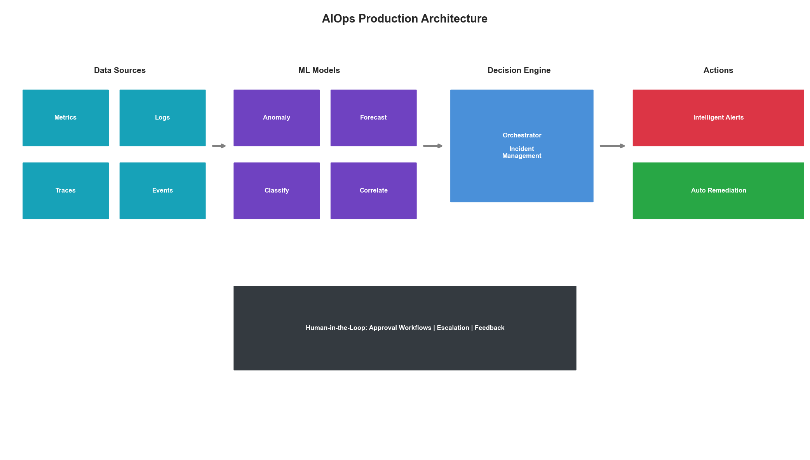
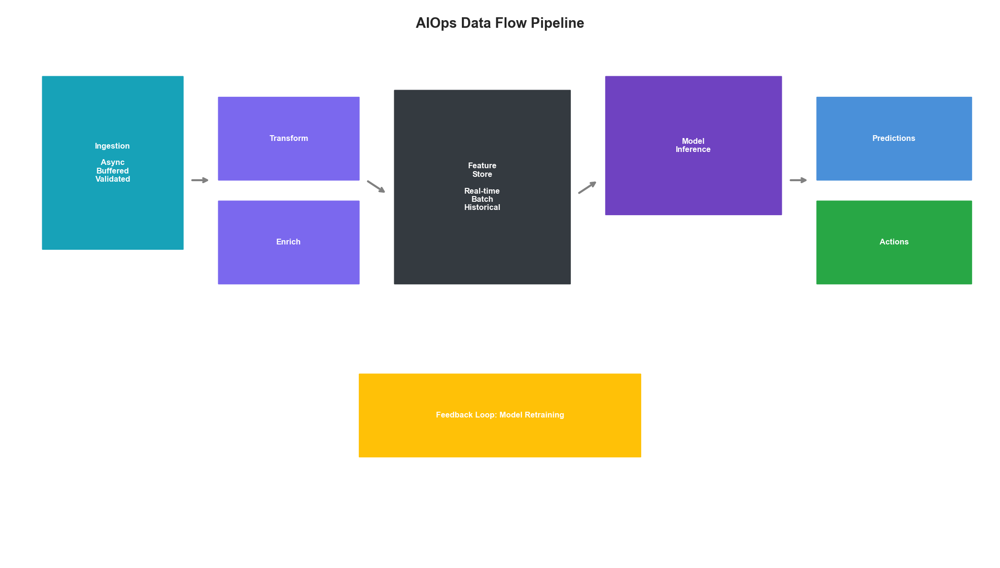
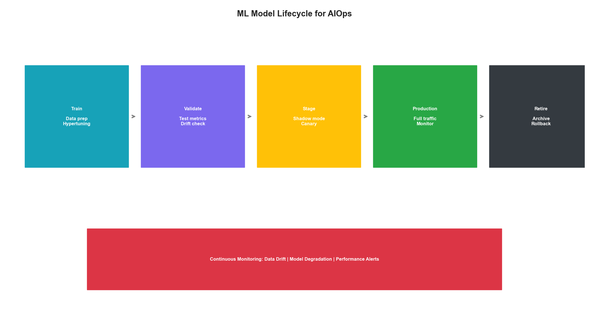
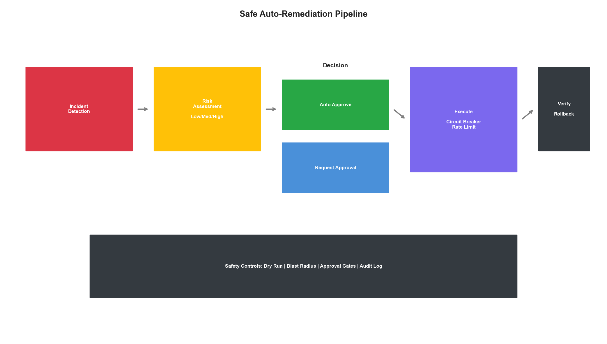

# Chapter 17: AIOps Production

## Introduction

AIOps—Artificial Intelligence for IT Operations—represents the evolution from reactive monitoring to proactive, intelligent infrastructure management. This chapter covers the practical aspects of deploying AIOps in production environments, from building reliable ML pipelines to establishing operational maturity.

Moving from proof-of-concept to production requires addressing challenges unique to ML systems: data drift, model degradation, explainability requirements, and the need for human-in-the-loop oversight.



## AIOps Platform Architecture

### Production-Grade System Design

```python
from dataclasses import dataclass, field
from typing import Dict, List, Optional, Callable
from datetime import datetime, timedelta
from abc import ABC, abstractmethod
import asyncio
import logging

@dataclass
class AIOpsConfig:
    """Configuration for AIOps platform."""
    # Data ingestion
    metrics_retention_days: int = 90
    logs_retention_days: int = 30
    trace_retention_days: int = 7

    # Model serving
    model_inference_timeout_ms: int = 100
    max_concurrent_inferences: int = 1000
    model_cache_size: int = 10

    # Alerting
    min_confidence_for_alert: float = 0.8
    alert_cooldown_minutes: int = 5
    max_alerts_per_hour: int = 100

    # Human oversight
    require_approval_threshold: float = 0.95
    auto_remediate_threshold: float = 0.99


class AIOpsOrchestrator:
    """
    Central orchestrator for AIOps platform.

    Coordinates:
    - Data ingestion and processing
    - Model inference and predictions
    - Alert generation and routing
    - Automated remediation
    - Human-in-the-loop workflows
    """

    def __init__(self, config: AIOpsConfig):
        self.config = config
        self.logger = logging.getLogger('AIOps')

        # Component registries
        self.data_sources: Dict[str, DataSource] = {}
        self.models: Dict[str, MLModel] = {}
        self.alerters: Dict[str, Alerter] = {}
        self.remediators: Dict[str, Remediator] = {}

        # State tracking
        self.active_incidents: Dict[str, Incident] = {}
        self.pending_approvals: Dict[str, ApprovalRequest] = {}

        # Metrics
        self.metrics = AIOpsMetrics()

    def register_data_source(self, name: str, source: 'DataSource'):
        """Register a data source."""
        self.data_sources[name] = source
        self.logger.info(f"Registered data source: {name}")

    def register_model(self, name: str, model: 'MLModel'):
        """Register an ML model."""
        self.models[name] = model
        self.logger.info(f"Registered model: {name}")

    async def run(self):
        """Main event loop."""
        self.logger.info("Starting AIOps orchestrator...")

        tasks = [
            self._ingest_data_loop(),
            self._inference_loop(),
            self._alert_loop(),
            self._remediation_loop(),
            self._health_check_loop()
        ]

        await asyncio.gather(*tasks)

    async def _ingest_data_loop(self):
        """Continuously ingest data from all sources."""
        while True:
            for name, source in self.data_sources.items():
                try:
                    data = await source.fetch()
                    await self._process_data(name, data)
                except Exception as e:
                    self.logger.error(f"Error ingesting from {name}: {e}")
                    self.metrics.record_error('ingestion', name)

            await asyncio.sleep(1)

    async def _inference_loop(self):
        """Run model inference on incoming data."""
        while True:
            for model_name, model in self.models.items():
                try:
                    if model.has_pending_data():
                        predictions = await model.predict()
                        await self._handle_predictions(model_name, predictions)
                except Exception as e:
                    self.logger.error(f"Error in model {model_name}: {e}")
                    self.metrics.record_error('inference', model_name)

            await asyncio.sleep(0.1)

    async def _alert_loop(self):
        """Process predictions and generate alerts."""
        while True:
            await self._process_pending_alerts()
            await asyncio.sleep(1)

    async def _remediation_loop(self):
        """Execute approved remediation actions."""
        while True:
            await self._process_pending_remediations()
            await asyncio.sleep(1)

    async def _health_check_loop(self):
        """Monitor platform health."""
        while True:
            await self._check_platform_health()
            await asyncio.sleep(60)


class DataSource(ABC):
    """Abstract base for data sources."""

    @abstractmethod
    async def fetch(self) -> Dict:
        pass

    @abstractmethod
    def get_schema(self) -> Dict:
        pass


class MLModel(ABC):
    """Abstract base for ML models."""

    @abstractmethod
    async def predict(self) -> List[Dict]:
        pass

    @abstractmethod
    def has_pending_data(self) -> bool:
        pass

    @abstractmethod
    def get_metadata(self) -> Dict:
        pass


@dataclass
class Incident:
    """Represents an active incident."""
    id: str
    type: str
    severity: str
    detected_at: datetime
    source_model: str
    confidence: float
    affected_resources: List[str]
    description: str
    status: str = 'open'
    assigned_to: Optional[str] = None
    remediation_actions: List[Dict] = field(default_factory=list)


@dataclass
class ApprovalRequest:
    """Request for human approval."""
    id: str
    incident_id: str
    action: str
    reason: str
    requested_at: datetime
    expires_at: datetime
    auto_approve: bool = False
```



## ML Pipeline Operations

### Model Training and Deployment Pipeline

```python
from typing import Tuple
import hashlib
import json

@dataclass
class ModelVersion:
    """Tracks model versions."""
    version_id: str
    model_name: str
    created_at: datetime
    training_data_hash: str
    hyperparameters: Dict
    metrics: Dict
    status: str  # 'training', 'validating', 'staging', 'production', 'retired'
    artifact_path: str

class MLPipelineManager:
    """
    Manages ML model lifecycle for AIOps.

    Handles:
    - Automated retraining triggers
    - Model validation and testing
    - Canary deployments
    - Rollback mechanisms
    """

    def __init__(
        self,
        model_registry_path: str,
        artifact_store_path: str
    ):
        self.model_registry_path = model_registry_path
        self.artifact_store_path = artifact_store_path
        self.active_models: Dict[str, ModelVersion] = {}
        self.deployment_history: List[Dict] = []

    async def trigger_retrain(
        self,
        model_name: str,
        reason: str
    ) -> ModelVersion:
        """Trigger model retraining."""
        self.logger.info(f"Triggering retrain for {model_name}: {reason}")

        # Fetch latest training data
        training_data = await self._fetch_training_data(model_name)
        data_hash = self._compute_data_hash(training_data)

        # Create new version
        version_id = f"{model_name}-{datetime.now().strftime('%Y%m%d%H%M%S')}"
        version = ModelVersion(
            version_id=version_id,
            model_name=model_name,
            created_at=datetime.now(),
            training_data_hash=data_hash,
            hyperparameters=self._get_hyperparameters(model_name),
            metrics={},
            status='training',
            artifact_path=f"{self.artifact_store_path}/{version_id}"
        )

        # Train model
        try:
            metrics = await self._train_model(model_name, training_data, version)
            version.metrics = metrics
            version.status = 'validating'

            # Validate model
            if await self._validate_model(version):
                version.status = 'staging'
            else:
                version.status = 'failed'
                raise ValueError("Model validation failed")

        except Exception as e:
            version.status = 'failed'
            raise

        return version

    async def deploy_canary(
        self,
        version: ModelVersion,
        traffic_percentage: float = 5.0
    ) -> Dict:
        """Deploy model as canary."""

        if version.status != 'staging':
            raise ValueError(f"Cannot deploy model in {version.status} status")

        deployment = {
            'version_id': version.version_id,
            'started_at': datetime.now(),
            'traffic_percentage': traffic_percentage,
            'status': 'canary',
            'metrics': {
                'requests': 0,
                'errors': 0,
                'latency_p50': 0,
                'latency_p99': 0
            }
        }

        self.deployment_history.append(deployment)
        return deployment

    async def promote_to_production(
        self,
        version: ModelVersion
    ) -> bool:
        """Promote canary to full production."""

        # Verify canary metrics
        canary_deployment = self._get_active_deployment(version.version_id)
        if not canary_deployment:
            raise ValueError("No active canary deployment found")

        if not self._verify_canary_metrics(canary_deployment):
            self.logger.warning("Canary metrics not satisfactory")
            return False

        # Retire old production model
        old_production = self.active_models.get(version.model_name)
        if old_production:
            old_production.status = 'retired'

        # Promote new model
        version.status = 'production'
        self.active_models[version.model_name] = version

        # Update traffic routing
        canary_deployment['traffic_percentage'] = 100.0
        canary_deployment['status'] = 'production'

        self.logger.info(f"Promoted {version.version_id} to production")
        return True

    async def rollback(
        self,
        model_name: str,
        reason: str
    ) -> bool:
        """Rollback to previous model version."""

        # Find previous production version
        previous = self._find_previous_production(model_name)
        if not previous:
            self.logger.error(f"No previous version to rollback to for {model_name}")
            return False

        # Retire current
        current = self.active_models.get(model_name)
        if current:
            current.status = 'retired'

        # Restore previous
        previous.status = 'production'
        self.active_models[model_name] = previous

        self.logger.warning(f"Rolled back {model_name} to {previous.version_id}: {reason}")
        return True

    def _verify_canary_metrics(self, deployment: Dict) -> bool:
        """Verify canary is performing well."""
        metrics = deployment['metrics']

        # Check error rate
        if metrics['requests'] > 0:
            error_rate = metrics['errors'] / metrics['requests']
            if error_rate > 0.01:  # 1% error threshold
                return False

        # Check latency
        if metrics['latency_p99'] > 200:  # 200ms threshold
            return False

        return True

    def _compute_data_hash(self, data) -> str:
        """Compute hash of training data for versioning."""
        data_str = json.dumps(data, sort_keys=True, default=str)
        return hashlib.sha256(data_str.encode()).hexdigest()[:12]
```

### Data Drift Detection

```python
import numpy as np
from scipy import stats

class DataDriftDetector:
    """
    Detect data drift in production ML systems.

    Methods:
    - Statistical tests (KS, chi-squared)
    - Distribution comparison
    - Feature importance shifts
    """

    def __init__(
        self,
        reference_window_days: int = 7,
        detection_window_hours: int = 1,
        significance_level: float = 0.05
    ):
        self.reference_window_days = reference_window_days
        self.detection_window_hours = detection_window_hours
        self.significance_level = significance_level

        self.reference_distributions: Dict[str, np.ndarray] = {}
        self.drift_alerts: List[Dict] = []

    def set_reference(
        self,
        feature_name: str,
        data: np.ndarray
    ):
        """Set reference distribution for a feature."""
        self.reference_distributions[feature_name] = data

    def detect_drift(
        self,
        feature_name: str,
        current_data: np.ndarray
    ) -> Dict:
        """Detect drift for a specific feature."""

        if feature_name not in self.reference_distributions:
            return {'drift_detected': False, 'reason': 'No reference data'}

        reference = self.reference_distributions[feature_name]

        # Kolmogorov-Smirnov test
        ks_stat, ks_pvalue = stats.ks_2samp(reference, current_data)

        # Population Stability Index
        psi = self._calculate_psi(reference, current_data)

        # Jensen-Shannon divergence
        js_divergence = self._calculate_js_divergence(reference, current_data)

        drift_detected = (
            ks_pvalue < self.significance_level or
            psi > 0.2 or
            js_divergence > 0.1
        )

        result = {
            'feature': feature_name,
            'drift_detected': drift_detected,
            'ks_statistic': float(ks_stat),
            'ks_pvalue': float(ks_pvalue),
            'psi': float(psi),
            'js_divergence': float(js_divergence),
            'reference_mean': float(reference.mean()),
            'current_mean': float(current_data.mean()),
            'reference_std': float(reference.std()),
            'current_std': float(current_data.std())
        }

        if drift_detected:
            self.drift_alerts.append({
                'timestamp': datetime.now(),
                **result
            })

        return result

    def _calculate_psi(
        self,
        reference: np.ndarray,
        current: np.ndarray,
        buckets: int = 10
    ) -> float:
        """Calculate Population Stability Index."""

        # Create buckets based on reference
        breakpoints = np.percentile(reference, np.linspace(0, 100, buckets + 1))
        breakpoints[0] = -np.inf
        breakpoints[-1] = np.inf

        ref_counts = np.histogram(reference, bins=breakpoints)[0] / len(reference)
        cur_counts = np.histogram(current, bins=breakpoints)[0] / len(current)

        # Avoid division by zero
        ref_counts = np.clip(ref_counts, 0.0001, None)
        cur_counts = np.clip(cur_counts, 0.0001, None)

        psi = np.sum((cur_counts - ref_counts) * np.log(cur_counts / ref_counts))
        return psi

    def _calculate_js_divergence(
        self,
        reference: np.ndarray,
        current: np.ndarray,
        bins: int = 50
    ) -> float:
        """Calculate Jensen-Shannon divergence."""

        # Create common histogram bins
        all_data = np.concatenate([reference, current])
        bins_edges = np.histogram_bin_edges(all_data, bins=bins)

        ref_hist = np.histogram(reference, bins=bins_edges, density=True)[0]
        cur_hist = np.histogram(current, bins=bins_edges, density=True)[0]

        # Normalize
        ref_hist = ref_hist / ref_hist.sum()
        cur_hist = cur_hist / cur_hist.sum()

        # Avoid log(0)
        ref_hist = np.clip(ref_hist, 1e-10, None)
        cur_hist = np.clip(cur_hist, 1e-10, None)

        # Jensen-Shannon
        m = 0.5 * (ref_hist + cur_hist)
        js = 0.5 * (stats.entropy(ref_hist, m) + stats.entropy(cur_hist, m))

        return js

    def get_drift_summary(self) -> Dict:
        """Get summary of detected drifts."""
        recent_alerts = [
            a for a in self.drift_alerts
            if a['timestamp'] > datetime.now() - timedelta(hours=24)
        ]

        return {
            'total_alerts_24h': len(recent_alerts),
            'affected_features': list(set(a['feature'] for a in recent_alerts)),
            'alerts': recent_alerts
        }
```



## Intelligent Alerting

### Alert Correlation and Deduplication

```python
from collections import defaultdict
import re

@dataclass
class Alert:
    """Structured alert."""
    id: str
    source: str
    severity: str  # critical, high, medium, low
    title: str
    description: str
    timestamp: datetime
    labels: Dict[str, str]
    annotations: Dict[str, str]
    fingerprint: str
    status: str = 'firing'

class IntelligentAlerter:
    """
    Intelligent alert management with ML-based correlation.

    Features:
    - Alert deduplication
    - Correlation and grouping
    - Root cause identification
    - Alert fatigue reduction
    """

    def __init__(
        self,
        dedup_window_minutes: int = 15,
        correlation_window_minutes: int = 5,
        max_alerts_per_group: int = 100
    ):
        self.dedup_window = timedelta(minutes=dedup_window_minutes)
        self.correlation_window = timedelta(minutes=correlation_window_minutes)
        self.max_alerts_per_group = max_alerts_per_group

        self.active_alerts: Dict[str, Alert] = {}
        self.alert_groups: Dict[str, List[str]] = defaultdict(list)
        self.alert_history: List[Alert] = []

        # ML components
        self.correlation_model = None
        self.severity_model = None

    def process_alert(self, alert: Alert) -> Dict:
        """Process incoming alert."""

        # Check for duplicate
        if self._is_duplicate(alert):
            return {'status': 'deduplicated', 'original_id': alert.fingerprint}

        # Enrich alert
        alert = self._enrich_alert(alert)

        # Find correlated alerts
        correlated = self._find_correlated_alerts(alert)

        # Determine if this is root cause
        is_root_cause = self._is_root_cause(alert, correlated)

        # Calculate effective severity
        effective_severity = self._calculate_effective_severity(alert, correlated)

        # Store alert
        self.active_alerts[alert.id] = alert
        self.alert_history.append(alert)

        # Create or update group
        group_id = self._get_or_create_group(alert, correlated)

        return {
            'status': 'processed',
            'alert_id': alert.id,
            'group_id': group_id,
            'correlated_count': len(correlated),
            'is_root_cause': is_root_cause,
            'effective_severity': effective_severity
        }

    def _is_duplicate(self, alert: Alert) -> bool:
        """Check if alert is a duplicate."""
        for existing in self.active_alerts.values():
            if existing.fingerprint == alert.fingerprint:
                if alert.timestamp - existing.timestamp < self.dedup_window:
                    return True
        return False

    def _enrich_alert(self, alert: Alert) -> Alert:
        """Enrich alert with additional context."""

        # Extract service from labels
        if 'service' not in alert.labels:
            # Try to extract from title or description
            service_pattern = r'service[:\s]+(\w+)'
            match = re.search(service_pattern, alert.title, re.IGNORECASE)
            if match:
                alert.labels['service'] = match.group(1)

        # Add time context
        alert.annotations['hour_of_day'] = str(alert.timestamp.hour)
        alert.annotations['day_of_week'] = str(alert.timestamp.weekday())

        return alert

    def _find_correlated_alerts(self, alert: Alert) -> List[Alert]:
        """Find alerts correlated with this one."""
        correlated = []

        for existing in self.active_alerts.values():
            if existing.id == alert.id:
                continue

            # Time proximity
            time_diff = abs((alert.timestamp - existing.timestamp).total_seconds())
            if time_diff > self.correlation_window.total_seconds():
                continue

            # Label similarity
            if self._labels_overlap(alert.labels, existing.labels):
                correlated.append(existing)
                continue

            # ML-based correlation
            if self.correlation_model:
                score = self._ml_correlation_score(alert, existing)
                if score > 0.7:
                    correlated.append(existing)

        return correlated

    def _labels_overlap(
        self,
        labels1: Dict[str, str],
        labels2: Dict[str, str]
    ) -> bool:
        """Check if labels have significant overlap."""
        common_keys = set(labels1.keys()) & set(labels2.keys())
        if not common_keys:
            return False

        matches = sum(1 for k in common_keys if labels1[k] == labels2[k])
        return matches / len(common_keys) > 0.5

    def _is_root_cause(
        self,
        alert: Alert,
        correlated: List[Alert]
    ) -> bool:
        """Determine if this alert is likely the root cause."""

        if not correlated:
            return True

        # Earliest alert in correlation group
        earliest = min(correlated + [alert], key=lambda a: a.timestamp)
        if alert.id == earliest.id:
            return True

        # Infrastructure layer (lower = more fundamental)
        layer_order = ['hardware', 'network', 'storage', 'compute', 'platform', 'application']
        alert_layer = alert.labels.get('layer', 'application')
        if alert_layer in layer_order:
            alert_idx = layer_order.index(alert_layer)
            for other in correlated:
                other_layer = other.labels.get('layer', 'application')
                if other_layer in layer_order:
                    if layer_order.index(other_layer) < alert_idx:
                        return False
            return True

        return False

    def _calculate_effective_severity(
        self,
        alert: Alert,
        correlated: List[Alert]
    ) -> str:
        """Calculate effective severity considering context."""

        base_severity = {'critical': 4, 'high': 3, 'medium': 2, 'low': 1}
        score = base_severity.get(alert.severity, 2)

        # Increase severity if many correlated alerts
        if len(correlated) > 5:
            score = min(score + 1, 4)

        # Decrease if during known maintenance
        if self._is_maintenance_window():
            score = max(score - 1, 1)

        severity_map = {4: 'critical', 3: 'high', 2: 'medium', 1: 'low'}
        return severity_map.get(score, 'medium')

    def _is_maintenance_window(self) -> bool:
        """Check if currently in maintenance window."""
        # Implementation would check maintenance schedule
        return False

    def _get_or_create_group(
        self,
        alert: Alert,
        correlated: List[Alert]
    ) -> str:
        """Get or create alert group."""

        # Check if any correlated alert is already in a group
        for other in correlated:
            for group_id, members in self.alert_groups.items():
                if other.id in members:
                    if len(members) < self.max_alerts_per_group:
                        self.alert_groups[group_id].append(alert.id)
                        return group_id

        # Create new group
        group_id = f"group-{alert.id}"
        self.alert_groups[group_id] = [alert.id]
        return group_id

    def get_alert_summary(self) -> Dict:
        """Get summary of current alert state."""
        return {
            'active_alerts': len(self.active_alerts),
            'alert_groups': len(self.alert_groups),
            'by_severity': {
                severity: len([a for a in self.active_alerts.values() if a.severity == severity])
                for severity in ['critical', 'high', 'medium', 'low']
            }
        }
```

## Automated Remediation

### Safe Auto-Remediation Engine

```python
@dataclass
class RemediationAction:
    """Represents a remediation action."""
    id: str
    name: str
    description: str
    target_type: str  # pod, node, service, etc.
    target_selector: Dict[str, str]
    action_type: str  # restart, scale, rollback, etc.
    parameters: Dict
    risk_level: str  # low, medium, high
    requires_approval: bool
    rollback_action: Optional[str] = None

class AutoRemediator:
    """
    Automated remediation with safety controls.

    Safety mechanisms:
    - Risk assessment
    - Approval workflows
    - Rate limiting
    - Rollback capability
    - Blast radius limitation
    """

    def __init__(
        self,
        max_actions_per_hour: int = 10,
        approval_timeout_minutes: int = 30,
        dry_run: bool = False
    ):
        self.max_actions_per_hour = max_actions_per_hour
        self.approval_timeout = timedelta(minutes=approval_timeout_minutes)
        self.dry_run = dry_run

        self.action_registry: Dict[str, RemediationAction] = {}
        self.executed_actions: List[Dict] = []
        self.pending_approvals: Dict[str, Dict] = {}

        # Circuit breaker
        self.circuit_breaker = CircuitBreaker(
            failure_threshold=3,
            recovery_timeout_seconds=300
        )

    def register_action(self, action: RemediationAction):
        """Register a remediation action."""
        self.action_registry[action.id] = action

    async def execute(
        self,
        action_id: str,
        incident: Incident,
        context: Dict
    ) -> Dict:
        """Execute a remediation action."""

        action = self.action_registry.get(action_id)
        if not action:
            return {'status': 'error', 'message': f'Unknown action: {action_id}'}

        # Check circuit breaker
        if not self.circuit_breaker.allow_request():
            return {'status': 'blocked', 'message': 'Circuit breaker open'}

        # Check rate limits
        if not self._check_rate_limit():
            return {'status': 'rate_limited', 'message': 'Rate limit exceeded'}

        # Risk assessment
        risk = self._assess_risk(action, incident, context)
        if risk['level'] == 'high' and not context.get('force', False):
            return {
                'status': 'blocked',
                'message': 'High risk action requires explicit approval',
                'risk_assessment': risk
            }

        # Check if approval required
        if action.requires_approval and not context.get('approved', False):
            approval_id = await self._request_approval(action, incident)
            return {
                'status': 'pending_approval',
                'approval_id': approval_id,
                'expires_in': self.approval_timeout.total_seconds()
            }

        # Execute action
        try:
            if self.dry_run:
                result = {'status': 'dry_run', 'would_execute': action.name}
            else:
                result = await self._execute_action(action, incident, context)

            self._record_execution(action, incident, result)
            return result

        except Exception as e:
            self.circuit_breaker.record_failure()
            return {'status': 'error', 'message': str(e)}

    def _assess_risk(
        self,
        action: RemediationAction,
        incident: Incident,
        context: Dict
    ) -> Dict:
        """Assess risk of remediation action."""

        risk_score = 0
        factors = []

        # Base risk from action type
        action_risks = {
            'restart': 1,
            'scale': 2,
            'rollback': 3,
            'terminate': 4,
            'config_change': 3
        }
        risk_score += action_risks.get(action.action_type, 2)
        factors.append(f"Action type: {action.action_type}")

        # Target scope
        if 'namespace' not in action.target_selector:
            risk_score += 2
            factors.append("Broad target scope")

        # Time of day
        hour = datetime.now().hour
        if 9 <= hour <= 17:
            risk_score += 1
            factors.append("Business hours")

        # Recent failures
        recent_failures = len([
            e for e in self.executed_actions[-20:]
            if e['status'] == 'failed'
        ])
        if recent_failures > 2:
            risk_score += 2
            factors.append(f"Recent failures: {recent_failures}")

        # Determine level
        if risk_score <= 3:
            level = 'low'
        elif risk_score <= 6:
            level = 'medium'
        else:
            level = 'high'

        return {
            'score': risk_score,
            'level': level,
            'factors': factors
        }

    def _check_rate_limit(self) -> bool:
        """Check if rate limit allows action."""
        recent = [
            e for e in self.executed_actions
            if e['timestamp'] > datetime.now() - timedelta(hours=1)
        ]
        return len(recent) < self.max_actions_per_hour

    async def _request_approval(
        self,
        action: RemediationAction,
        incident: Incident
    ) -> str:
        """Request human approval for action."""
        approval_id = f"approval-{datetime.now().strftime('%Y%m%d%H%M%S')}"

        self.pending_approvals[approval_id] = {
            'action': action,
            'incident': incident,
            'requested_at': datetime.now(),
            'expires_at': datetime.now() + self.approval_timeout,
            'status': 'pending'
        }

        # Send notification (implementation would integrate with Slack, PagerDuty, etc.)
        await self._send_approval_notification(approval_id, action, incident)

        return approval_id

    async def _execute_action(
        self,
        action: RemediationAction,
        incident: Incident,
        context: Dict
    ) -> Dict:
        """Execute the remediation action."""

        # Implementation would integrate with Kubernetes, cloud APIs, etc.
        self.logger.info(f"Executing {action.name} for incident {incident.id}")

        # Simulate execution
        await asyncio.sleep(1)

        return {
            'status': 'success',
            'action': action.name,
            'target': action.target_selector,
            'executed_at': datetime.now().isoformat()
        }

    def _record_execution(
        self,
        action: RemediationAction,
        incident: Incident,
        result: Dict
    ):
        """Record action execution for audit."""
        self.executed_actions.append({
            'timestamp': datetime.now(),
            'action_id': action.id,
            'action_name': action.name,
            'incident_id': incident.id,
            'status': result.get('status', 'unknown'),
            'result': result
        })


class CircuitBreaker:
    """Circuit breaker pattern for remediation safety."""

    def __init__(
        self,
        failure_threshold: int = 5,
        recovery_timeout_seconds: int = 60
    ):
        self.failure_threshold = failure_threshold
        self.recovery_timeout = timedelta(seconds=recovery_timeout_seconds)
        self.failures = 0
        self.last_failure: Optional[datetime] = None
        self.state = 'closed'  # closed, open, half-open

    def allow_request(self) -> bool:
        """Check if request should be allowed."""
        if self.state == 'closed':
            return True

        if self.state == 'open':
            if datetime.now() - self.last_failure > self.recovery_timeout:
                self.state = 'half-open'
                return True
            return False

        # half-open: allow one request to test
        return True

    def record_failure(self):
        """Record a failure."""
        self.failures += 1
        self.last_failure = datetime.now()

        if self.failures >= self.failure_threshold:
            self.state = 'open'

    def record_success(self):
        """Record a success."""
        self.failures = 0
        self.state = 'closed'
```



## Key Takeaways

1. **Production ML is Different**: Focus on reliability, monitoring, and graceful degradation
2. **Drift Detection is Critical**: Continuously monitor for data and concept drift
3. **Intelligent Alerting**: Reduce noise through correlation, deduplication, and prioritization
4. **Safe Remediation**: Use circuit breakers, rate limits, and approval workflows
5. **Human-in-the-Loop**: Maintain human oversight for high-risk decisions

AIOps production success requires balancing automation benefits with operational safety. Start with monitoring and alerting, graduate to assisted remediation, and only enable full automation for well-understood, low-risk scenarios.
