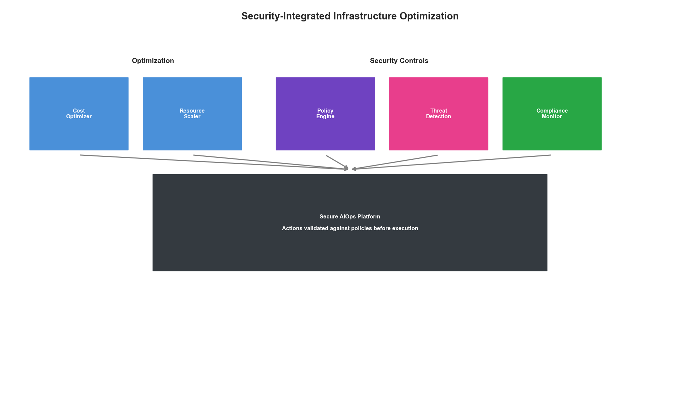
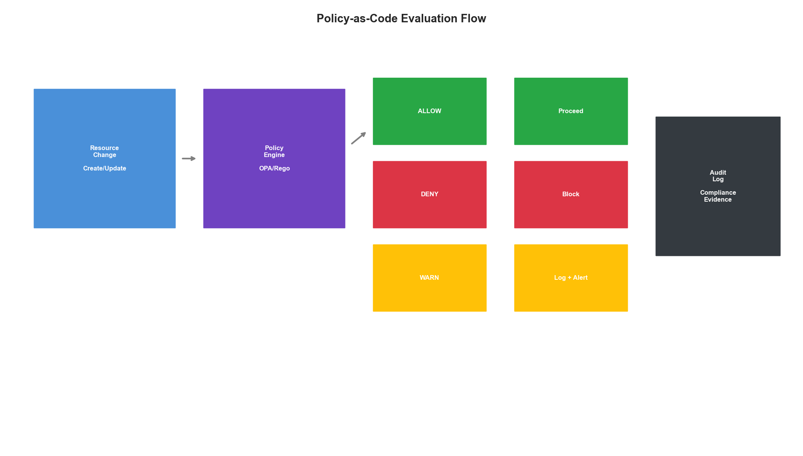
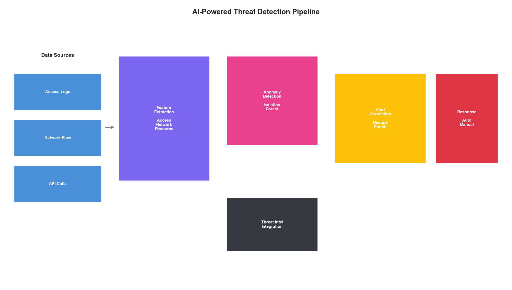
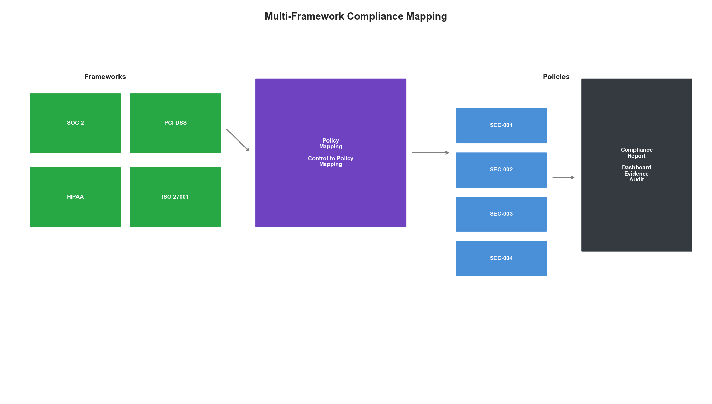

# Chapter 18: Security and Compliance Automation

## Introduction

AI-powered infrastructure optimization introduces new security considerations while also providing opportunities to enhance security posture. This chapter covers the integration of security and compliance automation into your AIOps platform—from continuous compliance monitoring to automated threat detection and response.

The key challenge is balancing automation speed with security requirements. Optimization decisions must respect security boundaries while security systems must not impede legitimate optimization.



## Policy as Code for Infrastructure

### Declarative Security Policies

```python
from dataclasses import dataclass, field
from typing import Dict, List, Optional, Callable, Any
from enum import Enum
import re
import json

class PolicySeverity(Enum):
    CRITICAL = "critical"
    HIGH = "high"
    MEDIUM = "medium"
    LOW = "low"
    INFO = "info"

class PolicyAction(Enum):
    DENY = "deny"
    WARN = "warn"
    AUDIT = "audit"
    REMEDIATE = "remediate"

@dataclass
class PolicyRule:
    """Individual policy rule."""
    id: str
    name: str
    description: str
    severity: PolicySeverity
    action: PolicyAction
    resource_types: List[str]
    condition: str  # Rego or Python expression
    remediation: Optional[str] = None
    exceptions: List[str] = field(default_factory=list)
    tags: Dict[str, str] = field(default_factory=dict)

@dataclass
class PolicyViolation:
    """Represents a policy violation."""
    rule_id: str
    rule_name: str
    severity: PolicySeverity
    action: PolicyAction
    resource_id: str
    resource_type: str
    description: str
    remediation_available: bool
    details: Dict[str, Any]

class PolicyEngine:
    """
    Policy-as-Code engine for infrastructure security.

    Supports:
    - Rego policies (OPA-compatible)
    - Python-based policies
    - Custom policy languages
    """

    def __init__(self):
        self.rules: Dict[str, PolicyRule] = {}
        self.exemptions: Dict[str, List[str]] = {}
        self.violation_handlers: Dict[PolicyAction, Callable] = {}

    def load_rules(self, rules: List[PolicyRule]):
        """Load policy rules."""
        for rule in rules:
            self.rules[rule.id] = rule

    def add_exemption(self, resource_id: str, rule_ids: List[str]):
        """Add exemption for a resource."""
        self.exemptions[resource_id] = rule_ids

    def evaluate(
        self,
        resource: Dict[str, Any]
    ) -> List[PolicyViolation]:
        """Evaluate resource against all applicable policies."""
        violations = []
        resource_type = resource.get('type', 'unknown')
        resource_id = resource.get('id', 'unknown')

        for rule_id, rule in self.rules.items():
            # Check if rule applies to this resource type
            if resource_type not in rule.resource_types and '*' not in rule.resource_types:
                continue

            # Check exemptions
            if resource_id in self.exemptions:
                if rule_id in self.exemptions[resource_id]:
                    continue

            # Evaluate condition
            try:
                if self._evaluate_condition(rule.condition, resource):
                    violations.append(PolicyViolation(
                        rule_id=rule_id,
                        rule_name=rule.name,
                        severity=rule.severity,
                        action=rule.action,
                        resource_id=resource_id,
                        resource_type=resource_type,
                        description=rule.description,
                        remediation_available=rule.remediation is not None,
                        details={'resource': resource}
                    ))
            except Exception as e:
                violations.append(PolicyViolation(
                    rule_id=rule_id,
                    rule_name=rule.name,
                    severity=PolicySeverity.HIGH,
                    action=PolicyAction.AUDIT,
                    resource_id=resource_id,
                    resource_type=resource_type,
                    description=f"Policy evaluation error: {str(e)}",
                    remediation_available=False,
                    details={'error': str(e)}
                ))

        return violations

    def _evaluate_condition(
        self,
        condition: str,
        resource: Dict[str, Any]
    ) -> bool:
        """Evaluate policy condition against resource."""
        # Simple Python expression evaluator
        # In production, use OPA/Rego or sandboxed evaluation
        local_vars = {'resource': resource}

        # Add helper functions
        local_vars['has_tag'] = lambda key: key in resource.get('tags', {})
        local_vars['tag_value'] = lambda key: resource.get('tags', {}).get(key)
        local_vars['is_public'] = lambda: resource.get('public', False)
        local_vars['has_encryption'] = lambda: resource.get('encryption', {}).get('enabled', False)

        return eval(condition, {"__builtins__": {}}, local_vars)


# Example policies
SECURITY_POLICIES = [
    PolicyRule(
        id="SEC-001",
        name="Require encryption at rest",
        description="All storage resources must have encryption enabled",
        severity=PolicySeverity.HIGH,
        action=PolicyAction.DENY,
        resource_types=["storage", "database", "volume"],
        condition="not has_encryption()",
        remediation="Enable encryption using KMS key"
    ),
    PolicyRule(
        id="SEC-002",
        name="No public access to databases",
        description="Databases must not be publicly accessible",
        severity=PolicySeverity.CRITICAL,
        action=PolicyAction.DENY,
        resource_types=["database"],
        condition="is_public()",
        remediation="Disable public access and use VPC endpoints"
    ),
    PolicyRule(
        id="SEC-003",
        name="Require environment tags",
        description="All resources must have environment tag",
        severity=PolicySeverity.MEDIUM,
        action=PolicyAction.WARN,
        resource_types=["*"],
        condition="not has_tag('environment')",
        remediation="Add 'environment' tag with value: dev, staging, or prod"
    ),
    PolicyRule(
        id="SEC-004",
        name="Restrict instance types in production",
        description="Production must use approved instance types",
        severity=PolicySeverity.HIGH,
        action=PolicyAction.DENY,
        resource_types=["compute"],
        condition="tag_value('environment') == 'prod' and resource.get('instance_type', '').startswith('t2')",
        remediation="Use t3 or larger instance types in production"
    )
]
```

### Continuous Compliance Monitoring

```python
from datetime import datetime, timedelta
import asyncio

class ComplianceMonitor:
    """
    Continuous compliance monitoring for infrastructure.

    Features:
    - Real-time policy evaluation
    - Compliance drift detection
    - Automated reporting
    - Integration with ticketing systems
    """

    def __init__(
        self,
        policy_engine: PolicyEngine,
        scan_interval_minutes: int = 15
    ):
        self.policy_engine = policy_engine
        self.scan_interval = timedelta(minutes=scan_interval_minutes)
        self.compliance_state: Dict[str, Dict] = {}
        self.violation_history: List[Dict] = []

    async def start_monitoring(self, resource_provider: Callable):
        """Start continuous compliance monitoring."""
        while True:
            await self._run_compliance_scan(resource_provider)
            await asyncio.sleep(self.scan_interval.total_seconds())

    async def _run_compliance_scan(self, resource_provider: Callable):
        """Run a full compliance scan."""
        scan_start = datetime.now()
        resources = await resource_provider()

        total_resources = len(resources)
        compliant_resources = 0
        violations_found = []

        for resource in resources:
            violations = self.policy_engine.evaluate(resource)

            if violations:
                violations_found.extend(violations)
                self._update_compliance_state(resource['id'], violations)
            else:
                compliant_resources += 1
                self._mark_compliant(resource['id'])

        # Generate scan report
        scan_report = {
            'timestamp': scan_start.isoformat(),
            'duration_seconds': (datetime.now() - scan_start).total_seconds(),
            'total_resources': total_resources,
            'compliant_resources': compliant_resources,
            'compliance_rate': compliant_resources / max(total_resources, 1) * 100,
            'violations': {
                'total': len(violations_found),
                'by_severity': self._group_by_severity(violations_found),
                'by_rule': self._group_by_rule(violations_found)
            }
        }

        # Handle violations based on action
        await self._handle_violations(violations_found)

        return scan_report

    def _update_compliance_state(
        self,
        resource_id: str,
        violations: List[PolicyViolation]
    ):
        """Update compliance state for a resource."""
        self.compliance_state[resource_id] = {
            'status': 'non_compliant',
            'last_checked': datetime.now().isoformat(),
            'violations': [v.rule_id for v in violations],
            'severity': max(v.severity.value for v in violations)
        }

    def _mark_compliant(self, resource_id: str):
        """Mark resource as compliant."""
        prev_state = self.compliance_state.get(resource_id, {})

        self.compliance_state[resource_id] = {
            'status': 'compliant',
            'last_checked': datetime.now().isoformat(),
            'violations': [],
            'was_remediated': prev_state.get('status') == 'non_compliant'
        }

    async def _handle_violations(self, violations: List[PolicyViolation]):
        """Handle violations based on their action type."""
        for violation in violations:
            if violation.action == PolicyAction.DENY:
                await self._block_resource(violation)
            elif violation.action == PolicyAction.REMEDIATE:
                await self._auto_remediate(violation)
            elif violation.action == PolicyAction.WARN:
                await self._send_warning(violation)
            # AUDIT actions are logged but no action taken

            self.violation_history.append({
                'timestamp': datetime.now().isoformat(),
                'violation': violation.__dict__
            })

    async def _block_resource(self, violation: PolicyViolation):
        """Block non-compliant resource."""
        # Implementation would integrate with cloud APIs
        pass

    async def _auto_remediate(self, violation: PolicyViolation):
        """Attempt automatic remediation."""
        # Implementation would apply remediation
        pass

    async def _send_warning(self, violation: PolicyViolation):
        """Send warning notification."""
        # Implementation would send to Slack/PagerDuty
        pass

    def _group_by_severity(self, violations: List[PolicyViolation]) -> Dict:
        """Group violations by severity."""
        groups = {}
        for v in violations:
            key = v.severity.value
            groups[key] = groups.get(key, 0) + 1
        return groups

    def _group_by_rule(self, violations: List[PolicyViolation]) -> Dict:
        """Group violations by rule."""
        groups = {}
        for v in violations:
            groups[v.rule_id] = groups.get(v.rule_id, 0) + 1
        return groups

    def get_compliance_dashboard(self) -> Dict:
        """Get compliance dashboard data."""
        total = len(self.compliance_state)
        compliant = sum(1 for s in self.compliance_state.values() if s['status'] == 'compliant')

        return {
            'overall_compliance': compliant / max(total, 1) * 100,
            'total_resources': total,
            'compliant_resources': compliant,
            'non_compliant_resources': total - compliant,
            'recent_violations': self.violation_history[-100:],
            'by_severity': self._aggregate_by_severity()
        }

    def _aggregate_by_severity(self) -> Dict:
        """Aggregate compliance state by severity."""
        result = {'critical': 0, 'high': 0, 'medium': 0, 'low': 0}
        for state in self.compliance_state.values():
            if state['status'] == 'non_compliant':
                result[state.get('severity', 'medium')] += 1
        return result
```



## AI-Powered Threat Detection

### Anomaly-Based Security Detection

```python
import numpy as np
from sklearn.ensemble import IsolationForest
from collections import deque

class SecurityAnomalyDetector:
    """
    ML-based security anomaly detection.

    Detects:
    - Unusual access patterns
    - Privilege escalation attempts
    - Data exfiltration indicators
    - Configuration drift
    """

    def __init__(
        self,
        contamination: float = 0.01,
        history_size: int = 10000
    ):
        self.contamination = contamination
        self.history = deque(maxlen=history_size)

        # Multiple specialized detectors
        self.detectors = {
            'access': IsolationForest(contamination=contamination, random_state=42),
            'network': IsolationForest(contamination=contamination, random_state=42),
            'resource': IsolationForest(contamination=contamination, random_state=42)
        }

        self.is_trained = False
        self.alerts: List[Dict] = []

    def add_event(self, event: Dict):
        """Add security event for analysis."""
        features = self._extract_features(event)
        self.history.append({
            'timestamp': datetime.now(),
            'event': event,
            'features': features
        })

    def train(self, min_samples: int = 1000):
        """Train detection models on historical data."""
        if len(self.history) < min_samples:
            return False

        # Prepare training data
        access_features = []
        network_features = []
        resource_features = []

        for record in self.history:
            features = record['features']
            access_features.append(features['access'])
            network_features.append(features['network'])
            resource_features.append(features['resource'])

        # Train each detector
        self.detectors['access'].fit(np.array(access_features))
        self.detectors['network'].fit(np.array(network_features))
        self.detectors['resource'].fit(np.array(resource_features))

        self.is_trained = True
        return True

    def detect(self, event: Dict) -> Optional[Dict]:
        """Detect anomalies in a security event."""
        if not self.is_trained:
            return None

        features = self._extract_features(event)
        anomalies = {}

        for detector_name, detector in self.detectors.items():
            feature_vector = np.array([features[detector_name]])
            score = detector.decision_function(feature_vector)[0]
            prediction = detector.predict(feature_vector)[0]

            if prediction == -1:  # Anomaly
                anomalies[detector_name] = {
                    'score': float(score),
                    'is_anomaly': True
                }

        if anomalies:
            alert = {
                'timestamp': datetime.now().isoformat(),
                'event': event,
                'anomalies': anomalies,
                'severity': self._calculate_severity(anomalies)
            }
            self.alerts.append(alert)
            return alert

        return None

    def _extract_features(self, event: Dict) -> Dict[str, List[float]]:
        """Extract feature vectors from security event."""
        return {
            'access': [
                event.get('hour_of_day', 0) / 24,
                event.get('day_of_week', 0) / 7,
                1 if event.get('is_privileged', False) else 0,
                len(event.get('resources_accessed', [])) / 100,
                event.get('failed_attempts', 0) / 10,
                1 if event.get('mfa_used', True) else 0,
                event.get('session_duration_minutes', 0) / 480
            ],
            'network': [
                event.get('bytes_transferred', 0) / 1e9,
                event.get('connection_count', 0) / 1000,
                event.get('unique_destinations', 0) / 100,
                1 if event.get('uses_vpn', True) else 0,
                event.get('port_count', 0) / 100,
                1 if event.get('encrypted', True) else 0
            ],
            'resource': [
                event.get('api_calls', 0) / 1000,
                event.get('config_changes', 0) / 100,
                event.get('permission_changes', 0) / 50,
                event.get('resource_creations', 0) / 100,
                event.get('resource_deletions', 0) / 100
            ]
        }

    def _calculate_severity(self, anomalies: Dict) -> str:
        """Calculate overall severity from anomaly scores."""
        avg_score = sum(a['score'] for a in anomalies.values()) / len(anomalies)

        if avg_score < -0.5:
            return 'critical'
        elif avg_score < -0.3:
            return 'high'
        elif avg_score < -0.1:
            return 'medium'
        else:
            return 'low'


class ThreatIntelligenceIntegrator:
    """
    Integrate threat intelligence feeds for enhanced detection.
    """

    def __init__(self):
        self.indicators: Dict[str, Dict] = {}
        self.feed_sources: List[str] = []

    def add_feed(self, feed_url: str, feed_type: str):
        """Add threat intelligence feed."""
        self.feed_sources.append({
            'url': feed_url,
            'type': feed_type,
            'last_updated': None
        })

    async def update_feeds(self):
        """Update all threat intelligence feeds."""
        for feed in self.feed_sources:
            try:
                indicators = await self._fetch_feed(feed['url'])
                for indicator in indicators:
                    self.indicators[indicator['value']] = {
                        'type': indicator['type'],
                        'severity': indicator['severity'],
                        'source': feed['url'],
                        'added': datetime.now().isoformat()
                    }
                feed['last_updated'] = datetime.now().isoformat()
            except Exception as e:
                print(f"Error updating feed {feed['url']}: {e}")

    def check_indicator(self, value: str, indicator_type: str) -> Optional[Dict]:
        """Check if value matches known threat indicator."""
        if value in self.indicators:
            indicator = self.indicators[value]
            if indicator['type'] == indicator_type or indicator_type == 'any':
                return indicator
        return None

    async def _fetch_feed(self, url: str) -> List[Dict]:
        """Fetch indicators from feed URL."""
        # Implementation would fetch from actual threat feeds
        return []
```



## Compliance Frameworks Integration

### Multi-Framework Compliance

```python
class ComplianceFramework:
    """Base class for compliance frameworks."""

    def __init__(self, framework_id: str, name: str):
        self.framework_id = framework_id
        self.name = name
        self.controls: Dict[str, Dict] = {}

    def add_control(
        self,
        control_id: str,
        title: str,
        description: str,
        policy_mappings: List[str]
    ):
        """Add a control to the framework."""
        self.controls[control_id] = {
            'title': title,
            'description': description,
            'policy_mappings': policy_mappings,
            'status': 'unknown'
        }

    def get_compliance_status(
        self,
        policy_results: Dict[str, bool]
    ) -> Dict:
        """Calculate compliance status for framework."""
        results = {}

        for control_id, control in self.controls.items():
            mapped_policies = control['policy_mappings']

            if not mapped_policies:
                results[control_id] = {'status': 'not_mapped', 'policies': []}
                continue

            policy_statuses = [
                policy_results.get(p, None) for p in mapped_policies
            ]

            if all(s is True for s in policy_statuses):
                status = 'compliant'
            elif any(s is False for s in policy_statuses):
                status = 'non_compliant'
            else:
                status = 'unknown'

            results[control_id] = {
                'status': status,
                'policies': list(zip(mapped_policies, policy_statuses))
            }

        return results


# Example frameworks
class SOC2Framework(ComplianceFramework):
    """SOC 2 Type II compliance framework."""

    def __init__(self):
        super().__init__('soc2', 'SOC 2 Type II')

        # Trust Service Criteria
        self.add_control('CC6.1', 'Logical Access Controls',
                        'Restrict logical access to systems',
                        ['SEC-001', 'SEC-002', 'SEC-005'])
        self.add_control('CC6.6', 'Encryption',
                        'Protect data in transit and at rest',
                        ['SEC-001', 'SEC-006'])
        self.add_control('CC7.2', 'System Monitoring',
                        'Monitor systems for anomalies',
                        ['SEC-010', 'SEC-011'])


class PCIDSSFramework(ComplianceFramework):
    """PCI DSS 4.0 compliance framework."""

    def __init__(self):
        super().__init__('pci-dss', 'PCI DSS 4.0')

        self.add_control('1.3', 'Network Segmentation',
                        'Restrict inbound and outbound traffic',
                        ['SEC-002', 'SEC-007'])
        self.add_control('3.4', 'Data Encryption',
                        'Render PAN unreadable anywhere it is stored',
                        ['SEC-001', 'SEC-008'])
        self.add_control('10.2', 'Audit Logs',
                        'Implement automated audit trails',
                        ['SEC-009', 'SEC-010'])


class ComplianceReportGenerator:
    """Generate compliance reports for audits."""

    def __init__(self):
        self.frameworks: Dict[str, ComplianceFramework] = {}

    def register_framework(self, framework: ComplianceFramework):
        """Register a compliance framework."""
        self.frameworks[framework.framework_id] = framework

    def generate_report(
        self,
        policy_results: Dict[str, bool],
        framework_id: Optional[str] = None
    ) -> Dict:
        """Generate compliance report."""

        if framework_id:
            frameworks = {framework_id: self.frameworks[framework_id]}
        else:
            frameworks = self.frameworks

        report = {
            'generated_at': datetime.now().isoformat(),
            'frameworks': {}
        }

        for fid, framework in frameworks.items():
            status = framework.get_compliance_status(policy_results)

            total_controls = len(status)
            compliant = sum(1 for s in status.values() if s['status'] == 'compliant')

            report['frameworks'][fid] = {
                'name': framework.name,
                'total_controls': total_controls,
                'compliant_controls': compliant,
                'compliance_rate': compliant / max(total_controls, 1) * 100,
                'controls': status
            }

        return report

    def generate_audit_evidence(
        self,
        framework_id: str,
        control_id: str,
        policy_engine: PolicyEngine
    ) -> Dict:
        """Generate audit evidence for a specific control."""

        framework = self.frameworks.get(framework_id)
        if not framework:
            return {'error': 'Framework not found'}

        control = framework.controls.get(control_id)
        if not control:
            return {'error': 'Control not found'}

        evidence = {
            'framework': framework.name,
            'control_id': control_id,
            'control_title': control['title'],
            'generated_at': datetime.now().isoformat(),
            'policies': []
        }

        for policy_id in control['policy_mappings']:
            rule = policy_engine.rules.get(policy_id)
            if rule:
                evidence['policies'].append({
                    'policy_id': policy_id,
                    'name': rule.name,
                    'description': rule.description,
                    'condition': rule.condition
                })

        return evidence
```



## Secure AI/ML Operations

### ML Security Best Practices

```python
class SecureMLPipeline:
    """
    Security wrapper for ML operations.

    Implements:
    - Model signing and verification
    - Input validation
    - Output sanitization
    - Audit logging
    """

    def __init__(
        self,
        model_path: str,
        signing_key_path: str
    ):
        self.model_path = model_path
        self.signing_key_path = signing_key_path
        self.audit_log: List[Dict] = []

    def verify_model_integrity(self) -> bool:
        """Verify model hasn't been tampered with."""
        import hashlib
        import hmac

        # Load model hash
        with open(f"{self.model_path}.sha256", 'r') as f:
            expected_hash = f.read().strip()

        # Calculate current hash
        with open(self.model_path, 'rb') as f:
            actual_hash = hashlib.sha256(f.read()).hexdigest()

        is_valid = hmac.compare_digest(expected_hash, actual_hash)

        self._log_audit('model_verification', {
            'result': 'valid' if is_valid else 'invalid',
            'expected_hash': expected_hash[:16] + '...',
            'actual_hash': actual_hash[:16] + '...'
        })

        return is_valid

    def validate_input(self, input_data: Dict) -> Tuple[bool, str]:
        """Validate input data before inference."""

        # Check for injection attempts
        if self._contains_injection(input_data):
            self._log_audit('input_validation', {
                'result': 'rejected',
                'reason': 'injection_detected'
            })
            return False, "Potential injection detected"

        # Check data bounds
        if not self._check_bounds(input_data):
            self._log_audit('input_validation', {
                'result': 'rejected',
                'reason': 'out_of_bounds'
            })
            return False, "Input out of expected bounds"

        # Check for adversarial patterns
        if self._detect_adversarial(input_data):
            self._log_audit('input_validation', {
                'result': 'flagged',
                'reason': 'potential_adversarial'
            })
            # Allow but flag for review

        self._log_audit('input_validation', {'result': 'accepted'})
        return True, "Valid"

    def sanitize_output(self, output: Dict) -> Dict:
        """Sanitize model output before returning."""

        sanitized = {}

        for key, value in output.items():
            # Remove any sensitive data that might leak
            if self._is_sensitive_key(key):
                sanitized[key] = '[REDACTED]'
            elif isinstance(value, str):
                # Sanitize string outputs
                sanitized[key] = self._sanitize_string(value)
            else:
                sanitized[key] = value

        self._log_audit('output_sanitization', {
            'keys_redacted': sum(1 for k in output if self._is_sensitive_key(k))
        })

        return sanitized

    def _contains_injection(self, data: Dict) -> bool:
        """Check for injection attempts."""
        dangerous_patterns = [
            r'<script',
            r'javascript:',
            r'\$\{.*\}',
            r'{{.*}}',
            r'\\x[0-9a-fA-F]{2}'
        ]

        data_str = json.dumps(data)
        for pattern in dangerous_patterns:
            if re.search(pattern, data_str, re.IGNORECASE):
                return True
        return False

    def _check_bounds(self, data: Dict) -> bool:
        """Check if input is within expected bounds."""
        # Implementation would check specific bounds
        return True

    def _detect_adversarial(self, data: Dict) -> bool:
        """Detect potential adversarial inputs."""
        # Implementation would use adversarial detection
        return False

    def _is_sensitive_key(self, key: str) -> bool:
        """Check if key contains sensitive data."""
        sensitive_patterns = ['password', 'secret', 'key', 'token', 'credential']
        return any(p in key.lower() for p in sensitive_patterns)

    def _sanitize_string(self, value: str) -> str:
        """Sanitize string value."""
        # Remove control characters
        return ''.join(c for c in value if c.isprintable())

    def _log_audit(self, event_type: str, details: Dict):
        """Log audit event."""
        self.audit_log.append({
            'timestamp': datetime.now().isoformat(),
            'event_type': event_type,
            'details': details
        })
```

## Key Takeaways

1. **Policy as Code**: Define security policies declaratively for consistent enforcement
2. **Continuous Compliance**: Monitor compliance in real-time, not just during audits
3. **AI-Enhanced Detection**: Use ML to detect anomalies traditional rules miss
4. **Framework Mapping**: Map policies to multiple compliance frameworks
5. **Secure ML**: Apply security principles to ML pipelines themselves

Security and compliance automation enables organizations to move fast while maintaining strong security posture. The key is treating security as code—versionable, testable, and continuously enforced.
