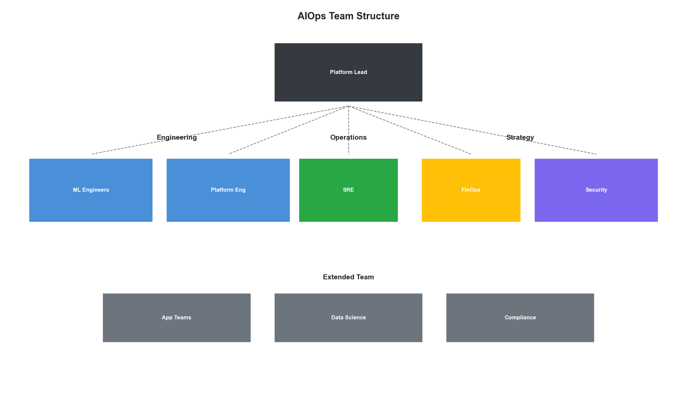
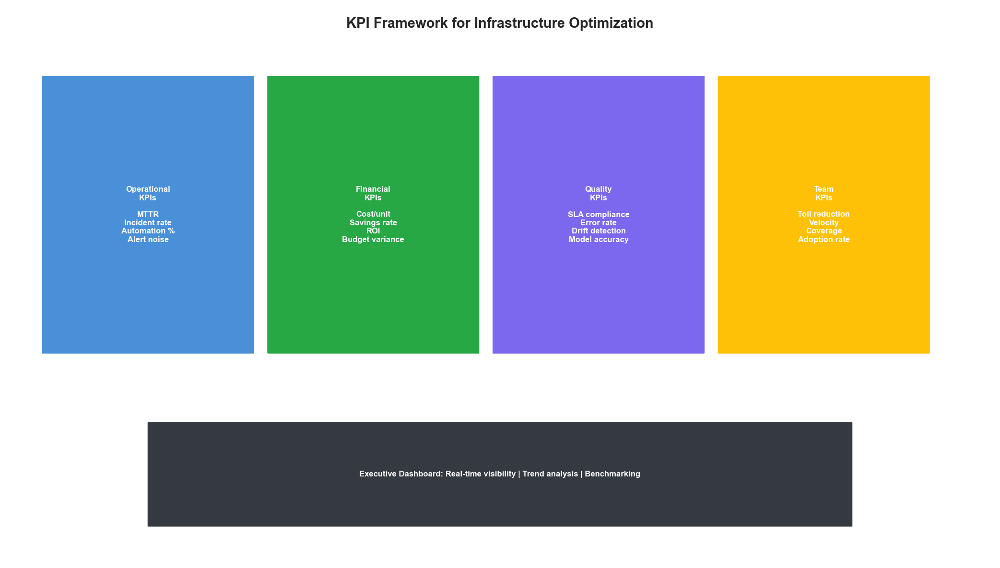

# Chapter 19: Implementation Roadmap

## Introduction

Transforming infrastructure operations with AI is a journey, not a destination. This chapter provides a practical roadmap for implementing the concepts covered throughout this book—from initial assessment through mature autonomous operations.

Success requires balancing ambition with pragmatism. Start with high-impact, low-risk use cases, build organizational capability, and progressively expand scope as confidence grows.


## Maturity Assessment

### AIOps Maturity Model

```python
from dataclasses import dataclass
from typing import Dict, List
from enum import Enum

class MaturityLevel(Enum):
    LEVEL_0_REACTIVE = 0      # Manual, reactive operations
    LEVEL_1_MONITORED = 1     # Basic monitoring and alerting
    LEVEL_2_ANALYZED = 2      # ML-assisted analysis
    LEVEL_3_AUTOMATED = 3     # Automated recommendations
    LEVEL_4_AUTONOMOUS = 4    # Self-healing infrastructure

@dataclass
class MaturityDimension:
    """Assessment dimension for maturity."""
    name: str
    current_level: MaturityLevel
    target_level: MaturityLevel
    gaps: List[str]
    actions: List[str]

class MaturityAssessment:
    """
    Assess current AIOps maturity and identify improvement areas.
    """

    DIMENSIONS = [
        'data_collection',
        'analytics',
        'automation',
        'governance',
        'team_capability',
        'tooling'
    ]

    def __init__(self):
        self.dimensions: Dict[str, MaturityDimension] = {}
        self.questions = self._load_assessment_questions()

    def _load_assessment_questions(self) -> Dict[str, List[Dict]]:
        """Load assessment questions by dimension."""
        return {
            'data_collection': [
                {'question': 'Are metrics collected from all critical systems?',
                 'level_1': True, 'level_2': True, 'level_3': True, 'level_4': True},
                {'question': 'Is log aggregation centralized?',
                 'level_1': False, 'level_2': True, 'level_3': True, 'level_4': True},
                {'question': 'Are traces collected for request flows?',
                 'level_1': False, 'level_2': True, 'level_3': True, 'level_4': True},
                {'question': 'Is data retention policy automated?',
                 'level_1': False, 'level_2': False, 'level_3': True, 'level_4': True},
                {'question': 'Is real-time streaming enabled?',
                 'level_1': False, 'level_2': False, 'level_3': True, 'level_4': True}
            ],
            'analytics': [
                {'question': 'Are threshold-based alerts configured?',
                 'level_1': True, 'level_2': True, 'level_3': True, 'level_4': True},
                {'question': 'Is anomaly detection deployed?',
                 'level_1': False, 'level_2': True, 'level_3': True, 'level_4': True},
                {'question': 'Are forecasting models used?',
                 'level_1': False, 'level_2': False, 'level_3': True, 'level_4': True},
                {'question': 'Is root cause analysis automated?',
                 'level_1': False, 'level_2': False, 'level_3': True, 'level_4': True},
                {'question': 'Are models continuously retrained?',
                 'level_1': False, 'level_2': False, 'level_3': False, 'level_4': True}
            ],
            'automation': [
                {'question': 'Are runbooks documented?',
                 'level_1': True, 'level_2': True, 'level_3': True, 'level_4': True},
                {'question': 'Are common remediations scripted?',
                 'level_1': False, 'level_2': True, 'level_3': True, 'level_4': True},
                {'question': 'Is auto-scaling implemented?',
                 'level_1': False, 'level_2': True, 'level_3': True, 'level_4': True},
                {'question': 'Are recommendations auto-generated?',
                 'level_1': False, 'level_2': False, 'level_3': True, 'level_4': True},
                {'question': 'Is autonomous remediation enabled?',
                 'level_1': False, 'level_2': False, 'level_3': False, 'level_4': True}
            ],
            'governance': [
                {'question': 'Are change management processes defined?',
                 'level_1': True, 'level_2': True, 'level_3': True, 'level_4': True},
                {'question': 'Is automation approval workflow in place?',
                 'level_1': False, 'level_2': True, 'level_3': True, 'level_4': True},
                {'question': 'Are ML models versioned and audited?',
                 'level_1': False, 'level_2': False, 'level_3': True, 'level_4': True},
                {'question': 'Is explainability required for decisions?',
                 'level_1': False, 'level_2': False, 'level_3': True, 'level_4': True},
                {'question': 'Is continuous compliance monitoring enabled?',
                 'level_1': False, 'level_2': False, 'level_3': False, 'level_4': True}
            ]
        }

    def assess(self, responses: Dict[str, Dict[str, bool]]) -> Dict:
        """Run maturity assessment based on responses."""
        results = {}

        for dimension, questions in self.questions.items():
            dimension_responses = responses.get(dimension, {})

            # Calculate current level
            current_level = MaturityLevel.LEVEL_0_REACTIVE
            for level in [MaturityLevel.LEVEL_4_AUTONOMOUS,
                          MaturityLevel.LEVEL_3_AUTOMATED,
                          MaturityLevel.LEVEL_2_ANALYZED,
                          MaturityLevel.LEVEL_1_MONITORED]:
                level_key = f'level_{level.value}'
                required = [q for q in questions if q.get(level_key, False)]
                met = all(dimension_responses.get(q['question'], False) for q in required)
                if met:
                    current_level = level
                    break

            # Identify gaps for next level
            next_level = MaturityLevel(min(current_level.value + 1, 4))
            next_level_key = f'level_{next_level.value}'
            gaps = [
                q['question'] for q in questions
                if q.get(next_level_key, False) and not dimension_responses.get(q['question'], False)
            ]

            results[dimension] = {
                'current_level': current_level.value,
                'current_level_name': current_level.name,
                'gaps_for_next_level': gaps
            }

        # Calculate overall maturity
        avg_level = sum(r['current_level'] for r in results.values()) / len(results)
        results['overall'] = {
            'average_level': round(avg_level, 1),
            'recommendation': self._get_recommendation(avg_level)
        }

        return results

    def _get_recommendation(self, avg_level: float) -> str:
        """Get recommendation based on maturity level."""
        if avg_level < 1:
            return "Focus on establishing basic monitoring and observability foundation"
        elif avg_level < 2:
            return "Implement ML-based analytics for anomaly detection and log analysis"
        elif avg_level < 3:
            return "Build automation capabilities with human-in-the-loop approval"
        elif avg_level < 4:
            return "Enable autonomous operations with comprehensive safety controls"
        else:
            return "Continue optimizing and expanding autonomous capabilities"
```


## Phased Implementation

### Phase 1: Foundation

```python
@dataclass
class ImplementationPhase:
    """Represents an implementation phase."""
    name: str
    objectives: List[str]
    deliverables: List[str]
    success_criteria: List[str]
    risks: List[str]
    dependencies: List[str]

class ImplementationRoadmap:
    """Complete implementation roadmap."""

    def __init__(self):
        self.phases = self._define_phases()

    def _define_phases(self) -> List[ImplementationPhase]:
        return [
            ImplementationPhase(
                name="Phase 1: Foundation",
                objectives=[
                    "Establish unified observability platform",
                    "Centralize metrics, logs, and traces",
                    "Implement basic alerting and dashboards",
                    "Build data pipeline infrastructure"
                ],
                deliverables=[
                    "Metrics collection from all critical systems",
                    "Centralized log aggregation",
                    "Distributed tracing implementation",
                    "Alert management system",
                    "Executive dashboards"
                ],
                success_criteria=[
                    "95% of critical systems instrumented",
                    "< 5 min data ingestion latency",
                    "Alert accuracy > 80%",
                    "On-call response time < 15 min"
                ],
                risks=[
                    "Data volume exceeds storage capacity",
                    "Performance impact on production systems",
                    "Team resistance to new tooling"
                ],
                dependencies=[
                    "Budget approval",
                    "Infrastructure access",
                    "Team training plan"
                ]
            ),
            ImplementationPhase(
                name="Phase 2: Intelligence",
                objectives=[
                    "Deploy ML-based anomaly detection",
                    "Implement log classification",
                    "Enable cost forecasting",
                    "Build initial automation scripts"
                ],
                deliverables=[
                    "Anomaly detection models in production",
                    "Log classification pipeline",
                    "Cost prediction dashboard",
                    "Automated remediation scripts (manual trigger)"
                ],
                success_criteria=[
                    "50% reduction in false positive alerts",
                    "MTTR reduced by 30%",
                    "Cost forecasting accuracy > 90%",
                    "5+ automated runbooks implemented"
                ],
                risks=[
                    "Model accuracy insufficient",
                    "Training data quality issues",
                    "Alert fatigue during tuning"
                ],
                dependencies=[
                    "Phase 1 completion",
                    "Historical data for training",
                    "ML engineering capability"
                ]
            ),
            ImplementationPhase(
                name="Phase 3: Automation",
                objectives=[
                    "Enable automated recommendations",
                    "Implement approval workflows",
                    "Deploy auto-scaling optimization",
                    "Build feedback loops"
                ],
                deliverables=[
                    "Recommendation engine for operations",
                    "Approval workflow system",
                    "ML-optimized auto-scaling",
                    "Closed-loop learning system"
                ],
                success_criteria=[
                    "80% of recommendations actionable",
                    "Auto-remediation for 30% of incidents",
                    "20% cost reduction achieved",
                    "Model drift detection < 24h"
                ],
                risks=[
                    "Automation errors impact production",
                    "Approval bottlenecks",
                    "Governance compliance gaps"
                ],
                dependencies=[
                    "Phase 2 completion",
                    "Governance approval",
                    "Safety controls implemented"
                ]
            ),
            ImplementationPhase(
                name="Phase 4: Autonomy",
                objectives=[
                    "Enable self-healing infrastructure",
                    "Deploy predictive optimization",
                    "Implement continuous compliance",
                    "Achieve hands-off operations"
                ],
                deliverables=[
                    "Autonomous remediation for common issues",
                    "Predictive scaling and optimization",
                    "Real-time compliance enforcement",
                    "Full AIOps platform"
                ],
                success_criteria=[
                    "90% of incidents auto-remediated",
                    "< 5 human interventions per week",
                    "Zero compliance violations",
                    "40%+ cost optimization"
                ],
                risks=[
                    "Over-reliance on automation",
                    "Skill degradation in team",
                    "Black swan events"
                ],
                dependencies=[
                    "Phase 3 completion",
                    "Executive sponsorship",
                    "Mature safety controls"
                ]
            )
        ]

    def get_current_phase(self, assessment: Dict) -> int:
        """Determine current phase based on maturity assessment."""
        avg_level = assessment.get('overall', {}).get('average_level', 0)

        if avg_level < 1.5:
            return 1
        elif avg_level < 2.5:
            return 2
        elif avg_level < 3.5:
            return 3
        else:
            return 4

    def get_roadmap(self, assessment: Dict) -> Dict:
        """Generate implementation roadmap based on assessment."""
        current = self.get_current_phase(assessment)

        return {
            'current_phase': current,
            'phases': [
                {
                    'phase': i + 1,
                    'name': phase.name,
                    'status': 'completed' if i + 1 < current else ('in_progress' if i + 1 == current else 'planned'),
                    'objectives': phase.objectives,
                    'deliverables': phase.deliverables,
                    'success_criteria': phase.success_criteria
                }
                for i, phase in enumerate(self.phases)
            ]
        }
```

### Team Structure and Roles

```python
@dataclass
class TeamRole:
    """Define team role for AIOps."""
    title: str
    responsibilities: List[str]
    skills_required: List[str]
    headcount_range: str

class TeamStructure:
    """Recommended team structure for AIOps."""

    def __init__(self, organization_size: str):
        self.size = organization_size  # small, medium, large, enterprise
        self.roles = self._define_roles()

    def _define_roles(self) -> List[TeamRole]:
        return [
            TeamRole(
                title="AIOps Platform Lead",
                responsibilities=[
                    "Overall platform strategy and vision",
                    "Stakeholder management",
                    "Roadmap prioritization",
                    "Budget and resource allocation"
                ],
                skills_required=[
                    "Infrastructure operations background",
                    "ML/AI understanding",
                    "Leadership experience",
                    "Cloud platform expertise"
                ],
                headcount_range="1"
            ),
            TeamRole(
                title="ML Engineer",
                responsibilities=[
                    "Model development and training",
                    "Feature engineering",
                    "Model deployment and monitoring",
                    "Performance optimization"
                ],
                skills_required=[
                    "Python, PyTorch/TensorFlow",
                    "Time series analysis",
                    "MLOps practices",
                    "Infrastructure domain knowledge"
                ],
                headcount_range="2-4"
            ),
            TeamRole(
                title="Data Engineer",
                responsibilities=[
                    "Data pipeline development",
                    "Data quality management",
                    "Feature store maintenance",
                    "Data platform operations"
                ],
                skills_required=[
                    "Spark, Kafka, Flink",
                    "SQL and data modeling",
                    "Cloud data services",
                    "Data governance"
                ],
                headcount_range="2-3"
            ),
            TeamRole(
                title="Platform Engineer",
                responsibilities=[
                    "Infrastructure automation",
                    "Integration development",
                    "API design and implementation",
                    "Reliability engineering"
                ],
                skills_required=[
                    "Kubernetes, Terraform",
                    "Go or Python",
                    "API development",
                    "DevOps practices"
                ],
                headcount_range="2-4"
            ),
            TeamRole(
                title="SRE/Operations",
                responsibilities=[
                    "Production support",
                    "Incident response",
                    "Runbook development",
                    "Automation validation"
                ],
                skills_required=[
                    "Linux systems",
                    "Monitoring tools",
                    "Scripting",
                    "Cloud operations"
                ],
                headcount_range="2-4"
            )
        ]

    def get_team_recommendation(self) -> Dict:
        """Get team structure recommendation."""
        multiplier = {'small': 0.5, 'medium': 1.0, 'large': 1.5, 'enterprise': 2.0}
        mult = multiplier.get(self.size, 1.0)

        return {
            'organization_size': self.size,
            'total_headcount_range': f"{int(8 * mult)}-{int(16 * mult)}",
            'roles': [
                {
                    'title': role.title,
                    'responsibilities': role.responsibilities,
                    'headcount': role.headcount_range
                }
                for role in self.roles
            ],
            'structure_notes': [
                "Consider shared services for smaller organizations",
                "Enterprise may need dedicated teams per business unit",
                "Start lean and grow based on demonstrated value"
            ]
        }
```



## Success Metrics

### KPI Framework

```python
@dataclass
class KPI:
    """Key Performance Indicator definition."""
    name: str
    category: str
    formula: str
    target: str
    measurement_frequency: str
    data_source: str

class KPIFramework:
    """AIOps success metrics framework."""

    def __init__(self):
        self.kpis = self._define_kpis()

    def _define_kpis(self) -> List[KPI]:
        return [
            # Operational KPIs
            KPI("Mean Time to Detect (MTTD)", "operational",
                "Time from incident start to detection",
                "< 5 minutes", "per incident", "monitoring system"),
            KPI("Mean Time to Resolve (MTTR)", "operational",
                "Time from detection to resolution",
                "< 30 minutes", "per incident", "incident management"),
            KPI("Incident Volume", "operational",
                "Number of incidents per period",
                "Month-over-month reduction", "weekly", "incident management"),
            KPI("Auto-Remediation Rate", "operational",
                "Incidents auto-remediated / total incidents",
                "> 50%", "weekly", "automation platform"),

            # Cost KPIs
            KPI("Infrastructure Cost", "financial",
                "Total cloud/infrastructure spend",
                "20% reduction from baseline", "monthly", "cloud billing"),
            KPI("Cost per Transaction", "financial",
                "Infrastructure cost / transaction volume",
                "Continuous reduction", "monthly", "billing + metrics"),
            KPI("Resource Utilization", "financial",
                "Average CPU/memory utilization",
                "60-80% average", "daily", "metrics platform"),
            KPI("Waste Elimination", "financial",
                "Cost of unused resources identified",
                "> $100K annually", "monthly", "optimization platform"),

            # Quality KPIs
            KPI("Alert Accuracy", "quality",
                "True positives / total alerts",
                "> 90%", "weekly", "alerting system"),
            KPI("Model Accuracy", "quality",
                "Prediction accuracy across models",
                "> 85%", "weekly", "ML platform"),
            KPI("Recommendation Acceptance", "quality",
                "Recommendations accepted / total",
                "> 70%", "weekly", "automation platform"),
            KPI("Customer Impact Incidents", "quality",
                "Incidents affecting customers",
                "Zero", "weekly", "incident management"),

            # Team KPIs
            KPI("Toil Reduction", "team",
                "Time on manual repetitive tasks",
                "50% reduction", "monthly", "time tracking"),
            KPI("On-Call Pages", "team",
                "Pages per on-call shift",
                "< 2 per shift", "weekly", "paging system"),
            KPI("Automation Confidence", "team",
                "Team confidence in automation (survey)",
                "> 80% positive", "quarterly", "surveys")
        ]

    def get_dashboard_config(self) -> Dict:
        """Get dashboard configuration for KPIs."""
        categories = {}
        for kpi in self.kpis:
            if kpi.category not in categories:
                categories[kpi.category] = []
            categories[kpi.category].append({
                'name': kpi.name,
                'target': kpi.target,
                'frequency': kpi.measurement_frequency
            })

        return {
            'categories': categories,
            'refresh_schedule': {
                'real_time': ['MTTD', 'MTTR', 'Alert Accuracy'],
                'hourly': ['Resource Utilization', 'Auto-Remediation Rate'],
                'daily': ['Cost per Transaction', 'Model Accuracy'],
                'weekly': ['Incident Volume', 'Recommendation Acceptance']
            }
        }
```



## Change Management

### Adoption Strategy

```python
class AdoptionStrategy:
    """Strategy for organizational adoption of AIOps."""

    def __init__(self):
        self.phases = [
            {
                'name': 'Awareness',
                'activities': [
                    'Executive briefings on AIOps value',
                    'Success story sharing from industry',
                    'Pilot team identification',
                    'Initial training planning'
                ],
                'stakeholders': ['Executives', 'IT Leadership', 'Pilot Teams']
            },
            {
                'name': 'Understanding',
                'activities': [
                    'Hands-on training sessions',
                    'Tool demonstrations',
                    'Process documentation',
                    'Q&A sessions'
                ],
                'stakeholders': ['Operations Teams', 'Development Teams', 'Security']
            },
            {
                'name': 'Acceptance',
                'activities': [
                    'Pilot program execution',
                    'Quick wins celebration',
                    'Feedback collection',
                    'Process refinement'
                ],
                'stakeholders': ['Pilot Teams', 'Adjacent Teams']
            },
            {
                'name': 'Adoption',
                'activities': [
                    'Broad rollout',
                    'Champion program',
                    'Advanced training',
                    'Best practice sharing'
                ],
                'stakeholders': ['All IT Teams']
            },
            {
                'name': 'Optimization',
                'activities': [
                    'Continuous improvement',
                    'Innovation programs',
                    'Cross-team optimization',
                    'Industry contribution'
                ],
                'stakeholders': ['Organization-wide']
            }
        ]

    def get_resistance_mitigation(self) -> List[Dict]:
        """Common resistance points and mitigation strategies."""
        return [
            {
                'resistance': 'Fear of job loss',
                'mitigation': 'Emphasize upskilling and new opportunities. '
                             'AIOps creates higher-value roles, not job elimination.'
            },
            {
                'resistance': 'Distrust of automation',
                'mitigation': 'Start with recommendations, not actions. '
                             'Build trust through transparency and gradual rollout.'
            },
            {
                'resistance': 'Comfortable with current tools',
                'mitigation': 'Show clear productivity gains. '
                             'Provide excellent training and support.'
            },
            {
                'resistance': 'Concerns about reliability',
                'mitigation': 'Implement strong safety controls. '
                             'Maintain human oversight until confidence builds.'
            }
        ]
```

## Key Takeaways

1. **Assess First**: Understand current maturity before planning improvements
2. **Phase Implementation**: Build foundation before automation
3. **Right-Size Team**: Scale team to organization needs
4. **Measure Success**: Define and track clear KPIs
5. **Manage Change**: Address human factors as seriously as technology

Implementation success depends equally on technology, process, and people. Start small, demonstrate value, and expand based on proven results.
