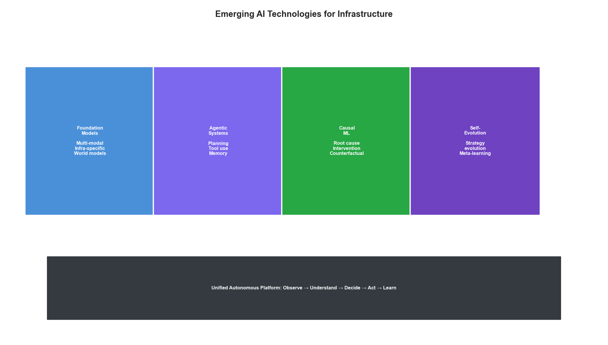
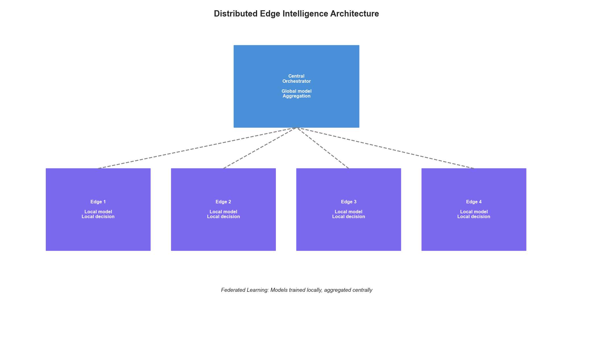
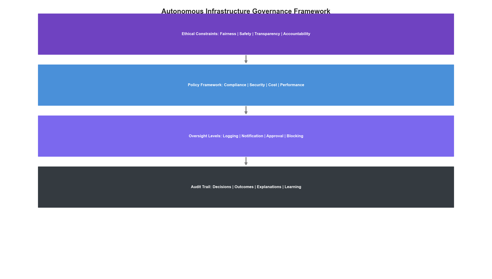

# Chapter 20: The Future of Autonomous Infrastructure

## Introduction

As we conclude this playbook, we look ahead to where infrastructure optimization is heading. The convergence of advanced AI, edge computing, quantum technologies, and increasingly sophisticated autonomous systems will fundamentally transform how we build, operate, and optimize infrastructure. This chapter explores emerging trends, research directions, and strategic considerations for organizations positioning themselves at the forefront of autonomous infrastructure.


*Figure 20.1: The Evolution Toward Fully Autonomous Infrastructure*

## 20.1 The Autonomy Spectrum

Infrastructure autonomy exists on a spectrum from fully manual to fully autonomous. Understanding where current technologies sit—and where they're heading—helps organizations make strategic investments.

### Levels of Autonomy

```python
from enum import IntEnum
from dataclasses import dataclass
from typing import List, Dict, Optional
from datetime import datetime

class AutonomyLevel(IntEnum):
    """SAE-inspired autonomy levels for infrastructure"""
    LEVEL_0_MANUAL = 0        # Human performs all operations
    LEVEL_1_ASSISTED = 1      # System provides recommendations
    LEVEL_2_PARTIAL = 2       # System automates routine tasks
    LEVEL_3_CONDITIONAL = 3   # System handles most scenarios, human fallback
    LEVEL_4_HIGH = 4          # System handles all scenarios, human oversight
    LEVEL_5_FULL = 5          # Complete autonomy, no human intervention

@dataclass
class AutonomyCapability:
    """Tracks autonomy level for specific capabilities"""
    capability: str
    current_level: AutonomyLevel
    target_level: AutonomyLevel
    blockers: List[str]
    research_areas: List[str]

class AutonomyRoadmap:
    """Maps the journey toward autonomous infrastructure"""

    def __init__(self):
        self.capabilities = self._define_capabilities()

    def _define_capabilities(self) -> Dict[str, AutonomyCapability]:
        return {
            "resource_scaling": AutonomyCapability(
                capability="Resource Scaling",
                current_level=AutonomyLevel.LEVEL_3_CONDITIONAL,
                target_level=AutonomyLevel.LEVEL_5_FULL,
                blockers=["Workload unpredictability", "Cost constraints"],
                research_areas=["Multi-objective RL", "Causal inference"]
            ),
            "incident_response": AutonomyCapability(
                capability="Incident Response",
                current_level=AutonomyLevel.LEVEL_2_PARTIAL,
                target_level=AutonomyLevel.LEVEL_4_HIGH,
                blockers=["Novel failure modes", "Safety guarantees"],
                research_areas=["Safe RL", "Anomaly detection"]
            ),
            "capacity_planning": AutonomyCapability(
                capability="Capacity Planning",
                current_level=AutonomyLevel.LEVEL_2_PARTIAL,
                target_level=AutonomyLevel.LEVEL_4_HIGH,
                blockers=["Long-term prediction accuracy", "Business changes"],
                research_areas=["Time series foundation models", "Scenario planning"]
            ),
            "security_response": AutonomyCapability(
                capability="Security Response",
                current_level=AutonomyLevel.LEVEL_1_ASSISTED,
                target_level=AutonomyLevel.LEVEL_3_CONDITIONAL,
                blockers=["Adversarial adaptation", "False positive costs"],
                research_areas=["Adversarial ML", "Explainable AI"]
            ),
            "architecture_evolution": AutonomyCapability(
                capability="Architecture Evolution",
                current_level=AutonomyLevel.LEVEL_1_ASSISTED,
                target_level=AutonomyLevel.LEVEL_3_CONDITIONAL,
                blockers=["Complexity", "Business requirements"],
                research_areas=["Code generation", "System synthesis"]
            )
        }

    def get_industry_position(self) -> Dict[str, float]:
        """Estimate where the industry currently stands"""
        return {
            "leading_edge": 3.5,      # Top 5% of organizations
            "early_adopters": 2.5,    # Top 20%
            "mainstream": 1.5,        # Middle 60%
            "laggards": 0.5           # Bottom 20%
        }

    def project_timeline(self, capability: str) -> Dict[str, int]:
        """Project years to reach each level (speculative)"""
        cap = self.capabilities.get(capability)
        if not cap:
            return {}

        current = int(cap.current_level)
        target = int(cap.target_level)

        # Rough projection - each level takes longer
        timeline = {}
        years = 0
        for level in range(current + 1, target + 1):
            years += level  # Higher levels take longer
            timeline[f"Level {level}"] = years

        return timeline
```

### Current State of the Art

```python
class IndustryBenchmark:
    """Benchmarks current industry capabilities"""

    def __init__(self):
        self.benchmarks = self._load_benchmarks()

    def _load_benchmarks(self) -> Dict:
        """Current state of autonomous infrastructure (2024)"""
        return {
            "auto_scaling": {
                "adoption_rate": 0.85,
                "autonomous_percentage": 0.60,
                "human_override_rate": 0.15,
                "accuracy": 0.92
            },
            "auto_remediation": {
                "adoption_rate": 0.45,
                "autonomous_percentage": 0.30,
                "human_override_rate": 0.40,
                "accuracy": 0.85
            },
            "cost_optimization": {
                "adoption_rate": 0.70,
                "autonomous_percentage": 0.25,
                "human_override_rate": 0.50,
                "accuracy": 0.88
            },
            "security_automation": {
                "adoption_rate": 0.60,
                "autonomous_percentage": 0.20,
                "human_override_rate": 0.60,
                "accuracy": 0.90
            },
            "capacity_planning": {
                "adoption_rate": 0.55,
                "autonomous_percentage": 0.15,
                "human_override_rate": 0.70,
                "accuracy": 0.75
            }
        }

    def calculate_maturity_score(self, org_metrics: Dict) -> float:
        """Calculate organization's autonomy maturity"""
        weights = {
            "adoption_rate": 0.2,
            "autonomous_percentage": 0.3,
            "accuracy": 0.3,
            "override_efficiency": 0.2
        }

        score = 0.0
        for metric, weight in weights.items():
            if metric == "override_efficiency":
                # Lower override rate is better
                value = 1 - org_metrics.get("human_override_rate", 0.5)
            else:
                value = org_metrics.get(metric, 0.5)
            score += value * weight

        return score
```

## 20.2 Emerging AI Technologies

Several AI advances will accelerate the path to autonomous infrastructure.


*Figure 20.2: Emerging AI Technologies for Infrastructure*

### Foundation Models for Infrastructure

```python
from abc import ABC, abstractmethod
import numpy as np

class InfrastructureFoundationModel(ABC):
    """Base class for infrastructure-specific foundation models"""

    def __init__(self, model_config: Dict):
        self.config = model_config
        self.context_length = model_config.get("context_length", 128000)
        self.modalities = model_config.get("modalities", ["text", "metrics", "logs"])

    @abstractmethod
    def encode_infrastructure_state(self, state: Dict) -> np.ndarray:
        """Encode multi-modal infrastructure state"""
        pass

    @abstractmethod
    def predict_next_state(self, current_state: np.ndarray,
                          action: Optional[np.ndarray] = None) -> np.ndarray:
        """World model: predict infrastructure evolution"""
        pass

    @abstractmethod
    def generate_action(self, state: np.ndarray,
                       objective: str) -> Dict:
        """Generate optimal action given objective"""
        pass

class MultiModalInfraModel(InfrastructureFoundationModel):
    """Multi-modal model for infrastructure understanding"""

    def __init__(self, model_config: Dict):
        super().__init__(model_config)
        self.encoders = self._initialize_encoders()
        self.fusion_layer = self._initialize_fusion()

    def _initialize_encoders(self) -> Dict:
        """Initialize modality-specific encoders"""
        return {
            "metrics": TimeSeriesEncoder(
                input_dim=self.config.get("metrics_dim", 256),
                hidden_dim=512,
                output_dim=256
            ),
            "logs": TextEncoder(
                vocab_size=50000,
                embed_dim=256,
                output_dim=256
            ),
            "topology": GraphEncoder(
                node_dim=64,
                edge_dim=32,
                output_dim=256
            ),
            "config": StructuredEncoder(
                schema_aware=True,
                output_dim=256
            )
        }

    def _initialize_fusion(self):
        """Initialize cross-modal fusion"""
        return CrossModalAttention(
            num_modalities=len(self.encoders),
            hidden_dim=512,
            num_heads=8
        )

    def encode_infrastructure_state(self, state: Dict) -> np.ndarray:
        """Encode complete infrastructure state"""
        embeddings = {}

        for modality, encoder in self.encoders.items():
            if modality in state:
                embeddings[modality] = encoder.encode(state[modality])

        # Fuse modalities
        fused = self.fusion_layer(embeddings)
        return fused

    def predict_next_state(self, current_state: np.ndarray,
                          action: Optional[np.ndarray] = None) -> np.ndarray:
        """Predict future infrastructure state"""
        if action is not None:
            combined = np.concatenate([current_state, action])
        else:
            combined = current_state

        # World model prediction
        return self.world_model(combined)

    def generate_action(self, state: np.ndarray, objective: str) -> Dict:
        """Generate action to achieve objective"""
        # Parse objective into structured goal
        goal = self.objective_parser(objective)

        # Plan using world model
        plan = self.planner.plan(
            current_state=state,
            goal=goal,
            world_model=self.world_model
        )

        return {
            "action": plan.next_action,
            "explanation": plan.explanation,
            "confidence": plan.confidence,
            "alternatives": plan.alternatives
        }

class TimeSeriesEncoder:
    """Placeholder for time series encoder"""
    def __init__(self, input_dim, hidden_dim, output_dim):
        self.output_dim = output_dim
    def encode(self, data):
        return np.zeros(self.output_dim)

class TextEncoder:
    """Placeholder for text encoder"""
    def __init__(self, vocab_size, embed_dim, output_dim):
        self.output_dim = output_dim
    def encode(self, data):
        return np.zeros(self.output_dim)

class GraphEncoder:
    """Placeholder for graph encoder"""
    def __init__(self, node_dim, edge_dim, output_dim):
        self.output_dim = output_dim
    def encode(self, data):
        return np.zeros(self.output_dim)

class StructuredEncoder:
    """Placeholder for structured data encoder"""
    def __init__(self, schema_aware, output_dim):
        self.output_dim = output_dim
    def encode(self, data):
        return np.zeros(self.output_dim)

class CrossModalAttention:
    """Placeholder for cross-modal attention"""
    def __init__(self, num_modalities, hidden_dim, num_heads):
        pass
    def __call__(self, embeddings):
        return np.zeros(512)
```

### Agentic Systems

```python
from typing import Callable, Any
import asyncio

class InfrastructureAgent:
    """Autonomous agent for infrastructure management"""

    def __init__(self, agent_config: Dict):
        self.config = agent_config
        self.tools = self._register_tools()
        self.memory = AgentMemory()
        self.planner = HierarchicalPlanner()

    def _register_tools(self) -> Dict[str, Callable]:
        """Register available tools"""
        return {
            "query_metrics": self._query_metrics,
            "execute_command": self._execute_command,
            "modify_config": self._modify_config,
            "scale_resource": self._scale_resource,
            "create_alert": self._create_alert,
            "search_logs": self._search_logs,
            "run_diagnosis": self._run_diagnosis
        }

    async def handle_objective(self, objective: str) -> Dict:
        """Handle a high-level objective autonomously"""
        # Understand the objective
        parsed = await self._parse_objective(objective)

        # Create execution plan
        plan = await self.planner.create_plan(
            objective=parsed,
            available_tools=list(self.tools.keys()),
            context=self.memory.get_context()
        )

        # Execute with monitoring
        results = []
        for step in plan.steps:
            try:
                result = await self._execute_step(step)
                results.append(result)

                # Update memory
                self.memory.add_experience(step, result)

                # Check if replanning needed
                if self._needs_replan(result, plan):
                    plan = await self.planner.replan(
                        original_plan=plan,
                        completed_steps=results,
                        failure=result.get("error")
                    )

            except Exception as e:
                # Handle failures gracefully
                recovery = await self._recover_from_failure(e, step)
                results.append(recovery)

        return {
            "objective": objective,
            "status": "completed" if all(r.get("success") for r in results) else "partial",
            "results": results,
            "learnings": self.memory.extract_learnings()
        }

    async def _execute_step(self, step: Dict) -> Dict:
        """Execute a single step of the plan"""
        tool_name = step["tool"]
        tool_args = step["arguments"]

        if tool_name not in self.tools:
            return {"success": False, "error": f"Unknown tool: {tool_name}"}

        tool = self.tools[tool_name]
        result = await tool(**tool_args)

        return {
            "success": True,
            "step": step,
            "result": result
        }

    def _needs_replan(self, result: Dict, plan) -> bool:
        """Check if replanning is needed"""
        if not result.get("success"):
            return True
        if result.get("unexpected_state"):
            return True
        return False

    async def _recover_from_failure(self, error: Exception, step: Dict) -> Dict:
        """Attempt to recover from failure"""
        # Check known recovery patterns
        recovery_action = self.memory.find_recovery_pattern(
            error_type=type(error).__name__,
            context=step
        )

        if recovery_action:
            return await self._execute_step(recovery_action)

        return {
            "success": False,
            "error": str(error),
            "requires_human": True
        }

    # Tool implementations (placeholders)
    async def _query_metrics(self, **kwargs): pass
    async def _execute_command(self, **kwargs): pass
    async def _modify_config(self, **kwargs): pass
    async def _scale_resource(self, **kwargs): pass
    async def _create_alert(self, **kwargs): pass
    async def _search_logs(self, **kwargs): pass
    async def _run_diagnosis(self, **kwargs): pass
    async def _parse_objective(self, objective): return {"goal": objective}

class AgentMemory:
    """Long-term memory for agent learning"""
    def __init__(self):
        self.experiences = []
        self.patterns = {}
    def get_context(self): return {}
    def add_experience(self, step, result): pass
    def extract_learnings(self): return []
    def find_recovery_pattern(self, error_type, context): return None

class HierarchicalPlanner:
    """Hierarchical task planner"""
    async def create_plan(self, objective, available_tools, context):
        class Plan:
            steps = []
        return Plan()
    async def replan(self, original_plan, completed_steps, failure):
        return original_plan
```

### Causal Inference for Root Cause Analysis

```python
class CausalInfrastructureModel:
    """Causal model for infrastructure root cause analysis"""

    def __init__(self):
        self.causal_graph = None
        self.intervention_history = []

    def learn_causal_structure(self, observations: List[Dict],
                               interventions: Optional[List[Dict]] = None):
        """Learn causal relationships from data"""
        # Combine observational and interventional data
        if interventions:
            # Interventional data provides stronger causal evidence
            self.causal_graph = self._learn_with_interventions(
                observations, interventions
            )
        else:
            # Use constraint-based or score-based methods
            self.causal_graph = self._learn_from_observations(observations)

    def _learn_from_observations(self, observations: List[Dict]):
        """Learn structure from observational data only"""
        # Use PC algorithm or similar
        return self._pc_algorithm(observations)

    def _learn_with_interventions(self, observations: List[Dict],
                                  interventions: List[Dict]):
        """Learn structure using interventional data"""
        # Interventions break confounding
        return self._intervention_calculus(observations, interventions)

    def root_cause_analysis(self, symptom: str,
                           current_state: Dict) -> List[Dict]:
        """Identify root causes of a symptom"""
        if not self.causal_graph:
            raise ValueError("Causal graph not learned")

        # Find ancestors of the symptom in causal graph
        ancestors = self._find_ancestors(symptom)

        # Score each potential cause
        causes = []
        for ancestor in ancestors:
            score = self._compute_causal_effect(
                cause=ancestor,
                effect=symptom,
                state=current_state
            )
            causes.append({
                "cause": ancestor,
                "causal_strength": score,
                "path": self._find_causal_path(ancestor, symptom),
                "intervention_effect": self._estimate_intervention_effect(
                    ancestor, symptom, current_state
                )
            })

        return sorted(causes, key=lambda x: x["causal_strength"], reverse=True)

    def recommend_intervention(self, target_outcome: str,
                              current_state: Dict) -> Dict:
        """Recommend intervention to achieve target outcome"""
        # Find variables that causally affect target
        parents = self._find_direct_causes(target_outcome)

        # Estimate intervention effects
        interventions = []
        for parent in parents:
            effect = self._estimate_intervention_effect(
                intervention_var=parent,
                target_var=target_outcome,
                current_state=current_state
            )
            interventions.append({
                "variable": parent,
                "recommended_value": effect["optimal_value"],
                "expected_outcome": effect["expected_outcome"],
                "confidence": effect["confidence"]
            })

        # Return best intervention
        return max(interventions, key=lambda x: x["confidence"])

    def _pc_algorithm(self, observations): return {}
    def _intervention_calculus(self, obs, int): return {}
    def _find_ancestors(self, node): return []
    def _compute_causal_effect(self, cause, effect, state): return 0.0
    def _find_causal_path(self, source, target): return []
    def _estimate_intervention_effect(self, intervention_var, target_var, state):
        return {"optimal_value": 0, "expected_outcome": 0, "confidence": 0}
    def _find_direct_causes(self, node): return []
```

## 20.3 Edge and Distributed Intelligence

The future of infrastructure optimization extends to the edge, requiring distributed AI systems.


*Figure 20.3: Distributed Edge Intelligence Architecture*

### Federated Infrastructure Learning

```python
from typing import Tuple
import hashlib

class FederatedInfrastructureLearning:
    """Federated learning across infrastructure nodes"""

    def __init__(self, config: Dict):
        self.config = config
        self.global_model = None
        self.node_registry = {}
        self.aggregation_strategy = config.get("aggregation", "fedavg")

    def register_node(self, node_id: str, node_config: Dict):
        """Register an infrastructure node for federated learning"""
        self.node_registry[node_id] = {
            "config": node_config,
            "last_update": None,
            "contribution_weight": node_config.get("weight", 1.0),
            "data_size": 0
        }

    async def training_round(self) -> Dict:
        """Execute one round of federated training"""
        # Distribute current global model
        global_weights = self.global_model.get_weights()

        # Collect updates from nodes
        updates = []
        for node_id, node_info in self.node_registry.items():
            try:
                update = await self._get_node_update(node_id, global_weights)
                updates.append({
                    "node_id": node_id,
                    "weights": update["weights"],
                    "metrics": update["metrics"],
                    "data_size": update["data_size"]
                })
            except Exception as e:
                print(f"Node {node_id} failed to respond: {e}")

        # Aggregate updates
        aggregated = self._aggregate_updates(updates)

        # Update global model
        self.global_model.set_weights(aggregated)

        return {
            "round_complete": True,
            "participating_nodes": len(updates),
            "global_loss": self._evaluate_global_model()
        }

    def _aggregate_updates(self, updates: List[Dict]) -> np.ndarray:
        """Aggregate node updates into global update"""
        if self.aggregation_strategy == "fedavg":
            return self._federated_averaging(updates)
        elif self.aggregation_strategy == "fedprox":
            return self._federated_proximal(updates)
        else:
            return self._federated_averaging(updates)

    def _federated_averaging(self, updates: List[Dict]) -> np.ndarray:
        """Standard FedAvg aggregation"""
        total_data = sum(u["data_size"] for u in updates)

        aggregated = None
        for update in updates:
            weight = update["data_size"] / total_data
            if aggregated is None:
                aggregated = update["weights"] * weight
            else:
                aggregated += update["weights"] * weight

        return aggregated

    def _federated_proximal(self, updates: List[Dict]) -> np.ndarray:
        """FedProx with proximal term for heterogeneity"""
        # Similar to FedAvg but with regularization
        return self._federated_averaging(updates)

    async def _get_node_update(self, node_id: str,
                               global_weights: np.ndarray) -> Dict:
        """Get update from a specific node"""
        # In practice, this would be an RPC call
        return {
            "weights": global_weights,  # Placeholder
            "metrics": {"loss": 0.1},
            "data_size": 1000
        }

    def _evaluate_global_model(self) -> float:
        """Evaluate global model performance"""
        return 0.0  # Placeholder

class EdgeOptimizer:
    """Local optimization at edge nodes"""

    def __init__(self, node_config: Dict):
        self.config = node_config
        self.local_model = None
        self.edge_constraints = node_config.get("constraints", {})

    def optimize_locally(self, state: Dict) -> Dict:
        """Make optimization decisions at the edge"""
        # Check if we can decide locally
        if self._can_decide_locally(state):
            return self._local_decision(state)
        else:
            return self._request_central_decision(state)

    def _can_decide_locally(self, state: Dict) -> bool:
        """Check if decision can be made locally"""
        # Decide locally if:
        # 1. Impact is limited to this node
        # 2. Confidence is high enough
        # 3. Within authorized bounds

        impact_scope = self._estimate_impact_scope(state)
        confidence = self.local_model.confidence(state)
        within_bounds = self._check_authorization(state)

        return (impact_scope == "local" and
                confidence > 0.9 and
                within_bounds)

    def _local_decision(self, state: Dict) -> Dict:
        """Make decision using local model"""
        action = self.local_model.predict(state)

        return {
            "decision": "local",
            "action": action,
            "confidence": self.local_model.confidence(state)
        }

    def _request_central_decision(self, state: Dict) -> Dict:
        """Escalate to central system"""
        return {
            "decision": "escalate",
            "state_summary": self._summarize_state(state),
            "local_recommendation": self.local_model.predict(state)
        }

    def _estimate_impact_scope(self, state): return "local"
    def _check_authorization(self, state): return True
    def _summarize_state(self, state): return state
```

## 20.4 Quantum-Classical Hybrid Optimization

While full quantum advantage in infrastructure is years away, hybrid approaches show promise for specific optimization problems.

```python
class HybridQuantumOptimizer:
    """Quantum-classical hybrid optimizer for infrastructure"""

    def __init__(self, config: Dict):
        self.config = config
        self.quantum_backend = config.get("backend", "simulator")
        self.num_qubits = config.get("qubits", 20)

    def optimize_placement(self, workloads: List[Dict],
                          resources: List[Dict]) -> Dict:
        """Optimize workload placement using QAOA"""
        # Encode as QUBO (Quadratic Unconstrained Binary Optimization)
        qubo = self._encode_placement_qubo(workloads, resources)

        if self._problem_size_fits_quantum(qubo):
            # Use quantum solver
            return self._qaoa_solve(qubo)
        else:
            # Hybrid: decompose and solve parts quantum
            return self._hybrid_solve(qubo)

    def _encode_placement_qubo(self, workloads: List[Dict],
                               resources: List[Dict]) -> np.ndarray:
        """Encode placement problem as QUBO"""
        n_workloads = len(workloads)
        n_resources = len(resources)

        # Binary variables: x[i,j] = 1 if workload i on resource j
        n_vars = n_workloads * n_resources

        # Construct QUBO matrix
        Q = np.zeros((n_vars, n_vars))

        # Add constraints and objective terms
        # (Simplified - real implementation more complex)

        return Q

    def _problem_size_fits_quantum(self, qubo: np.ndarray) -> bool:
        """Check if problem fits on quantum hardware"""
        n_vars = qubo.shape[0]
        return n_vars <= self.num_qubits

    def _qaoa_solve(self, qubo: np.ndarray) -> Dict:
        """Solve using QAOA algorithm"""
        # In practice, would use Qiskit or similar
        return {
            "solution": np.zeros(qubo.shape[0]),
            "objective": 0.0,
            "method": "qaoa"
        }

    def _hybrid_solve(self, qubo: np.ndarray) -> Dict:
        """Hybrid classical-quantum solve"""
        # Decompose large problem
        subproblems = self._decompose(qubo)

        solutions = []
        for sub in subproblems:
            if self._problem_size_fits_quantum(sub):
                sol = self._qaoa_solve(sub)
            else:
                sol = self._classical_solve(sub)
            solutions.append(sol)

        # Combine solutions
        return self._combine_solutions(solutions)

    def _decompose(self, qubo): return [qubo]
    def _classical_solve(self, qubo):
        return {"solution": np.zeros(qubo.shape[0]), "objective": 0.0}
    def _combine_solutions(self, solutions): return solutions[0] if solutions else {}
```

## 20.5 Self-Evolving Infrastructure

The ultimate vision is infrastructure that evolves and improves itself over time.

```python
class SelfEvolvingInfrastructure:
    """Infrastructure that evolves its own optimization strategies"""

    def __init__(self, config: Dict):
        self.config = config
        self.strategy_population = []
        self.fitness_history = []
        self.generation = 0

    def initialize_strategies(self, seed_strategies: List[Dict]):
        """Initialize population of optimization strategies"""
        self.strategy_population = [
            OptimizationStrategy(s) for s in seed_strategies
        ]

    def evolution_cycle(self) -> Dict:
        """Run one evolution cycle"""
        self.generation += 1

        # Evaluate fitness of current strategies
        fitness_scores = self._evaluate_strategies()

        # Select best performers
        selected = self._selection(fitness_scores)

        # Create new strategies through crossover and mutation
        offspring = self._reproduce(selected)

        # Replace population
        self.strategy_population = selected + offspring

        # Record history
        self.fitness_history.append({
            "generation": self.generation,
            "best_fitness": max(fitness_scores.values()),
            "avg_fitness": np.mean(list(fitness_scores.values())),
            "population_size": len(self.strategy_population)
        })

        return {
            "generation": self.generation,
            "best_strategy": self._get_best_strategy(fitness_scores),
            "improvement": self._calculate_improvement()
        }

    def _evaluate_strategies(self) -> Dict[str, float]:
        """Evaluate all strategies against real infrastructure"""
        scores = {}
        for strategy in self.strategy_population:
            # Run strategy in shadow mode or controlled experiment
            score = self._evaluate_single_strategy(strategy)
            scores[strategy.id] = score
        return scores

    def _evaluate_single_strategy(self, strategy) -> float:
        """Evaluate a single strategy"""
        # Run in shadow mode
        shadow_results = strategy.run_shadow(duration_hours=24)

        # Calculate composite fitness
        fitness = (
            shadow_results["cost_efficiency"] * 0.3 +
            shadow_results["performance"] * 0.3 +
            shadow_results["reliability"] * 0.2 +
            shadow_results["adaptability"] * 0.2
        )

        return fitness

    def _selection(self, fitness_scores: Dict[str, float]) -> List:
        """Select strategies for reproduction"""
        # Tournament selection
        sorted_strategies = sorted(
            self.strategy_population,
            key=lambda s: fitness_scores[s.id],
            reverse=True
        )
        return sorted_strategies[:len(sorted_strategies)//2]

    def _reproduce(self, selected: List) -> List:
        """Create offspring through crossover and mutation"""
        offspring = []

        for i in range(len(selected)):
            parent1 = selected[i]
            parent2 = selected[(i + 1) % len(selected)]

            # Crossover
            child = parent1.crossover(parent2)

            # Mutation
            if np.random.random() < self.config.get("mutation_rate", 0.1):
                child = child.mutate()

            offspring.append(child)

        return offspring

    def _get_best_strategy(self, fitness_scores: Dict[str, float]):
        """Get the best performing strategy"""
        best_id = max(fitness_scores, key=fitness_scores.get)
        return next(s for s in self.strategy_population if s.id == best_id)

    def _calculate_improvement(self) -> float:
        """Calculate improvement over generations"""
        if len(self.fitness_history) < 2:
            return 0.0
        return (self.fitness_history[-1]["best_fitness"] -
                self.fitness_history[0]["best_fitness"])

class OptimizationStrategy:
    """Evolvable optimization strategy"""
    def __init__(self, config: Dict):
        self.id = hashlib.md5(str(config).encode()).hexdigest()[:8]
        self.config = config
        self.genes = config.get("genes", {})

    def run_shadow(self, duration_hours: int) -> Dict:
        """Run strategy in shadow mode"""
        return {
            "cost_efficiency": np.random.random(),
            "performance": np.random.random(),
            "reliability": np.random.random(),
            "adaptability": np.random.random()
        }

    def crossover(self, other: 'OptimizationStrategy') -> 'OptimizationStrategy':
        """Combine with another strategy"""
        new_genes = {}
        for key in self.genes:
            if np.random.random() < 0.5:
                new_genes[key] = self.genes[key]
            else:
                new_genes[key] = other.genes.get(key, self.genes[key])
        return OptimizationStrategy({"genes": new_genes})

    def mutate(self) -> 'OptimizationStrategy':
        """Random mutation"""
        mutated_genes = self.genes.copy()
        # Randomly modify one gene
        if mutated_genes:
            key = np.random.choice(list(mutated_genes.keys()))
            mutated_genes[key] = mutated_genes[key] * (1 + np.random.normal(0, 0.1))
        return OptimizationStrategy({"genes": mutated_genes})
```

## 20.6 Ethical and Governance Considerations

As systems become more autonomous, ethical considerations become paramount.


*Figure 20.4: Autonomous Infrastructure Governance Framework*

```python
class AutonomousGovernance:
    """Governance framework for autonomous infrastructure"""

    def __init__(self, config: Dict):
        self.config = config
        self.ethical_constraints = config.get("ethical_constraints", [])
        self.oversight_levels = config.get("oversight_levels", {})

    def evaluate_decision(self, decision: Dict) -> Dict:
        """Evaluate a decision against governance framework"""
        evaluations = []

        # Check ethical constraints
        for constraint in self.ethical_constraints:
            result = self._check_constraint(decision, constraint)
            evaluations.append(result)

        # Determine required oversight
        oversight = self._determine_oversight(decision, evaluations)

        # Generate audit trail
        audit = self._create_audit_record(decision, evaluations, oversight)

        return {
            "approved": all(e["passed"] for e in evaluations),
            "oversight_required": oversight,
            "evaluations": evaluations,
            "audit_record": audit
        }

    def _check_constraint(self, decision: Dict, constraint: Dict) -> Dict:
        """Check a single ethical constraint"""
        constraint_type = constraint["type"]

        if constraint_type == "fairness":
            return self._check_fairness(decision, constraint)
        elif constraint_type == "transparency":
            return self._check_transparency(decision, constraint)
        elif constraint_type == "safety":
            return self._check_safety(decision, constraint)
        elif constraint_type == "accountability":
            return self._check_accountability(decision, constraint)
        else:
            return {"passed": True, "constraint": constraint_type}

    def _check_fairness(self, decision: Dict, constraint: Dict) -> Dict:
        """Ensure decisions don't unfairly impact specific groups"""
        return {
            "passed": True,
            "constraint": "fairness",
            "details": "No disparate impact detected"
        }

    def _check_transparency(self, decision: Dict, constraint: Dict) -> Dict:
        """Ensure decisions are explainable"""
        has_explanation = "explanation" in decision
        return {
            "passed": has_explanation,
            "constraint": "transparency",
            "details": "Explanation required" if not has_explanation else "Explanation provided"
        }

    def _check_safety(self, decision: Dict, constraint: Dict) -> Dict:
        """Ensure decisions meet safety requirements"""
        risk_level = decision.get("risk_level", "low")
        passed = risk_level in ["low", "medium"]
        return {
            "passed": passed,
            "constraint": "safety",
            "details": f"Risk level: {risk_level}"
        }

    def _check_accountability(self, decision: Dict, constraint: Dict) -> Dict:
        """Ensure clear accountability chain"""
        has_owner = "owner" in decision
        return {
            "passed": has_owner,
            "constraint": "accountability",
            "details": f"Owner: {decision.get('owner', 'unassigned')}"
        }

    def _determine_oversight(self, decision: Dict,
                            evaluations: List[Dict]) -> str:
        """Determine required human oversight level"""
        # Check for any failed evaluations
        if any(not e["passed"] for e in evaluations):
            return "blocking"  # Requires approval before execution

        # Check decision risk level
        risk_level = decision.get("risk_level", "low")

        oversight_map = {
            "critical": "blocking",
            "high": "approval",
            "medium": "notification",
            "low": "logging"
        }

        return oversight_map.get(risk_level, "logging")

    def _create_audit_record(self, decision: Dict,
                            evaluations: List[Dict],
                            oversight: str) -> Dict:
        """Create comprehensive audit record"""
        return {
            "timestamp": datetime.now().isoformat(),
            "decision_id": decision.get("id"),
            "decision_type": decision.get("type"),
            "governance_evaluations": evaluations,
            "oversight_level": oversight,
            "outcome": "pending" if oversight == "blocking" else "proceeding"
        }
```

## 20.7 Preparing for the Future

### Skills and Capabilities to Develop

```python
class FutureSkillsFramework:
    """Framework for developing future-ready skills"""

    def __init__(self):
        self.skill_domains = self._define_skill_domains()

    def _define_skill_domains(self) -> Dict:
        return {
            "ai_ml": {
                "current": ["ML basics", "Model deployment", "Data pipelines"],
                "emerging": ["Foundation models", "Agentic systems", "Causal ML"],
                "future": ["Self-evolving systems", "Human-AI teaming"],
                "priority": "high"
            },
            "infrastructure": {
                "current": ["Cloud platforms", "Kubernetes", "IaC"],
                "emerging": ["Edge computing", "Serverless", "Multi-cloud"],
                "future": ["Quantum-hybrid", "Neuromorphic", "Sustainable"],
                "priority": "high"
            },
            "systems_thinking": {
                "current": ["Architecture", "Integration", "Scalability"],
                "emerging": ["Complex adaptive systems", "Resilience engineering"],
                "future": ["Self-organizing systems", "Emergence"],
                "priority": "medium"
            },
            "ethics_governance": {
                "current": ["Compliance", "Security", "Privacy"],
                "emerging": ["AI ethics", "Algorithmic accountability"],
                "future": ["Autonomous system governance", "AI rights"],
                "priority": "high"
            }
        }

    def generate_learning_path(self, current_skills: List[str],
                              target_role: str) -> List[Dict]:
        """Generate personalized learning path"""
        gaps = self._identify_gaps(current_skills, target_role)

        path = []
        for gap in gaps:
            path.append({
                "skill": gap["skill"],
                "domain": gap["domain"],
                "resources": self._find_resources(gap["skill"]),
                "estimated_effort": gap["effort"],
                "priority": gap["priority"]
            })

        return sorted(path, key=lambda x: x["priority"], reverse=True)

    def _identify_gaps(self, current_skills, target_role):
        """Identify skill gaps for target role"""
        # Simplified - would compare against role requirements
        return []

    def _find_resources(self, skill):
        """Find learning resources for a skill"""
        return []
```

### Strategic Recommendations

```python
class StrategicRecommendations:
    """Strategic recommendations for future-proofing"""

    @staticmethod
    def get_recommendations() -> Dict[str, List[str]]:
        return {
            "immediate_actions": [
                "Establish strong observability foundation",
                "Implement policy-as-code frameworks",
                "Build ML experimentation infrastructure",
                "Create feedback loops for model improvement",
                "Develop human-in-the-loop workflows"
            ],
            "medium_term": [
                "Deploy domain-specific SLMs for infrastructure",
                "Implement causal inference for root cause analysis",
                "Build self-healing capabilities with safety bounds",
                "Develop cross-team AI governance standards",
                "Create federated learning infrastructure"
            ],
            "long_term_positioning": [
                "Experiment with agentic systems in sandboxes",
                "Explore quantum-classical hybrid optimization",
                "Build infrastructure for model evolution",
                "Develop human-AI collaboration patterns",
                "Prepare for regulatory requirements"
            ],
            "key_investments": [
                "Data infrastructure and quality",
                "ML platform capabilities",
                "Safety and governance frameworks",
                "Talent development",
                "Research partnerships"
            ]
        }
```

## Summary

The future of infrastructure optimization is one of increasing autonomy, intelligence, and self-improvement. Key trends to watch include:

1. **Foundation Models**: Multi-modal models trained on infrastructure data will enable better understanding and decision-making
2. **Agentic Systems**: Autonomous agents will handle complex, multi-step optimization tasks
3. **Causal Reasoning**: Moving beyond correlation to true root cause analysis
4. **Edge Intelligence**: Distributed AI enabling local decision-making
5. **Self-Evolution**: Infrastructure that improves its own optimization strategies
6. **Quantum-Hybrid**: Specialized quantum algorithms for hard optimization problems

Success requires:
- Strong foundational capabilities in observability and automation
- Investment in AI/ML expertise and infrastructure
- Robust governance frameworks for autonomous systems
- Continuous learning and adaptation

The organizations that thrive will be those that view infrastructure not as a cost center, but as an intelligent, self-optimizing system that enables their business objectives.

## Conclusion: The Journey Ahead

Throughout this playbook, we've covered the complete journey from basic optimization to autonomous infrastructure:

- **Foundations**: Understanding cost models, observability, and data pipelines
- **Intelligence**: Applying ML for predictions, anomalies, and recommendations
- **Automation**: Implementing safe auto-remediation and policy enforcement
- **Optimization**: Using RL and specialized models for continuous improvement
- **Autonomy**: Building self-healing, self-optimizing systems

The path to autonomous infrastructure is iterative. Start with strong foundations, build intelligence incrementally, automate with safety in mind, and continuously evolve your capabilities. The future belongs to organizations that can harness the full power of AI to optimize their infrastructure while maintaining the reliability, security, and governance their business demands.

The journey has just begun.
